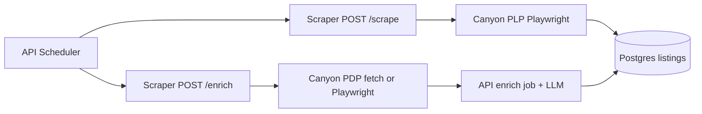

# Add Canyon store (scrape + enrich)

## Problem framing (idea-refine)

**How might we** surface Canyon US sale inventory in the aggregator with accurate prices, stock signals, and enough PDP context for taxonomy/LLM enrichment—without blocking on affiliate setup?

**Recommended direction:** Treat Canyon as a **custom SFCC SPA** (Demandware-style URLs: `/{id}.html?dwvar_{id}_pv_rahmenfarbe=...`), not Shopify. Ship **full sale PLP** ingest at [`https://www.canyon.com/en-us/sale/`](https://www.canyon.com/en-us/sale/) with **Playwright PLP + fetch-first PDP enrich**, reusing WAF/storage patterns from [`backcountry-family-plp.ts`](apps/scraper/src/parsers/backcountry-family-plp.ts). Defer **Awin affiliate**, **per-frame-size SKU fan-out**, and **admin category mappings** until after first successful scrape.



---

## What we know about Canyon’s site

| Signal                                                                        | Implication                                                                                                                                       |
| ----------------------------------------------------------------------------- | ------------------------------------------------------------------------------------------------------------------------------------------------- |
| URLs like `.../spectral-125-al-5/3175.html?dwvar_3175_pv_rahmenfarbe=SR%2FBK` | **SFCC master product ID** = numeric segment before `.html`; **color variant** = `rahmenfarbe` query param                                        |
| Sale PLP shows ~45 cards + **“See more products”**                            | Lazy-loaded catalog; scraper must **scroll / click load-more** until exhausted or `SCRAPER_MAX_PRODUCTS`                                          |
| PDP has **frame sizes** (S/M/L/XL) behind “Select frame size”                 | Size-specific SKU/price often **not on PLP**; MVP: one row per **color** from PLP; enrich adds specs/breadcrumbs; per-size fan-out is **phase 2** |
| `From $X` / `Save up to $Y` on some cards                                     | Use **listed sale price** when single; for “From”, store **min current_price** and treat as in-stock if any size available (document limitation)  |
| Not Shopify                                                                   | **Do not** use [`shopify-helpers.ts`](apps/scraper/src/parsers/shopify-helpers.ts) or `variant_backfill.go` Shopify paths                         |
| Possible bot/WAF                                                              | Reuse **`SCRAPER_STORAGE_STATE`** + optional **`SCRAPER_HEADED=1`** (you confirmed willingness to bootstrap)                                      |

---

## Phase 0 — Discovery spike (before coding parsers)

**Goal:** Confirm the cheapest reliable data source so we don’t over-build Playwright.

1. In DevTools on the sale PLP, watch **XHR/Fetch** while scrolling “See more products” — look for a **Search-Show / product-search / GraphQL** JSON response with product array + pagination cursor/offset.
2. On a sample PDP (e.g. Spectral 125), check:
   - **`application/ld+json`** `Product` / `Offer` blocks
   - Inline `__NEXT_DATA__` / window bootstrap JSON with variants
3. From your machine, run a quick headed check:
   ```bash
   SCRAPER_HEADED=1 pnpm --filter @mtb-aggregator/scraper run dev
   # optional: playwright codegen --save-storage=apps/scraper/canyon-storage.json https://www.canyon.com/en-us/sale/
   ```
4. **Deliverable:** Short note in parser file header (or PR description): chosen strategy — **network JSON** vs **DOM evaluate** vs **hybrid** (mirror [`attachJsonResponseCapture`](apps/scraper/src/parsers/backcountry-family-plp.ts) if JSON exists).

**If blocked by WAF:** Add `apps/scraper/canyon-storage.json` (gitignored), set `SCRAPER_STORAGE_STATE` locally; document Render secret-file path in [`apps/scraper/README.md`](apps/scraper/README.md) (same pattern as CC).

---

## Phase 1 — Wire `canyon` through the stack

| Area           | Change                                                                                                                                                                                                                                                                                           |
| -------------- | ------------------------------------------------------------------------------------------------------------------------------------------------------------------------------------------------------------------------------------------------------------------------------------------------ |
| DB             | [`packages/shared/seed.sql`](packages/shared/seed.sql): `Canyon`, `base_url` `https://www.canyon.com/en-us/`, `scrape_url` `https://www.canyon.com/en-us/sale/`, `store_type` `canyon`, `affiliate_network` NULL                                                                                 |
| Scraper types  | [`apps/scraper/src/types.ts`](apps/scraper/src/types.ts): add `"canyon"` to `STORE_TYPES`                                                                                                                                                                                                        |
| Registration   | [`apps/scraper/src/parsers/index.ts`](apps/scraper/src/parsers/index.ts): `PARSERS` + `ENRICHERS`                                                                                                                                                                                                |
| API allowlists | [`apps/api/internal/api/admin.go`](apps/api/internal/api/admin.go) `AllowedStoreTypes`; [`apps/api/internal/scheduler/scheduler.go`](apps/api/internal/scheduler/scheduler.go) store-type gate (~line 127); [`apps/api/internal/db/db.go`](apps/api/internal/db/db.go) `StoreTypesWithEnrichers` |
| Makefile       | [`Makefile`](Makefile): `scrape-now-canyon`, `enrich-now-canyon` (mirror TMB targets)                                                                                                                                                                                                            |
| Env example    | [`.env.example`](.env.example): optional `SCRAPER_STORAGE_STATE` note for Canyon if separate from CC file                                                                                                                                                                                        |

Run after merge: `make db-seed` (or `make db-seed-remote`).

---

## Phase 2 — PLP scraper (`canyon-plp.ts` + `canyon.ts`)

**New files:**

- [`apps/scraper/src/parsers/canyon-plp.ts`](apps/scraper/src/parsers/canyon-plp.ts) — Playwright sale PLP loop
- [`apps/scraper/src/parsers/canyon.ts`](apps/scraper/src/parsers/canyon.ts) — thin exports `scrapeCanyon`, `enrichCanyon`

**PLP behavior (modeled on Backcountry-family, not copied blindly):**

1. `runWithBrowser` → context with `locale: en-US`, realistic `BROWSER_USER_AGENT`, optional `storageState` from config.
2. `goto` sale URL → wait for product grid (poll similar to `waitForBackcountryFamilyPlReady`).
3. **Load all products:** repeat until no new cards:
   - click **“See more products”** if present, else scroll + wait for network idle
   - respect `SCRAPER_MAX_PRODUCTS` / `SCRAPER_MAX_PAGES` during dev
4. **Extract cards** via `page.evaluate` (or captured JSON):
   - `product_name`, `current_price`, `original_price` (parse `$` / `You save`)
   - `product_url` (canonical, strip tracking noise; keep `dwvar_*` when color-specific)
   - `image_url`, `brand` = `"Canyon"` (or omit; listings are DTC)
   - `is_in_stock`: false if card text matches `Only available in` **and** no purchasable price for that variant; true otherwise
5. **Map to `ScrapeResult`:**
   - `store_sku`: `{masterId}-{colorCode}` (color from `dwvar_*_rahmenfarbe` or default swatch)
   - `product_group_key`: master product id (e.g. `3175`) for future `group_variants`
   - `variant_options`: `{ Color: "Real Raw" }` when known
   - `category_path`: **null on scrape** (from PDP path segments during enrich)

**Dedupe:** by `store_sku` before return.

**Tests:** fixture HTML/JSON under `apps/scraper/src/parsers/__fixtures__/canyon/` + unit tests for URL/SKU parsing and price extraction (no live network in CI).

---

## Phase 3 — PDP enricher (`canyon-pdp.ts`)

**Goal:** Populate `category_path`, `raw_specs`, `description` for the nightly enrich job.

1. **Try `fetch` first** (cheaper): GET PDP URL with browser-like headers.
2. Parse:
   - **Breadcrumbs** from URL path (`mountain-bikes` → `trail-bikes` → model) and/or DOM nav
   - **JSON-LD** `Product` description, weight, travel if present
   - **Specs** from “Components”, “Key features”, tables (Cheerio — patterns from [`backcountry-family-pdp.ts`](apps/scraper/src/parsers/backcountry-family-pdp.ts))
3. **Fallback:** Playwright PDP if fetch returns challenge page or empty LD+JSON (reuse WAF wait helpers; persist storage state after successful PDP if configured).
4. Return standard `EnrichResult` (`category_path`, `raw_specs`, `description`; no `variants[]` in MVP).

**Not in MVP:** API-side variant fan-out (unlike Jenson/CC) until we confirm per-size SKUs in JSON-LD or a variant API.

---

## Phase 4 — Docs, verify, taxonomy follow-up

**Docs** (per [documentation-sync rule](.cursor/rules/documentation-sync.mdc)):

- [`docs/SCRAPING.md`](docs/SCRAPING.md) — Canyon section (SFCC, sale URL, WAF bootstrap)
- [`apps/scraper/README.md`](apps/scraper/README.md)
- [`apps/api/README.md`](apps/api/README.md) if Makefile targets added
- [`CLAUDE.md`](CLAUDE.md) — one-line store mention + `make scrape-now-canyon`

**Manual verification:**

```bash
make db-seed
pnpm --filter @mtb-aggregator/scraper run test
# scraper running:
curl -X POST http://localhost:3000/scrape \
  -H "Content-Type: application/json" \
  -d '{"url":"https://www.canyon.com/en-us/sale/","store":"canyon"}'
make scrape-now-canyon   # after API wired
make enrich-now-canyon   # optional FORCE=1
```

**Post-MVP (admin, not blocking launch):** Add category mappings in Admin for Canyon breadcrumb strings → canonical MTB taxonomy ([`docs/TAXONOMY.md`](docs/TAXONOMY.md)).

---

## Key assumptions to validate

| Assumption                                                          | How to test                                                                |
| ------------------------------------------------------------------- | -------------------------------------------------------------------------- |
| Sale PLP is scrapable with Playwright from US egress                | Phase 0 spike; if fail → storage state bootstrap                           |
| One row per color from PLP is enough for useful deals UI            | Spot-check 5 MTB PDPs: color price matches site                            |
| `fetch` PDP works without WAF for enrich volume                     | Run 10 enrich URLs from scheduler; fall back to Playwright if &gt;20% fail |
| Full sale PLP size is acceptable (~hundreds, not tens of thousands) | Count rows after full load-more; tune `SCRAPER_MAX_PRODUCTS` if needed     |

---

## Not doing (MVP)

- **Awin / `affiliate_url`** — you chose product_url only; revisit when credentials exist
- **MTB-only filtering** — you chose full sale PLP; filter can be a later `scrape_url` or client-side path filter
- **Per frame-size `variants[]` fan-out** — needs PDP variant API or LD+JSON offers per size; separate small project
- **Impact-style Go ingest** — only if Awin exposes a product catalog API worth more than scrape
- **Dedicated `scrape-debug` endpoint** — use PLP HTML dumps in parser dev (Backcountry pattern) unless we generalize debug route

---

## What we need from you

| When          | Action                                                                                                                    |
| ------------- | ------------------------------------------------------------------------------------------------------------------------- |
| Phase 0       | Run DevTools spike **or** share a HAR / sample XHR response from sale PLP “load more” (speeds parser design)              |
| If WAF blocks | Run `playwright codegen --save-storage=apps/scraper/canyon-storage.json` on sale URL; set `SCRAPER_STORAGE_STATE` locally |
| After deploy  | `make db-seed` on target DB; trigger `make scrape-now-canyon` and skim listing count/prices in admin Data Browser         |
| Optional      | Add 3–5 category mappings in Admin once breadcrumb strings are visible                                                    |

---

## Implementation order (suggested PR sequence)

1. **Spike + registration** — seed, types, API allowlists, empty `scrapeCanyon` throwing “not implemented” OR minimal stub
2. **PLP scraper + tests** — get `/scrape` returning real `ScrapeResult[]`
3. **PDP enrich + tests** — get `/enrich` returning breadcrumbs/specs
4. **Docs + Makefile + manual scrape/enrich verification**
