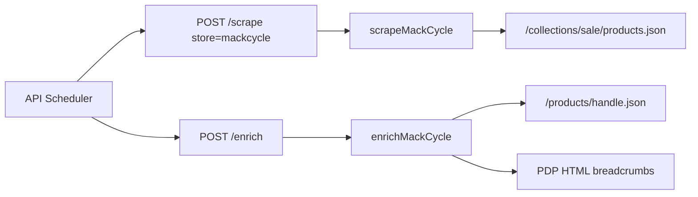

# Add Mack Cycle (Shopify)

## Problem statement

**How might we** surface Mack Cycle sale inventory in the MTB deals aggregator with accurate per-variant pricing, stock, and PDP specs—without manual maintenance or browser scraping?

## Recommended direction

Treat Mack Cycle as a **standard Shopify store** in this repo—not a custom integration. Live probe confirms:

- `powered-by: Shopify` on responses
- [`https://www.mackcycle.com/collections/sale/products.json`](https://www.mackcycle.com/collections/sale/products.json) returns **200** with full product payloads
- **153 products** on page 1, **0** on page 2 (~1,179 variants total)

Follow the **Thunder Mountain Bikes** playbook ([`.cursor/plans/thunder_mountain_bikes_store_80943d21.plan.md`](.cursor/plans/thunder_mountain_bikes_store_80943d21.plan.md)): dedicated parser file, `fetch` + JSON scrape, parallel PDP enrich (`/products/{handle}.json` + HTML breadcrumbs), seed row, API allowlists, Make targets, docs.

**Variant filter (your “unsure”):** **Include all variants** returned in the sale collection, matching [`worldwidecyclery.ts`](apps/scraper/src/parsers/worldwidecyclery.ts) / [`thundermountainbikes.ts`](apps/scraper/src/parsers/thundermountainbikes.ts). Rationale: `/collections/sale` is Shopify-curated; ~463 variants lack `compare_at_price` but are still listed as sale items—filtering to `compare_at > price` would drop a large slice. If post-scrape noise is high, we can tighten later without changing architecture.



## Key assumptions to validate

- [ ] **Sale collection stability** — `scrape_url` stays `https://www.mackcycle.com/collections/sale` and remains the canonical sale feed (re-scrape after deploy; watch for 0-result alerts).
- [ ] **No bot blocking in production** — `products.json` and `/products/{handle}.json` work from Render scraper with the same `User-Agent` as other Shopify stores (local curl succeeded).
- [ ] **WWC-style enrich is good enough** — Mack `body_html` uses `<strong>KEY</strong>` + `<ul>` spec blocks (sample: Cannondale Topstone); existing table/dl/strong extractors in WWC should populate `raw_specs`. Breadcrumbs from PDP HTML may need a spot-check on 2–3 PDPs after first enrich.

## MVP scope

| In                                                                            | Out (for now)                                       |
| ----------------------------------------------------------------------------- | --------------------------------------------------- |
| `store_type=mackcycle` parser + enricher                                      | Affiliate / Impact integration                      |
| Seed: `base_url=https://www.mackcycle.com`, `scrape_url=.../collections/sale` | Playwright or WAF cookie bootstrap                  |
| Per-variant rows + `product_group_key` = handle + `variant_options`           | MTB-only filtering (you chose full sale collection) |
| Wire API allowlists, scheduler whitelist, variant backfill SQL                | Admin category mappings                             |
| `make scrape-now-mackcycle` / `enrich-now-mackcycle`                          | Dedicated vitest fixtures (optional follow-up)      |

## Implementation checklist

### 1. Scraper — [`apps/scraper/`](apps/scraper/)

| Item          | Detail                                                                                                                                                                                                                                                                                                                                                                                                                                             |
| ------------- | -------------------------------------------------------------------------------------------------------------------------------------------------------------------------------------------------------------------------------------------------------------------------------------------------------------------------------------------------------------------------------------------------------------------------------------------------- |
| New file      | [`apps/scraper/src/parsers/mackcycle.ts`](apps/scraper/src/parsers/mackcycle.ts) — copy structure from [`thundermountainbikes.ts`](apps/scraper/src/parsers/thundermountainbikes.ts): `fetchPage` → `{pathname}/products.json?limit=250&page=N`, variant loop with [`buildVariantOptions`](apps/scraper/src/parsers/shopify-helpers.ts), `dedupeBySku`, `SCRAPER_MAX_PRODUCTS`. `BASE_URL = "https://www.mackcycle.com"`, log prefix `Mack Cycle`. |
| Registration  | [`apps/scraper/src/parsers/index.ts`](apps/scraper/src/parsers/index.ts): `PARSERS.mackcycle`, `ENRICHERS.mackcycle`.                                                                                                                                                                                                                                                                                                                              |
| Types         | [`apps/scraper/src/types.ts`](apps/scraper/src/types.ts): append `"mackcycle"` to `STORE_TYPES`.                                                                                                                                                                                                                                                                                                                                                   |
| Error message | If [`apps/scraper/src/server.ts`](apps/scraper/src/server.ts) still hardcodes store names on `/scrape` errors, align with `Object.keys(PARSERS)` (TMB plan item).                                                                                                                                                                                                                                                                                  |

Scrape logic (same as WWC/TMB):

- Emit one `ScrapeResult` per variant with valid `price > 0`
- `original_price` from `compare_at_price` when present (nullable otherwise)
- `product_url` = `{origin}/products/{handle}`
- `brand` = `product.vendor`, `category_path` = `[product_type]` when set
- `product_group_key` = `product.handle`

### 2. API — [`apps/api/`](apps/api/)

| File                                                                                   | Change                                                                                   |
| -------------------------------------------------------------------------------------- | ---------------------------------------------------------------------------------------- |
| [`apps/api/internal/db/db.go`](apps/api/internal/db/db.go)                             | Add `"mackcycle"` to `StoreTypesWithEnrichers`                                           |
| [`apps/api/internal/api/admin.go`](apps/api/internal/api/admin.go)                     | Add `"mackcycle"` to `AllowedStoreTypes`                                                 |
| [`apps/api/internal/scheduler/scheduler.go`](apps/api/internal/scheduler/scheduler.go) | Extend scrape whitelist (~line 127) so unknown types don’t fall through to `"jensonusa"` |
| [`apps/api/internal/db/variant_backfill.go`](apps/api/internal/db/variant_backfill.go) | Add `'mackcycle'` to Shopify `store_type IN (...)`                                       |

No Go scraper client changes (store passed as string).

### 3. Database seed

[`packages/shared/seed.sql`](packages/shared/seed.sql):

```sql
INSERT INTO stores (name, base_url, scrape_url, store_type, affiliate_network)
SELECT 'Mack Cycle', 'https://www.mackcycle.com', 'https://www.mackcycle.com/collections/sale', 'mackcycle', NULL
WHERE NOT EXISTS (SELECT 1 FROM stores WHERE name = 'Mack Cycle');
```

Existing DBs: `make db-seed` or admin Store Manager after deploy.

### 4. Ops / admin UI

- [`Makefile`](Makefile): `scrape-now-mackcycle`, `enrich-now-mackcycle` (mirror thunder targets)
- [`apps/web/src/admin/StoreManager.tsx`](apps/web/src/admin/StoreManager.tsx): add `mackcycle` to fallback `storeTypes` array
- [`CLAUDE.md`](CLAUDE.md): document Make targets

### 5. Docs (documentation-sync)

- [`apps/scraper/README.md`](apps/scraper/README.md) — Mack Cycle row in store table
- [`docs/SCRAPING.md`](docs/SCRAPING.md) — Shopify note + scrape/enrich behavior
- [`apps/api/README.md`](apps/api/README.md) — `StoreTypesWithEnrichers` mention if listed there

## Verification

1. `pnpm --filter @mtb-aggregator/scraper run test` (no regressions)
2. Scraper direct:
   ```bash
   curl -X POST http://localhost:3000/scrape \
     -H "Content-Type: application/json" \
     -d '{"url":"https://www.mackcycle.com/collections/sale","store":"mackcycle"}'
   ```
   Expect ~1,000+ listings (or fewer if `SCRAPER_MAX_PRODUCTS` set).
3. `make db-seed` → `make scrape-now-mackcycle` with API + scraper running
4. `make enrich-now-mackcycle` — spot-check 2–3 listings for `category_path`, `raw_specs`, `description`
5. Optional: `make backfill-variant-options` after migration 021 if any rows lack `variant_options`

## Not doing (and why)

- **MTB-only filter** — you chose full sale collection; taxonomy/LLM classifier can categorize later
- **compare_at-only filter** — would drop ~40% of sale SKUs; revisit if listings look off-price
- **Shared Shopify parser abstraction** — repo convention is one file per store; avoids scope creep
- **Affiliate URLs** — no program wired; same as Canyon/Specialized MVP
- **Playwright** — JSON APIs are open; no WAF observed

## Open questions (non-blocking)

- After first enrich run: do breadcrumbs need a Mack-specific selector, or does WWC’s JSON-LD/DOM logic suffice?
- Is there a future Mack-specific sale collection (e.g. components-only) worth a second `scrape_url`? Not needed for MVP.
