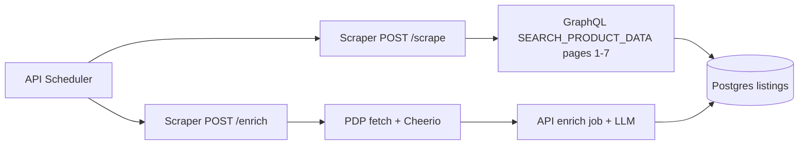

# Add Specialized store (scrape + enrich)

## Idea refine (Phase 1)

**How might we** surface Specialized’s full US sale catalog in the aggregator with accurate per-color prices and enough PDP context for taxonomy/LLM—without blocking on affiliate?

**Your choices (locked in):**

- **Catalog:** full sale PLP ([`https://www.specialized.com/us/en/shop/sale`](https://www.specialized.com/us/en/shop/sale)) — ~630 items
- **Affiliate:** none in MVP (`product_url` only, like Canyon)
- **Discovery:** DevTools capture provided (see Phase 0)

### What’s similar to Canyon vs different

| Aspect | Canyon (shipped) | Specialized (confirmed) |
|--------|------------------|-------------------------|
| Variant model | One row per color; `product_group_key` = numeric master id | One row per swatch; `product_group_key` = product id (`uid`); `store_sku` = `swatchesJSON[].id` |
| PLP pagination | Demandware ajax `start`/`sz` — pure fetch | **GET** persisted GraphQL `SEARCH_PRODUCT_DATA`; `page` 1–7, `resultsPerPage` 96 |
| PDP enrich | JSON-LD `Product` + `BreadcrumbList` | Microdata breadcrumbs + `og:description`; specs in **Technical Specifications** DOM |
| Bot risk | Low | **403** without browser UA; use `BROWSER_USER_AGENT` on all fetches |



**Recommended approach (locked):** **fetch-only GraphQL** for full catalog — no Playwright for PLP. Optional Cheerio HTML parser kept only as a test fallback / first-page sanity check.

### Key assumptions

- [x] Sale GraphQL paginates all products — **validated:** `totalResults: 630`, `totalPages: 7`, `perPage: 96`
- [ ] Per-color `colorPrices` on GraphQL match PDP (some products show min/max discount ranges)
- [ ] `fetch` + `BROWSER_USER_AGENT` works without `codeCacheKey` / session cookies (try without first; add cache key from sale HTML if 403)
- [ ] PDP microdata + tech-spec DOM sufficient for enrich without expanding accordions

### Not doing (MVP)

- Affiliate / Impact deep links
- Per-**size** SKU fan-out (color-only rows)
- Admin category mappings (post-first-scrape)
- Playwright “Show More” PLP (superseded by GraphQL)

---

## Phase 0 — GraphQL spike (complete)

**Endpoint (GET, persisted query / APQ):**

```
GET https://www.specialized.com/api/graphql/SEARCH_PRODUCT_DATA
  ?operationName=SEARCH_PRODUCT_DATA
  &variables={...}
  &extensions={"persistedQuery":{"version":1,"sha256Hash":"bf8ddeb358a5285109e572678e70c6a5194f6c03dafd3203bc644141736234ee"}}
  &localeCacheKey=US:en
```

Optional query param from browser: `codeCacheKey=...` — omit on first implementation; add if requests fail without it.

**Core variables** (merge `page` 1..`pagination.totalPages`):

```json
{
  "ajaxCatalog": "v3",
  "baseSiteId": "SBCUnitedStates",
  "categories": [],
  "categoryCode": "sale",
  "categoryFilter": "",
  "currencyIso": "USD",
  "filters": [],
  "backgroundFilters": [{ "key": "clearance_{country}", "value": true }],
  "getFromArchive": false,
  "language": "en",
  "page": 1,
  "path": "/us/en/shop/sale",
  "q": "",
  "region": "us",
  "resultsFormat": "native",
  "resultsPerPage": 96,
  "routeTag": "",
  "shouldShowColor": { "property": "alt_clearance_{country}", "acceptedValue": "1" },
  "sort": null,
  "temporaryAddlQueryString": "&bgfilter.clearance=true&&&excludedFacets=ss_price_employee&excludedFacets=ss_price_prodeal&resultsPerPage=96&page=1",
  "user_id": "",
  "validSolrCampaign": true
}
```

Update `temporaryAddlQueryString` `page=` to match `variables.page` each request.

**Response path:** `data.searchProducts.results[]`, `data.searchProducts.pagination.{totalResults,totalPages,currentPage,perPage}`

**Pagination loop:** `for (page = 1; page <= totalPages; page++)` — expect **7** requests for full sale.

**Fixture:** Save redacted page-2 JSON (you provided) as `apps/scraper/src/parsers/__fixtures__/specialized/graphql-sale-page-2.json` for tests.

---

## Phase 1 — Wire `specialized` through the stack

Mirror Canyon wiring ([`.cursor/plans/add_canyon_store_e867a6a8.plan.md`](.cursor/plans/add_canyon_store_e867a6a8.plan.md)):

| File | Change |
|------|--------|
| [`packages/shared/seed.sql`](packages/shared/seed.sql) | `Specialized`, `base_url=https://www.specialized.com/us/en`, `scrape_url=.../shop/sale`, `store_type=specialized` |
| [`apps/scraper/src/types.ts`](apps/scraper/src/types.ts) | `"specialized"` in `STORE_TYPES` |
| [`apps/scraper/src/parsers/index.ts`](apps/scraper/src/parsers/index.ts) | `PARSERS` / `ENRICHERS` |
| [`apps/api/internal/db/db.go`](apps/api/internal/db/db.go) | `StoreTypesWithEnrichers` |
| [`apps/api/internal/api/admin.go`](apps/api/internal/api/admin.go) | `AllowedStoreTypes` |
| [`apps/api/internal/scheduler/scheduler.go`](apps/api/internal/scheduler/scheduler.go) | Scrape guard |
| [`Makefile`](Makefile) | `scrape-now-specialized`, `enrich-now-specialized` |

---

## Phase 2 — PLP scraper (`specialized-plp.ts`)

**Facade:** [`apps/scraper/src/parsers/specialized.ts`](apps/scraper/src/parsers/specialized.ts) — `scrapeSpecialized` → `scrapeSpecializedSalePl`.

### GraphQL → `ScrapeResult` mapping

For each `result` in `searchProducts.results`, iterate **`swatchesJSON`** (usually one swatch per result row; same `uid` can appear multiple times for different colors):

| `ScrapeResult` field | GraphQL source |
|---------------------|----------------|
| `store_sku` | `swatch.id` (e.g. `5366729-4221397`) |
| `product_group_key` | `result.uid` or `result.productData.id` |
| `product_name` | `result.name` |
| `current_price` | `swatch.colorPrices.minDiscountPrice` (if null, skip row or fall back to `minPrice` — document in parser) |
| `original_price` | `swatch.colorPrices.minPrice` when `> current_price` |
| `product_url` | `https://www.specialized.com${result.url}?color=${swatch.id}` — e.g. `/us/en/p/4221397?color=5366729-4221397` (slug-less URL; matches site behavior) |
| `image_url` | `swatch.plpImageId` ?? `result.imageUrl` |
| `brand` | `"Specialized"` |
| `category_path` | `productData.list` split on `\|`, drop noise tokens (`Suspension Calculator`, `Turbo Range Calculator`, etc.) |
| `variant_options` | `{ Color: swatch.color ?? swatch.swatch }` — `color` often null; hex swatch is fallback |
| `is_in_stock` | `true` (sale feed; no stock signal on PLP) |

**Dedup:** `seenSku` set on `store_sku` across pages.

**Exports for tests:**

- `buildSpecializedSaleSearchVariables(page: number)`
- `buildSpecializedSaleSearchUrl(page: number)` — encodes variables + extensions
- `parseSpecializedSearchProductResponse(json)` → `ScrapeResult[]`
- `fetchSpecializedSaleSearchPage(page)` — `fetch` with `BROWSER_USER_AGENT`

**Main loop:**

```ts
let page = 1;
let totalPages = 1;
const all: ScrapeResult[] = [];
while (page <= totalPages) {
  const body = await fetchSpecializedSaleSearchPage(page);
  const { rows, pagination } = parseSpecializedSearchProductResponse(body);
  totalPages = pagination.totalPages;
  // merge rows, respect SCRAPER_MAX_PRODUCTS
  page++;
}
```

### Optional HTML parser (tests only)

Keep `parseSpecializedProductGridHtml` for SSR fixture (`[data-component="product-tile"]`) as regression guard for page-1 structure — **not** used in production scrape path.

---

## Phase 3 — PDP enrich (`specialized-pdp.ts`)

**fetch** with `BROWSER_USER_AGENT` + `ENRICH_DELAY_MS` (same as [`canyon-pdp.ts`](apps/scraper/src/parsers/canyon-pdp.ts)).

| Field | Source |
|-------|--------|
| `category_path` | Microdata `BreadcrumbList` — `span[itemProp="name"]`; prefer over PLP `productData.list` when present |
| `description` | `meta[property="og:description"]` |
| `raw_specs` | `#technical-specifications` / `SpecContainer_*` pairs |

---

## Phase 4 — Tests + fixtures

- `__fixtures__/specialized/graphql-sale-page-2.json` — from your capture (page 2)
- `__fixtures__/specialized/pdp-stumpjumper-head.html` — optional PDP snippet
- [`specialized.test.ts`](apps/scraper/src/parsers/specialized.test.ts): parse fixture → rows with SKU/prices/URLs; mocked multi-page fetch; PDP enrich

---

## Phase 5 — Docs + verification

Update [`docs/SCRAPING.md`](docs/SCRAPING.md), [`apps/scraper/README.md`](apps/scraper/README.md), [`CLAUDE.md`](CLAUDE.md).

```bash
make db-seed
make scrape-now-specialized    # expect ~630 rows (or SCRAPER_MAX_PRODUCTS cap)
make enrich-now-specialized
```

---

## Risk notes

- **Price ranges:** `minDiscountPrice` / `maxDiscountPrice` can differ (e.g. Turbo Tero X) — store **min** as `current_price`; note in parser comment.
- **Null discount price:** Some rows have `minDiscountPrice: null` (e.g. wheelsets) — skip or treat as non-sale; log count.
- **`codeCacheKey` / WAF:** If GraphQL returns 403 in production, extract `codeCacheKey` from sale page HTML or use `SCRAPER_STORAGE_STATE`.
- **GraphQL hash drift:** Persisted-query `sha256Hash` may change on deploy — monitor failures; update constant or fall back to full query if needed.
