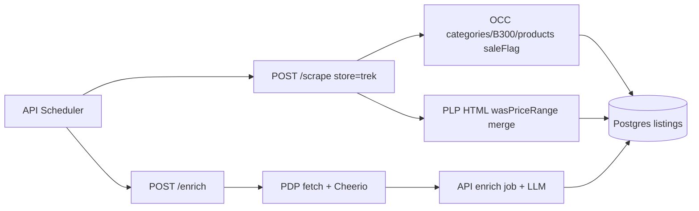

# Add Trek store (scrape + enrich)

## Idea refine

**How might we** surface Trek’s US MTB sale inventory with accurate sale pricing and enough PDP context for taxonomy/LLM—without affiliate wiring or browser scraping for the catalog?

**Your choices (locked in):**

- **Catalog:** MTB sale only — [`scrape_url`](https://www.trekbikes.com/us/en_US/bikes/mountain-bikes/c/B300/?pageSize=24&q=%3Arelevance%3AsaleFlag%3Atrue&sort=relevance) (category `B300`, `saleFlag:true`, ~23 results today)
- **Affiliate:** none (`product_url` only, like Canyon/Specialized)
- **Variants:** **one row per product code** (recommended) — matches PLP tiles; `store_sku` = OCC `code` (e.g. `57635`); optional `variant_options.Color` from `colorKeyValue` when present; do **not** fan out size SKUs (`5337753`, …) in MVP

### Platform discovery (from live probe)

Trek US runs **SAP Commerce Cloud** (`x-sap-pad`, `accstorefront` cookies). Two useful data sources:

| Source                                         | Use                     | Notes                                                                                                                                                                     |
| ---------------------------------------------- | ----------------------- | ------------------------------------------------------------------------------------------------------------------------------------------------------------------------- |
| **OCC REST** `api.trekbikes.com/occ/v2/us/...` | Primary scrape          | `categories/B300/products?query=:relevance:saleFlag:true` returns 23 products, 1 page; structured `code`, `name`, `url`, `price`, `saleFlag`, `defaultCategory`, `images` |
| **PLP HTML** (same `scrape_url`)               | MSRP / `original_price` | OCC listing lacks `wasPriceRange`; Vue `:product="{... wasPriceRange ...}"` embeds `"$12,499.99"` per tile                                                                |
| **PDP HTML** (fetch + Cheerio)                 | Enrich MVP              | Static breadcrumbs + `og:description` work; **spec DOM is client-rendered** (Vue `family-details-page-app` shell) — specs likely empty without Playwright follow-up       |



### Key assumptions to validate during implementation

- [ ] OCC category endpoint stays stable (`baseSite=us`, category `B300`, query `:relevance:saleFlag:true`)
- [ ] `fetch` + [`BROWSER_USER_AGENT`](apps/scraper/src/config.js) works from Render without session cookies (PLP + PDP succeeded locally)
- [ ] HTML `wasPriceRange` parsing stays aligned with Vue `:product` JSON (entity-encoded quotes)
- [ ] Fetch-only enrich (breadcrumbs + description) is enough for LLM categorization; **raw_specs may be sparse** until a Playwright spike finds a reliable spec selector

### Not doing (MVP)

- Affiliate / Impact deep links
- Per-size SKU fan-out or variant backfill SQL (Shopify-only today)
- All-Trek sale or non-sale MTB catalogs
- Playwright PLP scrape (OCC is cleaner)
- Admin category mappings (post-first-scrape, like other stores)

---

## Implementation

Follow the established “add store” checklist from [Mack Cycle plan](.cursor/plans/add_mack_cycle_store_82953e47.plan.md) and [Specialized plan](.cursor/plans/add_specialized_store_66aa7b2a.plan.md).

### 1. Scraper — [`apps/scraper/src/parsers/`](apps/scraper/src/parsers/)

| File                                                    | Purpose                                                       |
| ------------------------------------------------------- | ------------------------------------------------------------- |
| [`trek-plp.ts`](apps/scraper/src/parsers/trek-plp.ts)   | OCC scrape + HTML MSRP merge                                  |
| [`trek-pdp.ts`](apps/scraper/src/parsers/trek-pdp.ts)   | Fetch PDP enrich (Cheerio)                                    |
| [`trek.ts`](apps/scraper/src/parsers/trek.ts)           | `scrapeTrek` / `enrichTrek` re-exports                        |
| [`trek.test.ts`](apps/scraper/src/parsers/trek.test.ts) | Unit tests with fixtures from captured OCC JSON + PLP snippet |

**PLP scrape logic (`scrapeTrekSalePl`):**

- Constants: `TREK_ORIGIN = https://www.trekbikes.com`, `TREK_OCC = https://api.trekbikes.com/occ/v2/us`, category `B300`, query `:relevance:saleFlag:true`, `pageSize=24`
- Paginate `currentPage=0..totalPages-1` via:

```http
GET /occ/v2/us/categories/B300/products
  ?query=:relevance:saleFlag:true
  &fields=products(FULL),pagination(FULL)
  &pageSize=24&currentPage={n}&lang=en_US&curr=USD
```

- Map each product where `saleFlag === true`:
  - `store_sku` = `code`
  - `product_name` = `name`
  - `current_price` = `price.value`
  - `product_url` = `{TREK_ORIGIN}/us/en_US{url}` (normalize path)
  - `image_url` = `https:` + primary image URL when protocol-relative
  - `brand` = `brandNameFull` ?? `"Trek"`
  - `category_path` = `["Mountain bikes", defaultCategory]` when set
  - `is_in_stock` = `true` (OCC listing omits stock; sale items assumed purchasable)
  - `product_group_key` = `code`
  - `variant_options` = `{ Color: joined colorKeyValue values }` when `colorKeyValue` present

- **MSRP merge:** in parallel, `fetch(scrape_url)` and parse each `product-card-item` `:product="{...}"` block (decode `&#034;` → `"`), index by `code`, set `original_price` from `parseUsdPrice(wasPriceRange)` when `> current_price` (reuse price parser pattern from [`canyon-plp.ts`](apps/scraper/src/parsers/canyon-plp.ts))

**PDP enrich (`enrichTrekPdp`):**

- `fetch` PDP URL with redirects (`curl -L` behavior), `BROWSER_USER_AGENT`, [`ENRICH_DELAY_MS`](apps/scraper/src/config.js)
- Extract:
  - `category_path` from `#breadcrumbs` / `.breadcrumb__item` links (drop Home + current product), mirroring [`specialized-pdp.ts`](apps/scraper/src/parsers/specialized-pdp.ts)
  - `description` from `meta[property="og:description"]` or `meta[name="description"]`
  - `raw_specs` = `{}` for now (document Playwright follow-up if static HTML has no spec nodes)
- Export pure parse helpers for tests (`enrichTrekPdpFromHtml`)

**Registration:**

- [`apps/scraper/src/types.ts`](apps/scraper/src/types.ts): add `"trek"` to `STORE_TYPES`
- [`apps/scraper/src/parsers/index.ts`](apps/scraper/src/parsers/index.ts): `PARSERS.trek`, `ENRICHERS.trek`

### 2. API wiring — [`apps/api/`](apps/api/)

| File                                                                          | Change                                                                            |
| ----------------------------------------------------------------------------- | --------------------------------------------------------------------------------- |
| [`internal/db/db.go`](apps/api/internal/db/db.go)                             | Add `"trek"` to `StoreTypesWithEnrichers`                                         |
| [`internal/api/admin.go`](apps/api/internal/api/admin.go)                     | Add `"trek"` to `AllowedStoreTypes`                                               |
| [`internal/scheduler/scheduler.go`](apps/api/internal/scheduler/scheduler.go) | Extend scrape whitelist (~line 172) so `trek` doesn’t fall through to `jensonusa` |

No variant backfill change (not Shopify).

### 3. Database seed — [`packages/shared/seed.sql`](packages/shared/seed.sql)

```sql
INSERT INTO stores (name, base_url, scrape_url, store_type, affiliate_network)
SELECT 'Trek', 'https://www.trekbikes.com/us/en_US', 'https://www.trekbikes.com/us/en_US/bikes/mountain-bikes/c/B300/?pageSize=24&q=%3Arelevance%3AsaleFlag%3Atrue&sort=relevance', 'trek', NULL
WHERE NOT EXISTS (SELECT 1 FROM stores WHERE name = 'Trek');
```

Run `make db-seed` locally (or manual INSERT on remote).

### 4. Ops & admin UI

| File                                                                         | Change                                                |
| ---------------------------------------------------------------------------- | ----------------------------------------------------- |
| [`Makefile`](Makefile)                                                       | `scrape-now-trek`, `enrich-now-trek`; add to `.PHONY` |
| [`apps/web/src/admin/StoreManager.tsx`](apps/web/src/admin/StoreManager.tsx) | Add `trek` to fallback `storeTypes` list              |

### 5. Docs (per [documentation-sync rule](.cursor/rules/documentation-sync.mdc))

- [`docs/SCRAPING.md`](docs/SCRAPING.md) — Trek OCC + enrich notes
- [`apps/scraper/README.md`](apps/scraper/README.md) — manual curl / make targets
- [`apps/api/README.md`](apps/api/README.md) — enrich store list
- [`CLAUDE.md`](CLAUDE.md) — make targets + architecture blurb

### 6. Verification

```bash
# Unit tests
pnpm --filter @mtb-aggregator/scraper run test trek

# Manual (scraper running)
curl -X POST http://localhost:3000/scrape \
  -H "Content-Type: application/json" \
  -d '{"url":"https://www.trekbikes.com/us/en_US/bikes/mountain-bikes/c/B300/?pageSize=24&q=%3Arelevance%3AsaleFlag%3Atrue&sort=relevance","store":"trek"}'

make scrape-now-trek
make enrich-now-trek
```

Expect ~23 listings; spot-check `original_price`, discount %, and enrich breadcrumbs on 2–3 PDPs.

---

## Open follow-up (post-MVP, if specs matter)

If enrich returns empty `raw_specs`, run a short Playwright spike on a Trek PDP: wait for Vue hydration, locate technical-spec accordion selectors, and either add Playwright enrich (like CC) or discover a hidden OCC/JSON endpoint the SPA calls. You offered help here—useful if fetch-only enrich proves too thin for LLM spec extraction.
