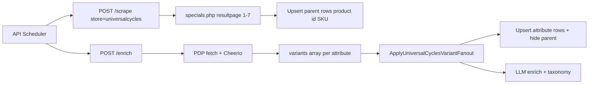

# Add Universal Cycles store

## Discovery summary (live probe)

Universal Cycles is **not Shopify** (404 on `/collections/.../products.json`). It runs a **custom PHP storefront** with **server-rendered HTML** — no WAF, no JS hydration required. Plain `fetch` + Cheerio works from scraper/API hosts.

| Finding            | Detail                                                                                                                  |
| ------------------ | ----------------------------------------------------------------------------------------------------------------------- |
| **Catalog**        | [`specials.php`](https://www.universalcycles.com/specials.php) — **615 sale products** today                            |
| **Pagination**     | `?resultpage=2` … `?resultpage=7` (100/100/…/15 products; **not** `page=`)                                              |
| **PLP tiles**      | `.product-box` cards; URL `/shopping/product_details.php?id={productId}`                                                |
| **SKU on site**    | Product id on PLP; attribute composite **`{productId}-{attributeId}`** on PDP (e.g. `96187-262627`)                     |
| **Pricing**        | `From: $X`, optional `Overstock Item From: $Y`, `MSRP: $Z` in green savings block                                       |
| **Category hints** | Section headers (`h4.well`) group tiles (e.g. "Fox Racing Shox Forks - MTB Suspension")                                 |
| **PDP enrich**     | `#PageContent` description/spec bullets; `og:*` meta; per-variant `#attribute_{id}` blocks with price, stock, cart link |
| **Stock**          | Per attribute: "Add to Cart" + ship qty vs "Notify When In Stock" / "Currently Out of Stock"                            |

**Your scope (locked):** `specials.php` only; **attribute fan-out on enrich** (one DB row per attribute SKU).

**Not in MVP:** [`shimano_special_sale.php`](https://www.universalcycles.com/shimano_special_sale.php), affiliate URLs, Playwright.

### Discovery feedback (locked)

| Topic                 | Decision                                                                                                                                                |
| --------------------- | ------------------------------------------------------------------------------------------------------------------------------------------------------- |
| **Sample PDPs**       | Use user-provided edge cases as primary fixtures (see below)                                                                                            |
| **Out of stock**      | Follow **JensonUSA pattern**: keep listing rows; set `is_in_stock` from per-variant `is_orderable`; default `/deals` already filters `is_in_stock=true` |
| **Category taxonomy** | PLP section headers for initial `category_path`; rely on **LLM classifier** post-enrich when headers are weak (same as Trek/Revel)                      |
| **Mobile HTML**       | Same layout as desktop — fetch with `BROWSER_USER_AGENT` only; no separate mobile parser                                                                |

#### Fixture PDPs (probe results)

| Product id                                                                         | Name                                     | Variants | Why it matters                                                                                                                               |
| ---------------------------------------------------------------------------------- | ---------------------------------------- | -------- | -------------------------------------------------------------------------------------------------------------------------------------------- |
| [`102857`](https://www.universalcycles.com/shopping/product_details.php?id=102857) | Fox Transfer Dropper (Performance Elite) | **5**    | Mixed stock: some attributes have `Add to Cart`, others show **Notify When In Stock** + **Currently Out of Stock** (e.g. attribute `254029`) |
| [`106730`](https://www.universalcycles.com/shopping/product_details.php?id=106730) | Odyssey Thunderbolt Crankset             | **6**    | LHD/RHD × arm length; per-variant **Overstock Item** badge on at least one SKU (`264711`); all in stock                                      |
| [`12846`](https://www.universalcycles.com/shopping/product_details.php?id=12846)   | Stans Original Tubeless Rim Tape 2024    | **7**    | High variant count (width × roll length); tests fan-out upsert at scale                                                                      |

Also keep from initial probe: [`96187`](https://www.universalcycles.com/shopping/product_details.php?id=96187) (single attribute, OOS), [`104220`](https://www.universalcycles.com/shopping/product_details.php?id=104220) (2 tire widths).



---

## Architecture decisions

### Scrape (PLP): one parent row per product

- Paginate `https://www.universalcycles.com/specials.php?resultpage={n}` until no next page (parse `.PageNumbers` links).
- Parse each `.product-box`:
  - `store_sku` = `id` query param from `product_details.php?id=`
  - `product_url` = absolute URL
  - `product_name` from link title / visible text (include subtitle `<i class="text-muted">` as part of name or stash in `variant_options` hint)
  - `current_price` = lowest of `From:` and `Overstock Item From:` (prefer overstock when present — it is the actual sale price)
  - `original_price` = parsed `MSRP: $X`
  - `image_url` = `/images/products/small/{id}.jpg`
  - `brand` = first token(s) of name + [`brand_aliases.json`](packages/shared/brand_aliases.json) normalization (same as other stores)
  - `category_path` = parsed from nearest preceding `h4.well` section header (split on last segment boundary heuristically, e.g. `"Cane Creek Suspension Seatposts"` → `["Cane Creek", "Suspension Seatposts"]`)
  - `product_group_key` = `{store_id}:{productId}` (match Jenson grouping convention)
  - `is_in_stock` = `true` at scrape time (refined on enrich)

**Template:** [`canyon-plp.ts`](apps/scraper/src/parsers/canyon-plp.ts) for fetch pagination + Cheerio tile parsing; [`trek-plp.ts`](apps/scraper/src/parsers/trek-plp.ts) for price-merge patterns.

### Enrich (PDP): attribute fan-out

Parse each `#attribute_{attributeId}` row:

| Field                              | Source                                                                                                                                                                      |
| ---------------------------------- | --------------------------------------------------------------------------------------------------------------------------------------------------------------------------- |
| `code`                             | Composite `"{productId}-{attributeId}"` from `#partnumbers_{id}` or cart URL                                                                                                |
| `dimensions`                       | Variant label from `h4` (e.g. `{ Size: "31.6 x 375mm (Black)" }`)                                                                                                           |
| `is_orderable`                     | `true` only when attribute block has working `#addToCart_{id}` href; `false` for **Notify When In Stock** or **Currently Out of Stock** (maps to `is_in_stock` like Jenson) |
| `current_price` / `original_price` | Per-variant price block (extend variant struct — UC-only optional fields)                                                                                                   |
| `description`                      | `#PageContent` HTML → text (shared across variants)                                                                                                                         |
| `raw_specs`                        | Bullet list items from `#PageContent` (`Diameter:`, `Travel:`, etc.)                                                                                                        |

Return standard [`EnrichResult`](apps/scraper/src/parsers/jensonusa.ts) with `variants[]` shaped like [`PdpEnrichVariant`](apps/scraper/src/parsers/jensonusa-pdp.ts), plus optional price fields for UC fan-out.

**Template:** [`trek-pdp.ts`](apps/scraper/src/parsers/trek-pdp.ts) for fetch enrich; [`jensonusa-pdp.ts`](apps/scraper/src/parsers/jensonusa-pdp.ts) for `variants[]` contract.

### API: new UC-specific fan-out (insert siblings)

Unlike Jenson (PLP already emits variant SKUs) or CC (Impact catalog pre-creates SKUs), UC needs **enrich-driven upserts**:

Add [`apps/api/internal/db/uc_pdp_variants.go`](apps/api/internal/db/uc_pdp_variants.go):

- `ApplyUniversalCyclesVariantFanout(ctx, storeID, parentListing, variants, seen)`
- For each enrich variant:
  - **Upsert** listing with `store_sku = composite code`, same `product_url`, per-variant prices/stock/`variant_options`, shared `product_group_key`
  - Set `is_in_stock = variant.is_orderable` (Jenson fan-out pattern — **do not hide** OOS rows)
- After successful fan-out, **hide parent** product-id row when attribute rows exist (same idea as migration [`025_jenson_hide_superseded_parent_listings.sql`](packages/shared/migrations/025_jenson_hide_superseded_parent_listings.sql) — add UC-specific migration or generalized hide rule)
- If enrich returns `unavailable: true` (PDP gone / 404), use existing [`UpdateListingEnrichment`](apps/api/internal/db/db.go) path to set parent `is_in_stock = false` (same as all enricher stores)
- Wire in [`scheduler.go`](apps/api/internal/scheduler/scheduler.go) enrich path + [`handlers.go`](apps/api/internal/api/handlers.go) admin enrich, mirroring [`jenson_apply.go`](apps/api/internal/api/jenson_apply.go) / [`cc_apply.go`](apps/api/internal/api/cc_apply.go)

Extend [`scraper.EnrichVariant`](apps/api/internal/scraper/client.go) with optional `CurrentPrice`, `OriginalPrice` (omitempty) for UC fan-out upserts.

---

## Implementation files

### Scraper (new)

| File                                                                        | Purpose                                                            |
| --------------------------------------------------------------------------- | ------------------------------------------------------------------ |
| [`universalcycles-plp.ts`](apps/scraper/src/parsers/universalcycles-plp.ts) | Paginated PLP fetch + parse                                        |
| [`universalcycles-pdp.ts`](apps/scraper/src/parsers/universalcycles-pdp.ts) | PDP parse: description, specs, attributes                          |
| [`universalcycles.ts`](apps/scraper/src/parsers/universalcycles.ts)         | Thin facade exports                                                |
| `__fixtures__/universalcycles/`                                             | PLP pages 1+7; PDPs `96187`, `104220`, `102857`, `106730`, `12846` |

Register in [`types.ts`](apps/scraper/src/types.ts) (`STORE_TYPES`) and [`parsers/index.ts`](apps/scraper/src/parsers/index.ts).

### API / ops

- [`db.go`](apps/api/internal/db/db.go) — `StoreTypesWithEnrichers`
- [`admin.go`](apps/api/internal/api/admin.go) — `AllowedStoreTypes`
- [`scheduler.go`](apps/api/internal/scheduler/scheduler.go) — scrape whitelist (~line 172) + enrich fan-out hook
- [`packages/shared/seed.sql`](packages/shared/seed.sql) — store row
- [`Makefile`](Makefile) — `scrape-now-universalcycles`, `enrich-now-universalcycles`
- [`apps/web/src/admin/StoreManager.tsx`](apps/web/src/admin/StoreManager.tsx) — fallback store types list
- Migration (optional but recommended): hide superseded parent `store_sku = product_id` when `{product_id}-*` siblings exist

### Docs

- [`docs/SCRAPING.md`](docs/SCRAPING.md), [`apps/scraper/README.md`](apps/scraper/README.md), [`apps/api/README.md`](apps/api/README.md), [`CLAUDE.md`](CLAUDE.md)

---

## Testing strategy

1. **Unit tests** (Cheerio on fixtures): price parsing (`From:` + overstock + MSRP), pagination URL builder, PLP tile extraction, PDP attribute blocks (in-stock vs OOS, 1 vs N attributes).
2. **Manual scrape** (limit with `SCRAPER_MAX_PRODUCTS=20` first):

```bash
curl -X POST http://localhost:3000/scrape \
  -H "Content-Type: application/json" \
  -d '{"url":"https://www.universalcycles.com/specials.php","store":"universalcycles"}'
```

3. **Manual enrich** on fixture PDPs: `102857` (mixed stock), `106730` (6 variants + overstock badge), `12846` (7 variants), plus `96187` / `104220`.
4. **Full job:** `make scrape-now-universalcycles` then `make enrich-now-universalcycles`; verify ~615 parent rows → attribute rows after enrich, `group_variants=true` collapses siblings.

---

## Edge cases to handle (validate with fixtures)

- **Dual price lines** (`From:` + `Overstock Item From:`) — use overstock as `current_price`
- **Missing MSRP** on some tiles — allow `original_price: null`
- **Malformed HTML** (unclosed `<a>` tags in PLP) — anchor parsing via `href` + `title`, not DOM tree depth
- **Single-attribute products** — fan-out still creates one attribute row; hide parent
- **Mixed / all OOS attributes** — keep rows visible; `is_in_stock=false` per variant (Jenson pattern); `/deals` default hides them
- **Per-variant overstock badge** — PDP may mark individual attributes as "Overstock Item" (`106730-264711`); parse price from that attribute's price block, not parent
- **OOS detection quirk** — some OOS attributes still have a dormant `#addToCart_{id}` script binding; prefer **Notify When In Stock** button or **Currently Out of Stock** text inside the `#attribute_{id}` block as the signal
- **Rate limiting** — pace PDP enrich (~200–300ms between fetches via existing `ENRICH_DELAY_MS`); 615 PDPs ≈ 3–5 min enrich job

---

## Risks / follow-ups (post-MVP)

- **Enrich duration** at ~615 PDPs — acceptable nightly; consider `SCRAPER_MAX_PRODUCTS` cap in dev only
- **Parent-row hide migration** — run after first successful enrich backfill
- **`make backfill-uc-variants`** command (like CC/Jenson) if we need to replay fan-out on existing rows
- **Shimano special sale** — separate store or second scrape URL later if desired
