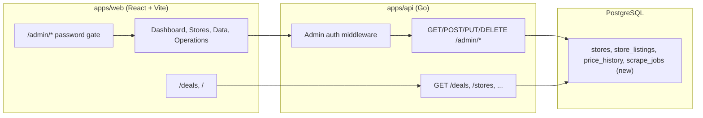

# Admin Dashboard

## Architecture

The admin dashboard lives inside `apps/web` as a set of protected `/admin/*` routes, backed by new `/admin/*` API endpoints in the Go API. Auth is a simple shared password checked against an env var.



## Phase A: Auth + Layout Foundation

### Backend -- Admin Auth Middleware

Add middleware in a new file [apps/api/internal/api/admin.go](apps/api/internal/api/admin.go):

- Read `ADMIN_PASSWORD` from env (required for admin routes)
- Check `Authorization: Bearer <password>` header on all `/admin/*` routes
- Add `POST /admin/auth` endpoint that validates password and returns success (for the frontend gate)

Register admin routes in [apps/api/main.go](apps/api/main.go) under an `/admin` prefix with the middleware applied.

**Scrape/Enrich triggers:** Allow either `CRON_SECRET` (header or query) or admin auth (`Authorization: Bearer <ADMIN_PASSWORD>`) on `POST /scrape-now` and `POST /enrich-now` so the same endpoints work for both cron and the admin dashboard.

### Frontend -- Password Gate + Admin Layout

- The frontend sends the password to the API and stores it in `localStorage` on success
- New component: `AdminGate` -- password input form, calls `POST /admin/auth`, stores password in localStorage on success
- New component: `AdminLayout` -- sidebar nav (Dashboard, Stores, Data, Operations), main content area
- Add routes in [apps/web/src/App.tsx](apps/web/src/App.tsx) or a new router config:
  - `/admin` -> Dashboard
  - `/admin/stores` -> Store Management
  - `/admin/data` -> Data Browser
  - `/admin/operations` -> Scraper Operations

## Phase B: Dashboard Overview

### Backend

Add `GET /admin/dashboard` in the admin handlers returning aggregate stats:

- Total stores, total listings, total in-stock listings
- Per-store: name, listing count, last scraped time, last result count, health status
- Scraper service reachability (reuse existing health check logic)
- Enrichment coverage (% of listings with canonical categories)

### Frontend -- `/admin` page

- Summary cards: total stores, total listings, scraper status (green/red)
- Store health table: each store with last scraped time, listing count, health indicator
- Quick action buttons: "Scrape All", "Scrape [Store]", "Run Enrichment"
- These buttons call the existing `POST /scrape-now` and `POST /enrich-now` endpoints (with admin auth)

## Phase C: Store Management

### Backend

Add CRUD endpoints in [apps/api/internal/api/admin.go](apps/api/internal/api/admin.go) and DB functions in [apps/api/internal/db/db.go](apps/api/internal/db/db.go):

- `GET /admin/stores` -- list all stores with full detail (existing `GetStores` can be extended)
- `POST /admin/stores` -- create store (name, base_url, scrape_url, store_type, affiliate_network)
- `PUT /admin/stores/:id` -- update store fields
- `DELETE /admin/stores/:id` -- delete store (cascades to listings + price history)

Validation: `store_type` must match a registered parser (query scraper's `/parsers` endpoint, or maintain a list).

### Frontend -- `/admin/stores` page

- Table listing all stores with columns: name, type, scrape URL, listing count, last scraped, actions
- "Add Store" button opening a form/modal (name, base_url, scrape_url, store_type dropdown, affiliate_network)
- Edit/Delete actions per row
- Per-store "Scrape Now" button

## Phase D: Scraper Operations + Job History

### Backend -- Scrape Job Tracking

New migration `packages/shared/migrations/008_scrape_jobs.sql`:

```sql
CREATE TABLE scrape_jobs (
    id SERIAL PRIMARY KEY,
    store_id INTEGER REFERENCES stores(id) ON DELETE SET NULL,
    store_name VARCHAR(100),
    status VARCHAR(20) DEFAULT 'running',  -- running, completed, failed
    started_at TIMESTAMPTZ DEFAULT NOW(),
    completed_at TIMESTAMPTZ,
    listings_found INTEGER,
    listings_upserted INTEGER,
    errors TEXT[],
    warnings TEXT[],
    triggered_by VARCHAR(20) DEFAULT 'manual'  -- manual, cron
);
```

Update [apps/api/internal/scheduler/scheduler.go](apps/api/internal/scheduler/scheduler.go) to create a `scrape_jobs` record at the start of each scrape and update it on completion/failure.

New endpoints:

- `GET /admin/jobs` -- list recent scrape jobs (paginated, filterable by store)
- `GET /admin/jobs/:id` -- single job detail with errors/warnings

### Frontend -- `/admin/operations` page

- "Trigger Scrape" panel: select store (or all) + "Run" button with status indicator
- "Trigger Enrichment" panel: "Run" button + force checkbox
- Job history table: store, status (color-coded), started, duration, listings found/upserted, errors
- Click a job to see full detail (errors, warnings)

## Phase E: Data Browser

### Backend

- `GET /admin/listings` -- paginated listing browser with all fields exposed (including metadata JSONB, raw category_path, enrichment status, created_at)
- Query params: store_id, brand, has_canonical_category (bool), has_enrichment (bool), search (q), sort, limit, offset

### Frontend -- `/admin/data` page

- Searchable, filterable table of listings
- Columns: product name, store, brand, price, original price, discount %, canonical category, enriched (yes/no), last scraped
- Click a row to see full detail: all fields, metadata JSON, category_path array, price history mini-chart
- Filters sidebar: store, brand, enrichment status, category
- Export option (CSV) could be a future nice-to-have

## Key Files to Create/Modify

**New files:**

- `apps/api/internal/api/admin.go` -- admin handlers + auth middleware
- `apps/web/src/admin/` -- admin components directory
  - `AdminGate.tsx`, `AdminLayout.tsx`
  - `Dashboard.tsx`, `StoreManager.tsx`, `DataBrowser.tsx`, `Operations.tsx`
- `apps/web/src/admin/api.ts` -- admin API client functions
- `packages/shared/migrations/008_scrape_jobs.sql`

**Modified files:**

- [apps/api/main.go](apps/api/main.go) -- register admin routes
- [apps/api/internal/db/db.go](apps/api/internal/db/db.go) -- store CRUD + scrape job queries
- [apps/api/internal/scheduler/scheduler.go](apps/api/internal/scheduler/scheduler.go) -- record scrape jobs
- [apps/web/src/App.tsx](apps/web/src/App.tsx) -- add admin routes
- [apps/web/package.json](apps/web/package.json) -- may need a table component library (e.g., `@tanstack/react-table`)

## Implementation Order

Build incrementally so each phase is independently useful:

1. **Auth + Layout** -- the skeleton that everything hangs on
2. **Dashboard** -- immediate value: see system health at a glance, trigger scrapes
3. **Store Management** -- unlocks adding stores without code changes
4. **Operations + Job History** -- visibility into what the system is doing
5. **Data Browser** -- inspect and debug data quality issues
