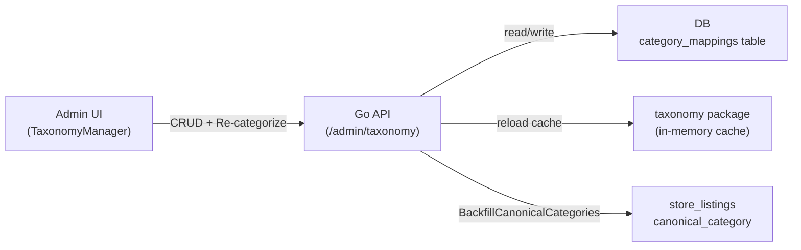

# Admin Taxonomy Management

## Current State

Mappings live in a static JSON file (`[packages/shared/category_taxonomy.json](packages/shared/category_taxonomy.json)`) loaded into memory at startup by `[taxonomy.Load()](apps/api/internal/taxonomy/taxonomy.go)`. Changing mappings requires editing JSON, redeploying, and running the `[backfill-canonical-categories](apps/api/cmd/backfill-canonical-categories/main.go)` CLI. The admin dashboard already displays canonical categories but has no way to manage them.

## Architecture



## 1. Database: `category_mappings` table

New migration `007_category_mappings.sql`:

```sql
CREATE TABLE IF NOT EXISTS category_mappings (
  id SERIAL PRIMARY KEY,
  raw_keywords TEXT[] NOT NULL,
  canonical TEXT[] NOT NULL,
  priority INT NOT NULL DEFAULT 0,
  created_at TIMESTAMPTZ NOT NULL DEFAULT NOW(),
  updated_at TIMESTAMPTZ NOT NULL DEFAULT NOW()
);
```

- `raw_keywords`: the list of raw terms (currently the `"raw"` array in JSON)
- `canonical`: the canonical path (e.g. `{"Components", "Brakes"}`)
- `priority`: controls evaluation order (higher = matched first); replaces implicit ordering from JSON array position
- Seed data from existing `category_taxonomy.json` entries (22 rows)

## 2. Taxonomy package: load from DB

Update `[apps/api/internal/taxonomy/taxonomy.go](apps/api/internal/taxonomy/taxonomy.go)`:

- Add `LoadFromDB(db)` that queries `category_mappings ORDER BY priority DESC, id` and populates the in-memory cache (same `cfg` struct)
- Add `Reload(db)` that re-reads from DB into the cache (called after admin edits)
- Keep `Load(path)` for seeding/fallback but make DB the primary source
- `Map()` function stays the same -- it reads from the in-memory cache, no query per call

## 3. DB layer: CRUD + seed

Add to `[apps/api/internal/db/db.go](apps/api/internal/db/db.go)`:

- `ListCategoryMappings(ctx) -> []CategoryMapping` -- all mappings ordered by priority DESC, id
- `GetCategoryMapping(ctx, id) -> CategoryMapping`
- `CreateCategoryMapping(ctx, raw, canonical, priority) -> id`
- `UpdateCategoryMapping(ctx, id, raw, canonical, priority)`
- `DeleteCategoryMapping(ctx, id)`
- `SeedCategoryMappings(ctx, mappings)` -- insert from JSON if table is empty (run at startup)

## 4. API endpoints

Add to `[apps/api/internal/api/handlers.go](apps/api/internal/api/handlers.go)` and register in `[apps/api/main.go](apps/api/main.go)`:

- `GET /admin/taxonomy` -- list all mappings
- `POST /admin/taxonomy` -- create mapping (body: `{ raw_keywords, canonical, priority }`)
- `PUT /admin/taxonomy/:id` -- update mapping
- `DELETE /admin/taxonomy/:id` -- delete mapping
- `POST /admin/taxonomy/recategorize` -- runs full backfill (`BackfillCanonicalCategories`), returns count of updated listings

All endpoints behind `AdminRequired`. After any CUD operation, call `taxonomy.Reload(db)` to refresh the in-memory cache.

## 5. Frontend: API client

Add to `[apps/web/src/admin/api.ts](apps/web/src/admin/api.ts)`:

- `CategoryMapping` type: `{ id, raw_keywords, canonical, priority, created_at, updated_at }`
- `fetchTaxonomyMappings()`, `createTaxonomyMapping(body)`, `updateTaxonomyMapping(id, body)`, `deleteTaxonomyMapping(id)`, `triggerRecategorize()`

## 6. Frontend: TaxonomyManager component

New component at `apps/web/src/admin/TaxonomyManager.tsx`, following the existing patterns in `[DataBrowser.tsx](apps/web/src/admin/DataBrowser.tsx)`:

- **Table view**: columns for canonical path, raw keywords (as tags/chips), priority, actions (edit/delete)
- **Add/edit form**: inline or modal with fields for canonical path (e.g. "Components > Brakes"), raw keywords (comma-separated or tag input), priority number
- **Delete**: confirmation prompt
- **"Re-categorize all" button**: calls `POST /admin/taxonomy/recategorize`, shows result count and loading state
- Wire into the admin layout as a new tab/section

## 7. Startup seeding

In `[apps/api/main.go](apps/api/main.go)`, after `taxonomy.Load("")` and DB init:

- Call `db.SeedCategoryMappings()` to populate the table from JSON if empty (one-time migration of existing data)
- Then call `taxonomy.LoadFromDB(db)` to switch the in-memory cache to DB-sourced data
