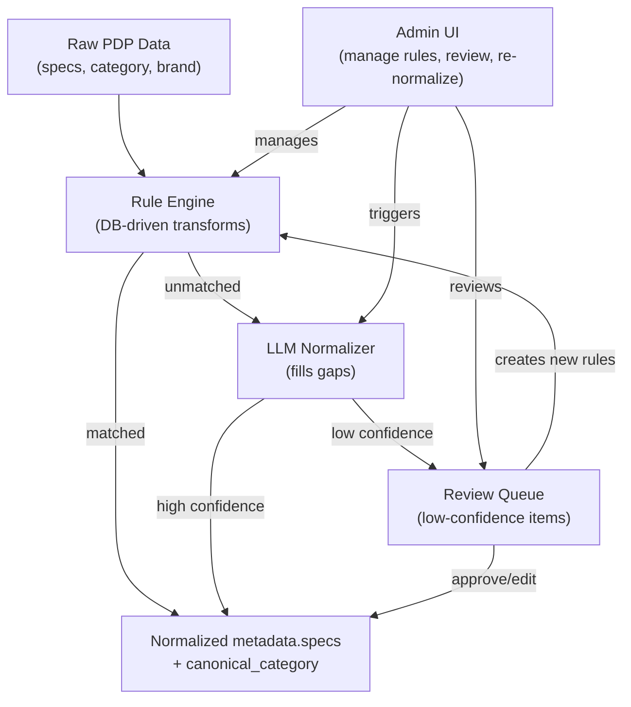

# Automating Data Normalization

## Primary Goal

Normalize `metadata.specs` values and category data automatically, with a configurable system that can be managed and adapted over time through the admin UI. The system should grow smarter as more data flows through it, with human oversight where it matters.

## Current State: What's Manual

Every normalization layer requires human intervention:

- **Spec values (`metadata.specs`):** Raw PDP values like "148mm", "148 mm", "Boost 148mm", "15x110mm BOOST(TM)" are stored as-is. `spec_value_aliases` only remap at display time in facets -- the underlying data stays messy. There is no write-time normalization of spec values.
- **Spec key aliases:** Hardcoded in `[apps/api/internal/metadata/normalize.go](apps/api/internal/metadata/normalize.go)` (`specKeyAliases` map). New PDP spec keys from stores just get snake_cased with no semantic grouping. Adding a new alias requires a code change.
- **Category taxonomy:** Admin manually adds raw keyword -> canonical path mappings in TaxonomyManager. Uncategorized products go unnoticed.
- **Brand aliases:** Manual entries in `[packages/shared/brand_aliases.json](packages/shared/brand_aliases.json)`.

## Design Principles

Since this system will be critical and needs to evolve over time:

- **DB-driven configuration over hardcoded rules.** All normalization rules (spec key aliases, value transforms, taxonomy mappings) should live in the database and be editable through the admin UI -- not in Go source code or JSON files.
- **Admin UI as the control center.** A dedicated Normalization Manager page where you can see what's normalized, what's not, add/edit rules, review LLM suggestions, and trigger re-normalization.
- **Write-time normalization for spec values.** Normalize `metadata.specs` values when they are written (during enrichment), not just at display/query time. This means the stored data is clean.
- **Audit trail.** Track what was normalized, when, and by what rule -- so you can debug and roll back.
- **Layered approach.** Deterministic rules run first (cheap, fast, predictable). LLM fills gaps for what rules can't handle. Human reviews edge cases.

## Normalization Engine Architecture

### Spec Value Normalization (Core Feature)

The engine applies transforms to `metadata.specs` values at write time. Transforms are DB-driven and per-spec-key.

**DB table: `spec_normalization_rules`**

- `id`, `spec_key` (e.g. "hub_spacing"), `rule_type` (e.g. "regex_replace", "value_map", "unit_normalize"), `config` (JSONB), `priority`, `created_at`, `updated_at`

**Rule types:**

- `**unit_normalize`: Strip whitespace around units, standardize format. Config: `{ "unit": "mm", "strip_trademark": true }`. E.g., "148 mm" -> "148mm", "BOOST(TM)" -> "Boost"
- `**value_map`: Exact or pattern-based replacement. Config: `{ "mappings": {"29er": "29", "650b": "27.5", "twentyniner": "29"} }`. Subsumes current `spec_value_aliases` but applied at write time.
- `**regex_replace`_: Pattern-based transform. Config: `{ "pattern": "\\s_(mm|cm)$", "replace": "$1" }`
- `**case_normalize`: Title case, lower, upper per key. Config: `{ "mode": "title" }`

**Processing order:** For a given spec key, rules are applied in `priority` order. Multiple rules can chain (e.g., first strip trademark, then normalize units, then value map).

**Where it runs:**

- In `metadata.MergeSpecs()` -- after key aliasing, before storing. This is the single write path for enriched specs.
- In a new `POST /admin/renormalize-spec-values` endpoint for backfilling existing data.

### Spec Key Aliases (Move to DB)

Migrate the hardcoded `specKeyAliases` map from `[apps/api/internal/metadata/normalize.go](apps/api/internal/metadata/normalize.go)` into a `spec_key_aliases` DB table (or extend `spec_filter_config`). The admin UI already shows discovered spec keys -- this just lets you map them without a code deploy.

### Unmapped Items Dashboard

A section of the admin UI that surfaces:

- Products with `canonical_category IS NULL` (with their raw `category_path` values, grouped by frequency)
- Spec keys that have no alias mapping (raw keys that fell through to `toSnakeCase`)
- Spec values per key that have no normalization rule and appear in low frequency (likely duplicates of a more common form)
- Brand strings that don't match any alias

This is the "attention needed" view that replaces manually browsing DataBrowser to spot problems.

## Recommended Phased Approach

### Phase 1: Configurable Rule Engine (No AI Required)

Build the foundation -- a DB-driven, admin-managed normalization system.

- `**spec_normalization_rules` table + migration. Rule types: `unit_normalize`, `value_map`, `regex_replace`, `case_normalize`.
- **Go normalization engine** (`internal/normalization/`). Loads rules from DB, applies them in `MergeSpecs()`. Caches rules in memory, reloads on admin changes (same pattern as taxonomy).
- **Spec value normalization at write time.** Apply rules during enrichment so stored `metadata.specs` values are clean.
- **Move `specKeyAliases` to DB.** New `spec_key_aliases` table or extend `spec_filter_config`.
- **Wire `metadata.Extract()` into scrape** (currently backfill-only).
- **Set `canonical_category` during enrichment** (currently only at scrape time).
- **Normalization Manager admin page:**
  - Rules editor (CRUD for `spec_normalization_rules` by spec key)
  - Unmapped items dashboard (uncategorized products, unmapped keys, duplicate-looking values)
  - Re-normalize triggers (apply rules to existing data)
  - Preview: "show me what this rule would change" before applying

### Phase 2: LLM-Powered Suggestions

Add AI to fill the gaps that rules can't cover.

- `**/admin/suggest-normalizations` endpoint. Sends unmapped items (uncategorized products, unknown spec keys, messy values) to an LLM in batches with your known canonical values as constraints.
- **Suggestion storage.** `normalization_suggestions` table: `type` (category/spec_key/spec_value/brand), `raw_value`, `suggested_value`, `confidence`, `status` (pending/approved/rejected), `source` (llm/rule).
- **Review queue in admin UI.** Approve -> auto-creates the corresponding rule/mapping. Edit -> adjust then approve. Reject -> mark as ignored.
- **Batch processing.** Trigger manually or on a schedule. Process orphaned items from the unmapped dashboard.

### Phase 3: Inline LLM Normalization

Move LLM from "suggest" to "act" in the pipeline.

- LLM normalization runs as a step in enrichment for items where rules produce no match.
- Confidence thresholds: high confidence -> auto-apply and create a rule. Low confidence -> queue for review.
- Track LLM-created rules separately for auditability.
- Configurable via admin UI: enable/disable, set confidence thresholds, choose which normalization types to automate.

### Phase 4: Embeddings + Continuous Learning (Optional)

- Add `pgvector` to Neon, store product embeddings.
- k-NN classification for categories based on similar already-categorized products.
- Detect near-duplicate spec values via embedding similarity.
- Feedback loop: admin corrections feed back into both rules and embedding quality.

## Key Files to Modify

- `[apps/api/internal/metadata/normalize.go](apps/api/internal/metadata/normalize.go)` -- refactor to load key aliases from DB, integrate value normalization
- `[apps/api/internal/db/db.go](apps/api/internal/db/db.go)` -- new queries for normalization rules, suggestions
- `[apps/api/main.go](apps/api/main.go)` -- register new admin endpoints, load normalization config at startup
- `[packages/shared/migrations/](packages/shared/migrations/)` -- new migration for `spec_normalization_rules`, `spec_key_aliases`, `normalization_suggestions`
- `[apps/web/src/admin/](apps/web/src/admin/)` -- new NormalizationManager page
- `[apps/api/internal/scheduler/scheduler.go](apps/api/internal/scheduler/scheduler.go)` -- wire `metadata.Extract()` into scrape, apply taxonomy in enrichment
