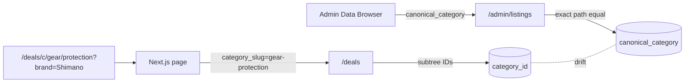

# Align admin Data Browser with `/deals` category filter

## Diagnosis (recap)

- `/deals` (public) filters by `category_slug` → resolved to a subtree of `category_id`s via `GetCategorySubtreeIDs` ([apps/api/internal/db/deals_filter.go](apps/api/internal/db/deals_filter.go) lines 57–66).
- Admin Data Browser filters by `canonical_category` (exact `text[]` equality) ([apps/api/internal/db/db.go](apps/api/internal/db/db.go) lines 361–372).
- The two columns drift: `UpsertListing` does `COALESCE(store_listings.category_id, EXCLUDED.category_id)` ([apps/api/internal/db/db.go](apps/api/internal/db/db.go) ~212), and enrichment / classifier paths can update one column without the other.
- Result: four Shimano rows have `category_id` in the Protection subtree but `canonical_category` set to something else (likely a brakes/components path), so they show on the production Protection page but are invisible in the admin browser.
- Source of truth (per your selection): `category_id` + the `categories` tree.



## Fix scope

Tooling only. Make the admin Data Browser able to filter by `category_slug` (with subtree) — same semantics as `/deals`. Keep the existing `canonical_category` exact-path filter as a secondary option so admins can deliberately surface drift.

## Backend changes

### 1. `GetAdminListingsParams` + filter SQL

[apps/api/internal/db/db.go](apps/api/internal/db/db.go)

- Add `CategorySlug string` to `GetAdminListingsParams` (around line 270, alongside `Category` / `CanonicalCategory`).
- In `buildAdminListingsFilter` (around line 450, used by both `GetAdminListings` and the bulk endpoints), add a branch that mirrors `dealsFilterSQL`:

```go
if params.CategorySlug != "" {
    cat, err := db.GetCategoryBySlug(ctx, strings.TrimSpace(params.CategorySlug))
    if err == nil && cat != nil {
        subtreeIDs, err := db.GetCategorySubtreeIDs(ctx, cat.ID)
        if err == nil && len(subtreeIDs) > 0 {
            query += fmt.Sprintf(" AND l.category_id = ANY($%d)", argNum)
            args = append(args, pq.Array(subtreeIDs))
            argNum++
        }
    }
}
```

Note: `buildAdminListingsFilter` currently doesn't take a `ctx`. The cleanest move is to do the slug → subtree resolution inside `GetAdminListings` / `CountAdminListingsByFilter` / `ListAdminListingIDsByFilter` (which already have a context) and pass the resolved IDs into the builder via a new `CategoryIDs []int` field on `GetAdminListingsParams`. Same approach as `specs.go` already uses for facets ([apps/api/internal/db/specs.go](apps/api/internal/db/specs.go) lines 22–27, 115–119) — copy that pattern.

### 2. HTTP handler

[apps/api/internal/api/handlers.go](apps/api/internal/api/handlers.go) `GetAdminListings` (around line 769):

- Parse `category_slug` and trim it onto `params.CategorySlug` (mirror lines 281–283 from the `GetDeals` handler).
- Update the doc comment listing supported params.

### 3. Bulk admin endpoints

[apps/api/internal/api/bulk_listings_admin.go](apps/api/internal/api/bulk_listings_admin.go):

- Add `CategorySlug *string \`json:"category_slug,omitempty"\``to`bulkListingsFilterBody`and pass it through in`toGetAdminListingsParams()` so bulk classify / bulk enrich respect the same filter as the UI.

### 4. Optional: precedence & validation

If both `category_slug` and `canonical_category` are present, prefer slug (matches `/deals` precedence). Document this in the handler comment.

## Frontend changes

[apps/web/src/admin/DataBrowser.tsx](apps/web/src/admin/DataBrowser.tsx) and [apps/web/src/admin/api.ts](apps/web/src/admin/api.ts):

- Add `category_slug?: string` to the `useAdminListings` params and to `AdminBulkListingsFilterBody`. Update the `useAdminListings` hook to forward it as `category_slug=` to the API.
- In `DataBrowser`, add a `CategoryPicker` (`apps/web/src/admin/CategoryPicker.tsx`) above or replacing the current canonical-paths `<select>`:
  - Picker emits `string[]` (path of names).
  - Use `useAdminCategoryTree()` to walk the tree, find the node whose path equals the picker output, read its `slug`, and store it in a new `categorySlug` state.
  - Pass `category_slug: categorySlug || undefined` into `useAdminListings` and `buildBulkFilterBody`.
- Keep the existing canonical-paths `<select>` as a secondary "Canonical (exact)" filter — useful for surfacing rows whose `canonical_category` doesn't match their `category_id` subtree.
- Show a small inline hint near the new filter: "Subtree match (uses `category_id`, same as the public site)" so admins understand the difference.

## Docs

- [apps/api/README.md](apps/api/README.md): add `category_slug` to the `/admin/listings` query-param table; note that it filters by `category_id` subtree, mirroring `/deals`.
- [docs/ARCHITECTURE.md](docs/ARCHITECTURE.md): in the API/admin section, add a one-liner explaining `category_id` is the source of truth and `canonical_category` is a denormalized snapshot that can drift; the admin browser supports both filters so drift is visible.

## Acceptance check

After deploy:

1. Open the admin Data Browser, pick **Protection** in the new category picker, set Brand = `Shimano`, and confirm the four rows from production now appear.
2. Inspect those rows in the detail panel; their `canonical_category` will not be `Gear > Protection` (or equivalent), confirming the drift.
3. From there an admin can re-classify them via existing per-row controls (or future bulk-classify against the new filter, since the bulk endpoints will share the same filter shape).

## Out of scope (intentionally deferred)

- No data backfill of `canonical_category` ↔ `category_id`.
- No change to `UpsertListing`'s `COALESCE` behavior on `category_id`.
- No removal of the `canonical_category` column or its writers.
- No changes to the four mis-classified rows themselves; they can be triaged after the new filter ships.
