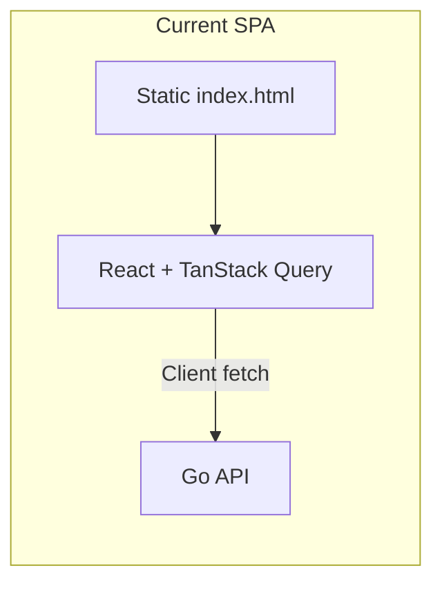

# Astro Migration Feasibility and SEO Strategy

## Current State

The web app is a **React 18 + Vite SPA** with:

- **~50 TSX files** across pages, components, and admin
- **TanStack Query** for all data fetching (client-side)
- **React Router** for routing (/, /deals, /admin/)
- **Single static meta** in [index.html](apps/web/index.html): one title, no per-page meta
- **No sitemap, robots.txt, or structured data**
- **Deal detail** shown in a modal (`?deal=123`), not a dedicated route

---

## 1. Is an Astro Migration Theoretically Possible?

**Yes**, but with significant effort and tradeoffs.

### What Would Work Well

- **Astro + React integration** ([@astrojs/react](https://docs.astro.build/en/guides/integrations-guide/react/)) lets you keep React components
- **Static generation** for Home and category landing pages (fetch from API at build time)
- **File-based routing** replaces React Router for public routes
- **Built-in SEO** via `Astro.glob`, `getStaticPaths`, and layout metadata

### Challenges

| Area                | Challenge                                                                                                                                                                                               |
| ------------------- | ------------------------------------------------------------------------------------------------------------------------------------------------------------------------------------------------------- |
| **Deals page**      | Highly dynamic (filters, pagination, search). Either SSR (needs Node adapter) or client-hydrated React islands. Astro's strength is static/SSR; your deals page is filter-heavy and query-param driven. |
| **TanStack Query**  | Designed for client-side. You'd keep it in hydrated React islands, but initial HTML would be empty or need duplicate fetch logic for SSR.                                                               |
| **Admin section**   | ~15 admin components with auth, CRUD, modals. Best kept as a React SPA island or separate app—migrating to Astro adds little SEO value.                                                                 |
| **Build-time data** | Prerendering needs API available at build. Your API is Go; you'd need `DATABASE_URL` and a running API during `astro build`, or use `output: 'server'` for SSR.                                         |

### Migration Scope (Rough)

- **Low effort**: Home page, maybe a few static category landing pages
- **Medium effort**: Deals page as hybrid (static shell + React islands for filters/grid)
- **High effort**: Admin section, full parity with current behavior, deployment config

---

## 2. Would a Migration Be Worth It?

**Probably not**, for your use case.

### Why Astro Shines

- **Content-heavy sites**: Blogs, marketing pages, docs—where most pages are static
- **Zero-JS by default**: Great for Core Web Vitals on mostly static content
- **Build-time data**: When you can fetch everything at build and rarely need runtime data

### Why It's a Poor Fit Here

1. **Deals are dynamic** — Filters, search, pagination, and deal counts change often. A static build would be stale quickly; SSR would require a Node server and more infra.
2. **Google crawls JS well** — For a deals aggregator, the main SEO gaps are meta tags, URLs, and structured data, not the framework. These can be fixed without a full migration.
3. **Admin has no SEO impact** — Half the app is admin tooling; Astro doesn't help there.
4. **Cost vs benefit** — A full migration is 2–4 weeks of work. The SEO gains from Astro alone are modest compared to targeted SEO fixes in the current stack.

### When Astro _Would_ Make Sense

- You add many static content pages (blog, guides, category landing pages)
- You want to move off Vercel/Node to static hosting (e.g. Cloudflare Pages) and need SSR only for a few routes
- You're starting a new project and can design around Astro from the start

---

## 3. Alternative SEO Improvements (No Migration)

These can be done in the current React + Vite setup and will have a larger SEO impact than a framework switch.

### High Impact

| Improvement                   | Effort  | Description                                                                                                                                                                                  |
| ----------------------------- | ------- | -------------------------------------------------------------------------------------------------------------------------------------------------------------------------------------------- |
| **Per-page meta tags**        | Low     | Use `react-helmet-async` or `@tanstack/react-router`'s meta API. Set unique `<title>`, `<meta name="description">`, and `og:title`/`og:description` per route (Home, Deals, category views). |
| **Dedicated deal pages**      | Medium  | Add route `/deals/:id` that renders a full page (not just a modal). Enables indexable URLs like `/deals/123` for sharing and crawling.                                                       |
| **Structured data (JSON-LD)** | Low     | Add `Product`/`Offer` schema for deals. Helps rich results in search.                                                                                                                        |
| **Sitemap**                   | Low     | Generate `sitemap.xml` (e.g. via `vite-plugin-sitemap` or a small build script) with Home, Deals, and key category URLs.                                                                     |
| **robots.txt**                | Trivial | Add `robots.txt` pointing to sitemap and allowing crawlers.                                                                                                                                  |

### Medium Impact

| Improvement                | Effort | Description                                                                                                                            |
| -------------------------- | ------ | -------------------------------------------------------------------------------------------------------------------------------------- |
| **Category landing pages** | Medium | Routes like `/deals/category/bikes-mountain` with prerendered or server-rendered content. Better URLs than `?category=bikes-mountain`. |
| **Canonical URLs**         | Low    | Add `<link rel="canonical">` to avoid duplicate content from query param variations.                                                   |
| **Semantic HTML**          | Low    | Ensure `<main>`, `<article>`, `<h1>` hierarchy, and `alt` on images.                                                                   |

### Lower Effort, Quick Wins

- Remove the `console.log` in [HomePage.tsx](apps/web/src/pages/HomePage.tsx) (line 37)
- Add `lang="en"` (already present) and ensure `viewport` meta is correct
- Lazy-load below-the-fold content to improve LCP

---

## 4. Recommended Path

**Skip the Astro migration** for now. Instead:

1. **Phase 1 (1–2 days)**: Add `react-helmet-async`, per-route meta tags, `robots.txt`, and a simple sitemap.
2. **Phase 2 (2–3 days)**: Add `/deals/:id` route and JSON-LD structured data for deals.
3. **Phase 3 (optional)**: Add category landing pages (`/deals/category/:slug`) if you want stronger category-level SEO.

Revisit Astro if you later add a blog, many static landing pages, or need to simplify hosting to a static-first model.

---

## Summary

| Question             | Answer                                                                                       |
| -------------------- | -------------------------------------------------------------------------------------------- |
| **Possible?**        | Yes, with notable refactoring and SSR or hybrid setup.                                       |
| **Worth it?**        | No—SEO gains are small vs. effort; your app is dynamic and admin-heavy.                      |
| **Better approach?** | Stay on React + Vite; add meta tags, deal pages, structured data, sitemap, and `robots.txt`. |
