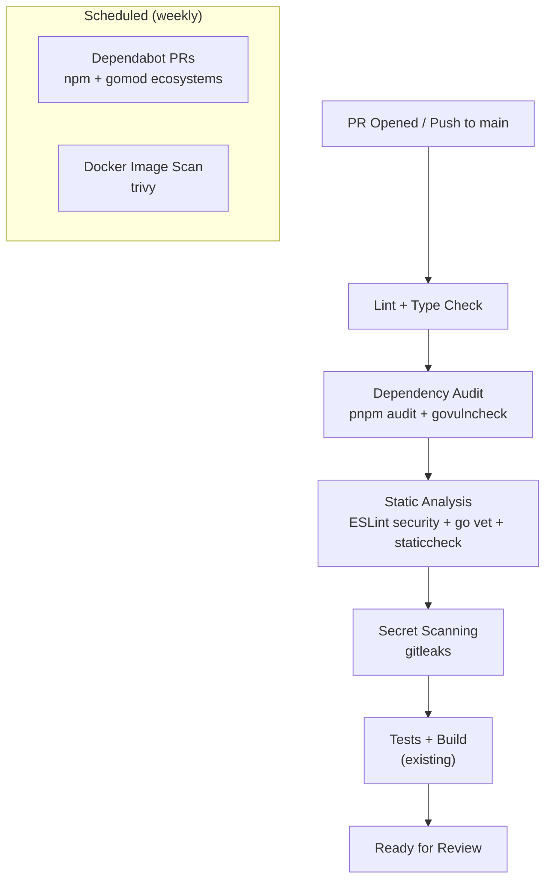

# Automated Security Checks

## Current State

The CI pipeline (`[.github/workflows/ci.yml](.github/workflows/ci.yml)`) currently runs only:

1. `pnpm install --frozen-lockfile`
2. Scraper tests (`vitest`)
3. API build (`go build`)
4. Web build (`next build`)

There are **no security gates** — no dependency audits, no static analysis, no secret scanning, no automated dependency updates.

---

## Proposed Security Layers

Each layer catches a different class of vulnerability, ordered by effort-to-value ratio.



---

## Layer 1: Dependency Vulnerability Scanning (CI gate)

Add `pnpm audit` and `govulncheck` as CI steps. These are free, zero-config, and catch known CVEs in your dependency tree.

**In `[.github/workflows/ci.yml](.github/workflows/ci.yml)`:**

```yaml
- name: Node dependency audit
  run: pnpm audit --audit-level=high

- name: Go vulnerability check
  run: |
    go install golang.org/x/vuln/cmd/govulncheck@latest
    govulncheck ./...
  working-directory: apps/api
```

`pnpm audit` checks the npm advisory database. `govulncheck` checks the Go vulnerability database and only flags CVEs in code paths you actually call (much lower false-positive rate than generic scanners).

**Severity threshold:** `--audit-level=high` so moderate/low findings don't block PRs but high/critical do. Review moderate findings on a regular cadence.

---

## Layer 2: Static Analysis (CI gate)

### 2a. ESLint — add security plugin for the web app

Install `[eslint-plugin-security](https://github.com/eslint-community/eslint-plugin-security)` to catch common JS/TS antipatterns (eval, non-literal RegExp, prototype pollution vectors).

In `[apps/web/package.json](apps/web/package.json)`, add the plugin as a dev dependency, then create a minimal ESLint config extending `plugin:security/recommended-legacy`.

Add `next lint` to CI (it is already a script in the web `package.json` but not called in the workflow).

### 2b. Go static analysis

Add `go vet` (ships with Go, catches common mistakes) and `[staticcheck](https://staticcheck.dev/)` (the de facto Go linter — catches bugs, performance issues, and deprecated API usage):

```yaml
- name: Go vet
  run: go vet ./...
  working-directory: apps/api

- name: Staticcheck
  run: |
    go install honnef.co/go/tools/cmd/staticcheck@latest
    staticcheck ./...
  working-directory: apps/api
```

### 2c. Lint + type check the web app in CI

The CI skill recommends lint and type-check as the first gates. Add:

```yaml
- name: Lint web app
  run: pnpm --filter @mtb-aggregator/web run lint

- name: Type check web app
  run: pnpm --filter @mtb-aggregator/web exec tsc --noEmit
```

---

## Layer 3: Secret Scanning (CI gate)

Use [gitleaks](https://github.com/gitleaks/gitleaks) to scan commits for accidentally committed secrets (API keys, tokens, passwords). There is a well-maintained GitHub Action:

```yaml
- name: Secret scan
  uses: gitleaks/gitleaks-action@v2
  env:
    GITHUB_TOKEN: ${{ secrets.GITHUB_TOKEN }}
```

This scans the diff on PRs and the full push on `main`. Zero config needed — it ships with rules for AWS keys, Stripe tokens, database URLs, JWTs, etc.

---

## Layer 4: Automated Dependency Updates (scheduled)

Add Dependabot to open PRs when dependencies have security patches or new versions. Create `[.github/dependabot.yml](.github/dependabot.yml)`:

```yaml
version: 2
updates:
  - package-ecosystem: npm
    directory: /
    schedule:
      interval: weekly
    open-pull-requests-limit: 10

  - package-ecosystem: gomod
    directory: /apps/api
    schedule:
      interval: weekly
    open-pull-requests-limit: 5

  - package-ecosystem: docker
    directory: /apps/api
    schedule:
      interval: monthly

  - package-ecosystem: docker
    directory: /apps/scraper
    schedule:
      interval: monthly

  - package-ecosystem: github-actions
    directory: /
    schedule:
      interval: weekly
```

This covers npm, Go modules, Dockerfiles, and GitHub Actions themselves (pinning action versions prevents supply-chain attacks).

---

## Layer 5: Docker Image Scanning (scheduled)

Add a weekly workflow using [Trivy](https://github.com/aquasecurity/trivy) to scan your Docker images for OS-level vulnerabilities (Alpine CVEs, outdated base images):

```yaml
name: Docker Security Scan
on:
  schedule:
    - cron: "0 6 * * 1" # Weekly Monday 6am UTC
jobs:
  scan:
    runs-on: ubuntu-latest
    strategy:
      matrix:
        context: [apps/api, apps/scraper]
    steps:
      - uses: actions/checkout@v4
      - name: Build image
        run: docker build -t scan-target ${{ matrix.context }}
      - name: Trivy scan
        uses: aquasecurity/trivy-action@master
        with:
          image-ref: scan-target
          severity: HIGH,CRITICAL
          exit-code: 1
```

---

## Layer 6: Fix the Go version mismatch

`[go.mod](apps/api/go.mod)` declares `go 1.24.0` but CI uses `go-version: "1.22"`. Update CI to `go-version: "1.24"` to match. This is a correctness fix, not just housekeeping — newer Go versions have security patches and different build behavior.

---

## Final CI Workflow Shape

After all changes, the pipeline runs these gates in order on every PR:

| Gate                    | Tool                             | Blocks merge? |
| ----------------------- | -------------------------------- | ------------- |
| Install                 | `pnpm install --frozen-lockfile` | Yes           |
| Lint (web)              | `next lint`                      | Yes           |
| Type check (web)        | `tsc --noEmit`                   | Yes           |
| Lint (Go)               | `go vet` + `staticcheck`         | Yes           |
| Secret scan             | `gitleaks`                       | Yes           |
| Dependency audit (Node) | `pnpm audit --audit-level=high`  | Yes           |
| Dependency audit (Go)   | `govulncheck`                    | Yes           |
| Tests                   | `vitest` (scraper)               | Yes           |
| Build                   | `go build` + `next build`        | Yes           |

Scheduled (non-blocking, creates PRs/issues):

- Dependabot (weekly)
- Docker image scan via Trivy (weekly)

---

## Optional / Future Enhancements

These are lower priority but worth noting for later:

- **Security headers**: Add CSP, HSTS, X-Frame-Options, etc. via `headers()` in `[next.config.ts](apps/web/next.config.ts)` and `helmet` on the scraper Express app. These are runtime hardening rather than CI checks.
- **CodeQL**: GitHub's free SAST engine — deeper than ESLint but slower. Good as a scheduled weekly scan rather than a PR gate.
- **OWASP ZAP**: Dynamic application security testing against a running preview deployment. High effort, best added later.
- **Pre-commit hooks**: Run `gitleaks` and lint locally before push using Husky + lint-staged. Catches issues before they even reach CI.
- **Branch protection rules**: Require all CI status checks to pass before merge on `main`. Not a code change but an important GitHub repo setting.
