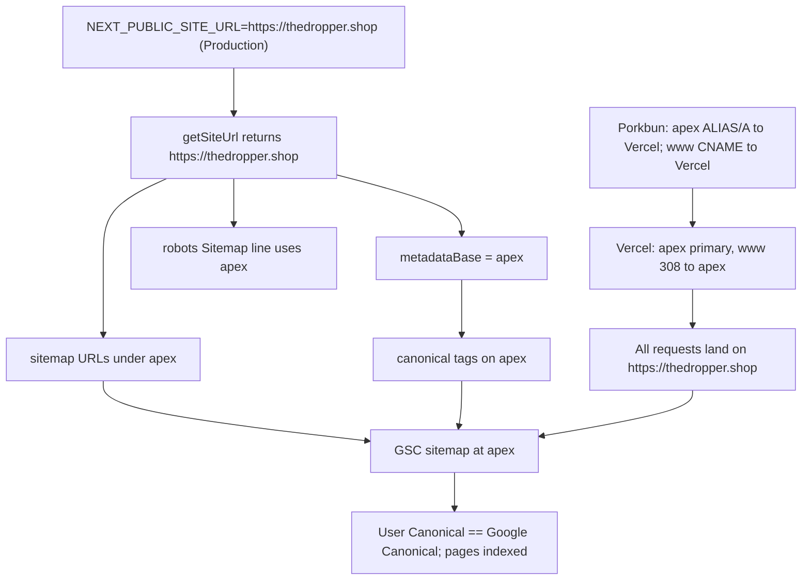

# Canonical Host & Indexing Fix

## Root cause recap

Two bugs compounding, confirmed via GSC MCP URL inspections and code:

1. **Canonicals are the rotating Vercel preview host.** `NEXT_PUBLIC_SITE_URL` is unset in Vercel prod, so [apps/web/src/lib/siteUrl.ts](apps/web/src/lib/siteUrl.ts) falls back to `VERCEL_URL` (e.g. `mtb-aggregator-bzl37kyip-...vercel.app`). That value feeds `metadataBase` (→ every `<link rel="canonical">`), every `/sitemap.xml` URL, and `/robots.txt`'s `sitemap:` line. GSC confirmed the live canonical on `thedropper.shop/` is a preview URL.
2. **`www` vs apex inconsistency.** Sitemap was submitted at `https://www.thedropper.shop/sitemap.xml`. `www.thedropper.shop/` gets "Duplicate, Google chose different canonical than user." `thedropper.shop/deals` returns `REDIRECT_ERROR`. Thousands of URLs end up in "Discovered/Duplicate — currently not indexed."

Canonical host (chosen): **`https://thedropper.shop`** (apex, no `www`).

---

## 1. Code changes

### `apps/web/src/lib/siteUrl.ts` — harden fallback

Drop the `VERCEL_URL` fallback when running in **production** on Vercel. Keep it for preview deployments only, and emit a build-time warning if `NEXT_PUBLIC_SITE_URL` is missing in prod.

```typescript
export function getSiteUrl(): URL {
  const explicit = process.env.NEXT_PUBLIC_SITE_URL?.trim();
  if (explicit) {
    try {
      return new URL(explicit.replace(/\/$/, ""));
    } catch {
      // fall through
    }
  }
  const vercelEnv = process.env.VERCEL_ENV; // 'production' | 'preview' | 'development'
  if (vercelEnv === "production") {
    // Fail loud: a missing NEXT_PUBLIC_SITE_URL in prod is what poisoned canonicals before.
    throw new Error(
      "NEXT_PUBLIC_SITE_URL must be set in production (got undefined). Canonical URLs and sitemap depend on it.",
    );
  }
  const vercel = process.env.VERCEL_URL?.trim();
  if (vercel) {
    const host = vercel.replace(/^https?:\/\//, "");
    return new URL(`https://${host}`);
  }
  return new URL("http://localhost:3000");
}
```

Rationale: canonicals and sitemap are too important to silently substitute a preview host. Preview deploys still work (fallback to `VERCEL_URL`), local dev still works (`localhost`), prod must be explicit.

### No other code changes needed

- [apps/web/src/app/layout.tsx](apps/web/src/app/layout.tsx) `metadataBase: getSiteUrl()` — correct.
- [apps/web/src/app/sitemap.ts](apps/web/src/app/sitemap.ts) uses `absoluteUrl()` — correct once `getSiteUrl()` returns `https://thedropper.shop`.
- [apps/web/src/app/robots.ts](apps/web/src/app/robots.ts) uses `absoluteUrl("/sitemap.xml")` — correct for same reason.
- Per-page `alternates: { canonical: "/path" }` (home, `/deals`, category, deal detail) — correct (Next resolves against `metadataBase`).

---

## 2. Vercel — Environment Variables

In the `apps/web` Vercel project → **Settings → Environment Variables**:

- Add `NEXT_PUBLIC_SITE_URL` = `https://thedropper.shop`
  - Environment: **Production** (required). Leave Preview/Development unset so previews keep using `VERCEL_URL`.
- Also verify existing vars still present: `API_URL` (server), `NEXT_PUBLIC_API_URL` (client), `NEXT_PUBLIC_SENTRY_DSN` (optional), `POSTHOG_*`.

Redeploy production after saving.

---

## 3. Vercel — Domains

In `apps/web` project → **Settings → Domains**:

- `thedropper.shop` — **primary** (no redirect). If currently marked as "Redirect to …", flip it to primary.
- `www.thedropper.shop` — configured as **Redirect to `thedropper.shop`** with **Status code 308** (permanent). Vercel handles this at the edge; no code needed.
- Remove any preview-only or legacy `*.vercel.app` aliases from the production domain list (they stay as auto-generated deployment URLs, but shouldn't be listed as aliases of the project).

After saving, Vercel will reissue TLS certs for both hostnames.

---

## 4. Porkbun — DNS Records

At Porkbun for `thedropper.shop` → **DNS Records**. Remove any conflicting existing records first, then set exactly these:

- **Apex (`thedropper.shop`)** — one of:
  - `A` record, Host (empty/`@`), Answer `76.76.21.21` (Vercel's anycast IP)
  - _or_ `ALIAS` record (Porkbun supports this at apex), Host (empty/`@`), Answer `cname.vercel-dns.com`
  - Prefer `ALIAS` if available — it follows Vercel's target automatically.
- **`www` subdomain** — `CNAME`, Host `www`, Answer `cname.vercel-dns.com`.
- **No** `AAAA`/`A` for `www` (let the CNAME resolve). **No** duplicate apex records.
- Leave MX / TXT (SPF, DMARC, Google/Vercel verification TXT) records untouched.

Propagation: usually minutes at Porkbun; up to a few hours globally. Vercel's Domains page will flip both to "Valid Configuration" once DNS is live.

---

## 5. Google Search Console — Resubmit & validate

Once DNS + Vercel + redeploy are live and `curl -I https://www.thedropper.shop/` returns `308 → https://thedropper.shop/`:

1. **Sitemaps** tab:
   - Remove the current submission `https://www.thedropper.shop/sitemap.xml`.
   - Add `https://thedropper.shop/sitemap.xml`.
2. **Indexing → Pages**:
   - Open each "Why pages aren't indexed" bucket (Duplicate, Discovered not indexed, Redirect error, Alternate page with canonical) and click **Validate Fix** on the affected groups. Google will recrawl representative URLs.
3. **URL Inspection** — spot check 4 URLs after the redeploy (expect each to show `INDEXING_ALLOWED`, `User Canonical == Google Canonical == inspected URL`, no redirect error):
   - `https://thedropper.shop/`
   - `https://thedropper.shop/deals`
   - `https://thedropper.shop/deals/c/bikes`
   - One deal detail URL from the sitemap, e.g. `https://thedropper.shop/deals/<id>`
4. **Request Indexing** on the homepage and `/deals` after verifying each inspection looks right (don't bulk-request — Google rate-limits this).

I can run steps 3–4 directly via the GSC MCP once you've redeployed.

---

## 6. Verification checklist (after all of the above)

- [ ] `curl -sI https://www.thedropper.shop/` → `HTTP/2 308` with `location: https://thedropper.shop/`
- [ ] `curl -sI https://thedropper.shop/deals` → `HTTP/2 200` (no redirect chain)
- [ ] `curl -s https://thedropper.shop/ | grep -E 'canonical|og:url'` → canonical is `https://thedropper.shop/`, never `*.vercel.app`
- [ ] `curl -s https://thedropper.shop/sitemap.xml | head` → all `<loc>` URLs start with `https://thedropper.shop/`
- [ ] `curl -s https://thedropper.shop/robots.txt` → `Sitemap: https://thedropper.shop/sitemap.xml`
- [ ] GSC URL inspection on all 4 sample URLs shows matching user/Google canonicals and `INDEXING_ALLOWED`
- [ ] Sitemap status in GSC = "Success", with discovered URL count roughly matching sitemap entry count

---

## Data flow after fix



---

## Out of scope (follow-up, not this plan)

- Other items from [.cursor/plans/seo_geo_monitoring_plan_5944ba9f.plan.md](.cursor/plans/seo_geo_monitoring_plan_5944ba9f.plan.md): `llms.txt`, BreadcrumbList JSON-LD, default OG image, Lighthouse CI, SEO smoke tests. Those can be picked up after indexing is healthy again.
