# Category Descriptions for LLM Classification

## Approach

Add a `description TEXT` column to the `categories` table, wire it through the admin CRUD, and include category descriptions in the LLM classify user message as a "Category definitions" reference section. The existing `categorySeo.ts` stays untouched — these descriptions serve a different purpose (classification rubrics vs. SEO copy).

## Data flow

```mermaid
flowchart LR
    AdminUI["Admin Categories UI"] -->|"PUT /admin/categories/:id"| GoAPI["Go API handler"]
    GoAPI -->|"UPDATE categories SET description"| DB["categories table"]
    DB -->|"GetAllCategoryPathsWithDescriptions()"| Scheduler["Scheduler / classify handler"]
    Scheduler -->|"ClassifyConfig.CategoryDescriptions"| LLM["LLM Client"]
    LLM -->|"user message includes\ncategory definitions"| OpenAI["OpenAI API"]
```



## 1. Migration `023_category_descriptions.sql`

File: [packages/shared/migrations/023_category_descriptions.sql](packages/shared/migrations/023_category_descriptions.sql)

```sql
ALTER TABLE categories ADD COLUMN description TEXT NOT NULL DEFAULT '';
```

Single column, nullable default empty string. No seed data in the migration — descriptions will be added via admin UI or a follow-up seed script.

## 2. DB layer — `internal/db/categories.go`

- **New function `GetAllCategoryPathsWithDescriptions`** — like the existing `[GetAllCategoryPaths](apps/api/internal/db/categories.go)` but returns `[]CategoryPathWithDescription` (path + description). Uses the same recursive CTE, adds `description` to the SELECT.
- **Update `CreateCategory`** — accept and INSERT `description` (new parameter).
- **Update `UpdateCategory`** — accept and SET `description` (new parameter).
- **Update `Category` struct** (if one exists for single-row reads) to include `Description string`.

Keep the existing `GetAllCategoryPaths` as-is (used elsewhere without descriptions).

## 3. Go API handlers — `internal/api/handlers_categories.go`

- `**PostAdminCategory`: Parse `description` from request body, pass to `CreateCategory`.
- `**PutAdminCategory`: Parse `description` from request body, pass to `UpdateCategory`.
- **GET responses**: Include `description` in category tree nodes and single-category responses.

## 4. LLM client — `internal/llm/client.go`

- **New struct** `CategoryOption` with `Path []string` and `Description string`.
- **Update `ClassifyConfig`**: Add `CategoryDescriptions map[string]string` (key = joined path string like `"Bikes > Mountain > Trail"`, value = description). Keep `ValidCategories [][]string` for the enum.
- **Update `buildClassifyUserMessage`**: After product info, append a "Category definitions" section listing each category path with its description (only for categories that have a non-empty description). Example output in the user message:

```
Category definitions:
- Bikes: Complete bikes sold as full builds. Includes all sub-disciplines. Does NOT include framesets or individual components.
- Bikes > Mountain > Trail: Trail mountain bikes with 120-150mm travel, designed for all-mountain singletrack.
- Components > Drivetrain: Chains, cassettes, derailleurs, cranksets, bottom brackets, and shifters.
...
```

## 5. Callers — scheduler + admin handler

Two places build `ClassifyConfig` and call `Classify`:

- `**[Scheduler.runLLMCategoryClassification](apps/api/internal/scheduler/scheduler.go)**` (~line 406): Replace `GetAllCategoryPaths` with `GetAllCategoryPathsWithDescriptions`, populate both `ValidCategories` and `CategoryDescriptions` on `ClassifyConfig`.
- **Admin test/batch handlers** in `[handlers_llm.go](apps/api/internal/api/handlers_llm.go)`: Same change — use the new function and populate descriptions.

## 6. Admin web UI

### [apps/web/src/admin/api.ts](apps/web/src/admin/api.ts)

- Add `description: string` to `AdminCategoryTreeNode`, `CreateCategoryBody`, `UpdateCategoryBody`.

### [apps/web/src/admin/CategoryManager.tsx](apps/web/src/admin/CategoryManager.tsx)

- Add a `Textarea` field for "Description (LLM classification hint)" to `CategoryForm`.
- Show description preview in `CategoryRow` (truncated, maybe as a tooltip or subtitle below the name).

## 7. Seed descriptions (optional follow-up)

Write initial classification-rubric descriptions for the ~40 existing categories. These should focus on disambiguation — what does and doesn't belong. Can be done via the admin UI or a one-time SQL update. This is the most impactful part for accuracy but can be iterative.

## Files changed

| File                                                       | Change                                                 |
| ---------------------------------------------------------- | ------------------------------------------------------ |
| `packages/shared/migrations/023_category_descriptions.sql` | New migration                                          |
| `apps/api/internal/db/categories.go`                       | New query + update Create/Update                       |
| `apps/api/internal/api/handlers_categories.go`             | Accept/return `description`                            |
| `apps/api/internal/llm/client.go`                          | `CategoryDescriptions` on config, updated user message |
| `apps/api/internal/scheduler/scheduler.go`                 | Use new query, populate descriptions                   |
| `apps/api/internal/api/handlers_llm.go`                    | Same as scheduler for admin test/batch                 |
| `apps/web/src/admin/api.ts`                                | Add `description` to types/payloads                    |
| `apps/web/src/admin/CategoryManager.tsx`                   | Textarea in form, display in tree                      |
| `packages/shared/README.md`                                | Document new column                                    |
