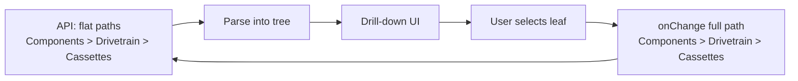

# Category Hierarchy Browser

## Problem

The current native `<select>` with `<optgroup>` has limitations with deeper nesting:

- **HTML optgroup** supports only one level of grouping (e.g., "Components" as group, then flat options)
- For paths like `Components > Drivetrain > Cassettes`, the label becomes `Drivetrain > Cassettes` — the ">" separator still appears
- With many categories, the dropdown becomes a long, hard-to-scan list

## Context

- **Layout**: Category selector lives in [FilterSidebar.tsx](apps/web/src/components/FilterSidebar.tsx) (narrow 240px sidebar) and [FilterDrawer.tsx](apps/web/src/components/FilterDrawer.tsx) (mobile bottom sheet)
- **Data**: Flat `string[]` from API, e.g. `["Components > Drivetrain > Cassettes", "Components > Suspension > Forks"]`
- **Stack**: React + Tailwind, no Radix/Headless UI

---

## Option A: Cascading selects (simplest)

Use 2–3 stacked native selects that filter each other:

```
[Components        ▼]   ← Level 1: top-level
[Drivetrain       ▼]   ← Level 2: mid-level (filtered by Level 1)
[Cassettes        ▼]   ← Level 3: leaf (filtered by Level 2)
```

- **Pros**: Native selects, minimal custom code, no ">" in labels, clear hierarchy
- **Cons**: Takes vertical space (3 rows in sidebar), user must select in order, feels a bit utilitarian

---

## Option B: Breadcrumb drill-down (recommended)

Single "Category" trigger opens a dropdown panel. User drills down step-by-step; breadcrumb shows path and allows going back:

```
┌─────────────────────────────────┐
│ All categories                  │
├─────────────────────────────────┤
│ Components > Drivetrain    [←]   │  ← breadcrumb when drilled in
├─────────────────────────────────┤
│   Cassettes                     │  ← click to select
│   Shifters                      │
│   Chains                        │
│   ...                           │
└─────────────────────────────────┘
```

**Flow**: Click "Category" → see Bikes, Components, Gear, Accessories → click "Components" → see Drivetrain, Suspension, Wheels/Tires → click "Drivetrain" → see Cassettes, Shifters (leaf, selectable). Breadcrumb "Components > Drivetrain" at top; click to go back.

- **Pros**: Familiar pattern (like folder navigation), handles arbitrary depth, no ">" in option labels, compact trigger, works in narrow sidebar and mobile drawer
- **Cons**: Custom component (~100–150 lines)

---

## Option C: Inline expandable accordion

Show the category tree inline in the sidebar (no dropdown). Top-level sections expand/collapse; subcategories indent beneath:

```
Category
  ▶ Bikes
  ▼ Components
      ▶ Drivetrain
      ▼ Suspension
          Forks      ← click to select
          Shocks
      ▶ Wheels/Tires
  ▶ Gear
```

- **Pros**: No dropdown, structure always visible when expanded, works in narrow space
- **Cons**: Can get long with many categories; differs from Store/Brand (which are dropdowns); more vertical space when expanded

---

## Recommendation: Option B (Breadcrumb drill-down)

Option B best balances clarity, compactness, and hierarchy support. It avoids the ">" separator, scales to arbitrary depth, and fits both the sidebar and mobile drawer.

## Implementation plan (Option B)

1. **Create `CategoryDrillDown.tsx`** — A new component that:

- Renders a trigger button (styled like current filter selects) showing selected leaf or "All categories"
- Opens a dropdown panel on click
- Parses flat `"Parent > Child > Grandchild"` paths into a tree
- Renders drill-down UI: current level as tappable items; breadcrumb when depth > 0; "All categories" at top
- Only leaf nodes (and optionally parent nodes that are themselves valid categories) are selectable
- Closes on selection, click-outside, Escape

1. **Update FilterSidebar and DealFilters** — Replace the native `<select>` with `CategoryDrillDown`, passing `canonicalCategories` and `canonicalCategoryFilter` / `onCanonicalCategoryChange`
2. **Remove `groupCanonicalCategories`** — Tree building happens inside the new component
3. **Export** — Add to [index.ts](apps/web/src/components/index.ts)

## Data flow



The component emits the full path string (unchanged API contract). Filter chips can continue to show the leaf segment for brevity.
