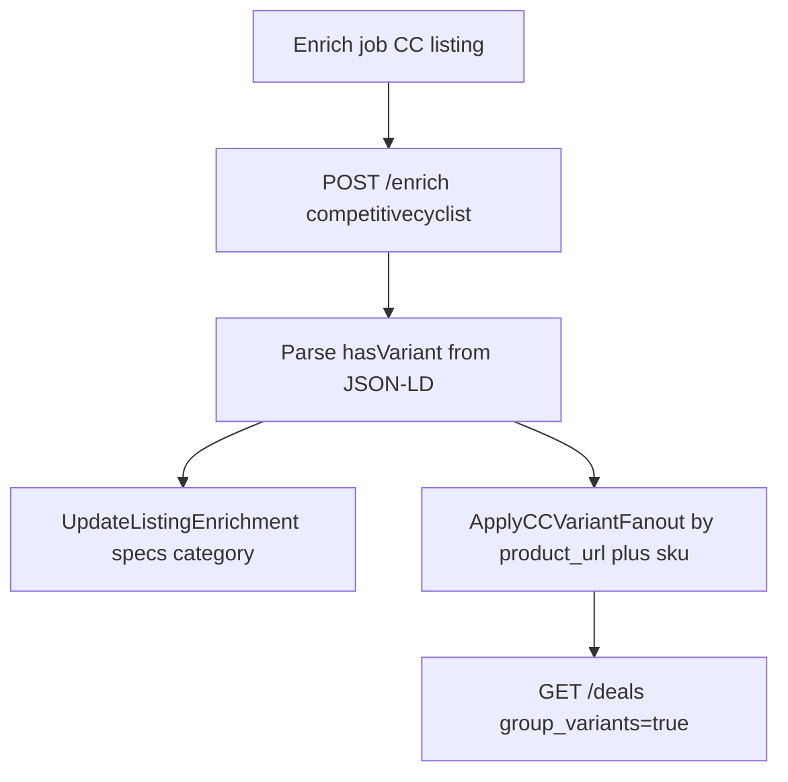

# CC variant grouping via JSON-LD `hasVariant`

## Goal

Impact ingest creates **one flat row per catalog SKU** with no [`product_group_key`](apps/api/internal/impact/map_catalog_item.go) (always `nil`). The UI’s grouped deals ([`deals_grouped.go`](apps/api/internal/db/deals_grouped.go)) only collapse rows sharing that key. Your PDP sample shows a parent Product with **`hasVariant[]`** entries (sku, size, color, price, availability) — we can use that at **enrich time** to link existing DB rows, without creating new listings.

**Scope (confirmed):** match and update **existing** catalog rows only; ignore `hasVariant` SKUs not already in `store_listings`.

## Architecture (Jenson-inspired, CC-specific)



| Piece              | JensonUSA today                               | CC plan                                                                    |
| ------------------ | --------------------------------------------- | -------------------------------------------------------------------------- |
| Ingest             | Multi-row scrape + parent `product_group_key` | Impact catalog, flat rows                                                  |
| Variant source     | `serverSideViewModel.variants` in HTML        | JSON-LD `hasVariant` on Product                                            |
| Fan-out match      | Siblings already in `product_group_key` group | All rows with **same normalized `product_url`** + **sku match**            |
| Unmatched siblings | Mark OOS                                      | **No change** (catalog may omit non-sale SKUs)                             |
| Group key          | `{store_id}:{parentCode}`                     | `{store_id}:{pdpSlug}` from path (e.g. `ion-rascal-amp-cycling-shoe-mens`) |

## 1. Scraper: parse `hasVariant` from PDP HTML

**New helper** in [`apps/scraper/src/parsers/backcountry-family-pdp.ts`](apps/scraper/src/parsers/backcountry-family-pdp.ts) (or a small `cc-pdp-variants.ts` imported by CC only):

- Reuse existing JSON-LD walk pattern from [`extractBackcountryFamilyBreadcrumbs`](apps/scraper/src/parsers/backcountry-family-pdp.ts) (`@graph` / array normalization).
- Find a `Product` (or `ProductGroup`) node with **`hasVariant`** array.
- For each variant object, emit [`PdpEnrichVariant`](apps/scraper/src/parsers/jensonusa-pdp.ts)-shaped rows:
  - `code` ← `sku`
  - `dimensions` ← `{ Size, Color, ... }` from known keys (`size`, `color`; skip empty)
  - `is_orderable` ← `offers.availability` contains `InStock` (schema.org URL or plain text)

**Wire in** [`apps/scraper/src/parsers/competitivecyclist.ts`](apps/scraper/src/parsers/competitivecyclist.ts):

- Call existing `enrichBackcountryFamilyPdp` logic (or inline fetch once) and attach `variants` when parse returns rows (same JSON contract as Jenson: `variants[].code`, `dimensions`, `is_orderable` per [`EnrichResult`](apps/api/internal/scraper/client.go)).

**Tests:** fixture JSON/HTML snippet from your sample ([`apps/scraper/src/parsers/__fixtures__/`](apps/scraper/src/parsers/__fixtures__/)) + vitest asserting 9 variants, sku `INBE04M-BLA-S380`, Size/Color dimensions, InStock.

## 2. API: CC variant fan-out after enrich

**New** [`apps/api/internal/db/cc_pdp_variants.go`](apps/api/internal/db/cc_pdp_variants.go) (name flexible):

```go
// ApplyCompetitiveCyclistVariantFanout(storeID, productURL, variants, seen)
// 1. Normalize productURL (strip query/fragment)
// 2. groupKey := fmt.Sprintf("%d:%s", storeID, slugFromPath(normalizedURL))
// 3. if seen[groupKey] { return nil }; seen[groupKey] = true
// 4. SELECT id, store_sku FROM store_listings WHERE store_id = $1 AND normalized product_url match
// 5. For each row: if store_sku matches a variant code, UpdateListingVariantInfo(id, variant_options JSON, is_orderable, groupKey)
// 6. Skip rows/SKUs with no match; do NOT mark unmatched rows OOS
```

Reuse [`UpdateListingVariantInfo`](apps/api/internal/db/jenson_pdp_variants.go) for JSON `variant_options` + `product_group_key`.

**Scheduler** ([`apps/api/internal/scheduler/scheduler.go`](apps/api/internal/scheduler/scheduler.go)): after `UpdateListingEnrichment`, call CC fan-out when `store_type == competitivecyclist` and `len(result.Variants) > 0`. Use a `seenCCGroups` map per job (parallel to `seenJensonGroups`). Pass **`l.ProductURL`** (canonical PDP from Impact unwrap).

**Admin single-listing enrich** ([`handlers.go`](apps/api/internal/api/handlers.go) `PostAdminEnrichListing`): same fan-out hook.

Helper to normalize URL: strip `?clickid=...` etc. so all Impact rows for one shoe match.

## 3. Optional backfill

**New** `apps/api/cmd/backfill-cc-variants` + `make backfill-cc-variants`:

- Distinct `(store_id, normalized product_url)` for `competitivecyclist` where `product_group_key IS NULL` (or force re-run).
- One `POST /enrich` per URL; fan-out updates siblings.
- Mirrors [`cmd/backfill-jenson-variants`](apps/api/cmd/backfill-jenson-variants/main.go).

## 4. Docs

Update [`apps/scraper/README.md`](apps/scraper/README.md), [`docs/SCRAPING.md`](docs/SCRAPING.md), [`CLAUDE.md`](CLAUDE.md), [`docs/ARCHITECTURE.md`](docs/ARCHITECTURE.md): CC grouping is enrich-driven from JSON-LD; ingest stays Impact-only.

## Risks

| Risk                                                | Mitigation                                                                                                    |
| --------------------------------------------------- | ------------------------------------------------------------------------------------------------------------- |
| **WAF / fetch fails** on PDP                        | Fan-out only runs when enrich returns variants; monitor enrich job errors (existing plan risk).               |
| **SKU mismatch** Impact vs JSON-LD                  | Log counts of matched vs unmatched per PDP; adjust sku field mapping if catalog uses `CatalogItemId` ≠ `sku`. |
| **Redundant PDP fetches** (many SKUs share one URL) | `seen` map skips repeat fan-out; optional follow-up: dedupe scraper calls by normalized URL within a batch.   |
| **Category drift** from PDP breadcrumbs             | Unchanged from current CC enrich; `LLM_CATEGORY_PRESERVE_THRESHOLD` still applies.                            |

## Rollout

1. Deploy scraper + API.
2. Run `make backfill-cc-variants` (or store-scoped `make enrich-now-competitivecyclist FORCE=1`) against prod/staging.
3. Verify grouped deals: same product shows one card with `variants[]` and price range when multiple sale SKUs share a PDP.
