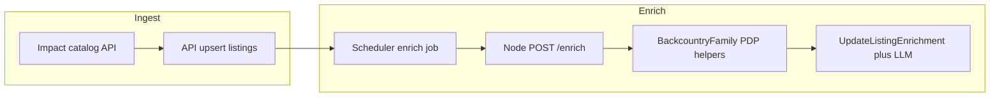

# Competitive Cyclist PDP enrichment

## Current behavior

- **Ingest:** CC listings come from the Impact catalog in the Go API ([`apps/api/internal/impact/`](apps/api/internal/impact/)); scrape never calls the Node service for CC.
- **Enrichment:** The scheduler loops over listings in [`apps/api/internal/scheduler/scheduler.go`](apps/api/internal/scheduler/scheduler.go), calls [`scraper.Client.Enrich`](apps/api/internal/scraper/client.go) with `product_url` + `store_type`, then [`db.UpdateListingEnrichment`](apps/api/internal/db/db.go) merges specs/description and may refresh `category_path` / `canonical_category` from PDP breadcrumbs (unless confident LLM category preservation applies).

CC is omitted from [`StoreTypesWithEnrichers`](apps/api/internal/db/db.go) so it never participates in listing selection or admin “Enrich” gating (`/admin/store-types-with-enrichers`, [`apps/web/src/admin/StoreManager.tsx`](apps/web/src/admin/StoreManager.tsx)).

## Recommended implementation (minimal)

**1. Scraper: enrich-only support for CC**

Reuse the proven Backcountry-family PDP logic (same stack as CC historically):

[`apps/scraper/src/parsers/backcountry-family-pdp.ts`](apps/scraper/src/parsers/backcountry-family-pdp.ts) (`fetch` HTML + Cheerio selectors for breadcrumbs, specs, description).

Changes:

- In [`apps/scraper/src/types.ts`](apps/scraper/src/types.ts), **split enums** instead of widening `STORE_TYPES` for scrape:
  - Keep **scrape** `store` union as today (no `competitivecyclist`), so [`POST /scrape`](apps/scraper/src/server.ts) cannot be invoked incorrectly.
  - Add **`ENRICH_STORE_TYPES`** (or equivalent) including `"competitivecyclist"`, and use it only in **`EnrichRequestSchema`**.
- In [`apps/scraper/src/parsers/index.ts`](apps/scraper/src/parsers/index.ts):

```ts
competitivecyclist: enrichBackcountryFamilyPdp, // shared with enrichBackcountry
```

(Either import `enrichBackcountryFamilyPdp` directly or add a thin `enrichCompetitiveCyclist` re-export from [`apps/scraper/src/parsers/backcountry.ts`](apps/scraper/src/parsers/backcountry.ts) for clarity.)

- Update [`apps/scraper/README.md`](apps/scraper/README.md) / [`docs/SCRAPING.md`](docs/SCRAPING.md): CC ingest = API catalog; PDP enrich = Node **non-Playwright** fetch parser (same family as Backcountry PLP PDP).

**2. API: enable listing selection + admin parity**

- Add `"competitivecyclist"` to [`StoreTypesWithEnrichers`](apps/api/internal/db/db.go) (`competitivecyclist` is omitted from ingest PLP scraping but PDP URLs stored on rows are canonical `www.competitivecyclist.com` links from catalog unwrap).

No scheduler changes required beyond reading the expanded allowlist (`GetListingsNeedingEnrichment*` already filters via this slice).

**3. Tests**

- Lightweight: unit test or integration test that `getEnricher("competitivecyclist")` is defined and rejects invalid scrape requests for CC ([`vitest`](apps/scraper/package.json)).
- Optional: snapshot a CC PDP HTML snippet under [`apps/scraper/src/parsers/__fixtures__/`](apps/scraper/src/parsers/__fixtures__/) if markup diverges from the existing Backcountry-family fixture (`backcountry-family-pdp.html`). Only add if prod smoke shows extractor gaps.

**4. Docs**

- [`apps/api/README.md`](apps/api/README.md), [`CLAUDE.md`](CLAUDE.md), [`docs/ARCHITECTURE.md`](docs/ARCHITECTURE.md): CC participates in PDP enrichment via scraper enricher; ingest remains Impact catalog only.



## Risks / follow-ups (call out in plan, not MVP)

| Risk                                                                                                                                                                                   | Mitigation                                                                                                                                                     |
| -------------------------------------------------------------------------------------------------------------------------------------------------------------------------------------- | -------------------------------------------------------------------------------------------------------------------------------------------------------------- |
| **Bot blocking:** CC may return 403/HTML challenge to plain `fetch` from datacenter IPs (you moved PLP ingest off Playwright partly for this).                                         | After deploy: spot-check enrichment success rate; if high failure rate, revisit with **`runWithBrowser`/Playwright PDP load** scoped to CC only (larger diff). |
| **Category divergence:** PDP breadcrumbs may remap `canonical_category` vs feed-derived path ([`UpdateListingEnrichment`](apps/api/internal/db/db.go) recomputes from `taxonomy.Map`). | Acceptable for most catalogs; tune `LLM_CATEGORY_PRESERVE_THRESHOLD` / classifier behavior if regressions appear.                                              |

## Rollout note

Trigger **store-scoped enrichment** (`?store=competitivecyclist`) or Operations **Enrich** with CC selected after shipping; nightly cron will also include CC—monitor scraper timeouts and outbound rate limits.
