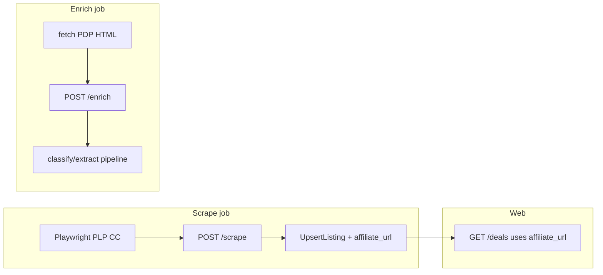

# Competitive Cyclist: scrape, enrich, Impact links

## Context from the codebase

- **Stack fit:** Competitive Cyclist is the same retail family as Backcountry. The repo already ships a resilient pattern in [`apps/scraper/src/parsers/backcountry.ts`](apps/scraper/src/parsers/backcountry.ts): Playwright with `networkidle` (AWS WAF), inlined/window JSON walk, pagination via `page` query param, and PDP enrichment via `fetch` + Cheerio (JSON-LD breadcrumbs, spec tables).
- **New-store wiring checklist** (all must stay in sync today):
  - Scraper: [`apps/scraper/src/types.ts`](apps/scraper/src/types.ts) (`STORE_TYPES` + Zod enums), [`apps/scraper/src/parsers/index.ts`](apps/scraper/src/parsers/index.ts).
  - API: [`apps/api/internal/api/admin.go`](apps/api/internal/api/admin.go) `AllowedStoreTypes`, [`apps/api/internal/db/db.go`](apps/api/internal/db/db.go) `StoreTypesWithEnrichers`, [`apps/api/internal/scheduler/scheduler.go`](apps/api/internal/scheduler/scheduler.go) scrape gate (~lines 125–126) so the type is not rewritten to `jensonusa`.
- **Affiliate gap:** [`UpsertListing`](apps/api/internal/db/db.go) never writes `store_listings.affiliate_url`. Handlers already prefer `affiliate_url` when present ([`handlers.go`](apps/api/internal/api/handlers.go) GET deals path); UI uses `deal.affiliate_url || deal.product_url`. So Impact tracking requires **computing an outbound URL at ingest** and extending the upsert.

## 1. Scraper: `competitivecyclist`

- Extract the large `page.evaluate` product walk from Backcountry into a **shared helper** (e.g. [`apps/scraper/src/parsers/backcountry-family-plp.ts`](apps/scraper/src/parsers/backcountry-family-plp.ts)) that resolves relative PDP URLs with **`window.location.origin`** (fixes today’s Backcountry-only hardcode of `https://www.backcountry.com`).
- Thin wrappers:
  - `scrapeBackcountry(url)` — same behavior, base/origin Backcountry.
  - `scrapeCompetitiveCyclist(url)` — navigates CC PLP(s), same injector + pagination loop (`SCAPER_MAX_PAGES` / delays unchanged).
- **Seed URL (MVP):** `https://www.competitivecyclist.com/rc/bikes-on-sale?rp=onsaleUS%3Atrue`. Validate pagination query (`page=`) matches BC; adjust `buildNextPageUrl` only if CC differs.
- **WAF/geo:** Automated fetches from non-US egress can return geo/consent HTML; treat **Playwright-first** as authoritative and capture one PLP fixture + assertions in Vitest (pattern used by other parsers). Optional: anonymized PDP HTML fixture for enrichment.

## 2. Enricher

- Factor shared PDP parsing (`extractBreadcrumbs`, `extractSpecs`, `extractDescription`) from [`backcountry.ts`](apps/scraper/src/parsers/backcountry.ts) into a Backcountry-family module; export `enrichCompetitiveCyclist` wired in `ENRICHERS`. If PDP markup differs, extend selectors narrowly for CC-only fallbacks while keeping BC tests green.

## 3. API / DB / scheduler

- **Seed:** [`packages/shared/seed.sql`](packages/shared/seed.sql): `INSERT ... WHERE NOT EXISTS` for **Competitive Cyclist** — `base_url` `https://www.competitivecyclist.com`, `scrape_url` bikes-on-sale URL above, `store_type` `competitivecyclist`, `affiliate_network` e.g. `impact_radius` (display/metadata only unless you branch on it in code).
- **Allowlists:** add `competitivecyclist` to `AllowedStoreTypes`, `StoreTypesWithEnrichers`, and scheduler `scrapeStore` type gate.
- **Ops:** optionally add `make scrape-now-competitivecyclist` and `make enrich-now-competitivecyclist` in [`Makefile`](Makefile) parallel to existing store targets (`POST ... ?store=competitivecyclist`).

## 4. Impact Radius affiliate URLs (implement now)

Impact’s exact deep-link shape comes from **your Impact dashboard** (program tracking link); do **not** commit IDs or secrets.

- **Mechanism:**
  - Add `AffiliateURL *string` to [`Listing`](apps/api/internal/db/db.go) and extend [`UpsertListing`](apps/api/internal/db/db.go) to `INSERT`/`ON CONFLICT` update `affiliate_url` using a merge rule such as: _set when computed value non-nil; otherwise leave existing_.
  - In [`scheduler.scrapeStore`](apps/api/internal/scheduler/scheduler.go), after building each listing from scrape results, if `strings.EqualFold(store.StoreType, "competitivecyclist")` **and** a configured Impact template/env is present, set `listing.AffiliateURL` to **template + encoded destination** (or documented placeholder substitution). Typical pattern is a static prefix ending in `u=` followed by `url.QueryEscape(productURL)` — confirm separator (`?` vs `&`) from your Impact link.
  - Prefer **env-only** secret, e.g. `IMPACT_DEEP_LINK_COMPETITIVE_CYCLIST` holding the dashboard-provided redirect base/prefix document in [`CLAUDE.md`](CLAUDE.md) / [`apps/api/README.md`](apps/api/README.md). If unset in dev, outbound links correctly fall back to `product_url` (current behavior).

## 5. Docs (doc-sync)

- Update [`docs/SCRAPING.md`](docs/SCRAPING.md), [`apps/scraper/README.md`](apps/scraper/README.md) — CC store_type, bikes-on-sale start URL, BC-family/WAF expectations.
- Update [`apps/api/README.md`](apps/api/README.md) (and briefly [`docs/ARCHITECTURE.md`](docs/ARCHITECTURE.md) if data flow touches scheduler/affiliate) — new env var, `affiliate_url` ingestion behavior.

## Deferred (follow-up after MVP)

- **Multiple PLP URLs per store** (`stores.scrape_urls` + scheduler loop + admin UI) from the broader internal RFC — only needed once you widen beyond bikes-on-sale or add components/apparel routes without stuffing everything into one URL.

## Risks / validation

- **US-only content:** run first successful scrape/enrich from US egress or local US browser once; inspect saved debug HTML logs if [`backcountry`-style diagnostics](apps/scraper/src/parsers/backcountry.ts) report `hasProducts=false`.
- **PDP fetch vs WAF:** if `fetch` enrichment fails intermittently for CC but works for BC, fall back to Playwright-based enrich mirroring PLP reliability (narrow change).
