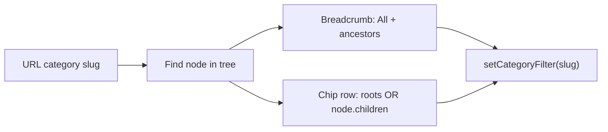

# Implement deals page category navigation (design-aligned)

## Current behavior (baseline)

- Category is a single URL param `[category](apps/web/src/lib/filterParams.ts)` (slug), managed by `[useFilterParams](apps/web/src/hooks/useFilterParams.ts)`.
- `[FilterSidebar](apps/web/src/components/FilterSidebar.tsx)` renders `[CategoryDrillDown](apps/web/src/components/CategoryDrillDown.tsx)` (expandable tree) together with brand/store/discount/specs/variants.
- `[DealsPageContent](apps/web/src/views/DealsPageContent.tsx)` layout: sticky sidebar (`lg+`) + main column with `[Toolbar](apps/web/src/components/Toolbar.tsx)`, `[FilterChips](apps/web/src/components/FilterChips.tsx)`, count, pagination, `[DealGrid](apps/web/src/components/DealGrid.tsx)`. Mobile uses `[FilterDrawer](apps/web/src/components/FilterDrawer.tsx)` for the same sidebar content.

No API changes are required: `[CategoryTreeNode](apps/web/src/api.ts)` already exposes `slug`, `name`, `children`, and `sort_order`.

## Target UX (mapped to code)

| Behavior       | Implementation                                                                                                                                                                                          |
| -------------- | ------------------------------------------------------------------------------------------------------------------------------------------------------------------------------------------------------- |
| No `category`  | Chip row = **top-level** tree nodes (order by existing `sort_order`, aligned with current `[TOP_ORDER](apps/web/src/components/CategoryDrillDown.tsx)` intent where practical).                         |
| `category` set | Breadcrumb = **All** (clears) + each ancestor as a control that sets URL to that slug; **current** segment is plain text.                                                                               |
| Drilled in     | Chip row = **direct children only** of the selected node; if leaf (no children), omit chip row or show a compact empty hint (choose one in implementation; prefer hiding for less noise).               |
| Filters        | Brand, store, discount, spec, variant stay in **sidebar / drawer** only — **remove** `CategoryDrillDown` from `[FilterSidebar](apps/web/src/components/FilterSidebar.tsx)`.                             |
| Mobile         | Horizontal scroll for chips (`overflow-x-auto`, touch-friendly targets ~44px, optional fade or `snap-x` if needed). Use theme tokens per [component-library rule](.cursor/rules/component-library.mdc). |

## Implementation steps

1. **Tree helpers (small, testable)**
   Add a tiny module (e.g. `[apps/web/src/lib/categoryTree.ts](apps/web/src/lib/categoryTree.ts)`) with:

- `findCategoryBySlug(tree, slug): CategoryTreeNode | null`
- `getAncestorChain(node, tree): CategoryTreeNode[]` or equivalent path from root
- `getChildNodesForBrowseLevel(tree, selectedSlug): CategoryTreeNode[]` implementing root vs drilled logic above

1. **New component: `DealsCategoryNav` (name flexible)**
   New file under `[apps/web/src/components/](apps/web/src/components/)`, props roughly:

- `categoryTree: CategoryTreeNode[]`
- `categoryFilter: string` (slug)
- `onCategoryChange: (slug: string) => void`
- Renders:
  - A labeled region (e.g. “Category”) with `[Card](apps/web/src/components/ui/card.tsx)` or bordered container matching existing deals styling
  - **Breadcrumb row**: `All` button → clears category; intermediate nodes use `Button` variant=link or ghost with underline/accessibility; `aria-current` on current
  - **Subcategories** label + **scrollable chip row** using `Button`/`Toggle`-style chips (selected state for current slug when it appears in the chip list — usually only when one of the children matches)

1. **Wire into `[DealsPageContent.tsx](apps/web/src/views/DealsPageContent.tsx)`**

- Render the new block in the **main column**, **above** `FilterChips` and the results count (order can match the Pencil flow: toolbar → category nav → chips → count → pagination → grid).
- Keep using existing `handleCategoryChange` for PostHog `filter_applied`.

1. **Sidebar / drawer**

- Remove the `CategoryDrillDown` block from `[FilterSidebar.tsx](apps/web/src/components/FilterSidebar.tsx)` (lines ~124–131) so mobile drawer and desktop sidebar only contain non-category filters.
- **Do not** change `[DealFilters.tsx](apps/web/src/components/DealFilters.tsx)` unless you decide to align it later (currently unused by routes).

1. **Filter chips and active count**

- In `DealsPageContent`, **exclude** `categoryFilter` from `activeFilterCount` so the mobile “Filters” button badge matches “spec filters only” (aligned with design’s “Filters · N active” separate from category).
- Remove the category entry from the `activeFilters` array built for `FilterChips` so users clear category via **All** / breadcrumb / selecting another chip, not a duplicate chip.

1. **Quality**

- Add a **Storybook** story for `DealsCategoryNav` with a small mock tree (root + 2 levels) covering: no selection, mid-tree selection, leaf selection.
- Optional: unit tests for `categoryTree.ts` helpers.

1. **Docs**

- Short note in `[apps/web/README.md](apps/web/README.md)` that deals category browsing is inline above results and filters are in the sidebar/drawer.

## Risks / edge cases

- **Stale slug** in URL not in tree: keep current pattern (API may still filter); breadcrumb can fall back to showing slug text or “Unknown” — mirror whatever `[FilterSidebar](apps/web/src/components/FilterSidebar.tsx)` / chips already assume.
- **Changing category clears spec/variant filters** — already enforced in `[setCategoryFilter](apps/web/src/hooks/useFilterParams.ts)`; no change needed.

## Out of scope (unless you want them next)

- Desktop-only second column for categories (design is mobile-first; current layout already has sidebar for filters).
- Changing PostHog event schema (can keep `filter_applied` for category).
