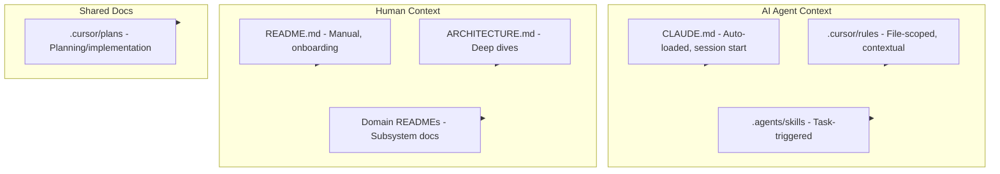

# Documentation Files for Humans and AI Agents

## Executive Summary

Different documentation files serve different audiences and get loaded at different times. This plan explains the landscape, how each file type behaves, and recommendations for your codebase.

---

## File Types and Their Roles

### 1. CLAUDE.md / AGENTS.md

| Aspect               | Details                                                                        |
| -------------------- | ------------------------------------------------------------------------------ |
| **Primary audience** | AI agents (Claude, Cursor, and tools that follow AGENTS.md)                    |
| **Location**         | Project root, subdirectories, or `~/.claude/CLAUDE.md` (personal)              |
| **When loaded**      | Automatically at session start                                                 |
| **Size**             | ~150–300 lines; concise instructions perform better (ETH Zurich 2025 research) |

**What it does:**

- Provides persistent project context so the AI doesn’t start from scratch each session
- Describes architecture, commands, conventions, and data flow
- Acts as the main “system prompt” for AI coding assistance

**Human value:** Developers can skim it to understand project structure and conventions. It’s secondary to a good README for human onboarding.

**Your project:** [CLAUDE.md](CLAUDE.md) is already strong: project overview, setup, commands, architecture per app.

---

### 2. README.md

| Aspect               | Details                                  |
| -------------------- | ---------------------------------------- |
| **Primary audience** | Humans (especially new contributors)     |
| **Location**         | Project root, package directories        |
| **When loaded**      | Manually (GitHub/GitLab, local browsing) |
| **Size**             | Flexible; often 100–300 lines at root    |

**What it does:**

- Onboarding: what the project is, how to run it, how to test
- Links to detailed docs and deployment notes
- Often includes diagrams, troubleshooting, and contribution info

**AI value:** AI can read it when relevant to tasks. It’s not auto-loaded like CLAUDE.md.

**Your project:** [README.md](README.md) covers setup, commands, deployment, and Makefile.

---

### 3. Cursor Rules (`.cursor/rules/*.mdc`)

| Aspect               | Details                                                                |
| -------------------- | ---------------------------------------------------------------------- |
| **Primary audience** | AI agents in Cursor                                                    |
| **Location**         | `.cursor/rules/`                                                       |
| **When loaded**      | When matching files are open (`globs`) or always (`alwaysApply: true`) |
| **Size**             | Keep under ~50 lines; one concern per rule                             |

**What it does:**

- Scoped, actionable rules (e.g. TS conventions, React patterns)
- Applied contextually by file pattern
- Stored as `.mdc` with YAML frontmatter (`description`, `globs`, `alwaysApply`)

**Human value:** Low; these are mainly for Cursor. They can still document team conventions.

**Your project:** Uses skills in `.agents/skills/`; Cursor rules would add project-specific conventions.

---

### 4. Agent Skills (`.agents/skills/` or `~/.cursor/skills-cursor/`)

| Aspect               | Details                                                           |
| -------------------- | ----------------------------------------------------------------- |
| **Primary audience** | AI agents                                                         |
| **Location**         | Project: `.agents/skills/`, Personal: `~/.cursor/skills-cursor/`  |
| **When loaded**      | When the skill description matches the task                       |
| **Size**             | SKILL.md under ~500 lines; use progressive disclosure for details |

**What it does:**

- Teaches domain- or task-specific workflows (e.g. TanStack Query, Neon Postgres)
- Reusable across projects
- Structure: `SKILL.md` (instructions), optional `AGENTS.md` (expanded rules), `references/`, `rules/`

**Human value:** Minimal; optimized for AI consumption.

**Your project:** You already have skills for React, TanStack Query, Neon, etc.

---

### 5. ARCHITECTURE.md / docs/

| Aspect               | Details                                        |
| -------------------- | ---------------------------------------------- |
| **Primary audience** | Humans and AI                                  |
| **Location**         | Project root or `docs/`                        |
| **When loaded**      | When AI or humans search/read for architecture |
| **Size**             | Flexible; can be broken into multiple files    |

**What it does:**

- Architecture decisions, data flow, boundaries between services
- Can include ADRs (Architecture Decision Records)

**AI value:** High when you explicitly reference or search these docs.

---

### 6. Domain READMEs (e.g. `packages/shared/migrations/README.md`)

| Aspect               | Details                             |
| -------------------- | ----------------------------------- |
| **Primary audience** | Humans (and AI when relevant)       |
| **Location**         | Subdirectories for specific domains |
| **When loaded**      | When working in that area           |

**What it does:**

- Explains that subdomain (e.g. migrations, API, scraper)
- Naming, conventions, and how things fit together

**Your project:** [packages/shared/migrations/README.md](packages/shared/migrations/README.md) exists.

---

### 7. .cursor/plans/

| Aspect               | Details                                      |
| -------------------- | -------------------------------------------- |
| **Primary audience** | Humans and AI during planning/implementation |
| **Location**         | `.cursor/plans/*.plan.md`                    |
| **When loaded**      | When planning or resuming a specific effort  |

**What it does:**

- Tracks design and implementation for features
- Helps maintain consistency and context for future work

---

## Differences at a Glance



| File            | Auto-loaded?             | Scope           | Best for                            |
| --------------- | ------------------------ | --------------- | ----------------------------------- |
| CLAUDE.md       | Yes (AI)                 | Project-wide    | Architecture, commands, conventions |
| README.md       | No                       | Project-wide    | Onboarding, setup, quick reference  |
| .cursor/rules   | Yes (AI, contextual)     | By file pattern | Code standards, patterns            |
| Skills          | Yes (AI, task-triggered) | Domain/task     | Reusable domain knowledge           |
| ARCHITECTURE.md | No                       | Project-wide    | Design and rationale                |
| Domain README   | No                       | Subsystem       | Migration rules, API details, etc.  |
| Plans           | No                       | Feature         | Design and implementation tracking  |

---

## Recommendations for mtb-aggregator

### 1. Keep CLAUDE.md Lean (Progressive Disclosure)

You already have solid content. To improve AI performance:

- Keep the most universal, high-value instructions (overview, structure, critical commands)
- Move detailed flows or rare operations to linked docs (e.g. `docs/ARCHITECTURE.md`, `docs/SCRAPING.md`)
- Target ~150–250 lines for the main file

### 2. Add an ARCHITECTURE.md for Deep Dives

Create `docs/ARCHITECTURE.md` (or `ARCHITECTURE.md` at root) with:

- Data flow diagrams (scrape → API → web)
- Category/taxonomy system
- Enrichment and LLM-driven filters

Reference it from CLAUDE.md for deeper context. Both humans and AI can use it.

### 3. Add Domain READMEs Where Needed

Example additions:

- `apps/scraper/README.md` – parser structure, adding stores, testing
- `apps/api/README.md` – endpoints, scheduler, backfills
- `packages/shared/README.md` – schema, migrations, brand/taxonomy config

### 4. Add Cursor Rules for Project-Specific Conventions

Create `.cursor/rules/` for patterns you want AI to follow:

- `go-api.mdc` – Go API and error handling style
- `scraper-parsers.mdc` – Playwright parser structure
- `react-admin.mdc` – Admin UI patterns

Keep each rule short and focused.

### 5. Cross-Link Documentation

- README links to CLAUDE.md for AI context and to `docs/` for architecture
- CLAUDE.md links to ARCHITECTURE.md and domain docs
- Domain READMEs link back to the main README and architecture

---

## Principles for Dual-Audience Docs

1. **Markdown only** – Works for both humans and AI; no binary or proprietary formats.
2. **Clear headings** – Help navigation and LLM context.
3. **Code examples** – Help humans and AI understand usage.
4. **Explicit file paths** – e.g. `apps/api/internal/scheduler/` so AI can target the right files.
5. **Avoid duplication** – Single source of truth with links instead of copy-paste.
6. **Progressive disclosure** – Core info in main docs, details in linked files.
7. **Stable structure** – Consistent sections (Overview, Setup, Architecture, Commands) across docs.

---

## Suggested File Layout

```
mtb-aggregator/
├── CLAUDE.md              # AI: session context (~200 lines)
├── README.md              # Humans: onboarding, setup
├── docs/                  # Optional
│   ├── ARCHITECTURE.md    # Design, data flow
│   ├── SCRAPING.md       # Scraper deep dive
│   └── TAXONOMY.md       # Category system
├── apps/
│   ├── api/README.md      # API-specific
│   └── scraper/README.md  # Scraper-specific
├── packages/
│   └── shared/
│       ├── README.md      # Schema, migrations
│       └── migrations/README.md  # Already exists
└── .cursor/
    ├── rules/             # Project-specific Cursor rules
    │   ├── go-api.mdc
    │   └── react-admin.mdc
    └── plans/             # Implementation plans (existing)
```
