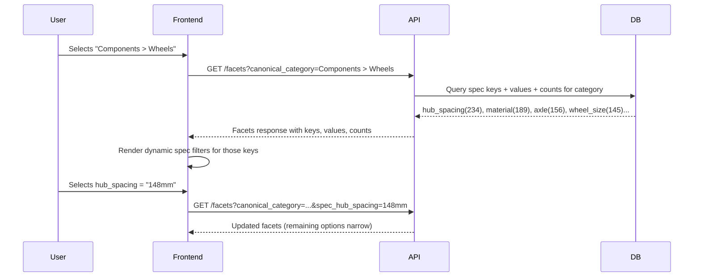

# Dynamic Category-Aware Faceted Filters

## Problem

Filters are static. The 13 spec keys in `[DealFilters.tsx](apps/web/src/components/DealFilters.tsx)` are hardcoded and always shown regardless of context. A user browsing "Wheels" sees irrelevant filters like "Damper" and "Spring", while potentially missing wheel-specific specs that exist in the data but aren't in the hardcoded list.

## Core Idea: Data-Driven Facets

Instead of maintaining a manual hierarchy of "category X shows filters Y, Z", we query the database to discover which spec keys actually exist for products matching the current filters. If 200 wheels have `hub_spacing` values and 180 have `material`, those filters surface automatically. If a new store starts providing `spoke_count` for wheels, it appears without any code change.



## Backend Changes

### 1. New DB query: `GetSpecFacets` in `[apps/api/internal/db/specs.go](apps/api/internal/db/specs.go)`

Accepts the same filter params as the deals query. Returns spec keys with counts, and for each key, the top values with counts.

```sql
-- Get spec keys + counts for current filter context
SELECT key, COUNT(DISTINCT sl.id) as product_count
FROM store_listings sl,
     jsonb_each_text(sl.metadata->'specs') AS spec(key, value)
WHERE sl.canonical_category @> $1   -- category filter
  AND sl.is_in_stock = true
  -- ... other active filters (store, brand, etc.)
GROUP BY key
HAVING COUNT(DISTINCT sl.id) >= 3   -- minimum coverage threshold
ORDER BY product_count DESC
LIMIT 20;
```

For value facets per key:

```sql
-- Get distinct values + counts for a specific spec key within context
SELECT sl.metadata->'specs'->>$2 AS value, COUNT(*) as count
FROM store_listings sl
WHERE sl.canonical_category @> $1
  AND sl.metadata->'specs' ? $2
  AND sl.metadata->'specs'->>$2 IS NOT NULL
GROUP BY value
ORDER BY count DESC
LIMIT 50;
```

### 2. New API endpoint: `GET /facets` in `[apps/api/main.go](apps/api/main.go)`

**Request**: Same query params as `/deals` (store, brand, canonical_category, q, etc.)

**Response**:

```json
{
  "spec_facets": [
    {
      "key": "hub_spacing",
      "label": "Hub Spacing",
      "product_count": 234,
      "values": [
        { "value": "148mm", "count": 120 },
        { "value": "142mm", "count": 87 },
        { "value": "150mm", "count": 27 }
      ]
    },
    {
      "key": "material",
      "label": "Material",
      "product_count": 189,
      "values": [
        { "value": "Carbon", "count": 95 },
        { "value": "Aluminum", "count": 82 }
      ]
    }
  ],
  "brand_facets": [
    { "value": "DT Swiss", "count": 45 },
    { "value": "Industry Nine", "count": 32 }
  ],
  "price_range": { "min": 89.99, "max": 2499.99 },
  "total_matching": 523
}
```

### 3. Spec key display labels

Keep a Go map in `[apps/api/internal/metadata/normalize.go](apps/api/internal/metadata/normalize.go)` mapping canonical keys to human-readable labels (the `specKeyAliases` data is already there). For unknown keys, auto-generate from snake_case: `hub_spacing` becomes "Hub Spacing". Return the label in the facets response so the frontend never needs its own mapping.

## Frontend Changes

### 4. New hook: `useFilterFacets` in `[apps/web/src/hooks/queries.ts](apps/web/src/hooks/queries.ts)`

Fetches `GET /facets` with current filter state. Uses TanStack Query with `keepPreviousData: true` so filter options don't flash/disappear while refetching.

### 5. Support multi-spec filtering

Currently the API only supports a single `spec_key` + `spec_value` pair. Change to support multiple spec filters using a convention like `spec_hub_spacing=148mm&spec_material=Carbon` (one query param per active spec filter). Update the deals query builder in the API to handle N spec conditions.

### 6. Redesign `DealFilters` in `[apps/web/src/components/DealFilters.tsx](apps/web/src/components/DealFilters.tsx)`

- **Always visible**: Category (canonical), Store, Brand, Sort, Min Discount, Search
- **Dynamic section**: Once a canonical category is selected, render spec filters returned by `/facets`
- Each spec facet renders as a select/chip group showing available values with counts
- Remove the hardcoded `SPEC_KEY_OPTIONS` list
- Support selecting multiple spec filters simultaneously (stored as `Record<string, string>` in state)

### 7. Update filter state in `[apps/web/src/App.tsx](apps/web/src/App.tsx)`

Replace the single `specKey`/`specValue` state with a `specFilters: Record<string, string>` map. When category changes, clear spec filters that no longer apply.

## Design Decisions

- **No manual mapping**: The system derives filter relevance from the data itself. Adding a new category or new spec key requires zero code changes.
- **Minimum coverage threshold**: Only show a spec filter if at least N products in the current context have that spec (avoids showing filters that only match 1-2 products).
- **Progressive disclosure**: Spec filters only appear after selecting a category, keeping the default UI clean.
- **Counts on values**: Showing "(45)" next to each filter value tells users whether a filter will actually narrow results.
- `**keepPreviousData`: Prevents jarring UI flicker when facets refetch as filters change.

## Performance Considerations

- The facets query uses `jsonb_each_text` which scans the JSONB column. With the existing GIN index on `metadata`, this should be fast for moderate dataset sizes.
- If performance becomes an issue, we could add a materialized view or cache facets per-category with a short TTL (category-level facets change infrequently).
- The facets endpoint is a separate request from `/deals`, so it can be fetched in parallel.
