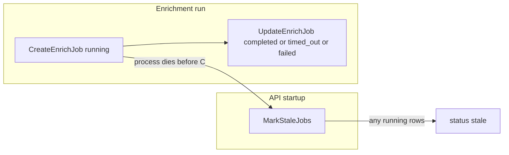

# Why scheduled enrichment jobs show `stale`

## What the code does

**`stale` is only written in one place:** [`MarkStaleJobs`](apps/api/internal/db/db.go) runs on **every API startup**, immediately after DB connect, in [`main.go`](apps/api/main.go) (before cron registration).

```1260:1278:apps/api/internal/db/db.go
// MarkStaleJobs sets status='stale' and completed_at=NOW() for any scrape_jobs and enrich_jobs that are still 'running'.
// Call on API startup to clean up jobs orphaned by a process crash/restart.
func (db *DB) MarkStaleJobs(ctx context.Context) error {
	_, err := db.pool.Exec(ctx, `
		UPDATE enrich_jobs
		SET status = 'stale', completed_at = NOW(),
			errors = array_append(COALESCE(errors, '{}'), 'marked stale: process restarted while job was running')
		WHERE status = 'running'
	`)
	// ... same for scrape_jobs
}
```

So a job appears **`stale`** only if:

1. It was inserted as `running` (normal: [`CreateEnrichJob`](apps/api/internal/db/db.go)), and
2. The process **did not** reach a terminal [`UpdateEnrichJob`](apps/api/internal/db/db.go) (`completed`, `failed`, `timed_out`, etc.) before the process exited, and
3. The **next** process start ran `MarkStaleJobs` and updated it.

**This is not** the enrichment time limit: that path sets **`timed_out`** via context deadline ([`getEnrichJobTimeout`](apps/api/internal/scheduler/scheduler.go), default **30 minutes** from `ENRICH_JOB_TIMEOUT`).



## Most likely causes (ordered)

1. **Rolling deploys / restarts** while cron or catch-up enrichment is running (Render sleep/wake, autodeploy, manual restarts, OOM kill, platform health recycle). Any exit before `UpdateEnrichJob` → next boot → `stale`.

2. **Multiple API replicas** sharing one DB (you were unsure—worth verifying on your host). During a rolling deploy, **every new instance** runs `MarkStaleJobs` against **all** `running` enrich jobs globally. Another instance’s legitimately running job can be marked `stale` even though work is still happening elsewhere—a design mismatch if you ever scale the API horizontally.

3. **Churn from catch-up + long jobs:** [`LastEnrichJobAge`](apps/api/internal/db/db.go) only considers `status IN ('completed', 'running')`—not `stale`, `failed`, or `timed_out`. If recent runs never reach `completed`, catch-up may keep thinking enrichment is “overdue” (README: 24h threshold) relative to the last **`completed`** job and fire [`RunEnrichmentJob`](apps/api/internal/scheduler/scheduler.go) on startup more often than you expect. There is **no cluster-wide lock** preventing overlapping enrich runs (cron vs catch-up vs manual), so you can accumulate multiple `running` rows; **any** restart then marks **all** of them `stale`.

## What to verify (no code changes)

- **Admin / DB:** Open recent `enrich_jobs`; confirm `errors` includes `marked stale: process restarted while job was running`. If yes, it confirms this path (not `timed_out`).
- **Host logs:** Correlate `stale` **completed_at** (or next deploy time) with API **restart/deploy** events, OOM, or health-check failures.
- **Replicas:** Check your platform (e.g. Render service **instance count**, rolling deploy settings). If count &gt; 1, treat multi-instance `MarkStaleJobs` as a prime suspect.
- **Duration:** If enrich often runs longer than your deploy cadence or instance lifetime, you will see `stale` repeatedly until deploys stabilize or enrichment is shorter.

## If you confirm the problem is operational

- Prefer **one** API instance that runs in-process cron, **or** move `POST /enrich-now` to an external cron hitting a **single** worker, with `ENRICH_CRON_SPEC=disabled` on web-facing instances if you split services later.
- Temporarily reduce deploys during the enrich window or lengthen stability window if you cannot avoid restarts.

## If you confirm multi-instance or need code-level hardening (future work)

- **Postgres advisory lock** (or similar) so only one enrichment run is active cluster-wide, **and/or** only mark jobs stale when they are provably orphaned (e.g. `started_at` older than a grace period, or tied to a dead `instance_id`—requires design).
- Broaden **catch-up** eligibility in [`LastEnrichJobAge`](apps/api/internal/db/db.go) / related logic so `stale`/`failed`/`timed_out` with recent `started_at` or `completed_at` does not skew “last run” semantics.

I can help interpret a redacted row from `enrich_jobs` (status, `triggered_by`, timestamps, first error line) or a short deploy/restart timeline if you paste them.
