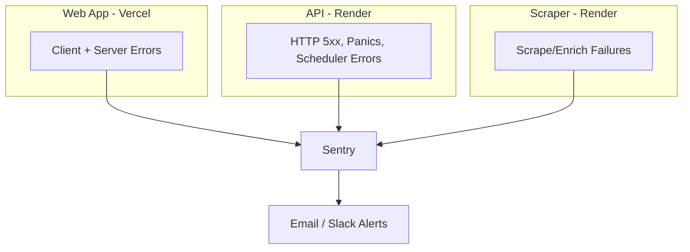

# Error Handling and Alerting Plan

## Current State

| Service                   | Error handling                                                                              | Alerting |
| ------------------------- | ------------------------------------------------------------------------------------------- | -------- |
| **Web** (Next.js/Vercel)  | `ErrorMessage` component, TanStack Query `onError`; no global error boundaries or reporting | None     |
| **API** (Go/Render)       | `log.Printf` for errors; HTTP middleware logs status codes                                  | None     |
| **Scraper** (Node/Render) | `console.error`, writes to `logs/` on failure                                               | None     |

Errors are logged locally but never surface to you. You only discover issues when you check logs or users report them.

---

## Recommended Approach: Sentry

**Sentry** provides a single platform for all three services with:

- Error capture with stack traces and context
- Alerting via email, Slack, PagerDuty, etc.
- Free tier: 5,000 errors/month (sufficient for a small aggregator)
- SDKs for Go, Node.js, and Next.js

---

## Implementation

### 1. Sentry Setup (one-time)

1. Create a Sentry account at [sentry.io](https://sentry.io)
2. Create a project (or one per service for finer-grained alerts)
3. Get DSN from Project Settings > Client Keys (DSN)
4. Add env var: `SENTRY_DSN` (or `NEXT_PUBLIC_SENTRY_DSN` for web client)

### 2. Web App ([apps/web/](apps/web/))

- **Install**: `@sentry/nextjs` (wizard: `npx @sentry/wizard@latest -i nextjs`)
- **Instrumentation**:
  - Client: uncaught errors, React error boundaries, unhandled promise rejections
  - Server: API route and server component errors
  - Optional: TanStack Query global `onError` to report failed mutations
- **Error boundary**: Add `error.tsx` and `global-error.tsx` in the App Router to catch route-level and root errors; optionally report to Sentry in `global-error.tsx`
- **Env**: `NEXT_PUBLIC_SENTRY_DSN`, `SENTRY_DSN` (server), `SENTRY_ORG`, `SENTRY_PROJECT` for source maps

### 3. API ([apps/api/](apps/api/))

- **Install**: `go get github.com/getsentry/sentry-go`
- **Init**: Call `sentry.Init()` in [apps/api/main.go](apps/api/main.go) at startup (after env load, before handlers)
- **Capture points**:
  - HTTP middleware: capture 5xx responses and panics (recover in middleware)
  - Scheduler: wrap scrape/enrich goroutines; on error call `sentry.CaptureException(err)` (or `sentry.CaptureMessage` for non-error cases)
  - Handlers: replace `log.Printf` for critical errors with `sentry.CaptureException` + `log.Printf` (keep logs for local debugging)
- **Flush**: Call `sentry.Flush()` in shutdown handler
- **Env**: `SENTRY_DSN`, `SENTRY_ENVIRONMENT` (e.g. `production`)

### 4. Scraper ([apps/scraper/](apps/scraper/))

- **Install**: `@sentry/node`
- **Init**: `Sentry.init()` at top of [apps/scraper/src/server.ts](apps/scraper/src/server.ts)
- **Capture points**:
  - `/scrape` and `/enrich` catch blocks: `Sentry.captureException(err)` before returning 500
  - Parser-level errors (e.g. in [apps/scraper/src/parsers/jensonusa.ts](apps/scraper/src/parsers/jensonusa.ts)): rethrow or call `Sentry.captureException` in enricher catch blocks
- **Env**: `SENTRY_DSN`, `SENTRY_ENVIRONMENT`

### 5. Alerting in Sentry

- **Alerts**: Sentry > Alerts > Create Alert
  - Trigger: "An event is seen" or "The number of events is above X"
  - Action: Email, Slack, etc.
- **Recommended**: One alert for "new issue" (first occurrence) and optionally one for "issue spikes" (e.g. >10 events in 1 hour)

### 6. Platform-Level Notifications (optional, no code changes)

- **Render**: Integrations > Notifications > enable "Only failure notifications" for deploy/build failures and unhealthy services
- **Vercel**: Project > Settings > Notifications > enable deploy failure emails

These complement Sentry by alerting on infrastructure/deploy issues, not application logic errors.

---

## Alternative Options

| Option                    | Pros                                                     | Cons                                                      |
| ------------------------- | -------------------------------------------------------- | --------------------------------------------------------- |
| **Sentry** (recommended)  | Unified, rich context, alerting, free tier               | Extra dependency                                          |
| **BetterStack (Logtail)** | Log aggregation + alerting, can parse Render/Vercel logs | Less focused on app errors; may need log forwarding setup |
| **Render + Vercel only**  | No new services                                          | Only deploy/infra failures; no app-level error alerts     |
| **Custom (webhook + DB)** | Full control                                             | More work; no grouping, stack traces, or UI               |

---

## Docs to Update

Per [documentation-sync](.cursor/rules/documentation-sync.mdc):

- [docs/ARCHITECTURE.md](docs/ARCHITECTURE.md) — add "Error Monitoring" section
- [README.md](README.md) — add `SENTRY_DSN` to env vars
- [.env.example](.env.example) — add `SENTRY_DSN`, `SENTRY_ENVIRONMENT`

---

## Summary

1. Add Sentry to web, API, and scraper.
2. Configure Sentry alerts (email/Slack) for new issues and spikes.
3. Optionally enable Render and Vercel failure notifications.
4. Update docs with new env vars and architecture notes.
