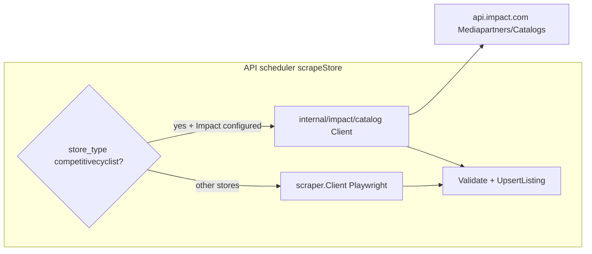

# Competitive Cyclist via Impact Partner API

## Problem

Playwright scraping CC is blocked by AWS WAF (“Human Verification”) even with saved storage state. The Impact **Product Catalog** / **ItemSearch** API is the supported affiliate path and avoids WAF entirely.

**Prerequisite (you provide, never commit):**

- `IMPACT_AUTH_TOKEN` — from Impact dashboard → **Settings → API** (create token if needed)
- `IMPACT_ACCOUNT_SID` — your Mediapartner Account SID (store in `.env` only; do not commit)

Your existing `IMPACT_DEEP_LINK_COMPETITIVE_CYCLIST` continues to power outbound links at upsert time ([`apps/api/internal/affiliate/impact.go`](apps/api/internal/affiliate/impact.go)).

### `.env` for Competitive Cyclist (API)

Add these to repo-root [`.env`](.env) (API reads via `godotenv`; scraper does not need Impact vars):

```bash
# Impact Partner API (required for CC ingest)
IMPACT_ACCOUNT_SID=your_mediapartner_sid
IMPACT_AUTH_TOKEN=your_api_auth_token

# Already configured — keep this
IMPACT_DEEP_LINK_COMPETITIVE_CYCLIST=https://competitivecyclist.g39l.net/c/7267030/368279/5416?u={{URL}}

# Optional after probe
# IMPACT_CC_CATALOG_ID=
# IMPACT_CC_ITEM_SEARCH_QUERY=StockAvailability!=OutOfStock
```

You can **remove** from `.env` once Impact ingest works:

- `SCRAPER_STORAGE_STATE` — only for Playwright WAF workaround (no longer needed for CC)
- Delete local `apps/scraper/cc-storage.json` (gitignored; do not commit)

## Cleanup: retire CC Playwright path

When implementing, remove or revert CC-specific scraper work that the Impact API replaces. **Keep** shared pieces still used by Backcountry.

| Action                     | Item                                                                                                                                                                                                                              | Rationale                                           |
| -------------------------- | --------------------------------------------------------------------------------------------------------------------------------------------------------------------------------------------------------------------------------- | --------------------------------------------------- |
| **Remove**                 | [`competitivecyclist.ts`](apps/scraper/src/parsers/competitivecyclist.ts)                                                                                                                                                         | Production ingest moves to API                      |
| **Remove**                 | `competitivecyclist` from [`PARSERS` / `ENRICHERS`](apps/scraper/src/parsers/index.ts) and [`STORE_TYPES`](apps/scraper/src/types.ts)                                                                                             | Scheduler never calls scraper for CC                |
| **Remove**                 | CC WAF sections in [`apps/scraper/README.md`](apps/scraper/README.md) (`SCRAPER_STORAGE_STATE`, `cc-storage.json`, CC scrape instructions)                                                                                        | Misleading once API is source of truth              |
| **Revert CC-only wording** | [`docs/SCRAPING.md`](docs/SCRAPING.md) CC bullet (WAF / storage state)                                                                                                                                                            | Replace with “Impact catalog API via API scheduler” |
| **Remove**                 | `make enrich-now-competitivecyclist` from [`Makefile`](Makefile)                                                                                                                                                                  | CC removed from `StoreTypesWithEnrichers`           |
| **Keep**                   | [`backcountry-family-plp.ts`](apps/scraper/src/parsers/backcountry-family-plp.ts), [`backcountry-family-pdp.ts`](apps/scraper/src/parsers/backcountry-family-pdp.ts), [`backcountry.ts`](apps/scraper/src/parsers/backcountry.ts) | Still valid for Backcountry store                   |
| **Keep**                   | `SCRAPER_STORAGE_STATE` / WAF wait in backcountry-family-plp                                                                                                                                                                      | Backcountry may still need it                       |
| **Keep**                   | [`impact.go`](apps/api/internal/affiliate/impact.go) deep link + scheduler `AffiliateURL` upsert                                                                                                                                  | Still used at ingest                                |
| **Keep**                   | CC row in [`seed.sql`](packages/shared/seed.sql), `competitivecyclist` in admin allowlists                                                                                                                                        | Store still exists; scrape source changes           |
| **Keep**                   | `make scrape-now-competitivecyclist`                                                                                                                                                                                              | Still triggers scheduler; now runs Impact ingest    |

Do **not** delete the old plan file [`.cursor/plans/competitive_cyclist_store_9ea83260.plan.md`](.cursor/plans/competitive_cyclist_store_9ea83260.plan.md) unless you want to archive it manually — it is superseded by this plan.



**Key decision:** Ingest runs in the **API** (not the Node scraper). CC `scrapeStore` calls Impact when credentials are set; other stores unchanged.

## Impact API surface (v12+)

Documented Partner endpoints ([catalogs overview](https://integrations.impact.com/impact-publisher/reference/catalogs-overview), [search catalog items](https://integrations.impact.com/impact-publisher/reference/search-catalog-items)):

| Step | Endpoint                                              | Purpose                                                                          |
| ---- | ----------------------------------------------------- | -------------------------------------------------------------------------------- |
| 1    | `GET /Mediapartners/{AccountSid}/Catalogs`            | List catalogs; pick Competitive Cyclist catalog (auto or `IMPACT_CC_CATALOG_ID`) |
| 2    | `GET /Mediapartners/{AccountSid}/Catalogs/ItemSearch` | Search/filter items with pagination                                              |

- **Auth:** HTTP Basic — username = Account SID, password = Auth Token
- **Headers:** `Accept: application/json`, API version v12+ (query param or header per Impact docs)
- **ItemSearch params:** `Query` (e.g. `StockAvailability!=OutOfStock`), optional `Keyword`, `CatalogId`, page size — exact pagination field names confirmed during a one-time live probe with your credentials
- **Mapping target:** existing [`scraper.ScrapeResult`](apps/api/internal/scraper/client.go) so [`ValidateResult`](apps/api/internal/scraper/validate.go) + upsert loop in [`scheduler.scrapeStore`](apps/api/internal/scheduler/scheduler.go) stay unchanged

Expected catalog fields (names may vary slightly in JSON; map defensively):

- `CatalogItemId` / `Sku` → `store_sku`
- `Name` → `product_name`
- `Url` / `ProductUrl` → `product_url`
- `CurrentPrice`, `OriginalPrice` / `RetailPrice` → prices
- `ImageUrl` → `image_url`
- `Manufacturer` / `Brand` → `brand`
- `Category` / `Labels` → `category_path` (split on `>` or `/`)
- `StockAvailability` → `is_in_stock`
- `Description` → store in listing `metadata` at ingest (for LLM classify/extract without PDP)

## Default product scope (MVP)

Align with current seed intent ([`packages/shared/seed.sql`](packages/shared/seed.sql) bikes-on-sale PLP):

- In-stock items only
- On-sale signal: `CurrentPrice < OriginalPrice` (post-fetch filter) and/or Impact `Query` if CC exposes sale labels (tuned after first API response)
- Category filter: bike-related categories (refine once we see CC’s `Category` strings in the feed)

Make scope **configurable** via env so you can widen later without code changes:

```bash
IMPACT_CC_ITEM_SEARCH_QUERY=StockAvailability!=OutOfStock
# optional: IMPACT_CC_CATALOG_ID=...
# optional: IMPACT_CC_CATEGORY_CONTAINS=Bike
```

## Implementation plan

### 1. Impact catalog client (`apps/api/internal/impact/`)

Extend the existing [`impact`](apps/api/internal/affiliate/impact.go) package or add sibling `catalog.go`:

- `Client` with `http.Client`, timeout, Basic auth from env
- `ListCatalogs(ctx)` → find CC catalog by name/advertiser match
- `SearchCatalogItems(ctx, catalogID, query, pageToken)` → paginate until exhausted (respect scrape job timeout)
- `CatalogItemToScrapeResult(item) scraper.ScrapeResult` — pure mapping + sale/category filters
- Unit tests with `httptest` fixtures (sample ListCatalogs + ItemSearch JSON); no live API in CI

Env vars (document in [`apps/api/README.md`](apps/api/README.md), [`.env.example`](.env.example), [`CLAUDE.md`](CLAUDE.md)):

| Variable                      | Required | Notes                            |
| ----------------------------- | -------- | -------------------------------- |
| `IMPACT_ACCOUNT_SID`          | yes      | Mediapartner SID                 |
| `IMPACT_AUTH_TOKEN`           | yes      | API token (secret)               |
| `IMPACT_CC_CATALOG_ID`        | no       | Skip list step if set            |
| `IMPACT_CC_ITEM_SEARCH_QUERY` | no       | Default in-stock query           |
| `IMPACT_API_BASE_URL`         | no       | Default `https://api.impact.com` |

### 2. Scheduler branch ([`apps/api/internal/scheduler/scheduler.go`](apps/api/internal/scheduler/scheduler.go))

In `scrapeStore`, before `s.scraper.Scrape(...)`:

```go
if strings.EqualFold(storeType, "competitivecyclist") && impactCatalogConfigured() {
    results, err = s.fetchCompetitiveCyclistFromImpact(ctx)
} else {
    results, err = s.scraper.Scrape(ctx, store.ScrapeURL, storeType)
}
```

- Log source: `impact-catalog` vs `scraper`
- Reuse existing validation, affiliate URL assignment, upsert, price history, stale-listing hide (`minResultsForStaleCleanup`)
- If Impact credentials **missing** for CC: fail loudly with clear log (do not silently fall back to Playwright WAF loop)

Optional small refactor: extract `persistScrapeResults(ctx, store, results, ...)` from the current inline loop to avoid duplication — only if it keeps the diff readable.

### 3. Enrichment strategy (no PDP for CC)

PDP enrich via Playwright/fetch will remain WAF-blocked. For Impact-sourced listings:

- Set `category_path` from feed at ingest
- Merge feed `Description` into listing `metadata` (existing JSONB patterns in [`metadata`](apps/api/internal/metadata/))
- **Remove `competitivecyclist` from [`StoreTypesWithEnrichers`](apps/api/internal/db/db.go)** so nightly enrich does not hammer dead PDP URLs
- Rely on existing **LLM classify/extract** paths (`RunEnrichmentJob` LLM steps / `POST /llm-specs-now`) using name + description + category from metadata

Keep the scraper enricher registered for manual/debug only, or leave registered but excluded from allowlist — prefer allowlist removal for production clarity.

### 4. Discovery / ops tooling

Add `apps/api/cmd/impact-catalog-probe/main.go` (or Makefile target `impact-probe-cc`):

- Lists catalogs, prints CC catalog ID
- Runs one ItemSearch page, prints field names + sample row JSON
- Helps tune `IMPACT_CC_ITEM_SEARCH_QUERY` without reading raw XML in the dashboard

Not required for production cron; dev/ops only.

### 5. Store seed / admin

- Keep [`packages/shared/seed.sql`](packages/shared/seed.sql) CC row; `scrape_url` becomes informational (document that CC uses Impact API when configured)
- No schema migration required for MVP
- Admin store CRUD unchanged

### 6. Documentation (doc-sync)

- [`apps/api/README.md`](apps/api/README.md) — Impact env vars, probe command, CC ingest flow
- [`docs/ARCHITECTURE.md`](docs/ARCHITECTURE.md) — CC data source = Impact catalog API
- [`docs/SCRAPING.md`](docs/SCRAPING.md) — note CC scrape bypasses scraper when Impact configured; Playwright parser retained but not production path
- [`apps/scraper/README.md`](apps/scraper/README.md) — short note that CC production ingest is API-side

### 7. Security

- **Never commit** `IMPACT_AUTH_TOKEN` or paste tokens in code/docs
- Account SID in env only (you shared yours in chat — rotate token if concerned; SID alone is lower risk but still env-only)
- Sentry: report Impact API 5xx / auth failures via existing [`sentryutil`](apps/api/internal/sentryutil/) in scheduler

## Verification

1. Set `IMPACT_ACCOUNT_SID`, `IMPACT_AUTH_TOKEN`, existing deep link in `.env`
2. Run probe command → confirm catalog ID + sample items
3. `make scrape-now-competitivecyclist` → non-zero listings, `affiliate_url` populated
4. Admin Data Browser: prices, URLs, categories present
5. `make enrich-now-competitivecyclist` should no-op (removed from enrich allowlist); run LLM classify if needed on feed descriptions

## Out of scope (follow-ups)

- Impact catalog for Backcountry (same pattern later)
- Storing `impact_catalog_id` on `stores` table (env is enough for single CC store)
- Full catalog sync of non-sale inventory
