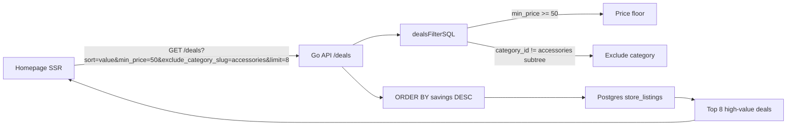

# Improve Homepage Deal Quality

## Problem

The homepage fetches top deals with `fetchDeals({ sort: "discount", limit: 8, offset: 0 })` ([page.tsx](<apps/web/src/app/(public)/page.tsx>), line 35). This sorts purely by discount percentage, so a $5 brake cable at 80% off outranks a $3,000 bike at 40% off. The result is a homepage full of low-value accessories and clearance junk.

## Root Cause

- **No value weighting** -- the `discount` sort in [db.go](apps/api/internal/db/db.go) (line ~577) uses:

```sql
ORDER BY (1 - current_price / original_price) * 100 DESC
```

- **No price floor** -- there is no `min_price` filter in [GetDealsParams](apps/api/internal/db/db.go) or [dealsFilterSQL](apps/api/internal/db/deals_filter.go)
- **No category scoping** -- the homepage query passes no category filter, and the API only accepts a single `category_slug`

## Recommended Approach: Automated, No Curation Needed

Three changes that stack together, all backward-compatible:

### 1. New sort mode: `sort=value` (value-weighted ranking)

Add a new ORDER BY option in the API that factors in both discount depth and absolute price. Two candidates:

- **Savings amount** (`original_price - current_price`): a $3,000 bike at 40% off saves $1,200 and ranks far above a $5 item at 80% off saving $4. Simple, intuitive.
- **Weighted score** (`discount_pct * ln(original_price)`): logarithmic price weight so mid-range items still surface. Slightly more nuanced.

**Recommendation:** Start with savings amount -- it's dead simple, explains itself, and naturally surfaces expensive products with real discounts. The SQL:

```sql
ORDER BY (CASE WHEN l.original_price IS NOT NULL AND l.original_price > 0
               AND l.current_price < l.original_price
          THEN l.original_price - l.current_price ELSE 0 END) DESC NULLS LAST
```

**Files to change:**

- [apps/api/internal/db/db.go](apps/api/internal/db/db.go) -- add `"value"` case to the sort switch (~line 577)
- [apps/api/internal/db/deals_grouped.go](apps/api/internal/db/deals_grouped.go) -- add same case in `groupedRepsOrderSQL`

### 2. Add `min_price` filter parameter

Filter out items below a price floor. Useful for the homepage (e.g., `min_price=50`) and generally useful for the deals page.

**Files to change:**

- [apps/api/internal/db/db.go](apps/api/internal/db/db.go) -- add `MinPrice *float64` to `GetDealsParams`
- [apps/api/internal/db/deals_filter.go](apps/api/internal/db/deals_filter.go) -- add `AND l.current_price >= $N` clause in `dealsFilterSQL`
- [apps/api/internal/api/handlers.go](apps/api/internal/api/handlers.go) -- parse `min_price` query param in `GetDeals`
- [apps/web/src/api.ts](apps/web/src/api.ts) -- add `min_price` to `fetchDeals` params

### 3. Add `exclude_category_slug` filter parameter

Allow excluding an entire category subtree (e.g., `exclude_category_slug=accessories`) so the homepage can drop low-value categories without needing to enumerate the ones to include.

**Files to change:**

- [apps/api/internal/db/db.go](apps/api/internal/db/db.go) -- add `ExcludeCategorySlug string` to `GetDealsParams`
- [apps/api/internal/db/deals_filter.go](apps/api/internal/db/deals_filter.go) -- add `AND l.category_id != ALL($N)` clause using subtree IDs
- [apps/api/internal/api/handlers.go](apps/api/internal/api/handlers.go) -- parse `exclude_category_slug` query param
- [apps/web/src/api.ts](apps/web/src/api.ts) -- add to `fetchDeals` params

### 4. Update homepage query

Combine all three in the homepage fetch call in [page.tsx](<apps/web/src/app/(public)/page.tsx>):

```typescript
fetchDeals({
  sort: "value",
  min_price: 50,
  exclude_category_slug: "accessories",
  limit: 8,
  offset: 0,
});
```

This is fully automated -- no curation, no admin UI, no new tables. The homepage will naturally show big-ticket items (bikes, forks, wheels, gear) with meaningful discounts.

## Why Not Manual Curation?

A `featured` boolean column + admin toggle would give the most control but requires:

- Ongoing manual work to curate after every scrape
- New DB column, migration, admin UI panel
- Stale featured picks if not maintained

The automated approach above gets 90%+ of the value with zero maintenance. If you later want a curated "editor's picks" section, that could be a separate feature alongside the automated top deals.

## Data Flow (after changes)


