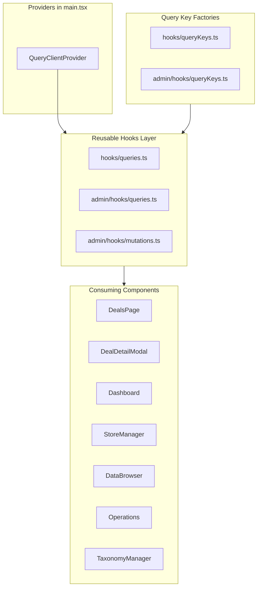

# Introduce TanStack Query

## Current State

The app has **17 `useEffect` data-fetching hooks** across 7 files, each manually managing `loading`, `error`, and data state with `useState`. There are no shared caching, retry, or deduplication mechanisms. Two API layers exist: public ([apps/web/src/api.ts](apps/web/src/api.ts)) and admin ([apps/web/src/admin/api.ts](apps/web/src/admin/api.ts)).

## Additional Benefits Beyond Your Goals

Beyond eliminating `useEffect`, creating reusable hooks, and enabling client-side caching, TanStack Query will also give us:

- **Automatic background refetching** on window focus and network reconnect -- users always see fresh data without manual refreshes
- **Request deduplication** -- if multiple components mount simultaneously requesting the same data (e.g. stores), only one network request fires
- **Built-in retry logic** -- failed requests automatically retry (configurable) before surfacing errors
- **Optimistic updates** for admin mutations (store CRUD, taxonomy edits) -- UI updates instantly, rolls back on failure
- **Prefetching on intent** -- e.g. prefetch deal detail on hover so the modal opens instantly
- **DevTools** -- `@tanstack/react-query-devtools` gives a visual cache inspector during development
- **Structural sharing** -- minimizes re-renders by preserving referential identity of unchanged data
- **Declarative loading/error states** -- `isPending`, `isError`, `data` replace manual `useState` triplets

## Architecture



## Step 1 -- Install Dependencies

```bash
cd apps/web && npm install @tanstack/react-query @tanstack/react-query-devtools
```

## Step 2 -- Set Up QueryClientProvider

In [apps/web/src/main.tsx](apps/web/src/main.tsx), create a `QueryClient` with sensible defaults and wrap the app:

```tsx
import { QueryClient, QueryClientProvider } from "@tanstack/react-query";
import { ReactQueryDevtools } from "@tanstack/react-query-devtools";

const queryClient = new QueryClient({
  defaultOptions: {
    queries: {
      staleTime: 60 * 1000, // 1 min default
      gcTime: 5 * 60 * 1000, // 5 min garbage collection
      retry: 1,
      refetchOnWindowFocus: true,
    },
  },
});

// Wrap <BrowserRouter> with <QueryClientProvider> + <ReactQueryDevtools />
```

## Step 3 -- Create Query Key Factories

**Public keys** -- new file `apps/web/src/hooks/queryKeys.ts`:

```ts
export const dealKeys = {
  all: ["deals"] as const,
  lists: () => [...dealKeys.all, "list"] as const,
  list: (filters: Record<string, unknown>) =>
    [...dealKeys.lists(), filters] as const,
  details: () => [...dealKeys.all, "detail"] as const,
  detail: (id: number) => [...dealKeys.details(), id] as const,
  priceHistory: (id: number) =>
    [...dealKeys.detail(id), "priceHistory"] as const,
};

export const storeKeys = {
  all: ["stores"] as const,
};

export const brandKeys = { all: ["brands"] as const };
export const categoryKeys = { all: ["categories"] as const };
export const canonicalCategoryKeys = { all: ["canonicalCategories"] as const };
export const specValueKeys = {
  all: ["specValues"] as const,
  byKey: (key: string) => [...specValueKeys.all, key] as const,
};
export const statusKeys = { all: ["status"] as const };
```

**Admin keys** -- new file `apps/web/src/admin/hooks/queryKeys.ts` with similar factories for `adminStores`, `dashboard`, `scrapeJobs`, `enrichJobs`, `adminListings`, `taxonomy`, `storeTypes`.

## Step 4 -- Create Reusable Query Hooks

**Public hooks** -- new file `apps/web/src/hooks/queries.ts`:

| Hook                       | Replaces                       | staleTime               |
| -------------------------- | ------------------------------ | ----------------------- |
| `useDeals(filters)`        | App.tsx deals `useEffect`      | 60s (default)           |
| `useDeal(id)`              | DealDetailModal fetch          | 5 min                   |
| `usePriceHistory(id)`      | DealDetailModal fetch          | 5 min                   |
| `useStores()`              | App.tsx stores `useEffect`     | 10 min (reference data) |
| `useBrands()`              | App.tsx brands `useEffect`     | 10 min                  |
| `useCategories()`          | App.tsx categories `useEffect` | 10 min                  |
| `useCanonicalCategories()` | App.tsx canonical `useEffect`  | 10 min                  |
| `useStatus()`              | App.tsx status `useEffect`     | 30s                     |

Example pattern each hook follows:

```ts
export function useStores() {
  return useQuery({
    queryKey: storeKeys.all,
    queryFn: fetchStores,
    staleTime: 10 * 60 * 1000,
  });
}
```

**Admin query hooks** -- new file `apps/web/src/admin/hooks/queries.ts`:

| Hook                           | Replaces                                          |
| ------------------------------ | ------------------------------------------------- |
| `useAdminDashboard()`          | Dashboard.tsx `useEffect`                         |
| `useAdminStores()`             | Operations, DataBrowser, StoreManager `useEffect` |
| `useStoreTypes()`              | StoreManager `useEffect`                          |
| `useStoreTypesWithEnrichers()` | StoreManager `useEffect`                          |
| `useScrapeJobs(params)`        | Operations `useEffect`                            |
| `useEnrichJobs(params)`        | Operations `useEffect`                            |
| `useAdminListings(params)`     | DataBrowser `useEffect`                           |
| `useAdminListing(id)`          | DataBrowser detail `useEffect`                    |
| `useTaxonomyMappings()`        | TaxonomyManager `useEffect`                       |

## Step 5 -- Create Reusable Mutation Hooks

New file `apps/web/src/admin/hooks/mutations.ts`:

| Hook                         | API function            | Invalidates                                |
| ---------------------------- | ----------------------- | ------------------------------------------ |
| `useTriggerScrape()`         | `triggerScrape`         | `scrapeJobs`, `dashboard`, `adminStores`   |
| `useTriggerEnrich()`         | `triggerEnrich`         | `enrichJobs`, `dashboard`, `adminListings` |
| `useCreateStore()`           | `createStore`           | `adminStores`, `storeTypes`                |
| `useUpdateStore()`           | `updateStore`           | `adminStores`                              |
| `useDeleteStore()`           | `deleteStore`           | `adminStores`                              |
| `useEnrichListing()`         | `enrichListing`         | `adminListings`, listing detail            |
| `useCreateTaxonomyMapping()` | `createTaxonomyMapping` | `taxonomy`                                 |
| `useUpdateTaxonomyMapping()` | `updateTaxonomyMapping` | `taxonomy`                                 |
| `useDeleteTaxonomyMapping()` | `deleteTaxonomyMapping` | `taxonomy`                                 |
| `useTriggerRecategorize()`   | `triggerRecategorize`   | `taxonomy`, `adminListings`, `deals`       |

Example:

```ts
export function useCreateStore() {
  const queryClient = useQueryClient();
  return useMutation({
    mutationFn: createStore,
    onSuccess: () => {
      queryClient.invalidateQueries({ queryKey: adminStoreKeys.all });
    },
  });
}
```

## Step 6 -- Refactor Components

### 6a. [apps/web/src/App.tsx](apps/web/src/App.tsx) (DealsPage)

Remove **7** `useEffect` hooks and **10** `useState` calls (`deals`, `totalCount`, `stores`, `loading`, `error`, `brands`, `categories`, `canonicalCategories`, `status`). Replace with:

```tsx
const { data: storesData } = useStores();
const { data: brandsData } = useBrands();
const { data: categoriesData } = useCategories();
const { data: canonicalData } = useCanonicalCategories();
const { data: statusData } = useStatus();
const { data: dealsData, isPending, isError, error } = useDeals(filterParams);
```

Keep filter/sort/offset `useState` as-is (that's client-only UI state). Keep the `useEffect` that resets sort to "newest" (pure UI logic, not data fetching).

### 6b. [apps/web/src/components/DealDetailModal.tsx](apps/web/src/components/DealDetailModal.tsx)

Replace the single `useEffect` that fetches deal + price history with `useDeal(dealId)` and `usePriceHistory(dealId)` (both with `enabled: dealId != null`).

### 6c. [apps/web/src/admin/Dashboard.tsx](apps/web/src/admin/Dashboard.tsx)

Replace `useEffect` + `fetchDashboard` with `useAdminDashboard()`. Replace manual `triggerScrape`/`triggerEnrich` calls with `useTriggerScrape()` and `useTriggerEnrich()` mutations.

### 6d. [apps/web/src/admin/Operations.tsx](apps/web/src/admin/Operations.tsx)

Replace 3 `useEffect` hooks with `useAdminStores()`, `useScrapeJobs(params)`, `useEnrichJobs(params)`. Use mutation hooks for trigger actions.

### 6e. [apps/web/src/admin/DataBrowser.tsx](apps/web/src/admin/DataBrowser.tsx)

Replace 3 `useEffect` hooks with `useAdminStores()`, `useAdminListings(params)`, `useAdminListing(selectedId)` + `usePriceHistory(selectedId)`. Use `useEnrichListing()` mutation.

### 6f. [apps/web/src/admin/StoreManager.tsx](apps/web/src/admin/StoreManager.tsx)

Replace `useEffect` with `useAdminStores()`, `useStoreTypes()`, `useStoreTypesWithEnrichers()`. Use `useCreateStore()`, `useUpdateStore()`, `useDeleteStore()` mutations.

### 6g. [apps/web/src/admin/TaxonomyManager.tsx](apps/web/src/admin/TaxonomyManager.tsx)

Replace `useEffect` with `useTaxonomyMappings()`. Use `useCreateTaxonomyMapping()`, `useUpdateTaxonomyMapping()`, `useDeleteTaxonomyMapping()`, `useTriggerRecategorize()` mutations.

## New Files Summary

| File                                    | Purpose                        |
| --------------------------------------- | ------------------------------ |
| `apps/web/src/hooks/queryKeys.ts`       | Public API query key factories |
| `apps/web/src/hooks/queries.ts`         | Public reusable query hooks    |
| `apps/web/src/admin/hooks/queryKeys.ts` | Admin API query key factories  |
| `apps/web/src/admin/hooks/queries.ts`   | Admin reusable query hooks     |
| `apps/web/src/admin/hooks/mutations.ts` | Admin reusable mutation hooks  |

## Files Modified

| File                                          | Change                                           |
| --------------------------------------------- | ------------------------------------------------ |
| `apps/web/src/main.tsx`                       | Add `QueryClientProvider` + devtools             |
| `apps/web/src/App.tsx`                        | Replace 7 useEffects with query hooks            |
| `apps/web/src/components/DealDetailModal.tsx` | Replace useEffect with query hooks               |
| `apps/web/src/admin/Dashboard.tsx`            | Replace useEffect with query + mutation hooks    |
| `apps/web/src/admin/Operations.tsx`           | Replace 3 useEffects with query + mutation hooks |
| `apps/web/src/admin/DataBrowser.tsx`          | Replace 3 useEffects with query + mutation hooks |
| `apps/web/src/admin/StoreManager.tsx`         | Replace useEffect with query + mutation hooks    |
| `apps/web/src/admin/TaxonomyManager.tsx`      | Replace useEffect with query + mutation hooks    |
