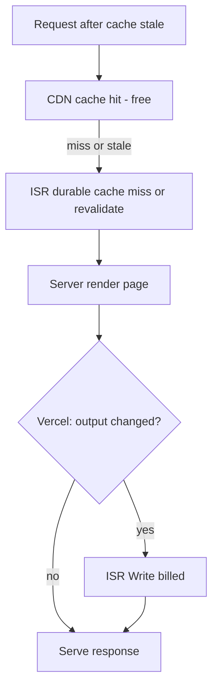

# ISR writes on Vercel — why, expected?, and how to cut them

## Restated problem (How Might We)

**How might we keep The Dropper’s SEO crawl surface and reasonably fresh prices while staying under Vercel’s free ISR write quota—without pausing the project?**

You chose **balance** (material ISR reduction, minimal SEO harm). Your 12h dashboard shows **steady writes, no spike**, with **`/index` as the top writer** (almost certainly the home page `/`, not a mystery route).

---

## Why you’re seeing this (root cause)

Your web app intentionally uses **ISR with short TTL** everywhere public:

| Route / artifact                                                         | `revalidate` | Source                                                                       |
| ------------------------------------------------------------------------ | ------------ | ---------------------------------------------------------------------------- |
| `/` (home)                                                               | 60s          | [`apps/web/src/app/(public)/page.tsx`](<apps/web/src/app/(public)/page.tsx>) |
| `/deals`, `/categories`, `/deals/c/...`, `/deals/hub/...`, `/deals/[id]` | 60s          | respective `page.tsx` files                                                  |
| `sitemap.xml`                                                            | 3600s        | [`apps/web/src/app/sitemap.ts`](apps/web/src/app/sitemap.ts)                 |
| API fetches (deals, tree, stores, brands)                                | 60s          | [`apps/web/src/api.ts`](apps/web/src/api.ts)                                 |

**Vercel only bills ISR writes when new content is persisted** ([ISR limits & pricing](https://vercel.com/docs/incremental-static-regeneration/limits-and-pricing)): if revalidation runs but the HTML/RSC payload is byte-identical, **no write**. That matters because your listings **do change often** (scheduler scrape every **4h**, enrich nightly), so revalidations usually **do** produce writes.

### Expected drivers (in priority order for _your_ codebase)

1. **Home `/` (`/index` in metrics)**
   - Fetches top 12 deals by `sort: value` every render path.
   - Prices/discounts/stock change after each scrape → stale revalidation almost always **changes output** → write.
   - High crawl + human traffic on `/` makes this a natural top writer in a 12h window.

2. **Large on-demand PDP surface**
   - [`/deals/[id]`](<apps/web/src/app/(public)/deals/[id]/page.tsx>): `revalidate = 60`, **no `generateStaticParams`** → each deal URL is created on first request and revalidated on traffic.
   - Sitemap can list **up to 48,000** deal URLs ([`MAX_DEAL_URLS_IN_SITEMAP`](apps/web/src/app/sitemap.ts)).
   - Crawlers discovering PDPs → first visit + periodic revalidations = many writes over a **month** (may be less visible in a 12h slice than `/`).

3. **Cache fragmentation from `?from=` on PDPs**
   - Internal links use `/deals/{id}?from={encoded list path}` ([`buildDealDetailHref`](apps/web/src/lib/dealsBackHref.ts)) for UX.
   - The server component reads `searchParams` and changes the visible back label.
   - That can create **separate ISR entries per list context** for the same deal ID → multiplies writes when bots/users follow those links.
   - Canonical metadata stays `/deals/{id}` (good for SEO); the extra query string is a **cache/cost** problem, not an indexing problem.

4. **Sitemap always “changes”**
   - Every entry uses `lastModified: new Date()` ([`sitemap.ts`](apps/web/src/app/sitemap.ts)). Vercel explicitly warns that non-deterministic output prevents write deduplication. Hourly regen likely **always writes**.

5. **Filter pages (`searchParams` on `/deals`, `/deals/c/...`, hubs)**
   - Less likely in sitemap, but bots can still hit query variants. Each unique query may be its own cache key when ISR applies.

### Is 75% of 200k expected?

**Yes, given the product direction** in [`docs/ideas/thedropper-distribution-seo.md`](docs/ideas/thedropper-distribution-seo.md): indexable hubs, large sitemap, SSR/ISR for SEO, fresh deal data. As inventory and crawl volume grow, ISR writes scale with:

`(unique URLs visited while stale) × (fraction of visits where HTML changed)`

**Mismatch to be aware of:** `revalidate = 60` implies “refresh every minute,” but **data only changes on scrape cadence (~4h)**. You are paying ISR write costs for freshness you do not actually get from the API pipeline.

---

## Phase 2 — Three directions (converged for “balance”)

### Direction A — **Align TTL with scrape cadence** (recommended first)

- Raise `revalidate` on public pages from **60 → 14400** (4h) or **21600** (6h) to match scheduler.
- **User value:** Still fresh within one scrape cycle; humans rarely notice between scrapes.
- **SEO:** Google does not require 60s freshness for deal aggregators; sitemap `changeFrequency` already says daily/weekly.
- **Feasibility:** Small diff (~8 files), low risk.
- **Differentiation:** Unchanged.

**Assumption to validate:** Staleness up to 4–6h is acceptable on listing/PDP pages.  
**Kill risk:** If you add “live” features (price alerts) that need sub-hour UI freshness.

### Direction B — **Collapse PDP cache keys** (`?from=` off the server path)

- Keep `?from=` in links for analytics/UX, but move back-navigation label/href resolution to a **client** boundary so ISR key is **`/deals/[id]` only**.
- **User value:** Same UX.
- **SEO:** Unchanged (canonical already without `from`).
- **Feasibility:** Medium — touch [`DealDetailContent`](<apps/web/src/app/(public)/deals/[id]/DealDetailContent.tsx>) + [`page.tsx`](<apps/web/src/app/(public)/deals/[id]/page.tsx>).
- **Writes:** Cuts multiplier from internal links and crawlers following `?from=` URLs.

### Direction C — **Stabilize sitemap + optional on-demand revalidation**

- Replace `new Date()` with stable timestamps (e.g. omit `lastModified`, or use a fixed build/run time, or API `last_seen_at` when available).
- Optional later: after API scrape job completes, `revalidatePath('/')` + hot category paths only — **longer TTL + targeted freshness** instead of global 60s.

---

## Ramifications of reducing ISR writes

| Change                                    | Upside                                               | Downside / tradeoff                                                  |
| ----------------------------------------- | ---------------------------------------------------- | -------------------------------------------------------------------- |
| Longer `revalidate`                       | Largest write reduction; matches real data freshness | Pages can show prices up to TTL old (still bounded by scrape)        |
| Client-only `?from=`                      | Fewer duplicate PDP cache entries                    | Slightly more client JS; back label may flash default before hydrate |
| Stable sitemap `lastModified`             | Fewer hourly sitemap writes                          | Less precise “last modified” signal to crawlers (minor)              |
| Fewer sitemap PDP URLs                    | Direct write reduction                               | Less long-tail SEO coverage                                          |
| `dynamic = 'force-dynamic'` PDPs (no ISR) | Zero ISR writes for PDPs                             | More **Function** invocations/duration (different quota line)        |
| Vercel Pro                                | Headroom + on-demand billing                         | Monthly cost                                                         |

**Pause risk:** At 100% of included ISR writes, Vercel may **pause projects** on the free team. You have ~25% headroom; Direction A alone often cuts writes by **~90%+** if most traffic was revalidating every 60s with changed deal data.

---

## Recommended phased approach (MVP)

**Phase 1 (config, 1 PR)**

1. Set `export const revalidate = 14400` (4h) on: home, deals list, categories, category deals, hubs, deal PDP.
2. Align `fetch(..., { next: { revalidate }})` in [`api.ts`](apps/web/src/api.ts) to the same value (or centralize constant).
3. Fix [`sitemap.ts`](apps/web/src/app/sitemap.ts): remove `new Date()` per row or use deterministic values.

**Phase 2 (cache hygiene, 1 PR)**  
4. Stop reading `searchParams` in [`deals/[id]/page.tsx`](<apps/web/src/app/(public)/deals/[id]/page.tsx>) server component; handle `from` in client child only.

**Phase 3 (measure)**  
5. Watch Vercel Usage → ISR Writes by route for 7 days; confirm `/index` and `/deals/[id]` drop.  
6. GSC: index coverage / crawl stats unchanged after 2–4 weeks.

**Not doing (for now)**

- Removing deal PDPs from sitemap — SEO tradeoff too large for first pass.
- Full SSR (no ISR) sitewide — shifts cost, doesn’t simplify.
- Per-filter ISR at 60s — already discouraged by your SEO idea doc.

---

## Idea-refine one-pager (draft — save to `docs/ideas/` only if you want)

### Problem Statement

How might we reduce Vercel ISR writes for The Dropper while preserving curated SEO URLs and deal accuracy aligned to scrape cadence?

### Recommended Direction

**Align revalidation with 4h scrape + dedupe PDP cache keys + deterministic sitemap.** This matches how fresh the data actually is and attacks the `/index` + PDP multipliers without shrinking the indexable catalog.

### Key Assumptions to Validate

- [ ] 4–6h visible staleness is acceptable for shoppers — compare to scrape schedule.
- [ ] `?from=` is the main PDP cache multiplier — sample Vercel route breakdown after Phase 2.
- [ ] GSC crawl/index rates stay stable after TTL change — check after 2–4 weeks.

### MVP Scope

- TTL change + sitemap determinism + optional PDP `searchParams` client move.
- 7-day ISR dashboard review.

### Not Doing

- Slashing sitemap PDP cap — keep long-tail until data proves waste.
- Pro upgrade — unless still >80% after Phase 1–2.
- On-demand revalidation webhooks — until scrape-triggered freshness is worth engineering.

---

## Open questions for you

1. After Phase 1, if still >80% usage, are you open to **Pro** or **lowering sitemap PDP cap**?
2. Do you want home featured deals to stay **server-rendered** for SEO, or is **client fetch** for the 12-card grid acceptable (would further cut `/index` writes)?
