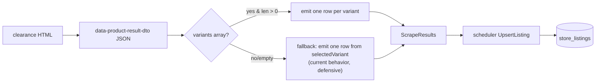

# jenson variants extraction

## Discovery — variants confirmed in the clearance DTO

Verified by fetching `/clearance?ps=24` (curl, 24 cards) and inspecting every DTO. Top-level keys include `variants` (array) in addition to `selectedVariant` (singular). Sample multi-variant product: **Race Face Turbine R 35 Stem** has `dto.code = "ST192A02"` with **16 variants**:

```text
ST192A02BLK  50   color: Black   listPrice: $69.99   msrpPrice: $115.99   savings: 40%
ST192A02 RED 50   color: Red     listPrice: $49.99   msrpPrice: $115.99   savings: 57%
ST192A02 GREEN 32 color: Green   listPrice: $49.99   msrpPrice: $115.99   savings: 57%
… 13 more
```

**Per-variant fields seen in SSR (curl) DTOs across 68 total variants:** `code`, `color` (string), `listPrice.amount`, `msrpPrice.amount`, `imageUrl`, `swatchImageUrl`, `savingPercent`, `order`, `mfgPartNumber`, `gtin`. **All variants share `dto.url` and `dto.name`.** Counts across 24 sampled products: 1×16, 1×9, 1×7, 2×5, 1×4, 4×2, 14×1.

**Hydrated DTO has more fields.** The existing scraper waits 9s after `page.goto` because Jenson's clearance page hydrates the DTOs client-side. Confirmed: `facetFieldsDictionary` is empty in the SSR response and gets populated post-hydration — this is also where additional per-variant dimensions land. The user reports per-variant fields like `"size":{"value":"8.5","sortOrder":2978}` in the live page — a different shape from `color`'s flat string. So:

- **Two value shapes coexist on a variant**: flat string (e.g. `color: "Black"`) AND structured `{value, sortOrder}` (e.g. `size: {value: "8.5", sortOrder: 2978}`).
- **Fields beyond color/size are likely** for product types whose dimensions aren't color or size (wheel diameter, BCD, length, drop, …). Curl-only sampling won't expose them.
- The parser needs to handle these **generically**: extract every variant key that isn't part of the known fixed set (price, ids, images, ordering) as a dimension. This way new axes show up in `variant_options` automatically without parser changes.

**Why this matters:** today the scraper uses `dto.code` (parent) as `store_sku` and `selectedVariant.listPrice` for price — meaning Red ($49.99) and Green ($49.99) variants disappear behind the Black ($69.99) "selected" price. We're losing cheaper deals.

## Approach: emit one ScrapeResult per variant (mirrors Shopify)

This is exactly the pattern in [apps/scraper/src/parsers/worldwidecyclery.ts](apps/scraper/src/parsers/worldwidecyclery.ts) lines 72–113 — iterate variants, emit one row per variant, share `product_group_key`. No PDP/enrich changes needed.



## Step 1 — Capture a hydrated DTO

The SSR DTO has fewer fields than the live (post-hydration) DTO — the parser must be built against real hydrated data. Before writing the parser:

- Run the scraper service locally (`pnpm --filter @mtb-aggregator/scraper run dev`) and trigger one Jenson scrape, OR run a one-off node script using the scraper's `runWithBrowser` helper to load `/clearance?ps=24` and dump all `data-product-result-dto` attributes after the existing 9s hydration wait.
- Save 1–2 representative DTOs (one with `size`, one with `color`+`size`, one with only `color`) trimmed of the verbose nested `currency.format` blob into [apps/scraper/src/parsers/__fixtures__/jensonusa-clearance-dto.json](apps/scraper/src/parsers/__fixtures__/jensonusa-clearance-dto.json).
- Confirm where `size`, `color`, and any other dimension fields actually live on the variant (top-level vs nested under `facetFieldsDictionary`). The plan below assumes top-level — if they're nested, adjust the dimension-discovery walker accordingly.

## Step 2 — Extend DTO types: dimensions are generic

File: [apps/scraper/src/parsers/jensonusa-dto.ts](apps/scraper/src/parsers/jensonusa-dto.ts)

Treat any variant key that isn't part of the known "metadata" set as a dimension. Two acceptable shapes per the captured data:

```ts
// Examples:
//   color: "Black"                           ← flat string
//   size:  { value: "8.5", sortOrder: 2978 } ← structured
export type JensonVariantDimension =
  | string
  | { value?: string | number | null; sortOrder?: number | null };

export interface JensonVariant {
  // Known fixed fields — everything else is treated as a dimension.
  code?: string;
  listPrice?: { amount?: number };
  msrpPrice?: { amount?: number };
  imageUrl?: string;
  swatchImageUrl?: string;
  mfgPartNumber?: string;
  gtin?: string;
  savingPercent?: number;
  order?: number;
  // Open shape: any other key (color, size, length, …) is a dimension.
  [key: string]: unknown;
}

export interface JensonProductDto {
  // ...existing fields
  variants?: JensonVariant[];
}
```

A small helper extracts dimensions:

```ts
const FIXED_VARIANT_FIELDS = new Set([
  "code", "listPrice", "msrpPrice", "imageUrl", "swatchImageUrl",
  "mfgPartNumber", "gtin", "savingPercent", "order",
]);

function extractDimensionString(v: unknown): string | null {
  if (v == null) return null;
  if (typeof v === "string") {
    const t = v.trim();
    return t === "" ? null : t;
  }
  if (typeof v === "number") return String(v);
  if (typeof v === "object" && "value" in (v as object)) {
    const inner = (v as { value?: unknown }).value;
    return extractDimensionString(inner);
  }
  return null;
}

function extractVariantDimensions(variant: Record<string, unknown>): Record<string, string> {
  const out: Record<string, string> = {};
  for (const [k, val] of Object.entries(variant)) {
    if (FIXED_VARIANT_FIELDS.has(k)) continue;
    const s = extractDimensionString(val);
    if (s == null) continue;
    out[titleCase(k)] = s;     // "color" -> "Color", "size" -> "Size"
  }
  return out;
}
```

`titleCase` capitalizes the first letter so the API-emitted key matches the casing the rest of the system uses (`{Color, Size, Length, ...}`). Camel-case keys (e.g. `wheelSize`) get split: "Wheel Size".

## Step 3 — Multi-variant parser

```ts
/**
 * Parse a Jenson DTO into one ParsedProduct per variant. Falls back to a single
 * ParsedProduct (using parseProductDto) when variants[] is missing/empty.
 *
 * - sku             = variant.code (parent dto.code as fallback)
 * - currentPrice    = variant.listPrice.amount
 * - originalPrice   = variant.msrpPrice.amount
 * - imageUrl        = variant.imageUrl ?? dto.imageUrl
 * - product_group_key = dto.code (parent code; the scheduler prepends "{store_id}:")
 * - variantOptions  = result of extractVariantDimensions(variant), or null when empty
 */
export function parseProductDtoVariants(
  dto: JensonProductDto,
  containerText?: string,
  imageUrlFromDom?: string | null
): Array<ParsedProduct & { productGroupKey: string | null; variantOptions: Record<string, string> | null }>;
```

Reuse `extractCurrentPrice`/`extractOriginalPrice` for per-variant prices to keep the field-rename safety net (the existing test that ensures we use `msrpPrice`, not `originalPrice`).

**Variant code whitespace.** Captured codes contain whitespace (`ST192A02BLK  50`). Keep them as-is for `store_sku` — that's how Jenson identifies them — but pass them through `String.trim()` only on the *outer* boundary so trailing spaces don't break dedup. Internal double-spaces stay (they're meaningful).

## Step 4 — Update the scraper to emit per-variant rows

File: [apps/scraper/src/parsers/jensonusa.ts](apps/scraper/src/parsers/jensonusa.ts) lines 154–169

Replace the current single-row emission:

```ts
// before
const parsed = parseProductDto(dto, containerText, imageUrlFromDom);
if (parsed) {
  results.push({ store_sku: parsed.sku, ... });
}
```

with:

```ts
// after
const parsedRows = parseProductDtoVariants(dto, containerText, imageUrlFromDom);
for (const p of parsedRows) {
  results.push({
    store_sku: p.sku,
    product_name: p.name,
    current_price: p.currentPrice!,
    original_price: p.originalPrice,
    product_url: p.url,
    image_url: p.imageUrl,
    brand: p.brand,
    category_path: p.category_path,
    is_in_stock: true,
    product_group_key: p.productGroupKey,                          // dto.code
    ...(p.variantOptions ? { variant_options: p.variantOptions } : {}),
  });
}
```

`deduplicateBySku` (line 212) keeps working unchanged — variant codes are unique. The Schema in [apps/scraper/src/types.ts](apps/scraper/src/types.ts) already accepts both fields. The Go scheduler at [apps/api/internal/scheduler/scheduler.go](apps/api/internal/scheduler/scheduler.go) lines 298–317 already passes `r.ProductGroupKey` and `r.VariantOptions` straight to `UpsertListing`, which (lines 217–218) writes them with `COALESCE`.

**Note on `product_group_key` format**: today's Shopify stores use `{store_id}:{handle}`. To stay consistent we'd want the same shape for Jenson — `{store_id}:{dto.code}`. The cleanest place to add the prefix is the scheduler (so the scraper service stays store-agnostic and just emits the raw key), matching how `internal/db/variant_backfill.go` line 186 does it for Shopify (`fmt.Sprintf("%d:%s", r.storeID, data.Product.Handle)`). I'd add the prefix in `RunScrapeJob` before calling `UpsertListing`. Verify this is consistent with how Shopify scrapers emit the value today — they currently emit just the handle and the scheduler stores it raw, so the existing Shopify behavior may need the same prefix change for consistency. **Open question for review.**

## Step 5 — Tests

File: new `apps/scraper/src/parsers/jensonusa-dto-variants.test.ts` (or extend [apps/scraper/src/parsers/jensonusa-dto.test.ts](apps/scraper/src/parsers/jensonusa-dto.test.ts)).

Coverage:
- multi-variant flat color: Race Face stem fixture (3 trimmed variants) → emits 3 rows with distinct SKUs/prices, `variantOptions = {Color: "Black" | "Red" | "Green"}`, shared `productGroupKey`.
- structured size: variant with `size: {value: "8.5", sortOrder: 2978}` → `variantOptions = {Size: "8.5"}`.
- color + size: variant with both → `variantOptions = {Color: "Black", Size: "L"}`.
- unknown axis: variant with `length: "100mm"` → `variantOptions = {Length: "100mm"}` (proves generic extraction works without a parser change).
- single-variant in array: emits 1 row, productGroupKey set to dto.code.
- missing/empty variants[] (defensive): falls back to existing parseProductDto behavior — 1 row, no productGroupKey, no variantOptions.
- per-variant price difference: confirm Red variant gets `current_price = $49.99` not `$69.99`.
- whitespace in code: `"ST192A02BLK  50"` becomes the `store_sku` unchanged (no double-space collapse).

## Step 6 — One-time cleanup of existing parent-code rows

After the new code ships, the next scrape will start emitting variant codes (`ST192A02BLK  50`) instead of parent codes (`ST192A02`). Existing rows with parent codes won't be re-upserted, so they'll linger with stale `last_scraped` *alongside* the new variant rows — duplicating products in the deals UI.

There's no automatic stale-listing pruning today (only `MarkStaleJobs` for jobs, [apps/api/internal/db/db.go](apps/api/internal/db/db.go) lines 1187–1206). Options:

- **A. SQL migration** — `packages/shared/migrations/022_hide_jenson_pre_variant.sql`:
  ```sql
  -- Run once after Jenson per-variant scraping ships.
  -- Hides pre-variant Jenson rows so they don't duplicate new per-variant rows.
  UPDATE store_listings sl
  SET hidden = true
  FROM stores s
  WHERE sl.store_id = s.id
    AND s.store_type = 'jensonusa'
    AND sl.last_scraped < NOW() - INTERVAL '1 hour';
  ```
  Run via `make db-migrate-docker` / `db-migrate-remote` *after* a fresh Jenson scrape with the new code (so any still-valid products were re-upserted with their new variant SKUs and have a fresh `last_scraped`).

- **B. Admin endpoint** — add a button in the existing admin Operations page that triggers a one-shot. Easier to time correctly but more code.

- **C. Skip migration; manual cleanup** — admin uses `SetListingHidden` per row. Tedious.

Recommended: **A**, with a short Makefile alias like `make hide-stale-jenson` that runs the migration. Document the timing (run it 1 hour after the first new-code scrape).

## Step 7 — Docs

Per the documentation-sync rule:

- [apps/scraper/README.md](apps/scraper/README.md) — note that JensonUSA now emits per-variant rows from the clearance DTO, and that variants share `product_group_key = dto.code`.
- [docs/SCRAPING.md](docs/SCRAPING.md) — add Jenson to the list of stores that gather variant data, alongside the Shopify stores.
- [CLAUDE.md](CLAUDE.md) — Architecture/Scraper section: drop "Jenson does not gather variants" (if mentioned implicitly anywhere); document the cleanup migration if added.

## Out of scope

- Backcountry variants (separate work — needs its own DTO investigation).
- Per-variant stock — the listing DTO has no `available` field, so we keep `is_in_stock = true` as we do today.
- Adjusting the Shopify backfill pattern; it's unaffected.
- Surfacing `swatchImageUrl` in the UI — the data lands in the DB row only via `image_url`; per-variant swatches are a separate UI task.
