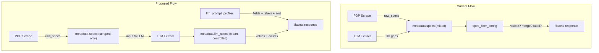

# LLM-Driven Category Filters

## Problem

Two disconnected systems control specs today:

- `**llm_prompt_profiles**` -- per-category extraction schemas defining which specs to derive via LLM
- `**spec_filter_config**` -- a global table manually controlling which spec keys appear as filters (no category awareness)

These are managed through separate admin UIs, PDP-scraped and LLM-derived specs are mixed together in `metadata.specs`, and adding a new filter requires updating both systems.

## Design



**Single source of truth:** The `extraction_schema.fields` array in each `llm_prompt_profile` defines both what the LLM extracts AND what filters the UI shows for that category.

## Key Changes

### 1. Extend `SchemaField` with display metadata

Add `label`, `sort_order`, and `filterable` to the extraction schema fields in [apps/api/internal/llm/client.go](apps/api/internal/llm/client.go):

```go
type SchemaField struct {
    Key         string   `json:"key"`
    Type        string   `json:"type"`
    Description string   `json:"description"`
    Values      []string `json:"values,omitempty"`
    Label       string   `json:"label,omitempty"`
    SortOrder   int      `json:"sort_order,omitempty"`
    Filterable  *bool    `json:"filterable,omitempty"` // default true; false for confidence
}
```

Update the existing seed profile in a new migration to include display metadata:

```json
{
  "key": "wheel_size",
  "type": "enum",
  "values": ["29", "27.5", "26", "mullet"],
  "description": "Wheel size",
  "label": "Wheel Size",
  "sort_order": 3
}
```

The `confidence` field gets `"filterable": false`.

### 2. Separate LLM specs from scraped specs

Change `MergeLLMSpecs` in [apps/api/internal/metadata/normalize.go](apps/api/internal/metadata/normalize.go) to write to `metadata.llm_specs` instead of `metadata.specs`:

- **Before:** LLM output fills gaps in `metadata.specs`
- **After:** LLM output goes to `metadata.llm_specs` (clean, isolated)
- `confidence` continues going to `metadata.llm_confidence`
- `llm_overrides` overrides values in `llm_specs` at display/query time

Resulting metadata shape:

```json
{
  "specs": { "hub_spacing": "148mm", "stanchion": "36mm" },
  "llm_specs": {
    "wheel_size": "29",
    "front_travel_mm": "160",
    "mtb_class": "Trail"
  },
  "llm_confidence": 0.95,
  "llm_overrides": { "wheel_size": "27.5" },
  "description": "..."
}
```

### 3. Update `/facets` to use LLM specs + profile

Rework `GetFacets` in [apps/api/internal/db/specs.go](apps/api/internal/db/specs.go):

- When `canonical_category` is provided, look up the matching `llm_prompt_profile`
- Query `metadata->'llm_specs'` (not `metadata->'specs'`) for facet values
- Use the profile's `fields` for labels and sort order (only include fields where `filterable != false`)
- Skip the `specfilter.LoadConfig` / `ApplyToFacets` path entirely for LLM-driven facets
- When no profile matches or no category is selected, return no spec facets (current behavior: filters only show with a category)

### 4. Update deals query spec filters

In [apps/api/internal/db/db.go](apps/api/internal/db/db.go) and `buildFacetsWhereClause` in [specs.go](apps/api/internal/db/specs.go):

- Spec filter params (`spec_wheel_size=29`) query `metadata->'llm_specs'` instead of `metadata->'specs'`
- `ExpandFilterValues` from `specfilter` is no longer needed (LLM values are already normalized via enum constraints)

### 5. Update PromptProfileManager admin UI

In [apps/web/src/admin/PromptProfileManager.tsx](apps/web/src/admin/PromptProfileManager.tsx):

- Add `label` and `sort_order` inputs to the field editor in the extraction schema form
- Add a `filterable` toggle (default on)
- This becomes the single place to manage both extraction and filter config per category

### 6. Backfill migration

New migration to move existing LLM-derived keys from `specs` to `llm_specs` for previously enriched listings:

- For each listing with `llm_confidence IS NOT NULL`, look up its profile's fields
- Copy matching keys from `metadata.specs` to `metadata.llm_specs`
- Optionally remove those keys from `metadata.specs` to keep it clean
- This is a one-time data migration (SQL or Go script via `cmd/`)

### 7. Deprecate `spec_filter_config` system

After migration:

- The `specfilter` package, `spec_filter_config` table, `spec_value_aliases` table, and `SpecFilterManager` admin UI become unused for LLM-driven categories
- Keep them temporarily for backward compatibility but remove the dependency from the facets/deals query path
- Can be fully removed in a follow-up cleanup

## What Stays the Same

- Frontend `FilterSidebar` -- already only shows spec facets when canonical category is selected; facets response shape (`SpecFacet` with key/label/values) is unchanged
- Frontend URL state (`spec_<key>=<value>`) -- unchanged
- LLM extraction flow -- still calls OpenAI with the profile schema; only storage location changes
- PDP enrichment -- still writes to `metadata.specs`; still serves as input to LLM

## Risks / Considerations

- **Listings without LLM enrichment** won't have `llm_specs` and thus won't contribute to facet counts. Acceptable since spec filters only appear for categories that have a profile, and those listings should be enriched.
- **Re-enrichment** after changing a profile's fields: existing listings keep old `llm_specs` until re-enriched. The admin "Run LLM Extraction" feature handles this.
- **Value aliases** become largely unnecessary since LLM enum constraints produce normalized values. If edge cases arise, we can add a lightweight alias mechanism later.
