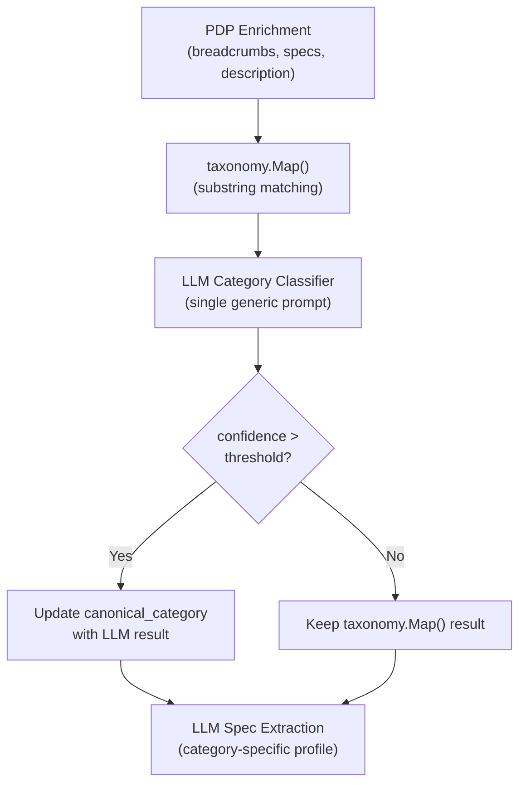

# LLM-Powered Category Classification

## Problem

The current `taxonomy.Map()` in [apps/api/internal/taxonomy/taxonomy.go](apps/api/internal/taxonomy/taxonomy.go) does case-insensitive substring matching on joined breadcrumbs. This fails for ambiguous cases like:

- **"Bikes & Frames > Forbidden Bikes"** -- contains both "bike" and "frame" keywords; can't determine sub-category "Mountain" at all since no mountain-specific keyword exists in the breadcrumbs
- Brand-specific collection paths (e.g. "Forbidden Bikes") carry no product-type signal
- Some stores have shallow or generic breadcrumbs that don't map cleanly

Meanwhile, the **product name** ("Forbidden Druid V2 SRAM GX T-Type Bike") and **description** text contain strong classification signals that an LLM can interpret.

## Design: Two-Phase LLM Pipeline

The key insight is a **chicken-and-egg problem**: LLM spec extraction profiles are selected by `canonical_category`, so we need classification to happen _before_ spec extraction. The solution is a dedicated classification step using a single, category-agnostic prompt.



**taxonomy.Map() is kept as a fast fallback** -- it still runs first. The LLM classifier is an optional enhancement that corrects or refines the result when enabled and an API key is set.

## Implementation

### Step 1: Migration -- `llm_category_classifier` table

New migration `packages/shared/migrations/015_llm_category_classifier.sql`:

```sql
CREATE TABLE IF NOT EXISTS llm_category_classifier (
  id SERIAL PRIMARY KEY,
  system_prompt TEXT NOT NULL,
  valid_categories JSONB NOT NULL DEFAULT '[]',
  confidence_threshold NUMERIC(3,2) NOT NULL DEFAULT 0.80,
  enabled BOOLEAN NOT NULL DEFAULT true,
  created_at TIMESTAMPTZ NOT NULL DEFAULT NOW(),
  updated_at TIMESTAMPTZ NOT NULL DEFAULT NOW()
);
```

This is a **singleton config** (one row). `valid_categories` is a JSON array of canonical category paths the LLM can choose from, e.g.:

```json
[
  ["Bikes", "Mountain"],
  ["Bikes", "Electric"],
  ["Bikes", "Gravel"],
  ["Bikes", "Road"],
  ["Bikes", "Kids"],
  ["Bikes"],
  ["Components", "Drivetrain"],
  ["Components", "Brakes"],
  ["Components", "Suspension"],
  ["Components", "Wheels"],
  ["Components", "Cockpit"],
  ["Components"],
  ["Gear", "Helmets"],
  ["Gear", "Protection"],
  ["Gear", "Clothing"],
  ["Gear", "Shoes"],
  ["Accessories", "Tools"],
  ["Accessories", "Bags"],
  ["Accessories", "Lights"],
  ["Accessories"],
  ["Gear"]
]
```

Seed with a default prompt and populate `valid_categories` from the distinct canonical values already in `category_mappings`.

### Step 2: LLM `Classify` method

Add to [apps/api/internal/llm/client.go](apps/api/internal/llm/client.go):

- New `ClassifyInput` struct (same fields as `ExtractInput`: product name, description, specs, raw breadcrumbs)
- New `ClassifyConfig` struct (system prompt, valid categories, confidence threshold)
- New `Classify(ctx, config, input) (*ClassifyResult, error)` method
  - Builds an OpenAI JSON schema with fields: `canonical_category` (enum of stringified paths), `confidence` (number), `reasoning` (string)
  - Returns `ClassifyResult { CanonicalCategory []string, Confidence float64, Reasoning string }`

The JSON schema forces the LLM to pick from the valid categories only, using OpenAI's strict JSON mode (same approach as spec extraction). The `reasoning` field aids admin review and debugging.

**Example system prompt:**

```
You are a product categorization expert for a mountain bike retailer aggregator.
Given a product listing with its name, description, breadcrumb path, and specs,
determine the most specific canonical category from the provided list.

Consider:
- Product name is the strongest signal (e.g. "Bike" vs "Frame" vs "Fork")
- Description text for product type clues
- Specs like travel, wheel size for sub-categorization
- Breadcrumbs as supporting context (but they can be misleading)

Choose the most specific matching category. For example, prefer
["Bikes", "Mountain"] over ["Bikes"] when the product is clearly a mountain bike.
```

### Step 3: DB CRUD for classifier config

Add to [apps/api/internal/db/db.go](apps/api/internal/db/db.go):

- `GetCategoryClassifier(ctx) (*CategoryClassifierConfig, error)` -- returns the singleton row (or nil if table empty)
- `UpsertCategoryClassifier(ctx, config)` -- insert or update the single config row
- `UpdateListingCanonicalCategory(ctx, id int, canonical []string) error` -- update just the canonical_category field for a listing

### Step 4: Wire into enrichment pipeline

In [apps/api/internal/scheduler/scheduler.go](apps/api/internal/scheduler/scheduler.go), the per-listing enrichment loop currently does:

```
1. scraper.Enrich()
2. UpdateListingEnrichment()   <-- taxonomy.Map() runs here
3. runLLMExtractionIfApplicable()
```

Insert a new step between 2 and 3:

```
1. scraper.Enrich()
2. UpdateListingEnrichment()        <-- taxonomy.Map() still runs
3. runLLMCategoryClassification()   <-- NEW: LLM refines category
4. runLLMExtractionIfApplicable()   <-- now uses corrected category
```

`runLLMCategoryClassification(ctx, listingID)`:

1. Return if `s.llm == nil`
2. Load classifier config via `GetCategoryClassifier()`; return if nil or disabled
3. Load listing data (product name, metadata with description/specs, raw category_path)
4. Call `s.llm.Classify()` with the config and listing data
5. If `confidence >= config.ConfidenceThreshold`, call `UpdateListingCanonicalCategory()`
6. Store classification metadata in `metadata.llm_category` for admin review: `{ "canonical_category": [...], "confidence": 0.95, "reasoning": "..." }`

Same logic duplicated in [apps/api/internal/api/handlers.go](apps/api/internal/api/handlers.go) for single-listing enrichment.

### Step 5: Admin API endpoints

New routes on [apps/api/main.go](apps/api/main.go):

- `GET /admin/category-classifier` -- return current config
- `PUT /admin/category-classifier` -- update config (prompt, valid categories, threshold, enabled)
- `POST /admin/category-classifier/test` -- test classification on a single listing (body: `{ "listing_id": 123 }`)
- `POST /admin/category-classifier/run` -- batch re-classify listings (optional filters: store, current canonical_category, unclassified only)

### Step 6: Admin UI -- Category Classifier Manager

New section in the admin panel (similar to Prompt Profile Manager):

- **Config editor:** system prompt textarea, confidence threshold slider (0.5-1.0), enable/disable toggle
- **Valid categories:** list with add/remove; "Auto-populate" button that pulls distinct canonical categories from `category_mappings`
- **Test panel:** pick a listing, run classification, see result with reasoning
- **Batch run:** re-classify all listings or filter by store/category; shows progress
- **DataBrowser integration:** new columns for `llm_category` (LLM-assigned), `llm_category_confidence`, and `llm_category_reasoning`; highlight rows where LLM category differs from taxonomy.Map() result

## Key Design Decisions

- **Singleton config, not per-category profiles:** Category classification is inherently a single task (pick from N categories) unlike spec extraction which varies by category. One prompt handles all products.
- **taxonomy.Map() kept as fallback:** System works without LLM. When LLM is enabled, it refines the result. When LLM is unavailable (no API key, rate limit, etc.), substring matching still provides a baseline.
- **Confidence threshold:** Admin-tunable. Only override taxonomy.Map() when the LLM is confident enough. Low-confidence results are logged for admin review but don't change the category.
- **valid_categories stored explicitly:** Rather than auto-deriving at runtime, the admin controls which categories the LLM can assign. This prevents hallucinated categories and lets the admin add new categories before any mappings exist for them.
- **Classification metadata stored separately:** `metadata.llm_category` doesn't interfere with existing `canonical_category` flow or `metadata.specs`. Clear audit trail of what the LLM decided and why.

## Cost Impact

Minimal. Classification uses a short prompt (~~200 input tokens) and short response (~~30 tokens). At GPT-4o-mini rates, roughly $0.00005 per product. For 600 listings, ~$0.03 for a full re-classification run.

## Files to Modify

**New files:**

- `packages/shared/migrations/015_llm_category_classifier.sql`
- `apps/web/src/admin/CategoryClassifierManager.tsx`

**Modified files:**

- [apps/api/internal/llm/client.go](apps/api/internal/llm/client.go) -- `Classify` method, `ClassifyConfig`, `ClassifyResult`
- [apps/api/internal/db/db.go](apps/api/internal/db/db.go) -- classifier CRUD, `UpdateListingCanonicalCategory`
- [apps/api/internal/scheduler/scheduler.go](apps/api/internal/scheduler/scheduler.go) -- `runLLMCategoryClassification` step
- [apps/api/internal/api/handlers.go](apps/api/internal/api/handlers.go) -- classification in single-listing enrichment
- [apps/api/internal/api/handlers_llm.go](apps/api/internal/api/handlers_llm.go) -- admin classifier endpoints
- [apps/api/main.go](apps/api/main.go) -- route registration, load classifier config at startup
- [apps/web/src/admin/DataBrowser.tsx](apps/web/src/admin/DataBrowser.tsx) -- LLM category columns
- [apps/web/src/admin/AdminSection.tsx](apps/web/src/admin/AdminSection.tsx) -- nav link to classifier manager
