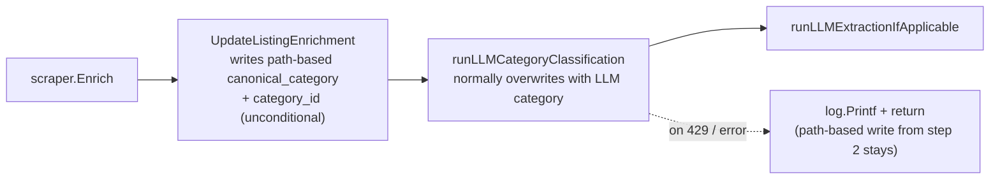

## Background

In `Scheduler.RunEnrichmentJob` ([apps/api/internal/scheduler/scheduler.go](apps/api/internal/scheduler/scheduler.go) 371-393), each listing goes through:



So on every run, path-based overwrites first and LLM corrects after. A 429 causes the corrective step to be skipped, leaving the path-based value. That's the regression you observed. The `[admin] listing 372: LLM extract failed:` log itself is from `runLLMExtractionIfApplicable` which only touches metadata-level specs, not categories — the category damage is coming from the twin classify 429 in the same job.

Additional gaps in [apps/api/internal/llm/client.go](apps/api/internal/llm/client.go) and the scheduler callers:

- No retries / backoff for transient 429s.
- `insufficient_quota` is treated identically to rate limits.
- LLM failures go to `log.Printf` only — workspace rule requires Sentry for significant failures when DSN is set.
- Admin `POST /admin/listings/:id/enrich` returns 200 even when LLM fails, hiding the issue.

## Changes

### 1. Preserve confident LLM category in `UpdateListingEnrichment`

File: [apps/api/internal/db/db.go](apps/api/internal/db/db.go) (lines 1330-1388).

Currently when `len(categoryPath) > 0`, it runs one UPDATE that sets `category_path`, `canonical_category`, `category_id`, and `metadata`. Change it to:

- Parse existing `metadata.llm_category.confidence` from the `existingMeta` bytes already being read at line 1338.
- Look up the active classifier threshold via `db.GetCategoryClassifier(ctx)` (returns `*CategoryClassifier` from [apps/api/internal/db/category_classifier.go](apps/api/internal/db/category_classifier.go)); fall back to a constant `DefaultLLMCategoryPreserveThreshold = 0.5` if classifier row absent/disabled.
- If `llm_category.confidence >= threshold` **and** `llm_category.canonical_category` is non-empty, issue a reduced UPDATE that writes only `category_path`, `metadata`, `last_enriched_at` — leaving `canonical_category` and `category_id` untouched.
- Otherwise, existing behavior.

This keeps `category_path` (raw store breadcrumb) always fresh for transparency while making `canonical_category` / `category_id` changes the exclusive responsibility of the LLM classifier once a confident verdict exists.

Pseudocode sketch:

```go
var existing struct {
    LLMCategory struct {
        CanonicalCategory []string `json:"canonical_category"`
        Confidence        float64  `json:"confidence"`
    } `json:"llm_category"`
}
_ = json.Unmarshal(existingMeta, &existing)

threshold := DefaultLLMCategoryPreserveThreshold
if cfg, _ := db.GetCategoryClassifier(ctx); cfg != nil && cfg.ConfidenceThreshold > 0 {
    threshold = cfg.ConfidenceThreshold
}
preserveLLM := len(existing.LLMCategory.CanonicalCategory) > 0 &&
               existing.LLMCategory.Confidence >= threshold
```

Two UPDATE branches replace the current single branch inside `if len(categoryPath) > 0`.

Add a small unit test for the two preservation branches in a new or existing `db_test.go` if one exists; otherwise cover via scheduler integration later.

### 2. Typed errors + retry in LLM client

File: [apps/api/internal/llm/client.go](apps/api/internal/llm/client.go).

Add:

- Exported sentinel errors: `var ErrQuotaExhausted = errors.New("openai quota exhausted")` and `var ErrRateLimited = errors.New("openai rate limited")`.
- A small helper `parseOpenAIError(statusCode int, body []byte) error` that tries to JSON-decode `{"error":{"code": "...", "type": "..."}}`. If `code == "insufficient_quota"` or `type == "insufficient_quota"`, return `ErrQuotaExhausted` (wrapped via `fmt.Errorf("%w: %s", ErrQuotaExhausted, body)`). Else if `statusCode == 429`, return wrapped `ErrRateLimited`. Else fall through to current `openai api <code>: <body>` string.
- A retry loop in both `Extract` (lines 140-156) and `Classify` (lines 213-229) for the HTTP call only:
  - Max attempts: `OPENAI_MAX_RETRIES` env, default 3.
  - Only retry on `ErrRateLimited` or `5xx`. Do **not** retry on `ErrQuotaExhausted` or other non-retriable 4xx.
  - Backoff: respect `Retry-After` header when present; otherwise exponential `base * 2^attempt` with jitter (`OPENAI_RETRY_BASE_MS`, default 500ms).
  - Respect `ctx` cancellation between retries.

Factor the request loop into a helper (e.g. `c.doWithRetry(ctx, req)`) so both `Extract` and `Classify` share it.

### 3. Scheduler: halt LLM calls on quota exhaustion, report to Sentry

File: [apps/api/internal/scheduler/scheduler.go](apps/api/internal/scheduler/scheduler.go).

- Add an internal flag `llmQuotaExhausted bool` scoped per enrichment job run (local var in `RunEnrichmentJob` / `RunEnrichmentJobForStore`, not on the struct — avoids cross-job state). Pass it (via closure or a small struct) into `runLLMCategoryClassification` and `runLLMExtractionIfApplicable`.
- At the top of each helper, short-circuit if the flag is set.
- When `s.llm.Classify`/`Extract` returns an error that `errors.Is(err, llm.ErrQuotaExhausted)`:
  - Set the flag.
  - Log at warn level + `sentryutil.CaptureError(err, map[string]string{"component":"scheduler","job":"enrich","llm_error":"quota_exhausted"})` (one capture per job).
  - Append a job-level error to `errStrs` so the `enrich_jobs` row records it.
- For other LLM errors: existing log + `sentryutil.CaptureError` with `{"llm_error":"other"}` tag. Rate-limit Sentry captures by counting to avoid floods (e.g. first N per job).

With fix (1) in place, continuing to run scraping + DB update for remaining listings while short-circuiting LLM is safe — path-based writes won't clobber prior LLM categories.

### 4. Admin endpoint surface LLM failure

File: [apps/api/internal/api/handlers.go](apps/api/internal/api/handlers.go) `PostAdminEnrichListing` (lines 914-970), and the helper variants at lines 1015-1018 / 1081-1084.

- Let the helpers return an `error` instead of just logging.
- Aggregate any LLM errors and include them in the JSON response:

```go
resp := map[string]any{"ok": true}
if len(llmWarnings) > 0 {
    resp["llm_warnings"] = llmWarnings
}
```

- Keep HTTP 200 (scrape + DB update succeeded) so the UI still shows success; surface the warning in the admin DataBrowser / listing detail. Follow-up UI work is a separate small change in [apps/web/src/components/admin](apps/web/src/components/admin) — flag in plan but do not implement unless requested.

### 5. Env vars + config

Add to [CLAUDE.md](CLAUDE.md) and [apps/api/README.md](apps/api/README.md):

- `OPENAI_MAX_RETRIES` (default 3)
- `OPENAI_RETRY_BASE_MS` (default 500)
- `LLM_CATEGORY_PRESERVE_THRESHOLD` override (optional; falls back to classifier row or 0.5)

### 6. Docs

Per the documentation-sync workspace rule:

- [apps/api/README.md](apps/api/README.md): document the new quota-halt behavior and category-preservation rule under Enrichment.
- [docs/ARCHITECTURE.md](docs/ARCHITECTURE.md): update "Data flow" for enrichment to show LLM quota path; update "Error monitoring (Sentry)" table to list the new scheduler captures.
- [docs/TAXONOMY.md](docs/TAXONOMY.md): describe interaction between path-based taxonomy mapping and LLM classifier — which is authoritative, and that LLM wins once `confidence >= threshold`.

No PostHog work; this is server-side only.

### Recovery (out of scope, noted for operator action)

Once billing is restored, re-running `make enrich-now FORCE=1` will repair affected listings because the LLM classifier will then produce a high-confidence category that overwrites the path-based one currently stored. To target just the recently-damaged set, an ad-hoc SQL filter like `WHERE last_enriched_at > '<quota outage start>' AND (metadata->'llm_category'->>'confidence')::float IS NULL OR (metadata->'llm_category'->>'confidence')::float < <threshold>` can feed a custom enrich call. Happy to turn that into a `make` target in a follow-up if useful.

## Risk & verification

- Add unit tests for `parseOpenAIError` with real 429 bodies (rate-limit vs insufficient_quota).
- Unit test `UpdateListingEnrichment` preservation branch: seed a listing with `metadata.llm_category.confidence = 0.9` and a specific `canonical_category`; run enrichment with a different `categoryPath`; assert `canonical_category` unchanged, `category_path` updated.
- Manual smoke: trigger `POST /admin/listings/:id/enrich` with `OPENAI_API_KEY` set to an invalid value and confirm response JSON includes `llm_warnings` and a Sentry event is captured.

## Follow-ups (not in this plan)

Tracked for later to keep this change tight. The structural fixes above make it safe to defer these.

### Operational / account-side (no code change)

- Top up OpenAI credit and/or raise the hard monthly cap at https://platform.openai.com/account/limits to clear the current `insufficient_quota` state. No code change or model swap resolves this — quota is per-org, not per-model, and `gpt-4o-mini` is already the cheapest sensible model for classify/extract.
- Set a usage alert + hard cap in the OpenAI billing dashboard so the same outage can't happen silently.
- Optional: the client already honors `OPENAI_BASE_URL` ([apps/api/internal/llm/client.go](apps/api/internal/llm/client.go) lines 39-41), so switching provider (OpenRouter, Groq, Azure OpenAI, self-hosted via Ollama/vLLM) is a pure env-var change if ever needed.

### Code follow-ups

- **Skip unchanged listings** — highest-leverage reduction in LLM call volume. Store a content hash of `(product_name, category_path, key specs)` in `metadata`; in [scheduler.go](apps/api/internal/scheduler/scheduler.go) before the `s.llm.Classify` (line 448) and `s.llm.Extract` (line 516) calls, skip when the hash matches the previous run and the listing already has a confident LLM result. Typically cuts calls by 80-95% after the initial backfill.
- **`LLM_MAX_CONCURRENCY` semaphore** — cap concurrent in-flight LLM calls (e.g. `golang.org/x/sync/semaphore`, default 4) to keep backfills from blowing per-minute rate limits or spiking spend.
- **Surface OpenAI `usage` tokens into `enrich_jobs`** — the client throws away the `usage` object from the chat completion response ([client.go](apps/api/internal/llm/client.go) line 158 decode). Capture `prompt_tokens` / `completion_tokens`, sum them per job, and persist on the `enrich_jobs` row so cost-per-run is visible. Enables Sentry warnings on runaway jobs.
- **Recovery `make` target** for the current quota incident: `make enrich-repair SINCE=<timestamp>` that re-enriches listings with `last_enriched_at > SINCE` and missing/low-confidence `metadata.llm_category.confidence`. Useful if `make enrich-now FORCE=1` is too broad.
- **Admin UI `llm_warnings` rendering** — after the handler change in section 4 lands, surface warnings in the DataBrowser / listing detail so operators notice LLM failures without reading logs.
