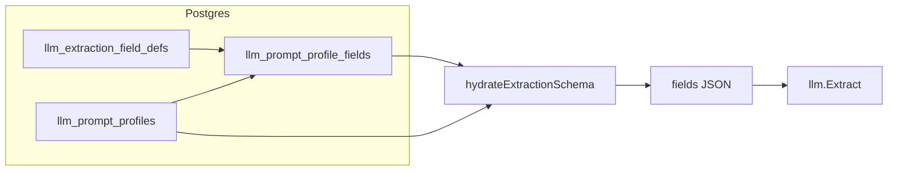

# Normalized extraction fields + composition admin UI

## Current behavior (unchanged contract)

- `[apps/api/internal/llm/client.go](apps/api/internal/llm/client.go)` expects `Profile.ExtractionSchema.Fields` as `[]SchemaField` (key, type, description, optional values, label, sort_order, filterable).
- Load paths (`[internal/db/llm_profiles.go](apps/api/internal/db/llm_profiles.go)`, scheduler/handlers) unmarshal `llm_prompt_profiles.extraction_schema` JSONB into that struct. **The LLM layer should keep receiving the same merged JSON shape**; only the **source of truth** for `fields` moves to normalized rows + hydration.

## Data model (new migration `019_*.sql`)

**Table `llm_extraction_field_defs`** (global library)

- `id` SERIAL PK
- `field_key` TEXT **UNIQUE** (matches output `key`, e.g. `confidence`, `wheel_size`)
- `type` TEXT NOT NULL (`integer`, `number`, `string`, `enum`)
- `description` TEXT NOT NULL
- `label` TEXT NULL
- `values` JSONB NULL (string array for enums)
- `filterable` BOOLEAN NULL (NULL = default true in merge, aligned with `[SchemaField](apps/api/internal/llm/client.go)`)
- `created_at` / `updated_at` TIMESTAMPTZ

**Table `llm_prompt_profile_fields`** (composition)

- `id` SERIAL PK
- `profile_id` INTEGER NOT NULL REFERENCES `llm_prompt_profiles(id)` **ON DELETE CASCADE**
- `field_def_id` INTEGER **NULL** REFERENCES `llm_extraction_field_defs(id)` **ON DELETE RESTRICT**
- `sort_order` INTEGER NOT NULL DEFAULT 0
- `overrides` JSONB NOT NULL DEFAULT `{}` — shallow merge over the def for any subset of: `label`, `description`, `values`, `filterable`, `type` (rare), plus **profile-only** keys if `field_def_id` IS NULL
- `inline_field` JSONB NULL — when set, **ignore** `field_def_id` and treat `inline_field` as the full `SchemaField` object (covers one-off fields without polluting the library). CHECK: `(field_def_id IS NOT NULL AND inline_field IS NULL) OR (field_def_id IS NULL AND inline_field IS NOT NULL)`
- UNIQUE `(profile_id, sort_order)` optional, or allow ties and break by `id` when hydrating (simpler: no unique on sort_order)

`**llm_prompt_profiles.extraction_schema`

- **Phase 1 (recommended):** Keep the column; **stop requiring it for writes** once composition exists. Hydration builds `fields` from `llm_prompt_profile_fields` **when at least one row exists** for that profile; otherwise fall back to legacy JSONB (smooth rollout / rollback).
- **Phase 2 (optional cleanup):** Backfill `extraction_schema` via batch job for debugging, or drop column after confidence in UI + API.

## Hydration (Go)

- Add in `[internal/db/](apps/api/internal/db/)` (e.g. `llm_extraction_fields.go`):
  - CRUD for defs + profile field rows
  - `hydrateExtractionSchema(ctx, profileID) (json.RawMessage, error)`:
    - Load ordered rows for `profile_id`
    - For each row: if `inline_field` → append as-is (validate shape); else load def, merge `overrides` into a `SchemaField` (explicit merge rules: overrides win; `sort_order` on **join row** wins over def; default `filterable` true if unset)
    - Marshal `{"fields":[...]}`
- Call hydration from `GetLLMPromptProfileByID`, `GetLLMPromptProfileForCategory`, `GetLLMPromptProfileForCategoryID`, and `ListLLMPromptProfiles` **after** reading the profile row: if composed fields exist, **replace** `p.ExtractionSchema` with merged bytes; else use stored JSONB.

Consider extracting merge logic into `**internal/llm` or `internal/metadata`** with small **Go tests (table-driven: def + overrides → expected field).

## Migration / backfill

- One-time SQL or `go run` cmd: for each `llm_prompt_profiles` row with `extraction_schema->fields`:
  - For each field object: `INSERT ... ON CONFLICT (field_key) DO UPDATE` into `llm_extraction_field_defs` (policy: **keep existing def** on conflict, or merge — document choice; safest: **do not overwrite** existing def on conflict, log ambiguous keys)
  - Insert `llm_prompt_profile_fields` with `sort_order` from array index, `field_def_id` resolved by `field_key`, `overrides` = **only** properties that differ from the stored def (or store `{}` initially and rely on def for v1 simplicity)
- Ambiguity: same `key` with different `values` across profiles → **overrides.values** on the join row, not multiple defs with same key.

## Admin API

New routes (Bearer admin), registered in `[main.go](apps/api/main.go)` alongside existing LLM handlers:

- `GET/POST /admin/llm-extraction-field-defs` — list (optional `q=` search on key/label), create
- `GET/PUT/DELETE /admin/llm-extraction-field-defs/:id` — read/update/delete (DELETE **RESTRICT** if referenced; return 409 unless UI removes usages first)

Profile field composition (pick one pattern):

- **A)** Extend `PUT /admin/llm-profiles/:id` body with optional `profile_fields: [...]`; when present, **replace** all rows for that profile in a transaction and skip/require empty `extraction_schema` in body.
- **B)** Dedicated `PUT /admin/llm-profiles/:id/fields` — clearer separation.

`[handlers_llm.go](apps/api/internal/api/handlers_llm.go)` GET responses should include **both** `extraction_schema` (hydrated, for test extract + backward compat) and `**profile_fields` (raw composition for the editor) when you want the UI to avoid guessing.

Document new endpoints in `[apps/api/README.md](apps/api/README.md)` and `[docs/ARCHITECTURE.md](docs/ARCHITECTURE.md)` (brief).

## Admin UI (`[PromptProfileManager.tsx](apps/web/src/admin/PromptProfileManager.tsx)` + hooks)

- **Field library** screen or sub-route under existing LLM admin: table of defs, create/edit modal (key, type, description, label, enum values editor, filterable).
- **Profile editor**: ordered list of fields — add from library (combobox/search), reorder (drag handle or up/down), remove, **Edit overrides** (small form or JSON snippet for `overrides` only), **Add custom field** (sets `inline_field`).
- Show **read-only preview** of merged `extraction_schema` (hydrated) or “Test extract” unchanged.
- Optional: collapsible **Advanced: raw `extraction_schema` JSON`** for power users / emergency edits; if present, define conflict rule (e.g. advanced only when no` profile_fields` rows).

TanStack Query: new query keys + `fetch` helpers in `[apps/web/src/admin/api.ts](apps/web/src/admin/api.ts)`; mutations invalidate profile + def lists.

## Docs / shared package

- New migration file under `[packages/shared/migrations/](packages/shared/migrations/)` + row in `[packages/shared/migrations/README.md](packages/shared/migrations/README.md)`
- `[packages/shared/README.md](packages/shared/README.md)`: mention new tables (schema overview)
- `[CLAUDE.md](CLAUDE.md)` Architecture: one line on composed LLM fields

## Rollout order

1. Migration + backfill + hydration + keep legacy JSON fallback
2. Admin API for defs + profile fields
3. Web UI composition + library
4. Optionally deprecate raw-only workflow and later drop dual-write

