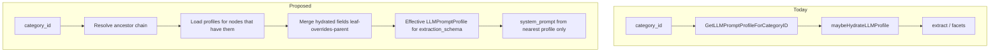

# LLM profile field inheritance (evaluation + implementation direction)

## Take

**Yes—inheriting spec _fields_ from ancestor categories is the right direction** for your example (`wheel_size` on `Bikes` applying to `Bikes > Mountain bikes > Trail bikes`). It matches how shoppers think about the tree and matches your schema: [`categories`](apps/api/internal/db/categories.go) already has `parent_id`, and [`llm_prompt_profiles`](apps/api/internal/db/llm_profiles.go) already has `category_id`, but **resolution is strict**: [`GetLLMPromptProfileForCategoryID`](apps/api/internal/db/llm_profiles.go) only loads a profile for the _exact_ category. [`GetFacets`](apps/api/internal/db/specs.go) uses the same strict lookup, so facets and enrichment stay aligned once you fix resolution.

**Important distinction:** inherit **composition** (`llm_prompt_profile_fields` hydrated via [`hydrateExtractionSchema`](apps/api/internal/db/llm_extraction_hydrate.go)), not necessarily a naive merge of **whole profiles**. Each row still has its own `name`, `system_prompt`, and `enabled`. The usual pattern is:

- **Extraction schema** = merged ordered fields from **self + ancestors** (root → leaf), with **child winning on duplicate `field_key`** (overrides at leaf behave like today’s `overrides` on a library def).
- **System prompt** = **only the nearest enabled profile’s** `system_prompt` (the category you attached the profile to), _or_ explicitly “most specific non-empty”—avoid auto-concatenating long prompts unless you decide that product-wise.

That avoids duplicating fields while still allowing trail-only fields (e.g. rear travel) on the leaf profile.

## Risks / assumptions to validate

| Assumption                                                                   | Risk if wrong                                                                                                                                                                             |
| ---------------------------------------------------------------------------- | ----------------------------------------------------------------------------------------------------------------------------------------------------------------------------------------- |
| Most overlap is **same field definitions** with same meaning across subtrees | If road vs MTB need different descriptions for the same key, you need per-node overrides (child row for same `field_def_id` with heavier `overrides`, or different keys).                 |
| **`sort_order` is global** after merge                                       | Parent sort 10 and child sort 10 can collide; you need a deterministic rule (e.g. parent block then child block, renumber; or `(depth * 1000) + sort_order`).                             |
| **Admin clarity**                                                            | Editors must see inherited vs local fields so they don’t “fix” the wrong profile; changing parent affects many children (expected, but needs UX).                                         |
| **Performance**                                                              | Enrichment and facets call profile resolution often; walking ancestors should be **one query** (recursive CTE or loop with small depth), optionally cached in-process with TTL if needed. |

## Where code would change (high level)

Core implementation surface:

- **New resolver** in [`apps/api/internal/db/`](apps/api/internal/db/) (e.g. `effective_llm_profile.go` or extend [`llm_profiles.go`](apps/api/internal/db/llm_profiles.go)): given `categoryID`, return something like `(baseProfile *LLMPromptProfile, mergedSchema json.RawMessage)` or a dedicated struct with `ExtractionSchema` + metadata for admin.
- **Call sites** today: [`GetLLMPromptProfileForCategory`](apps/api/internal/db/llm_profiles.go) / `GetLLMPromptProfileForCategoryID`, used from [`handlers.go`](apps/api/internal/api/handlers.go) (enrichment), [`scheduler.go`](apps/api/internal/scheduler/scheduler.go), [`specs.go`](apps/api/internal/db/specs.go) (facets). Replace “exact profile only” with “effective profile” for **schema**, while keeping **prompt meta** from the chosen node.
- **Hydration:** Today [`hydrateExtractionSchemaFrom`](apps/api/internal/db/llm_extraction_hydrate.go) runs one `profile_id`. You’ll either **merge `llm.SchemaField` slices in Go** after calling hydration per ancestor profile, or build a SQL UNION ordered by depth (more complex). **Go merge after hydrating each profile** is easier to test and matches existing `confidence` append logic (ensure **one** confidence field after merge).
- **Admin API / web:** [`PromptProfileManager`](apps/web/) and [`handlers_llm.go`](apps/api/internal/api/handlers_llm.go) may need a read-only **effective fields** view (flattened inherited + local) so operators understand what enrichment will use—optional for MVP if you only ship backend merge first.

**Data migration:** After implementation, you can delete duplicate `llm_prompt_profile_fields` rows from child profiles that only mirrored the parent; keep leaf-only fields on children. No new table strictly required if inheritance is purely tree-derived.

## TDD approach ([test-driven-development](.agents/skills/workflows/test-driven-development/SKILL.md))

Treat merge as **pure logic** first (fast unit tests, no DB):

1. **RED:** Tests for `mergeProfileFields(ancestorFields, descendantFields)` — ordering, duplicate `Key` (child wins), `Filterable`/`Label` overrides, confidence deduped.
2. **GREEN:** Implement merge + renumber `SortOrder` rule.
3. **REFACTOR:** Wire into DB resolver; add **medium** test: Postgres or pgxmock fixture for category chain + two profiles (parent has `wheel_size`, child adds `rear_travel`) and assert effective schema keys/order.

Existing [`specs_test.go`](apps/api/internal/db/specs_test.go) (untracked in git status) is a natural place for facet-related assertions if you expose effective profile there.

## MVP vs not doing

**MVP:** Tree-walk + merge hydrated fields; child overrides parent key; single system prompt from nearest enabled profile; update enrichment + facets paths; unit tests for merge.

**Not doing (initially):** UI for “detach from inheritance”; multiple inheritance; merging `system_prompt` text from ancestors; changing how listings without a leaf profile fall back (keep current behavior unless you explicitly add “nearest ancestor profile for schema only”).

## Open product decisions (short)

- **Duplicate keys:** Default **child replaces parent** for that key; document for admins.
- **Sort order:** Default **ancestors first (breadth by depth), then descendant fields**, with stable tie-break by `field_key`—or renumber contiguously after merge.

If you want **strict** “parent fields always listed before child fields regardless of saved sort_order,” say so—that’s a one-line policy in the merge function.
