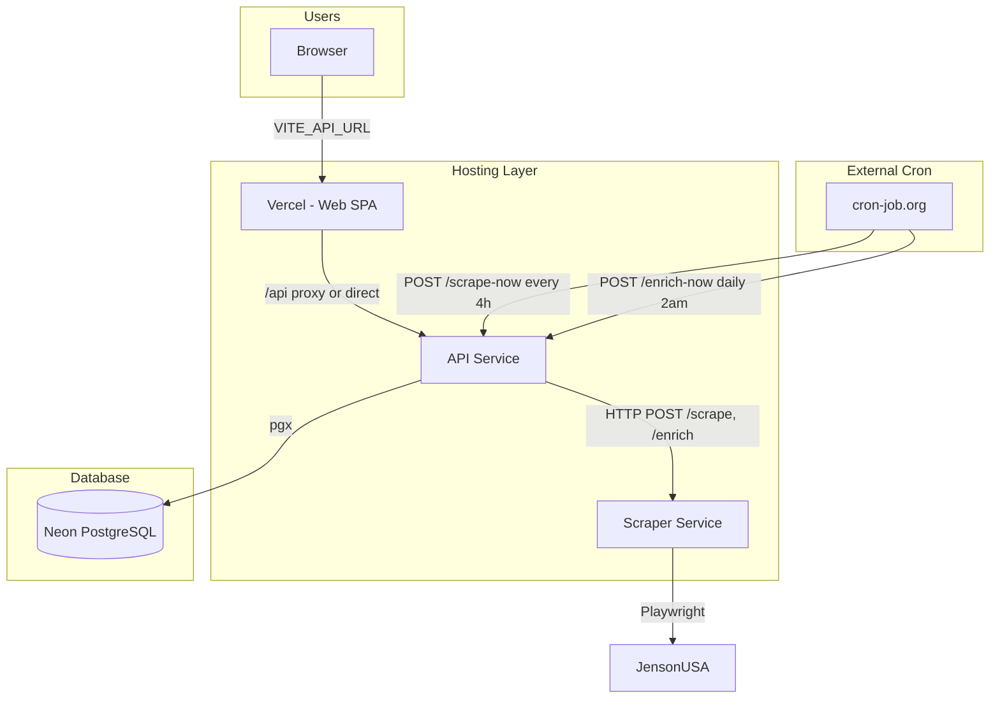

# MTB Aggregator Deployment Plan

## Decisions (Locked In)

- **Scraper hosting**: Render free tier + `--disable-dev-shm-usage` for Chromium
- **Domains**: Platform subdomains (`*.vercel.app`, `*.onrender.com`) for now
- **Migrations**: Manual SQL with convention (see Migrations section below)
- **Scheduling**: External cron service (cron-job.org or similar) — in-process cron disabled on Render since services spin down after 15 min idle

---

## Architecture Overview



---

## Service Stack

| Component | Service | Cost | Notes |
|-----------|---------|------|-------|
| Web | Vercel | $0 | Hobby plan, auto-deploy from GitHub |
| Database | Neon | $0 | Free tier, auto-suspend after 5 min |
| API | Render | $0 | Free tier, 750 hrs/mo, spins down after 15 min |
| Scraper | Render | $0 | Free tier, add `--disable-dev-shm-usage` to Playwright |

**Total: $0/month** (may need paid tier if scraper is flaky on 512MB)

---

## External Cron (Scheduling)

Render free tier spins down services after 15 min idle. In-process cron (robfig/cron) does not run when the API is asleep. Use an external cron service to trigger jobs:

1. **Wake the API** — HTTP request spins up the service
2. **Trigger the job** — Request hits `/scrape-now` or `/enrich-now`
3. **API sleeps again** — After 15 min idle

### Endpoints

| Endpoint | Method | Schedule |
|----------|--------|----------|
| `/scrape-now` | POST | Every 4 hours |
| `/enrich-now` | POST | Daily at 2am |

### Recommended Service: cron-job.org

- Free tier, custom schedules
- Configure two jobs:
  - **Scrape**: `POST https://mtb-api.onrender.com/scrape-now` — every 4 hours (e.g. 0:00, 4:00, 8:00, 12:00, 16:00, 20:00 UTC)
  - **Enrich**: `POST https://mtb-api.onrender.com/enrich-now` — daily at 02:00 UTC

### API Changes Required

- Set `SCRAPE_CRON_SPEC=disabled` and `ENRICH_CRON_SPEC=disabled` on Render to disable in-process cron (avoids duplicate runs when API is awake)
- API code: add support for `disabled` value — skip starting cron when spec is `disabled`

### Optional: Secure Endpoints

Add `CRON_SECRET` env var; validate `X-Cron-Secret` header or `?secret=` query param in `/scrape-now` and `/enrich-now` handlers to prevent unauthorized triggers.

---

## Playwright: --disable-dev-shm-usage

Required for Render's 512MB free tier. Add to all `chromium.launch()` calls:

**Files to update:**
- [apps/scraper/src/parsers/jensonusa.ts](apps/scraper/src/parsers/jensonusa.ts) — scrape and enrich functions
- [apps/scraper/src/server.ts](apps/scraper/src/server.ts) — scrape-debug endpoint

**Change:** Add `--disable-dev-shm-usage` to the `args` array:

```typescript
args: ["--no-sandbox", "--disable-setuid-sandbox", "--disable-dev-shm-usage"]
```

---

## Migrations

**Approach:** Manual SQL with a simple convention. No migration tool for now.

### Initial Deploy

1. Create Neon project, get connection string
2. Run once: `packages/shared/schema.sql` then `packages/shared/seed.sql`
3. Use Neon SQL Editor or: `psql $DATABASE_URL -f packages/shared/schema.sql`

### Future Changes

1. Create `packages/shared/migrations/` directory
2. Add numbered files: `002_add_foo_column.sql`, `003_add_bar.sql`
3. Each file: additive only (e.g. `ALTER TABLE ... ADD COLUMN IF NOT EXISTS`)
4. Run new files manually in order when deploying
5. Document in README: "Database" section with setup + migration steps

### When to Add golang-migrate

Consider adding a migration tool if: multiple deployers, need rollbacks, or want migrations in CI/API startup.

---

## Implementation Phases

### Phase 1: Prep

- Add `.env.example` with all required vars (no secrets)
- Add `--disable-dev-shm-usage` to Playwright launch args in jensonusa.ts and server.ts

### Phase 2: Database

- Create Neon project
- Run schema.sql + seed.sql
- Store `DATABASE_URL` for API

### Phase 3: Backend (Render)

- Create two Render Web Services: API and Scraper
- API: connect repo, build from `apps/api/Dockerfile`, set `DATABASE_URL`, `SCRAPER_SERVICE_URL`
- Scraper: connect repo, build from `apps/scraper/Dockerfile`, set env vars
- Configure `SCRAPER_SERVICE_URL` to scraper's Render URL (e.g. `https://mtb-scraper.onrender.com`)
- Set `SCRAPE_CRON_SPEC=disabled` and `ENRICH_CRON_SPEC=disabled` on API (in-process cron disabled; external cron used instead)
- Render free: both services share 750 instance hrs/month; they spin down after 15 min idle

### Phase 3.5: External Cron

- Sign up at [cron-job.org](https://cron-job.org) (or UptimeRobot, etc.)
- Create job 1: POST `https://<api-url>/scrape-now` every 4 hours
- Create job 2: POST `https://<api-url>/enrich-now` daily at 02:00 UTC
- Optional: add `CRON_SECRET` and validate in API handlers

### Phase 4: Frontend (Vercel)

- Create Vercel project, connect repo
- Root directory: `apps/web` (or set in Vercel)
- Build command: `pnpm install && pnpm run build`
- Set `VITE_API_URL` to API's Render URL (e.g. `https://mtb-api.onrender.com`)

### Phase 5: CI/CD

- Add `.github/workflows/deploy.yml` for: test on PR/push, deploy on merge to main
- Use Vercel + Render GitHub integrations where possible to reduce Actions usage (private repo: 2,000 min/mo)
- Cache Go modules and pnpm

---

## Environment Variables

### API (Render)

| Variable | Source |
|----------|--------|
| `DATABASE_URL` | Neon connection string |
| `SCRAPER_SERVICE_URL` | Scraper Render URL |
| `PORT` | 8080 (Render sets automatically) |
| `SCRAPE_CRON_SPEC` | `disabled` (use external cron) |
| `ENRICH_CRON_SPEC` | `disabled` (use external cron) |
| `CRON_SECRET` | Optional: shared secret for /scrape-now, /enrich-now |

### Scraper (Render)

| Variable | Source |
|----------|--------|
| `PORT` | 3000 (Render sets automatically) |
| `NODE_ENV` | production |
| `SCRAPE_DELAY_MS` | 5000 (optional) |

### Web (Vercel)

| Variable | Source |
|----------|--------|
| `VITE_API_URL` | API Render URL |

---

## Cost Summary

| Scenario | Monthly Cost |
|----------|--------------|
| All free (current plan) | $0 |
| Scraper flaky → Railway $5 | ~$5-10 |
| Full reliability (Render paid) | ~$7-25 |

---

## Key Files

- [packages/shared/schema.sql](packages/shared/schema.sql) — initial schema
- [packages/shared/seed.sql](packages/shared/seed.sql) — store seed data
- [apps/api/main.go](apps/api/main.go) — cron config, /scrape-now, /enrich-now handlers
- [apps/api/Dockerfile](apps/api/Dockerfile) — API image
- [apps/scraper/Dockerfile](apps/scraper/Dockerfile) — Scraper image (Playwright base)
- [docker-compose.yml](docker-compose.yml) — local dev reference
