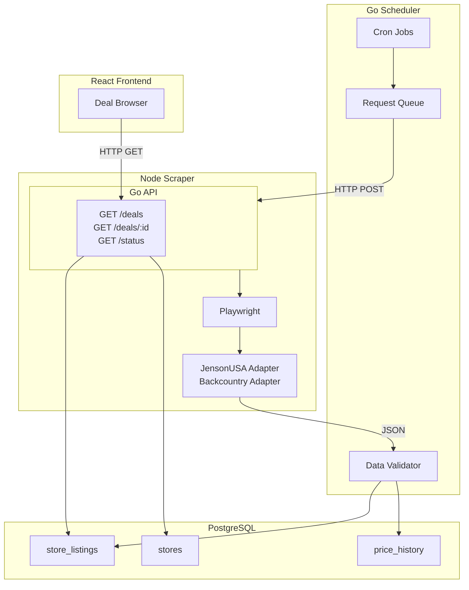

# MTB Deal Aggregator Implementation Plan

## Architecture Overview



## Project Structure

```
mtb-aggregator/
├── apps/
│   ├── api/           # Go - scheduler + REST API
│   │   ├── main.go
│   │   ├── Dockerfile
│   │   └── go.mod
│   ├── scraper/       # Node + Playwright
│   │   ├── src/
│   │   │   ├── server.ts
│   │   │   ├── parsers/
│   │   │   │   ├── jensonusa.ts
│   │   │   │   └── backcountry.ts
│   │   │   └── types.ts
│   │   ├── Dockerfile
│   │   └── package.json
│   └── web/           # React + Vite
│       ├── src/
│       └── package.json
├── packages/
│   └── shared/
│       ├── schema.sql
│       └── types.json
├── docker-compose.yml
├── Makefile
└── package.json       # pnpm workspace root
```

---

## Phase 1: Foundation

**Goal:** Monorepo structure, database schema, and Docker orchestration.

### 1.1 Monorepo Setup

- Initialize pnpm workspace with `apps/web`, `apps/scraper`, `packages/shared`
- Create root `package.json` with workspaces
- Add `Makefile` with targets: `dev`, `db-up`, `db-down`, `scrape`, `build-all`

### 1.2 Database Schema (Listing-First)

Create `packages/shared/schema.sql`:

- **stores** - `id`, `name`, `base_url`, `affiliate_network` (nullable), `created_at`
- **store_listings** - `id`, `store_id`, `store_sku`, `product_name`, `current_price`, `original_price` (nullable), `product_url`, `affiliate_url` (nullable), `image_url`, `is_in_stock`, `last_scraped`, `created_at`
- **price_history** - `id`, `listing_id`, `price`, `recorded_at`
- **scraped_raw_data** (optional) - `id`, `store_id`, `raw_content`, `created_at` - for debugging

No `products` or `brands` tables in MVP; deduplication deferred.

### 1.3 Docker Compose

- **db**: Postgres 16, volume for persistence
- **scraper**: Node + Playwright (base: `mcr.microsoft.com/playwright:v1.41.0-jammy`), port 3000
- **api**: Go service, port 8080, depends on db + scraper
- **web**: React dev server, port 5173 (optional in compose for local dev)

Internal networking: `http://scraper:3000`, `postgres://db:5432`

---

## Phase 2: Scraper Service (Node + Playwright)

**Goal:** Stateless HTTP API that accepts a URL + store type and returns normalized listing data.

### 2.1 Core Scraper API

- Express or Fastify server with `POST /scrape`
- Request body: `{ url: string, store: "jensonusa" | "backcountry" }`
- Response: Array of `ScrapeResult` objects
- Use Strategy pattern: `parsers/jensonusa.ts`, `parsers/backcountry.ts`
- Router selects parser by `store` param

### 2.2 Normalized Output Interface

```typescript
interface ScrapeResult {
  store_sku: string;
  product_name: string;
  current_price: number;
  original_price?: number;
  product_url: string;
  image_url?: string;
  is_in_stock: boolean;
}
```

### 2.3 Parser Implementation

- **JensonUSA**: Target sale/clearance URL, extract product cards (config-driven selectors in JSON or constants)
- **Backcountry**: Same pattern, different selectors
- Use Playwright with `page.waitForSelector()` for dynamic content
- Add 5-15 second delay between page loads (polite scraping)

### 2.4 Error Handling & Mitigation

- **Zod validation** on parser output - reject malformed data, log and return 500
- **Screenshot on failure**: `page.screenshot()` when selector fails, save to `logs/` or S3
- **User-Agent**: `MTBDealBot/1.0 (+https://yoursite.com/bot-info)`
- **robots.txt**: Check before scraping (simple fetch + parse), respect Disallow
- **Rate limiting**: Max 1 concurrent scrape per store, configurable delay

### 2.5 Config-Driven Selectors

Store in `parsers/config.json` or per-parser constants:

```json
{
  "jensonusa": {
    "product_card": "[data-product]",
    "price": ".product-price",
    "name": "h1.title",
    "link": "a.product-link"
  }
}
```

---

## Phase 3: Go Scheduler

**Goal:** Cron-driven job that triggers scrapes and persists results.

### 3.1 Cron Engine

- Use `robfig/cron` or `gocron`
- Schedule: `0 */4` (every 4 hours) or configurable via env
- Job: Iterate `stores` table, POST to `http://scraper:3000/scrape` for each store's target URL(s)

### 3.2 Store Configuration

- Add `scrape_url` (or `scrape_urls` JSONB) to `stores` table
- Seed JensonUSA and Backcountry with their sale page URLs

### 3.3 HTTP Client

- Go HTTP client to call scraper
- Timeout: 120s (Playwright can be slow)
- Parse JSON response into Go structs

### 3.4 Data Validation

- Strict struct with required fields
- Reject if `current_price <= 0` or `current_price` is absurd (e.g. > $50,000)
- Shadow check: if price drops > 90% from last scrape, flag for manual review (log, don't insert)
- Log validation failures, don't crash

### 3.5 Persistence

- Upsert into `store_listings` (match by `store_id` + `store_sku`)
- Insert into `price_history` for each listing on successful scrape
- Store raw JSON in `scraped_raw_data` on error (optional, for debugging)

---

## Phase 4: Go REST API

**Goal:** Serve deal data to the frontend.

### 4.1 Endpoints

- `GET /deals` - List deals with query params: `?store=`, `?min_discount=`, `?limit=`, `?offset=`
- `GET /deals/:id` - Single listing detail
- `GET /stores` - List stores
- `GET /status` - Health: last successful scrape per store, scraper reachable

### 4.2 Affiliate URL Logic (Hybrid)

- Add `generateAffiliateUrl(rawUrl, storeId)` - stub that returns `rawUrl` for now
- Schema has `affiliate_url` column (nullable)
- When affiliate approved: implement real logic (AvantLink/Impact API), run backfill job
- Frontend: use `affiliate_url ?? product_url` for "View Deal" links

### 4.3 Database Access

- Use `pgx` or `database/sql` with `lib/pq`
- Connection from env: `DATABASE_URL`

---

## Phase 5: React Frontend

**Goal:** Simple deal browser for MVP.

### 5.1 Stack

- Vite + React + TypeScript
- Tailwind CSS
- Fetch or TanStack Query for API calls

### 5.2 Pages

- **Deals list** - Grid/list of deals with image, name, price, discount %, store badge, "View Deal" button
- **Deal detail** (optional for MVP) - Single deal with full info
- **Stores** (optional) - List of stores with deal counts

### 5.3 API Integration

- `VITE_API_URL=http://localhost:8080` for dev
- Typed interfaces matching Go API response

### 5.4 Basic Filtering

- Filter by store (dropdown)
- Sort by discount %, price, newest

---

## Phase 6: Reliability & Polish

### 6.1 Error Snapshots

- Scraper saves screenshot to `logs/{store}_{timestamp}.png` on selector failure
- Optional: upload to S3 for production

### 6.2 Health Dashboard

- `GET /status` returns `{ stores: [{ name, last_scraped, success }], scraper_reachable: bool }`
- Simple status page or integrate into existing UI

### 6.3 Proxy Readiness

- Scraper accepts optional `PROXY_URL` env var
- If set, configure Playwright to use proxy
- No proxy by default; add when blocked

---

## Implementation Order

| Phase | Tasks                                                   | Dependency |
| ----- | ------------------------------------------------------- | ---------- |
| 1     | Monorepo, schema, Docker                                | -          |
| 2     | Scraper + 1 parser (JensonUSA)                          | Phase 1    |
| 3     | Go scheduler + validation + persistence                 | Phase 2    |
| 4     | Go REST API                                             | Phase 3    |
| 5     | React frontend                                          | Phase 4    |
| 6     | Second parser (Backcountry), error screenshots, /status | Phase 5    |

---

## Key Files to Create

- [packages/shared/schema.sql](packages/shared/schema.sql) - DB schema
- [apps/scraper/src/server.ts](apps/scraper/src/server.ts) - Scrape API
- [apps/scraper/src/parsers/jensonusa.ts](apps/scraper/src/parsers/jensonusa.ts) - First parser
- [apps/api/main.go](apps/api/main.go) - Scheduler + API (or split into `cmd/scheduler` and `cmd/api`)
- [apps/web/src/App.tsx](apps/web/src/App.tsx) - Deals list
- [docker-compose.yml](docker-compose.yml) - Service orchestration
- [Makefile](Makefile) - Dev commands

---

## Out of Scope for MVP

- Fuzzy matching / product deduplication
- User accounts, email alerts, stock notifications
- Affiliate link integration (schema ready, logic stubbed)
- Proxies (add when blocked)
- Mobile app
