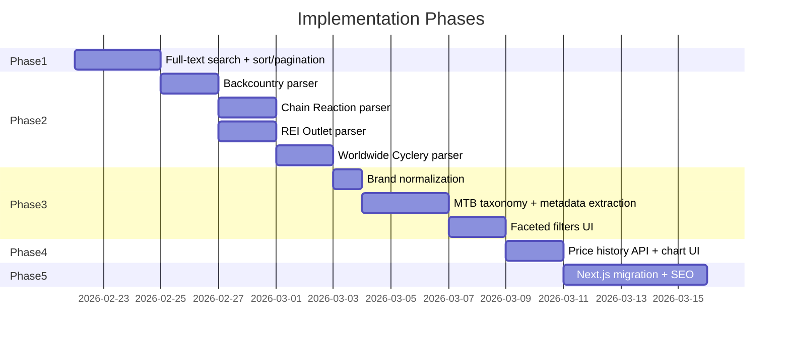

# MTB Aggregator V2 Roadmap

## Current State

- 1 scraper (JensonUSA clearance), strategy-pattern parser architecture in [apps/scraper/src/parsers/index.ts](apps/scraper/src/parsers/index.ts)
- Go API with basic filtering (store, brand, category, min_discount) in [apps/api/internal/db/db.go](apps/api/internal/db/db.go)
- React + Vite SPA with dropdowns and client-side sorting in [apps/web/src/App.tsx](apps/web/src/App.tsx)
- PostgreSQL schema with `store_listings`, `price_history`, `stores` tables in [packages/shared/schema.sql](packages/shared/schema.sql)
- No price history UI, no SSR/SEO

## Phase 1: Full-Text Search + Server-Side Sort/Pagination -- COMPLETED

Full-text search via `tsvector`/GIN index, server-side sort/pagination, search bar, page-number pagination top/bottom. See [packages/shared/migrations/003_full_text_search.sql](packages/shared/migrations/003_full_text_search.sql).

---

## Phase 2: Source Diversity -- Add 3-4 Scrapers

**Goal:** Enough sources that users come here instead of visiting each store. Target 4-5 total stores.

### Scraper Infrastructure: Render Standard (2GB)

Upgrade the Render scraper service from free tier (512MB) to Standard ($25/mo, 2GB RAM). This avoids the complexity and fragility of remote browser services (session timeouts, CDP protocol issues) and gives plenty of headroom for Chromium + multiple parsers.

- **Playwright parsers** run local `chromium.launch()` for sites needing JS rendering (JensonUSA, Backcountry). 2GB supports Chromium (~~300MB) + Node (~~100MB) comfortably.
- **Cheerio parsers** (already added as a dependency) for sites serving product data in HTML or JSON (Shopify, server-rendered). No Chromium needed, ~10MB per scrape.
- **[apps/scraper/src/browser.ts](apps/scraper/src/browser.ts):** Simplify to default to `chromium.launch()`. Keep optional `BROWSER_WS_ENDPOINT` support for future flexibility, but the primary path is local. Remove Browserless-specific session timeout logic.
- **Remove `SCRAPER_MAX_PAGES=1` constraint**: with 2GB, set `SCRAPER_MAX_PAGES=5` (or higher) on Render to scrape full catalogs.
- **Render config:** Upgrade scraper service to Standard in Render dashboard. Update env vars to remove `BROWSER_WS_ENDPOINT` / `BROWSERLESS_TOKEN`, increase `SCRAPER_MAX_PAGES`.

### New Parsers

Each parser follows the existing pattern: export a `scrape[Store]` function returning `ScrapeResult[]` and an `enrich[Store]` function returning `EnrichResult`, then register in [apps/scraper/src/parsers/index.ts](apps/scraper/src/parsers/index.ts).

- **Backcountry** (`backcountry.ts`) -- already stubbed in types. Target `https://www.backcountry.com/cycling/mountain-biking` + sale section. Large catalog, good metadata. Likely needs Playwright (React SPA).
- **Chain Reaction Cycles** (`chainreaction.ts`) -- `https://www.chainreactioncycles.com/clearance/cycling`. UK-based, massive MTB selection, frequent deep discounts. Try cheerio first (server-rendered). Prices in GBP (store in original currency, add `currency` column or normalize to USD).
- **REI Outlet** (`rei.ts`) -- `https://www.rei.com/rei-garage/c/cycling`. Trusted US retailer. Try cheerio first (server-rendered HTML).
- **Worldwide Cyclery** (`worldwide.ts`) -- `https://www.worldwidecyclery.com/collections/sale`. Shopify store, supports `.json` URL variant for direct JSON access. Use cheerio/fetch.

### Database Changes — DONE

- Seed new stores in `packages/shared/seed.sql` (JensonUSA, Worldwide Cyclery, Revel Bikes)
- Added `currency VARCHAR(3) DEFAULT 'USD'` in `004_currency.sql` for future international stores
- Enrichment query now uses `StoreTypesWithEnrichers` in `db.go` so new store types get enriched when enrichers are added

### Operational

- **Scraper health monitoring — DONE:** `stores.last_scrape_result_count` (migration `005_scraper_health.sql`); scheduler updates it after each scrape and logs a WARNING when a store returns 0 results for 2+ consecutive runs
- Parser fixture HTML/JSON + tests: deferred (add when stabilizing parsers)

---

## Phase 3: Data Quality + MTB Taxonomy

**Goal:** Clean, normalized data that powers precise filtering. This is the "invisible infrastructure" that makes the browsing experience feel professional.

### Brand Normalization

- Create a brand alias mapping (e.g., `"sram" -> "SRAM"`, `"shimano" -> "Shimano"`, `"rock shox" -> "RockShox"`) as a JSON config or DB table
- Apply during scrape ingestion in the Go scheduler before upserting
- Backfill existing data

### MTB Category Taxonomy

- Define a canonical category tree (stored as a reference table or config):
  - Bikes > Mountain > Trail, Enduro, XC, Downhill, Dirt Jump
  - Components > Drivetrain, Brakes, Suspension, Wheels, Cockpit
  - Gear > Helmets, Protection, Clothing, Shoes
  - Accessories > Tools, Bags, Lights
- Map each store's raw `category_path` to the canonical taxonomy during enrichment
- Add a `canonical_category` column (or reuse `category_path` with normalized values)

### Product Name Metadata Extraction

- Parse product names for structured attributes using regex patterns:
  - Wheel size: `29`, `27.5`, `26`, `29er`, `mullet`
  - Suspension travel: `150mm`, `160mm`
  - Model year: `2024`, `2025`
  - Groupset: `XT`, `XTR`, `GX Eagle`, `X01`
- Store as a `metadata JSONB` column on `store_listings`
- Expose as filterable facets in the API

### Frontend Faceted Filters — DONE

- Replace simple dropdowns with grouped/hierarchical category browser (canonical category dropdown with optgroups; raw category kept as "Category (raw)")
- Add MTB-specific filter chips (wheel size, model year, groupset) using extracted metadata
- Show active filter count and "clear all" affordance
- **Future refinement:** Dynamically generate filter chips from API (e.g. `GET /facets` or aggregate from deal metadata) instead of hardcoded options, so new wheel sizes/years/groupsets appear automatically as data grows

---

## Phase 4: Price History Visualization

**Goal:** Show users whether a deal is actually good, build trust, and create a "CamelCamelCamel for bikes" habit.

### API

- Add `GET /deals/:id/price-history` endpoint returning `[{price, recorded_at}]` from the existing `price_history` table
- Include `lowest_price`, `highest_price`, `avg_price` summary stats

### Frontend

- Add a deal detail page/modal (click a DealCard to expand)
- Add a price history chart (use `recharts` or `chart.js`) showing price over time
- Show "lowest ever" / "X% below average" badges on cards when applicable
- Add "price dropped" indicator when the current scrape found a lower price than the previous one

---

## Phase 5: SEO -- Next.js Migration

**Goal:** Organic search is the growth engine. A client-side SPA is invisible to Google. Move to Next.js for SSR.

### Migration

- Replace `apps/web` (Vite + React) with Next.js (App Router)
- Reuse all existing components (DealCard, DealFilters, etc.) -- they're already plain React
- Server Components for the deals list page (fetch data server-side)
- URL structure: `/deals` (browse), `/deals/[id]/[slug]` (individual deal), `/brands/[brand]`, `/categories/[category]`

### SEO Specifics

- Add JSON-LD structured data (`Product` schema) on deal detail pages
- Generate `sitemap.xml` dynamically from the deals database
- Add `<meta>` tags (title, description, og:image) per page
- Set proper canonical URLs

### API Adjustment

- The Go API remains as-is (backend for data)
- Next.js server components call the Go API directly (server-to-server, no CORS needed)

---

## Phase 6: Alerts + Saved Searches (Future)

**Goal:** Recurring engagement. Deferred until search and sources are solid.

- Simple email-based registration (no passwords -- magic link or just email + token)
- Save search criteria (query, filters, max price threshold)
- Daily digest: check saved searches against new/changed listings, send email if matches
- Price drop alerts: "notify me when this item drops below $X"

---

## Implementation Priority

Phases 1-2 are where the most value is concentrated. A usable search bar and 4-5 stores would already make this meaningfully useful to MTB shoppers. Phases 3-4 make it *great*. Phase 5 makes it *discoverable*. Phase 6 makes it *sticky*.