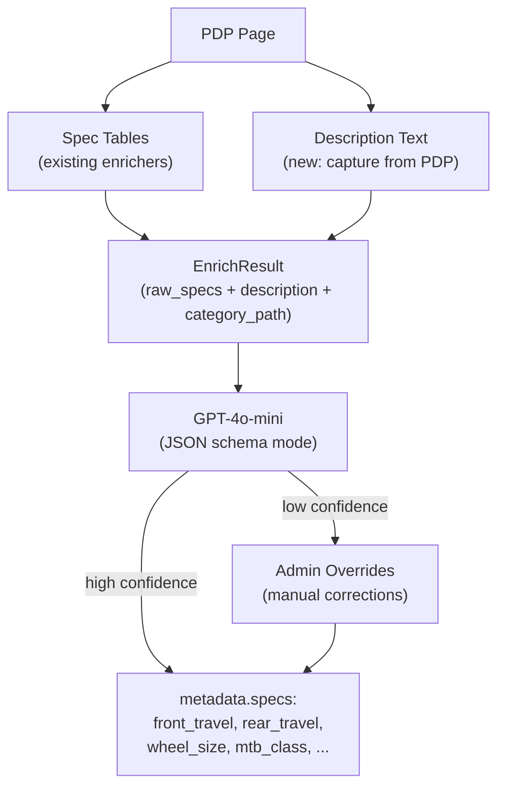

# Enhanced MTB Spec Extraction and Classification

## Problem

Mountain bike listings are missing key specs even after enrichment:

- **Travel** -- PDP spec tables often list a single "Travel" value, but front and rear travel are distinct (fork vs frame). Product names and descriptions often contain both.
- **Wheel size** -- Sometimes in spec tables, but frequently only in the name or description.
- **MTB classification** -- XC, Trail, Enduro, DH, Downcountry. Rarely in spec tables; sometimes in descriptions, category paths, or derivable from travel range.

Currently the enrichers only extract spec tables/definition lists. Product descriptions are available on the page but thrown away.

## Approach: LLM-Powered Extraction

Instead of building brittle regex parsers for descriptions and a hand-rolled classification engine, we use GPT-4o-mini with JSON schema mode to extract structured specs and classify bikes in a single call. The LLM receives all available context (product name, description, existing specs, category path) and returns structured data.



**Why LLM over regex:**

- Descriptions are messy and varied. "150mm fork paired with 145mm of rear travel" vs "145/150mm travel" vs "built around a 150mm chassis" -- an LLM handles all of these naturally.
- Classification requires judgment. A bike with 140mm travel could be Trail or Downcountry depending on context. An LLM reading "aggressive trail riding" gets this right.
- No pattern maintenance. New description formats from stores are handled automatically.
- Cost: ~$0.001-0.003 per product with GPT-4o-mini. Full catalog = a few dollars.

## Implementation

### Step 1: Capture description text from enrichers

Extend `EnrichResult` with a `description` field and extract description text from each store's PDP.

`**[apps/scraper/src/parsers/jensonusa.ts](apps/scraper/src/parsers/jensonusa.ts)` -- `EnrichResult` interface (shared by all enrichers):

```typescript
export interface EnrichResult {
  category_path: string[] | null;
  raw_specs: Record<string, string> | null;
  unavailable?: boolean;
  description?: string | null; // new
}
```

**Per-store extraction:**

- **Worldwide Cyclery** -- `body_html` from Shopify API is already in memory. Strip spec tables/dl, return remaining text. Easiest win.
- **JensonUSA** -- Add a selector in the `page.evaluate` script for the product description section (`.product-description`, `[id*="description"]`, or similar). Return `.textContent`.
- **Backcountry** -- HTML is already fetched. Use cheerio to find the description section, strip spec tables, return text.

**Go API client** -- `[apps/api/internal/scraper/client.go](apps/api/internal/scraper/client.go)`:

```go
type EnrichResult struct {
    CategoryPath []string          `json:"category_path"`
    RawSpecs     map[string]string `json:"raw_specs"`
    Unavailable  bool              `json:"unavailable"`
    Description  *string           `json:"description,omitempty"`
}
```

**Storage:** Store `description` in `metadata` JSONB (no schema change needed). Pass it through `UpdateListingEnrichment`.

### Step 2: Build OpenAI LLM client

New package: `apps/api/internal/llm/` -- a lightweight OpenAI client using `net/http` (no SDK).

`**apps/api/internal/llm/client.go`:

- `Client` struct with API key, model name, HTTP client
- `Extract(ctx, profile, input) (map[string]interface{}, error)` -- generic extraction using a prompt profile
- Uses OpenAI's `response_format` with JSON schema to guarantee valid output
- Configurable via `OPENAI_API_KEY` env var; disabled if not set (graceful degradation)

### Step 3: DB-driven prompt profiles

The key design: **prompt profiles** are stored in the DB and configured per canonical category via the admin UI. Each profile defines what fields to extract and what values are allowed.

**Migration: `llm_prompt_profiles` table:**

```sql
CREATE TABLE IF NOT EXISTS llm_prompt_profiles (
  id SERIAL PRIMARY KEY,
  canonical_category TEXT[] NOT NULL,
  name VARCHAR(200) NOT NULL,
  system_prompt TEXT NOT NULL,
  extraction_schema JSONB NOT NULL,
  enabled BOOLEAN NOT NULL DEFAULT true,
  created_at TIMESTAMPTZ NOT NULL DEFAULT NOW(),
  updated_at TIMESTAMPTZ NOT NULL DEFAULT NOW(),
  UNIQUE(canonical_category)
);
```

- `canonical_category` -- which products this profile applies to (e.g. `{"Bikes","Mountain"}`)
- `name` -- human label (e.g. "Mountain Bike Classification")
- `system_prompt` -- the full system prompt, editable in admin
- `extraction_schema` -- JSON defining the fields to extract, their types, and allowed values

**Example profile for `Bikes > Mountain`:**

```json
{
  "canonical_category": ["Bikes", "Mountain"],
  "name": "Mountain Bike Classification",
  "system_prompt": "You are a mountain bike spec extraction expert. Given a product listing, extract structured specs.\n\nOnly include fields you can determine from the provided data. Use null for unknown fields.\nSet confidence 0-1 based on how certain you are about the overall extraction.",
  "extraction_schema": {
    "fields": [
      {
        "key": "front_travel_mm",
        "type": "integer",
        "description": "Front fork travel in mm"
      },
      {
        "key": "rear_travel_mm",
        "type": "integer",
        "description": "Rear suspension travel in mm (null for hardtails)"
      },
      {
        "key": "wheel_size",
        "type": "enum",
        "values": ["29", "27.5", "26", "mullet"],
        "description": "Wheel size"
      },
      {
        "key": "mtb_class",
        "type": "enum",
        "values": [
          "XC",
          "Downcountry",
          "Trail",
          "Enduro",
          "DH",
          "Dirt Jump",
          "Fat Bike"
        ],
        "description": "Mountain bike classification"
      },
      {
        "key": "frame_material",
        "type": "enum",
        "values": ["Carbon", "Aluminum", "Steel", "Titanium"],
        "description": "Frame material"
      },
      {
        "key": "confidence",
        "type": "number",
        "description": "Overall confidence 0-1"
      }
    ]
  }
}
```

**Example profile for `Components > Suspension`:**

```json
{
  "canonical_category": ["Components", "Suspension"],
  "name": "Suspension Component Specs",
  "system_prompt": "You are a mountain bike suspension expert. Extract specs from the product listing.",
  "extraction_schema": {
    "fields": [
      { "key": "travel_mm", "type": "integer", "description": "Travel in mm" },
      {
        "key": "spring_type",
        "type": "enum",
        "values": ["Air", "Coil"],
        "description": "Spring type"
      },
      {
        "key": "axle_standard",
        "type": "enum",
        "values": ["15x110mm Boost", "15x100mm", "20x110mm"],
        "description": "Axle standard"
      },
      {
        "key": "stanchion_mm",
        "type": "integer",
        "description": "Stanchion diameter in mm"
      },
      {
        "key": "confidence",
        "type": "number",
        "description": "Overall confidence 0-1"
      }
    ]
  }
}
```

**How the LLM client uses profiles:**

1. The `extraction_schema` is converted into an OpenAI JSON schema for `response_format` -- this constrains the LLM to return exactly the fields you defined with valid types/enum values.
2. The `system_prompt` is sent as the system message.
3. The user message contains the product context (name, description, specs, category).
4. The LLM returns a JSON object matching the schema.

**Admin UI:**

- Prompt Profile Manager: CRUD for profiles (edit system prompt, add/remove/edit fields, set allowed enum values)
- "Test" button: send a sample product through the profile and preview the LLM response
- Seed: ship a default MTB profile; admin can adjust or add new profiles for other categories

### Step 4: Wire LLM into enrichment pipeline

After enrichment returns specs + description, call the LLM if a matching prompt profile exists.

**Where it runs:** In the scheduler after the enrichment call returns.

**Flow:**

1. Enrichment returns `raw_specs`, `category_path`, `description`
2. Merge specs as before (key aliases + value normalization)
3. Determine `canonical_category` (already done in enrichment)
4. Look up `llm_prompt_profiles` for this `canonical_category`
5. If a matching enabled profile exists and `OPENAI_API_KEY` is set:

- Call `llm.Extract()` with the profile + product context
- Merge LLM-derived specs into `metadata.specs` (only fill gaps, don't overwrite spec-table data)
- Store `confidence` in `metadata.llm_confidence` for admin review

1. If no profile matches or no API key, skip LLM step

**Categories without a profile simply skip the LLM step.** No code changes needed to add new categories -- just create a profile in the admin UI.

**Admin triggers:**

- `POST /admin/llm/run` -- re-run LLM extraction on listings for a given canonical category (using stored description + specs)
- `POST /admin/llm/test` -- test a profile against a single listing (preview mode)

### Step 5: Admin review and overrides

Extend the admin UI to review LLM results and manually override.

**DataBrowser enhancements:**

- Show LLM-derived fields (e.g. `mtb_class`, `front_travel_mm`) as columns for relevant listings
- Filter by low confidence (< 0.7) to find items needing review

**Manual override:**

- Per-listing override in DataBrowser (click to edit any LLM-derived spec value)
- Overrides stored as `metadata.llm_overrides` map, so re-running LLM doesn't clobber them

**Normalization Manager addition:**

- "LLM Extraction" section showing: active profiles, extraction stats per category, last run time
- "Re-run" button per profile to re-process all listings in that category
- Link to Prompt Profile Manager

### Step 6 (optional): Extend canonical_category with sub-classification

When a profile produces a classification field (e.g. `mtb_class`), optionally update `canonical_category` to include it:

- `["Bikes", "Mountain", "XC"]`
- `["Bikes", "Mountain", "Trail"]`
- `["Bikes", "Mountain", "Enduro"]`

This is configurable per profile (a flag like `"update_canonical_category": true` with a `"classification_field": "mtb_class"`).

## Key Files to Modify

**Scraper (TypeScript):**

- `[apps/scraper/src/parsers/jensonusa.ts](apps/scraper/src/parsers/jensonusa.ts)` -- `EnrichResult` interface, description extraction
- `[apps/scraper/src/parsers/worldwidecyclery.ts](apps/scraper/src/parsers/worldwidecyclery.ts)` -- extract description from `body_html`
- `[apps/scraper/src/parsers/backcountry.ts](apps/scraper/src/parsers/backcountry.ts)` -- extract description from HTML

**API (Go):**

- `[apps/api/internal/scraper/client.go](apps/api/internal/scraper/client.go)` -- add `Description` field to `EnrichResult`
- `apps/api/internal/llm/client.go` -- new: OpenAI client with generic `Extract` method
- `[apps/api/internal/db/db.go](apps/api/internal/db/db.go)` -- CRUD for `llm_prompt_profiles`, pass description through enrichment
- `[apps/api/internal/scheduler/scheduler.go](apps/api/internal/scheduler/scheduler.go)` -- wire LLM call after enrichment
- `[apps/api/main.go](apps/api/main.go)` -- initialize LLM client, add admin endpoints
- `packages/shared/migrations/` -- new migration for `llm_prompt_profiles`

**Admin (React):**

- New Prompt Profile Manager page or section (CRUD for profiles, field editor, test button)
- `[apps/web/src/admin/NormalizationManager.tsx](apps/web/src/admin/NormalizationManager.tsx)` -- LLM extraction stats + re-run buttons
- `[apps/web/src/admin/DataBrowser.tsx](apps/web/src/admin/DataBrowser.tsx)` -- LLM-derived columns, confidence filter, override UI

## Configuration

- `OPENAI_API_KEY` -- required for LLM features; system gracefully degrades without it
- `OPENAI_MODEL` -- defaults to `gpt-4o-mini`; override for testing with other models
- Profiles determine which categories use LLM; no profile = no LLM call

## Cost Estimate

- GPT-4o-mini: ~$0.15/1M input tokens, ~$0.60/1M output tokens
- Per product: ~500 input tokens, ~50 output tokens = ~$0.0001
- 600 listings full run: ~$0.10
- Ongoing: only new/re-enriched products with matching profiles
