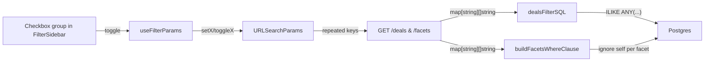

# Multi-select facet filters (spec, variant, brand)

## Goals & semantics

- Within one facet: OR (selecting wheel size 29" + 27.5" matches listings that have either).
- Across facets: AND (wheel size matches AND brand matches AND tire width matches).
- Facet value counts ignore that facet's own selections, so users can keep adding without options collapsing to zero (Backcountry/Algolia default; already true for specs and brand; fixed for variants below).
- Min discount and Sort remain single-select.
- URL contract: repeated query params, e.g. `?spec_wheel_size=29&spec_wheel_size=27.5&brand=SRAM&brand=Shimano&variant_Size=L&variant_Size=XL`. Already supported by URLSearchParams; no encoding tricks.

## Architecture sketch



## Backend changes (Go)

### 1. Param types — `apps/api/internal/db/specs.go` and `apps/api/internal/db/`

- Change `GetDealsParams.SpecFilters` and `GetDealsParams.VariantFilters` from `map[string]string` to `map[string][]string`.
- Same for `GetFacetsParams.SpecFilters` and `GetFacetsParams.VariantFilters`.
- Replace `GetDealsParams.Brand string` and `GetFacetsParams.Brand string` with `Brands []string` (keep an aliased single-value setter if needed for non-public callers).
- Drop the legacy `SpecKey` / `SpecValue` single-value fields (and the fallback in `dealsFilterSQL`) — already deprecated and not used by the web client.

### 2. Handler parsing — [apps/api/internal/api/handlers.go](apps/api/internal/api/handlers.go)

In `GetDeals` and `GetFacets`, replace the single-value collapse:

```go
params.SpecFilters = make(map[string][]string)
for key, vals := range r.URL.Query() {
    if !strings.HasPrefix(key, "spec_") { continue }
    specKey := strings.TrimSpace(strings.TrimPrefix(key, "spec_"))
    if specKey == "" { continue }
    for _, v := range vals {
        if t := strings.TrimSpace(v); t != "" {
            params.SpecFilters[specKey] = append(params.SpecFilters[specKey], t)
        }
    }
}
```

Same shape for `variant_<key>` → `params.VariantFilters`. For brand, use `params.Brands = trimNonEmpty(r.URL.Query()["brand"])`.

### 3. SQL builders

- [apps/api/internal/db/deals_filter.go](apps/api/internal/db/deals_filter.go) — replace `appendVariantFilters` with an OR-within-key fragment using `ILIKE ANY($n::text[])`:

```go
sb.WriteString(fmt.Sprintf(` AND EXISTS (
  SELECT 1 FROM jsonb_each_text(COALESCE(l.variant_options, '{}'::jsonb)) kv
  WHERE lower(kv.key) = lower($%d) AND kv.value ILIKE ANY($%d::text[])
)`, n, n+1))
```

- Brand condition (both `dealsFilterSQL` and `buildFacetsWhereClause`): switch to `l.brand ILIKE ANY($n::text[])`.
- The existing spec helper in [apps/api/internal/db/specs.go](apps/api/internal/db/specs.go) (`appendMetadataSpecFilterConditions`) already handles `len(values) > 1` with `ILIKE ANY`. Stop wrapping single values via the `expanded := map[string][]string{}` collapse in `dealsFilterSQL` and pass the multi-value map directly.

### 4. Facet counts (ignore self)

- Spec: `specFiltersOmit(specFiltersForWhere, f.key)` already removes the current key. Keep, just adapted to the multi-value type.
- Brand: keep `brandParams.Brands = nil` (currently `Brand = ""`).
- Variant: `discParams.VariantFilters = nil` zeroes all variant keys today. Replace with per-key omit so other variant dimensions still constrain counts:

```go
for _, vk := range variantKeys {
    perKeyParams := params
    perKeyParams.VariantFilters = omitKey(params.VariantFilters, vk)
    where, args := buildFacetsWhereClause(perKeyParams, specFiltersForWhere, true)
    ...
}
```

### 5. Tests

- Add table-driven tests in `apps/api/internal/db/deals_filter_test.go` (new) and an integration-style test in `apps/api/internal/db/specs_test.go` covering: single value, two values OR, multiple keys AND, empty value skipping. Postgres-bound tests can mirror existing patterns.

## Frontend changes

### 6. URL parsing — [apps/web/src/lib/filterParams.ts](apps/web/src/lib/filterParams.ts)

Change types to:

```ts
specFilters: Record<string, string[]>;
variantFilters: Record<string, string[]>;
brandFilters: string[]; // rename from brandFilter
```

Both `parseFilterParamsFromSearch` and `parseFilterParamsFromURL` collect all values for repeated keys (use `searchParams.getAll("brand")`, and `URLSearchParams.forEach` accumulating into arrays for `spec_*` / `variant_*`).

### 7. Filter param hook — [apps/web/src/hooks/useFilterParams.ts](apps/web/src/hooks/useFilterParams.ts)

- `applyToParams` for arrays: delete all instances of the key first, then `next.append(key, v)` once per value.
- Replace `setSpecFilter(key, value)` and `setVariantFilter(key, value)` with `toggleSpecFilter(key, value)` / `toggleVariantFilter(key, value)` (add if absent, remove if present). Keep `clearSpecFilter(key)` / `clearVariantFilter(key)` to drop all values for a key (used by chip "X" on the facet level if we keep it; otherwise per-value chips remove individually).
- Add `toggleBrandFilter(value)` and `clearBrandFilter()`.

### 8. Sidebar UI — [apps/web/src/components/FilterSidebar.tsx](apps/web/src/components/FilterSidebar.tsx) (+ drawer reuses)

Replace each `<Select>` for brand, spec facets, and variant facets with an inline checkbox group. New primitive in [apps/web/src/components/ui/](apps/web/src/components/ui/):

```tsx
// FacetCheckboxGroup.tsx
type Option = { value: string; count: number };
type Props = {
  label: string;
  name: string;
  values: string[];
  selected: string[];
  options: Option[];
  onToggle: (value: string) => void;
};
```

- Use the existing shadcn `Checkbox` (add via `pnpm dlx shadcn@latest add checkbox` if not yet present) and `Label`.
- Render `<fieldset>` / `<legend>` for grouping (a11y) — legend visually styled like today's `<label>`.
- Each row: `<Checkbox id={...} checked={...} onCheckedChange={...} /> <Label>{value} <span class="text-muted-foreground">({count})</span></Label>`.
- Preserve `mergeSelectedFacetValue` so selected-but-now-zero values still appear (so users can deselect from a stale URL).
- Long facet lists: defer "Show all" truncation. Note in the plan as out-of-scope but keep the API shape compatible.

### 9. Chips — [apps/web/src/components/FilterChips.tsx](apps/web/src/components/FilterChips.tsx)

No structural changes; the chip array becomes longer (one per selected value). Update [apps/web/src/views/DealsPageContent.tsx](apps/web/src/views/DealsPageContent.tsx) `activeFilters` builder to flatten arrays:

```ts
brandFilters.forEach((b) =>
  chips.push({
    key: `brand:${b}`,
    label: `Brand: ${b}`,
    onRemove: () => toggleBrandFilter(b),
  }),
);
Object.entries(specFilters).forEach(([k, vs]) =>
  vs.forEach((v) =>
    chips.push({
      key: `spec:${k}:${v}`,
      label: `${facetLabel(k)}: ${v}`,
      onRemove: () => toggleSpecFilter(k, v),
    }),
  ),
);
// same for variantFilters
```

`activeFilterCount` becomes `brandFilters.length + sum(spec arrays) + sum(variant arrays) + (storeFilter?1:0) + (minDiscount?1:0)`.

### 10. Analytics

In `DealsPageContent.tsx` capture handlers, keep the existing `filter_applied` event but extend properties:

```ts
posthog.capture("filter_applied", {
  filter_type: "spec",
  spec_key: key,
  value,
  selected_count: nextSelectedCount, // size of array AFTER toggle
  action: added ? "add" : "remove",
});
```

Same property extension for `brand` and `variant`. This keeps funnels intact (per `posthog-analytics.mdc` rule: prefer one event with discriminating properties). Document the new `selected_count` / `action` properties in [apps/web/README.md](apps/web/README.md).

### 11. Server-rendered category pages

Search-params utilities used by `app/(public)/...` routes ([apps/web/src/app/](apps/web/src/app/)) consume `parseFilterParamsFromSearch` — ensure they pass arrays through to the API client. The API client builder also needs to emit repeated keys.

### 12. Tests & stories

- Vitest: `parseFilterParamsFromSearch` / `parseFilterParamsFromURL` round-trip with repeated keys.
- Vitest: `useFilterParams` toggle add/remove and clear behavior.
- Storybook: `FacetCheckboxGroup.stories.tsx` with empty / 3-value / 30-value / selected-not-in-options cases.

## Out of scope (do not do in v1)

- Range slider for numeric facets (tire width, travel) — needs numeric typing in field library.
- Searchable combobox / "Show all" truncation for long facet lists — note in code comment near `FacetCheckboxGroup` for follow-up.
- Multi-select for store and min discount — stay single-select.
- `/canonical-categories` deprecation cleanup.

## Docs to update (per `documentation-sync.mdc`)

- [apps/api/README.md](apps/api/README.md) — `/deals` and `/facets` accept repeated `spec_<key>`, `variant_<key>`, and `brand`. OR-within-key, AND-across-keys.
- [apps/web/README.md](apps/web/README.md) — filter URL contract; new analytics properties (`selected_count`, `action`).
- [docs/ARCHITECTURE.md](docs/ARCHITECTURE.md) — short note in the data-flow / facets section that filters are multi-value.

## Risk & rollback

- Backwards compatibility: existing single-value bookmarks (`?spec_wheel_size=29`) still parse correctly because `getAll("spec_wheel_size")` returns `["29"]`. No migration needed.
- The biggest risk is the variant facet count refactor (per-key omit). Guard with the new test cases above and one manual regression sweep on the deals page.
- Rollback: revert API changes; frontend continues to send repeated params (server happily collapses again).
