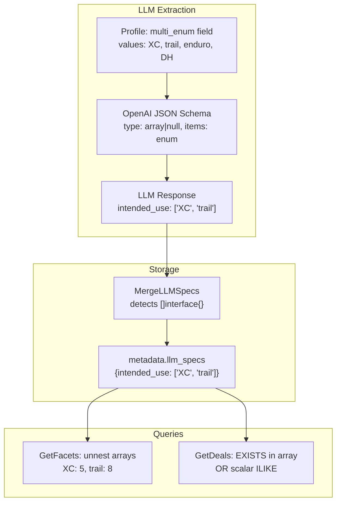

# Multi-Value Spec Support

## Problem

Specs are always stored as scalar strings (`fmt.Sprint(v)` in `MergeLLMSpecs`). Some specs like `intended_use` naturally have multiple valid values. The entire pipeline — LLM schema, storage, facet queries, and deal filtering — assumes scalar values only.

## Approach

Introduce a new field type `multi_enum` that tells the LLM to return an array, stores it as a JSONB array, and updates all downstream queries to handle both scalars and arrays transparently. No frontend changes required — a user filtering by `intended_use = trail` will correctly match listings where the array contains `"trail"`.

## Changes by Layer

### 1. Database Migration (new `020_multi_value_specs.sql`)

Widen the CHECK constraint on `llm_extraction_field_defs.field_type`:

```sql
ALTER TABLE llm_extraction_field_defs
  DROP CONSTRAINT chk_llm_extraction_field_defs_field_type,
  ADD CONSTRAINT chk_llm_extraction_field_defs_field_type CHECK (
    field_type IN ('integer', 'number', 'string', 'enum', 'multi_enum')
  );
```

File: [packages/shared/migrations/019_llm_extraction_field_library.sql](packages/shared/migrations/019_llm_extraction_field_library.sql) (original constraint at line 16)

### 2. LLM OpenAI Schema (`buildOpenAISchema`)

Add a `multi_enum` case that emits a nullable JSON Schema array with enum items:

```go
case "multi_enum":
    itemSchema := map[string]interface{}{"type": "string"}
    if len(f.Values) > 0 {
        enumVals := make([]interface{}, len(f.Values))
        for i, v := range f.Values {
            enumVals[i] = v
        }
        itemSchema["enum"] = enumVals
    }
    prop["type"] = []string{"array", "null"}
    prop["items"] = itemSchema
```

File: [apps/api/internal/llm/client.go](apps/api/internal/llm/client.go) lines 337-374

Also update the `SchemaField.Type` doc comment (line 66) to mention `multi_enum`.

### 3. Spec Storage (`MergeLLMSpecs`)

Currently line 103 does `llmSpecsObj[k] = fmt.Sprint(v)` for every value. This must detect `[]interface{}` (array from JSON decode) and store it as a proper JSON array of strings instead of flattening to a string like `[XC trail]`.

```go
switch val := v.(type) {
case []interface{}:
    arr := make([]string, 0, len(val))
    for _, elem := range val {
        if s := fmt.Sprint(elem); s != "" && s != "<nil>" {
            arr = append(arr, s)
        }
    }
    if len(arr) > 0 {
        llmSpecsObj[k] = arr
    }
default:
    llmSpecsObj[k] = fmt.Sprint(v)
}
```

File: [apps/api/internal/metadata/normalize.go](apps/api/internal/metadata/normalize.go) line 103

### 4. Facet Queries — Unnest Arrays

`**GetFacets` spec key/values query (lines 190-203 of [specs.go](apps/api/internal/db/specs.go)): Replace `jsonb_each_text` with a lateral subquery that handles both scalar and array values:

```sql
CROSS JOIN LATERAL (
  SELECT e.key,
    CASE WHEN jsonb_typeof(e.value) = 'array'
         THEN arr.elem
         ELSE e.value #>> '{}'
    END AS value
  FROM jsonb_each(f.metadata->'llm_specs') AS e(key, value)
  LEFT JOIN LATERAL jsonb_array_elements_text(
    CASE WHEN jsonb_typeof(e.value) = 'array' THEN e.value ELSE '[]'::jsonb END
  ) AS arr(elem) ON true
  WHERE CASE WHEN jsonb_typeof(e.value) = 'array'
             THEN arr.elem IS NOT NULL
             ELSE true END
) AS spec(key, value)
```

`**GetDistinctMetadataValues**` (lines 384-391): Same pattern — handle both scalar text extraction and array unnesting:

```sql
SELECT DISTINCT val FROM (
  SELECT metadata->'llm_specs'->>$1 AS val
  FROM store_listings
  WHERE ... AND jsonb_typeof(metadata->'llm_specs'->$1) <> 'array'
  UNION ALL
  SELECT arr.elem AS val
  FROM store_listings,
  LATERAL jsonb_array_elements_text(metadata->'llm_specs'->$1) AS arr(elem)
  WHERE ... AND jsonb_typeof(metadata->'llm_specs'->$1) = 'array'
) sub
WHERE val IS NOT NULL AND trim(val) <> ''
ORDER BY val LIMIT $limit
```

### 5. Deal + Facet Filtering — Match Inside Arrays

Both `GetDeals` ([db.go](apps/api/internal/db/db.go) lines 594-607) and `buildFacetsWhereClause` ([specs.go](apps/api/internal/db/specs.go) lines 346-358) use the same pattern to filter specs. Extract a shared helper function and update the WHERE clause to handle both forms:

```sql
AND (
  CASE WHEN jsonb_typeof(l.metadata->'llm_specs'->$key) = 'array'
    THEN EXISTS (
      SELECT 1 FROM jsonb_array_elements_text(l.metadata->'llm_specs'->$key) e
      WHERE e ILIKE $value
    )
    ELSE l.metadata->'llm_specs'->>$key ILIKE $value
  END
)
```

For the multi-value filter variant (multiple filter values per key), the array branch uses `ILIKE ANY(...)` inside the `EXISTS`.

### 6. Frontend — No Changes Required

The frontend sends `spec_intended_use=trail` (single value per spec key). The backend now matches that value against both scalar strings and arrays containing the value. The `<Select>` dropdown in [FilterSidebar.tsx](apps/web/src/components/FilterSidebar.tsx) continues to work — facet values are already individual strings (unnested from arrays), so the dropdown shows "XC (5)" and "trail (8)" as separate options.

### 7. Documentation Updates

- [packages/shared/README.md](packages/shared/README.md) and [packages/shared/migrations/README.md](packages/shared/migrations/README.md): Document migration 020
- [docs/TAXONOMY.md](docs/TAXONOMY.md): Mention `multi_enum` field type
- [CLAUDE.md](CLAUDE.md): Note `multi_enum` in the field type list

## Data Flow (after changes)



## Backward Compatibility

- Existing scalar spec values continue to work unchanged — all queries branch on `jsonb_typeof` to handle both forms.
- No backfill needed for existing data; only newly enriched listings with `multi_enum` fields will have array values.
- The `multi_enum` type is opt-in per field definition; existing `enum` fields remain scalar.
