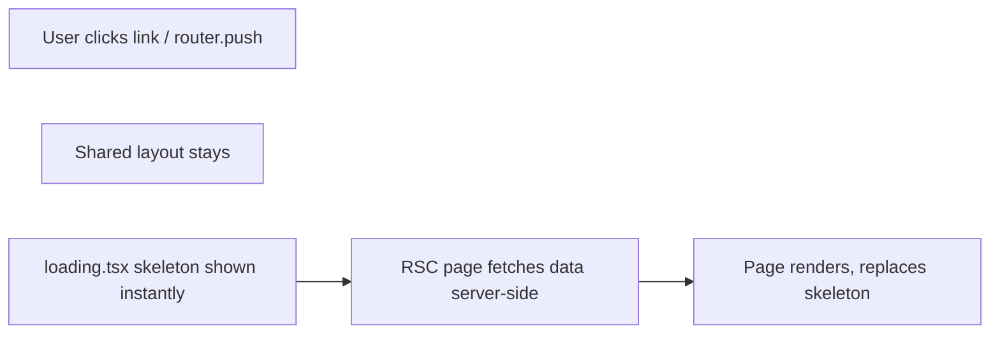

# Instant Navigation Feedback via Loading Skeletons

Add `loading.tsx` files for each public route segment. Next.js App Router wraps page content in a `<Suspense>` boundary automatically, using `loading.tsx` as the fallback. The skeleton appears **synchronously** when navigation starts -- the shared layout (NavHeader) stays in place and only the page content area swaps to the skeleton.



## Skeleton designs (matched to actual page layouts)

### 1. Home page -- `apps/web/src/app/(public)/loading.tsx`

Mirrors [HomePageContent.tsx](apps/web/src/views/HomePageContent.tsx):

- Centered hero block: two text-height pulse bars (headline + subtitle) + search bar placeholder
- "Shop by category" heading + 4-column grid of card-shaped pulse blocks (matching the `CategoryCard` grid)
- "Top deals" heading + 4-column grid of deal card placeholders

### 2. Deals list -- `apps/web/src/app/(public)/deals/loading.tsx`

Mirrors [DealsPageContent.tsx](apps/web/src/views/DealsPageContent.tsx):

- Two-column layout: left sidebar placeholder (60w, hidden on mobile) + right content area
- Right area: toolbar-height bar, category nav row, "X deals found" text bar, then a grid of 8 deal card skeletons

This also lets us **remove the now-redundant `<Suspense fallback={<LoadingState />}>` wrapper** in [deals/page.tsx](<apps/web/src/app/(public)/deals/page.tsx>) (lines 94-104), since `loading.tsx` provides the same Suspense boundary automatically.

### 3. Deal detail -- `apps/web/src/app/(public)/deals/[id]/loading.tsx`

Mirrors [DealDetailContent.tsx](<apps/web/src/app/(public)/deals/[id]/DealDetailContent.tsx>):

- "Back to deals" text link placeholder
- Card container with: image square (40x40 pulse) + right column (brand line, title line, store line, price line, button placeholder)

### 4. Shared skeleton primitive

Create a `Skeleton` component at `apps/web/src/components/ui/skeleton.tsx` (standard shadcn pattern):

```tsx
import { cn } from "@/lib/utils";

function Skeleton({ className, ...props }: React.ComponentProps<"div">) {
  return (
    <div
      className={cn("animate-pulse rounded-md bg-muted", className)}
      {...props}
    />
  );
}

export { Skeleton };
```

All three `loading.tsx` files compose from this primitive, keeping skeletons clean and consistent with the design system.

## Cleanup

- Remove the `<Suspense fallback={<LoadingState />}>` wrapper in [apps/web/src/app/(public)/deals/page.tsx](<apps/web/src/app/(public)/deals/page.tsx>) -- `loading.tsx` replaces it
- Delete [apps/web/src/components/LoadingState.tsx](apps/web/src/components/LoadingState.tsx) (only used as that Suspense fallback)

## Files to create/change

- `apps/web/src/components/ui/skeleton.tsx` -- new: reusable Skeleton primitive
- `apps/web/src/app/(public)/loading.tsx` -- new: home page skeleton
- `apps/web/src/app/(public)/deals/loading.tsx` -- new: deals list skeleton
- `apps/web/src/app/(public)/deals/[id]/loading.tsx` -- new: deal detail skeleton
- `apps/web/src/app/(public)/deals/page.tsx` -- remove redundant Suspense wrapper
- `apps/web/src/components/LoadingState.tsx` -- delete (replaced by loading.tsx)
