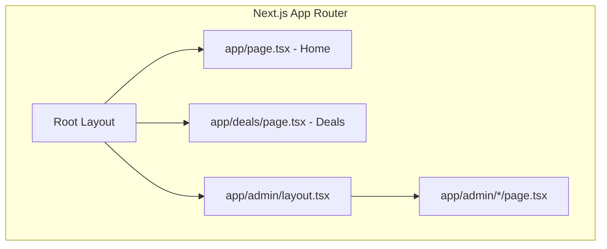

# Next.js Migration Plan

## Current State Summary

| Layer     | Current                | Location                                                                                 |
| --------- | ---------------------- | ---------------------------------------------------------------------------------------- |
| Framework | React 18 + Vite 6      | [apps/web](apps/web)                                                                     |
| Routing   | React Router 6         | [App.tsx](apps/web/src/App.tsx), [AdminSection.tsx](apps/web/src/admin/AdminSection.tsx) |
| Data      | TanStack Query + fetch | [api.ts](apps/web/src/api.ts), [hooks/queries.ts](apps/web/src/hooks/queries.ts)         |
| Styling   | Tailwind v4 + shadcn   | [index.css](apps/web/src/index.css), [components/ui/](apps/web/src/components/ui/)       |
| Env       | `VITE_API_URL`         | [api.ts](apps/web/src/api.ts), [admin/api.ts](apps/web/src/admin/api.ts)                 |
| Deploy    | Vercel (SPA rewrites)  | [vercel.json](apps/web/vercel.json)                                                      |

**Public routes:** `/` (Home), `/deals` (with query params: category, store, brand, sort, etc.)  
**Admin routes:** `/admin`, `/admin/stores`, `/admin/data`, ... (10 pages)

---

## Target Architecture



- **Home** and **Deals**: Server Components with initial data fetch; ISR with `revalidate: 60`
- **Admin**: Client Components (keep current behavior); layout handles auth gate

---

## Phase 1: Project Setup

### 1.1 Create Next.js App

- Add Next.js 15 to `apps/web` (in-place migration, not a new app)
- Remove Vite, `@vitejs/plugin-react`, `vite.config.ts`
- Add `next`, `react`, `react-dom`; keep `@tanstack/react-query`, `react-router-dom` only for admin (or remove after full migration)
- Create `next.config.ts` with:
  - `rewrites`: `/api/`_ → `http://localhost:8080/`_ (dev) or API URL (prod)
  - `images.domains` if using external image URLs
- Create `app/layout.tsx` (root layout) and `app/page.tsx` (home)

### 1.2 Environment Variables

| Old            | New                   | Notes                                                                          |
| -------------- | --------------------- | ------------------------------------------------------------------------------ |
| `VITE_API_URL` | `NEXT_PUBLIC_API_URL` | Client-side; defaults to `/api`                                                |
| —              | `API_URL`             | Server-side only; full URL for SSR fetch (e.g. `http://localhost:8080` in dev) |

Create `lib/api.ts` helper:

```ts
export function getApiBase(): string {
  if (typeof window !== "undefined")
    return process.env.NEXT_PUBLIC_API_URL || "/api";
  return (
    process.env.API_URL ||
    process.env.NEXT_PUBLIC_API_URL ||
    "http://localhost:8080"
  );
}
```

Update [api.ts](apps/web/src/api.ts) and [admin/api.ts](apps/web/src/admin/api.ts) to use this helper.

### 1.3 Tailwind Migration

- Tailwind v4 with `@tailwindcss/vite` may need adjustment for Next.js (Next uses PostCSS by default)
- Options: (a) Use Next.js + Tailwind v3 (stable), or (b) Configure Tailwind v4 with Next.js PostCSS if supported
- Preserve [index.css](apps/web/src/index.css) theme tokens and `@theme` block; move to `app/globals.css`
- Keep shadcn components; ensure they work with Next.js (they generally do)

---

## Phase 2: Routing and Layouts

### 2.1 Root Layout

Create `app/layout.tsx`:

- Wrap with `ThemeProvider` (from [ThemeContext.tsx](apps/web/src/context/ThemeContext.tsx))
- Wrap with `QueryClientProvider` (create new provider for Next.js; use `QueryClient` with default options)
- Include theme script (from current [index.html](apps/web/index.html)) for FOUC prevention
- Render `{children}`

### 2.2 Public Layout

Create `app/(public)/layout.tsx`:

- Render `NavHeader` + `{children}` (equivalent to [PublicLayout](apps/web/src/components/PublicLayout.tsx))
- Add `@vercel/analytics`

### 2.3 Route Mapping

| Current         | Next.js                                          |
| --------------- | ------------------------------------------------ |
| `/`             | `app/page.tsx`                                   |
| `/deals`        | `app/deals/page.tsx`                             |
| `/admin`        | `app/admin/page.tsx`                             |
| `/admin/stores` | `app/admin/stores/page.tsx`                      |
| `/admin/data`   | `app/admin/data/page.tsx`                        |
| ...             | `app/admin/[slug]/page.tsx` or individual routes |

---

## Phase 3: Page Migration

### 3.1 Home Page (SSR/ISR)

- Create `app/page.tsx` as Server Component
- Fetch `categoryTree` and `topDeals` on server using `fetch` + `getApiBase()`
- Pass data as props to client components (e.g. `CategoryCard` grid, `DealGrid`)
- Add `export const revalidate = 60` for ISR
- Add metadata: `export const metadata = { title: "The Dropper | MTB Deals", description: "..." }`

**Refactor:** Extract presentational parts of [HomePage.tsx](apps/web/src/pages/HomePage.tsx) into client components that accept data as props. Search submit and navigation stay client-side.

### 3.2 Deals Page (SSR/ISR)

- Create `app/deals/page.tsx` that reads `searchParams` (category, store, brand, sort, offset, etc.)
- Fetch deals and facets on server based on `searchParams`
- Pass to client components; filters and pagination remain client-side (or use server actions for filter changes with navigation)
- Add `revalidate = 60`
- Add dynamic metadata based on category (e.g. "Mountain Bike Deals | The Dropper")

**Refactor:** [DealsPage.tsx](apps/web/src/pages/DealsPage.tsx) is heavily client-driven. Strategy:

- Server: Fetch initial deals + facets; render shell with data
- Client: `useFilterParams` → use `useSearchParams` from `next/navigation`; keep filter UI, modal, pagination as client components

### 3.3 Admin Section

- Create `app/admin/layout.tsx`: `AdminGate` + `AdminLayout`; render `{children}` in content area
- Update [AdminLayout](apps/web/src/admin/AdminLayout.tsx): Replace `<Outlet />` with `{children}`; use `Link` from `next/link` for nav items; use `usePathname()` from `next/navigation` for active state
- Create one page per admin route: `app/admin/page.tsx` (Dashboard), `app/admin/stores/page.tsx`, etc.
- Each page: `"use client"` + render the corresponding component (Dashboard, StoreManager, etc.)
- Admin pages remain client-only; no SSR needed

---

## Phase 4: Router and Navigation Replacements

### 4.1 Replace React Router

| React Router      | Next.js                                  |
| ----------------- | ---------------------------------------- |
| `Link`            | `next/link`                              |
| `useNavigate`     | `useRouter` from `next/navigation`       |
| `useSearchParams` | `useSearchParams` from `next/navigation` |
| `useLocation`     | `usePathname`, `useSearchParams`         |
| `<Outlet />`      | `{children}` in layout                   |

### 4.2 Files to Update

- [NavHeader](apps/web/src/components/NavHeader.tsx): `Link` → `next/link`
- [CategoryCard](apps/web/src/components/CategoryCard.tsx): `Link` → `next/link`
- [HomePage](apps/web/src/pages/HomePage.tsx): `useNavigate` → `useRouter().push`
- [useFilterParams](apps/web/src/hooks/useFilterParams.ts): `useSearchParams` from `next/navigation`
- [DealCard](apps/web/src/components/DealCard.tsx), [FilterChips](apps/web/src/components/FilterChips.tsx), etc.: any `Link` or `useNavigate` usage
- [AdminLayout](apps/web/src/admin/AdminLayout.tsx): nav `Link`s, `Outlet` → `children`
- [AdminGate](apps/web/src/admin/AdminGate.tsx): `Link` for "Back to deals"

---

## Phase 5: Data Fetching

### 5.1 Server-Side Fetch

Create `lib/fetch-server.ts` (or extend `api.ts`):

- Use `getApiBase()` for absolute URL in server context
- Implement `fetchDeals`, `fetchCategoryTree`, `fetchFacets` for server use (or reuse existing with base URL override)

### 5.2 TanStack Query + Hydration

- For pages that need client-side refetch (Deals filters, deal modal): keep TanStack Query
- Pass server-fetched data as `initialData` to `useQuery` to avoid double fetch on first render
- Or: use `HydrationBoundary` + `dehydrate` to pass server cache to client

### 5.3 Admin

- Admin continues to use TanStack Query exclusively (client-side); no changes to [admin/hooks/queries.ts](apps/web/src/admin/hooks/queries.ts) except API base URL

---

## Phase 6: Metadata and SEO

### 6.1 Per-Page Metadata

- `app/layout.tsx`: default `metadata` (title template, description)
- `app/page.tsx`: home-specific metadata
- `app/deals/page.tsx`: `generateMetadata({ searchParams })` for dynamic title/description based on category

### 6.2 Schema Markup (Post-Migration)

- Add JSON-LD `Product` + `Offer` for deal cards (in `DealCard` or page)
- Add `AggregateOffer` for deal listing pages
- Add `BreadcrumbList` for category drill-down

### 6.3 llms.txt and Sitemap

- Add `app/llms.txt/route.ts` (or `public/llms.txt`) for AI crawlers
- Add `app/sitemap.ts` for dynamic sitemap

---

## Phase 7: Build, Storybook, and Deploy

### 7.1 Scripts and Build

- Update [apps/web/package.json](apps/web/package.json): `"dev": "next dev"`, `"build": "next build"`, `"start": "next start"`
- Remove Vite scripts and config
- Update root `Makefile` or docs if they reference `vite`

### 7.2 Storybook

- Switch from `@storybook/react-vite` to `@storybook/nextjs` (or keep `react-vite` if components are framework-agnostic)
- Components using `next/link` need a Storybook decorator to mock the router
- Update [.storybook/main.ts](apps/web/.storybook/main.ts) for Next.js if needed

### 7.3 Vercel

- Remove or simplify [vercel.json](apps/web/vercel.json); Next.js is detected automatically
- Ensure `API_URL` and `NEXT_PUBLIC_API_URL` are set in Vercel env
- API proxy: use Next.js `rewrites` in `next.config.ts` to forward `/api` to Go backend

---

## Phase 8: Cleanup and Validation

- Delete `main.tsx`, `index.html`, `vite.config.ts`, `vite-env.d.ts`
- Remove `react-router-dom` if fully migrated
- Update [apps/web/README.md](apps/web/README.md), [docs/ARCHITECTURE.md](docs/ARCHITECTURE.md), [CLAUDE.md](CLAUDE.md)
- Smoke test: home, deals, filters, admin login, key admin pages
- Verify SSR: view page source, confirm deal content in HTML

---

## Migration Order (Recommended)

1. **Phase 1** — Next.js setup, env, Tailwind
2. **Phase 2** — Root + public layout, basic routing
3. **Phase 3.1** — Home page (SSR/ISR)
4. **Phase 4** — Replace React Router in public components
5. **Phase 3.2** — Deals page (SSR/ISR)
6. **Phase 3.3** — Admin layout and pages
7. **Phase 5** — Data fetching and hydration
8. **Phase 6** — Metadata and SEO
9. **Phase 7** — Build, Storybook, deploy
10. **Phase 8** — Cleanup and docs

---

## Risk Mitigation

| Risk                      | Mitigation                                                                         |
| ------------------------- | ---------------------------------------------------------------------------------- |
| Tailwind v4 + Next.js     | Test early; fall back to Tailwind v3 if needed                                     |
| API URL in SSR            | Use `API_URL` for server; ensure Vercel env is set                                 |
| Admin auth (localStorage) | Admin stays client-only; no change to auth flow                                    |
| Storybook breakage        | Mock `next/link` and `next/navigation` in decorators                               |
| Large migration           | Migrate one route at a time; keep Vite running in parallel until home + deals work |

---

## Estimated Effort

| Phase  | Effort    |
| ------ | --------- |
| 1–2    | 1–2 days  |
| 3.1, 4 | 1 day     |
| 3.2    | 1–2 days  |
| 3.3    | 1 day     |
| 5–6    | 1 day     |
| 7–8    | 0.5–1 day |

**Total:** ~6–8 days for a careful migration.
