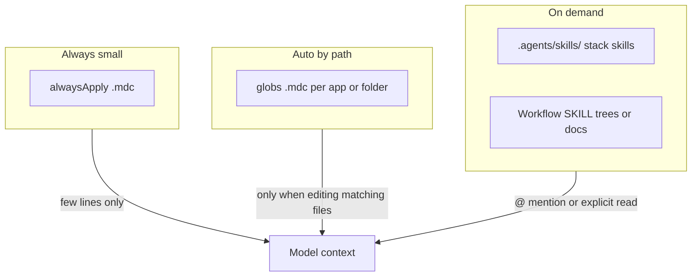

# Organize Cursor rules for performance and accuracy

## What you have today

| Layer                     | Location                                                  | Role                                                                                                                           |
| ------------------------- | --------------------------------------------------------- | ------------------------------------------------------------------------------------------------------------------------------ |
| **Native Cursor rules**   | `[.cursor/rules/*.mdc](.cursor/rules/)` (7 files)         | These are the primary mechanism: `alwaysApply` and/or `globs` control when they load.                                          |
| **Imported agent-skills** | `[.cursor/rules/*/SKILL.md](.cursor/rules/)` (21 folders) | Full workflow playbooks from [addyosmani/agent-skills](https://github.com/addyosmani/agent-skills); long, phase-based content. |
| **Project skills**        | `[.agents/skills/*/SKILL.md](.agents/skills/)` (8 files)  | Stack-specific skills (shadcn, TanStack Query, Go, Neon, etc.) — already a good “on-demand” home.                              |
| **Repo brain**            | `[CLAUDE.md](CLAUDE.md)`                                  | Already carries setup, commands, architecture — overlaps conceptually with generic workflow skills.                            |

Cursor’s **highest context cost** is anything that is **always applied** or repeatedly **auto-attached** to broad globs. Your `[documentation-sync.mdc](.cursor/rules/documentation-sync.mdc)` and `[posthog-analytics.mdc](.cursor/rules/posthog-analytics.mdc)` use `alwaysApply: true` (appropriate for “don’t forget docs/analytics,” but worth keeping **short**). Your other `.mdc` files are **path-scoped** (Go, scraper parsers, web components, admin, error reporting) — that’s the right pattern.

## Principles (optimize performance, accuracy, context)

1. **Minimize `alwaysApply: true`** — Reserve it for a small number of non‑negotiables (you’re already at two; avoid adding more unless each is very short).
2. **Prefer narrow `globs` over broad ones** — e.g. `apps/web/src/**/*.tsx` is better than `**/*.tsx` if you can avoid pulling UI rules into unrelated edits.
3. **One concern per rule** — Cursor’s own guidance (see `[.cursor/skills-cursor/create-rule/SKILL.md](../../.cursor/skills-cursor/create-rule/SKILL.md)`) suggests **concise** rules (~50 lines for `.mdc`-style snippets); split or link out instead of megafiles.
4. **Avoid duplicating the same policy** in three places (`CLAUDE.md`, an always-on `.mdc`, and a SKILL) — pick **one canonical home** and elsewhere add a one-line pointer.
5. **Treat generic workflows as optional** — Spec-driven development, shipping, CI, etc. rarely need to sit in **every** chat; they belong in **manual / @-invoked** skills or docs, not in always-on context.

## Recommended layout (mental model)

## Concrete organization options

**Option A — Keep workflows out of automatic context (strong default)**

- Leave **only** thin, project-specific `[.cursor/rules/*.mdc](.cursor/rules/)` for auto/always behavior.
- **Move** the 21 imported `SKILL.md` trees from `.cursor/rules/<name>/` to something like `**.agents/skills/workflows/`** (or `docs/agent-workflows/`) so they are **documentation + @-invoked playbooks, not mistaken for Cursor’s first-class rule files.
- Keep `[using-agent-skills/SKILL.md](.cursor/rules/using-agent-skills/SKILL.md)` as a **single index** (or replace with a short `workflows.md` index) that lists names and “when to use,” with paths to each SKILL.

**Option B — Stay under `.cursor/rules/` but clarify role**

- Rename or group folders so it’s obvious: e.g. `.cursor/rules/_workflows/spec-driven-development/SKILL.md` (underscore prefix = “not a `.mdc` rule”).
- Add **one** small `.mdc** whose only job is describing when to open which workflow (optional` alwaysApply: false`+ good`description` if you use agent-selected rules).
- Still avoid duplicating long prose in multiple always-on places.

**Option C — Merge duplicates**

- Where `[context-engineering/SKILL.md](.cursor/rules/context-engineering/SKILL.md)` overlaps `[CLAUDE.md](CLAUDE.md)`, **delete or shorten** the duplicate and link to `CLAUDE.md` for commands and stack facts.
- Same for generic “how to write rules” vs your actual `[.mdc](.cursor/rules/)` files.

## Accuracy tips

- **Conflict resolution**: If two rules disagree, the model may follow the wrong one. After consolidation, **one source of truth** per topic (e.g. Sentry policy only in `[error-reporting.mdc](.cursor/rules/error-reporting.mdc)` + `[docs/ARCHITECTURE.md](docs/ARCHITECTURE.md)`).
- **Descriptions matter**: For any rule that can be **agent-selected**, write the `description` field so it matches real tasks (“Use when debugging failing scraper parsers”) — that improves relevance when Cursor picks rules.

## What to verify in the product

Open **Cursor Settings → Rules** (or the project rules list) and confirm:

- Which files are **Always**, **Auto**, **Agent**, or **Manual**.
- Whether nested `SKILL.md` under `.cursor/rules/` are treated as **project rules** in your Cursor version (behavior can differ by version). That answer drives whether **Option A** (move workflows out) is necessary or optional.

## Summary

- **Performance / context**: Few always-on lines; narrow globs; long workflows **off the default path** (`.agents/skills/` or docs + `@`).
- **Accuracy**: One canonical rule per concern; trim overlap with `CLAUDE.md`.
- **Maintainability**: Keep `[.cursor/rules/*.mdc](.cursor/rules/)` as the **small, automatic** layer; use imported agent-skills as **libraries you invoke**, not as a second copy of everything the model already sees.
