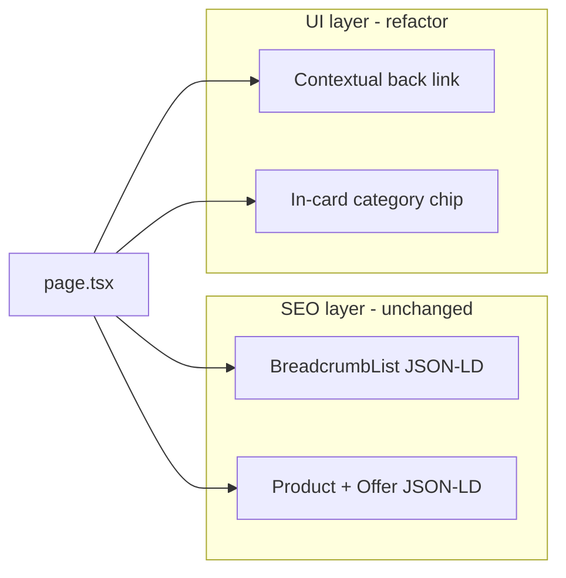

# PDP navigation refresh (UX + SEO)

## What’s going on today

There are **two separate concerns** on the deal detail page:

| Concern                                          | Where it lives                                                                                        | Visible?                                |
| ------------------------------------------------ | ----------------------------------------------------------------------------------------------------- | --------------------------------------- |
| **SEO breadcrumbs** (rich results)               | [`page.tsx`](<apps/web/src/app/(public)/deals/[id]/page.tsx>) → `buildBreadcrumbJsonLd(...)`          | No — JSON-LD only                       |
| **Category cross-link** (internal linking / GEO) | [`DealDetailContent.tsx`](<apps/web/src/app/(public)/deals/[id]/DealDetailContent.tsx>) lines 153–168 | Yes — second line under “Back to deals” |

The line you highlighted (`Parent › Child — more deals in this category`) is **not** the SEO breadcrumb. Google gets the full trail (`Home → Deals → … → Product`) from structured data in [`jsonLd.ts`](apps/web/src/lib/jsonLd.ts). That can stay exactly as-is — JSON-LD does not require visible breadcrumb UI.

The visible second line was added later for crawlable internal links when `?from=` does not already point at the same category ([`apps/web/README.md`](apps/web/README.md) line 23). It reads like a breadcrumb but uses different styling than [`DealsCategoryNav`](apps/web/src/components/DealsCategoryNav.tsx), which creates the “out of date / out of place” feeling — especially stacked under the mono “← Back to deals” link.

The Pencil reference ([`designs/README.md`](designs/README.md)) shows deal detail with **only a back link** at the top — no category prose line.

## Recommended approach

### 1. Keep all SEO structured data unchanged

In [`page.tsx`](<apps/web/src/app/(public)/deals/[id]/page.tsx>):

- **Do not remove or simplify** `buildBreadcrumbJsonLd(breadcrumbItems)` — this is what powers breadcrumb rich results.
- **Do not remove** `buildProductJsonLd(deal)`.
- Existing [`seo-smoke.ts`](apps/web/scripts/seo-smoke.ts) continues to pass with no changes.

### 2. Replace the two-line top nav with one contextual back link

Add a small helper in [`dealsBackHref.ts`](apps/web/src/lib/dealsBackHref.ts), e.g. `dealsListBackLabel(href, categoryTree?)`:

| `backToDealsHref` pathname       | Label                                                                                                                                                                                             |
| -------------------------------- | ------------------------------------------------------------------------------------------------------------------------------------------------------------------------------------------------- |
| `/deals/c/...`                   | `← Back to {leaf category name}` (resolve slug via existing [`parseCategorySlugFromDealsPath`](apps/web/src/lib/dealsCategoryPath.ts) + [`findCategoryBySlug`](apps/web/src/lib/categoryTree.ts)) |
| `/deals/hub/{slug}`              | `← Back to {hub.title}` via [`getSeoHubBySlug`](apps/web/src/lib/seoHubs.ts)                                                                                                                      |
| `/deals` (with or without query) | `← Back to deals`                                                                                                                                                                                 |

Compute the label **server-side** in `page.tsx` and pass `backToDealsLabel` as a prop so the client component stays dumb.

Wrap in `<nav aria-label="Deal navigation">` with the existing mono link styling — single row, no second line.

**UX win:** When a user arrives from a category list, they currently see generic “Back to deals” _and_ the category line is hidden (redundant logic). A contextual label (“← Back to Brakes”) is clearer without adding clutter.

### 3. Move category cross-link into the product card

Remove the top-of-page block at lines 153–168. Instead, when `categoryBrowseHref` is set and **not** redundant with back (same `isCategoryBrowseRedundantWithBack` check), render a compact in-card link below the product title area:

- Use existing design language: `Button variant="outline" size="sm"` (same family as deals list breadcrumbs) **or** a mono chip consistent with variant pills in the variants table.
- Copy: **`More in {categoryBrowseLabel}`** — drop the em-dash prose; shorter and less breadcrumb-like.
- Still a crawlable `<Link>` for internal linking when users land directly (home, search, shared URL without `?from=`).

Placement suggestion: between the store kicker (`// STORE`) and the discount badges — reads as product context, not page chrome.

### 4. Analytics

No new PostHog events required unless you want click tracking on the category chip later. Existing `deal_detail_viewed` with `list_surface` stays unchanged. The category line never had its own event.

### 5. Docs

Update the deal-detail bullet in [`apps/web/README.md`](apps/web/README.md) to describe: contextual back label + in-card category chip (when non-redundant), JSON-LD breadcrumbs unchanged.

## Files to touch

- [`apps/web/src/lib/dealsBackHref.ts`](apps/web/src/lib/dealsBackHref.ts) — `dealsListBackLabel()` (+ optional unit tests if a test file exists nearby; otherwise keep logic thin enough to skip)
- [`apps/web/src/app/(public)/deals/[id]/page.tsx`](<apps/web/src/app/(public)/deals/[id]/page.tsx>) — compute and pass `backToDealsLabel`
- [`apps/web/src/app/(public)/deals/[id]/DealDetailContent.tsx`](<apps/web/src/app/(public)/deals/[id]/DealDetailContent.tsx>) — simplified nav + in-card category chip
- [`apps/web/README.md`](apps/web/README.md) — behavior note

## What we are explicitly not doing

- Removing JSON-LD breadcrumbs (would hurt rich results, not help UX)
- Adding a full visible breadcrumb trail on PDP (duplicates deals list nav and fights “Back to deals”)
- Hiding category links with CSS-only tricks (bad for accessibility; in-card `<Link>` is better)

## Verification

1. **Direct landing** (`/deals/123` no `from`): back says “← Back to deals”; category chip visible when deal has `canonical_category`.
2. **From category** (`?from=/deals/c/components/brakes`): back says “← Back to Brakes” (or leaf name); category chip hidden.
3. **From hub** (`?from=/deals/hub/fox-forks`): back says “← Back to Fox fork deals”.
4. **View source**: `BreadcrumbList` + `Product` JSON-LD still present with full ancestor chain.
5. **Optional post-deploy**: Google Rich Results Test on a deal URL to confirm breadcrumb + product schemas validate.
