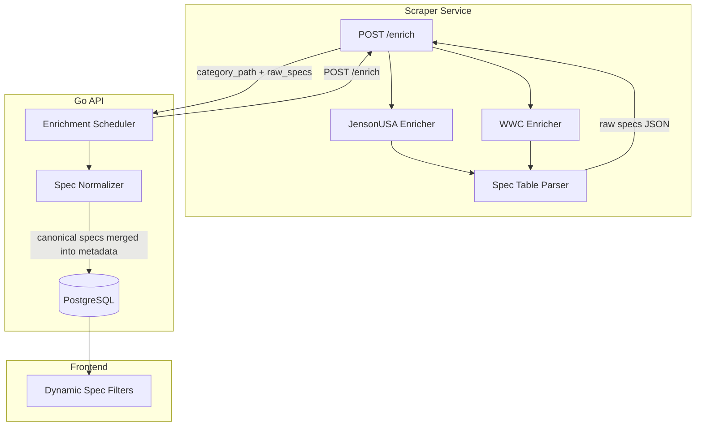

# PDP Spec Extraction for Fine-Grain Filtering

## Current State

- Enrichment visits PDPs but only extracts `category_path` from breadcrumbs
- `metadata` JSONB column exists with GIN index, currently populated by regex on product names (`[apps/api/internal/metadata/extract.go](apps/api/internal/metadata/extract.go)`) -- extracts: `wheel_size`, `suspension_travel_mm`, `model_year`, `groupset`
- Frontend already renders filter chips from metadata fields (`[apps/web/src/components/DealFilters.tsx](apps/web/src/components/DealFilters.tsx)`)
- Enrichment result currently only returns `category_path` -- `[UpdateListingEnrichment()](apps/api/internal/db/db.go)` only writes `category_path` + `last_enriched_at`

## Architecture



## Phase 1: Raw Spec Extraction (Scraper Side)

Extend the enrichment functions to also extract the spec/specifications table from PDPs and return it alongside `category_path`.

- **JensonUSA** (`[apps/scraper/src/parsers/jensonusa.ts](apps/scraper/src/parsers/jensonusa.ts)`): Already uses Playwright to visit PDPs. Add a page.evaluate script to find and parse the specs table (likely a `<table>` or `<dl>` inside a "Specifications" section). Return raw key-value pairs.
- **Worldwide Cyclery** (`[apps/scraper/src/parsers/worldwidecyclery.ts](apps/scraper/src/parsers/worldwidecyclery.ts)`): Two options:
  - **Option A (preferred)**: Fetch `/products/{handle}.json` which includes `body_html` containing the spec table. Parse it server-side with cheerio (no browser needed).
  - **Option B**: Add a Playwright-based enricher similar to JensonUSA.
- **Revel Bikes**: Same Shopify approach as Worldwide Cyclery.

Update the `EnrichResult` type to include a `raw_specs` field:

```typescript
interface EnrichResult {
  category_path: string[] | null;
  raw_specs: Record<string, string> | null;
}
```

## Phase 2: Spec Normalization (API Side)

Create a normalization layer that maps raw spec keys to canonical attribute names.

- Add a new file `apps/api/internal/metadata/normalize.go` with a mapping table:
  - "Tooth Count" / "Number of Teeth" / "Teeth" -> `tooth_count`
  - "Material" / "Frame Material" -> `material`
  - "Weight" -> `weight_grams`
  - "Wheel Size" -> `wheel_size`
  - "Travel" / "Suspension Travel" -> `suspension_travel_mm`
  - "Brake Type" / "Piston Count" -> `brake_pistons`
  - "Speeds" / "Drivetrain Speeds" -> `drivetrain_speeds`
  - etc.
- Merge normalized specs into the existing `metadata` JSONB, with PDP specs taking priority over name-extracted values (more accurate)
- Update `[UpdateListingEnrichment()](apps/api/internal/db/db.go)` to accept and merge specs into `metadata`

## Phase 3: API Filtering

- Extend the `/deals` handler (`[apps/api/internal/api/handlers.go](apps/api/internal/api/handlers.go)`) to support new spec-based query params (e.g., `tooth_count`, `material`, `brake_pistons`)
- Consider a generic approach: `spec.{key}={value}` pattern so new specs don't require handler changes
- Add a new endpoint `GET /api/spec-values?key=material` that returns distinct values for a given spec key (for populating filter dropdowns)

## Phase 4: Frontend Dynamic Filters

- Extend `[DealFilters.tsx](apps/web/src/components/DealFilters.tsx)` to render spec-based filters
- Filters should be category-aware: when a user selects "Components > Chainrings", show tooth_count and material filters; for "Bikes > Mountain", show wheel_size and travel filters
- Populate filter options dynamically from the `/api/spec-values` endpoint

## Decisions (Locked In)

- **Normalization approach**: Hardcoded mapping table in Go (like current `extract.go`). Can promote to DB-backed later if needed.
- **Spec storage**: Continue using the single `metadata` JSONB column (already GIN-indexed).
- **Enrichment for Shopify stores**: Use Shopify JSON API (`/products/{handle}.json`) to extract specs from `body_html`. No browser needed for WWC/Revel.
