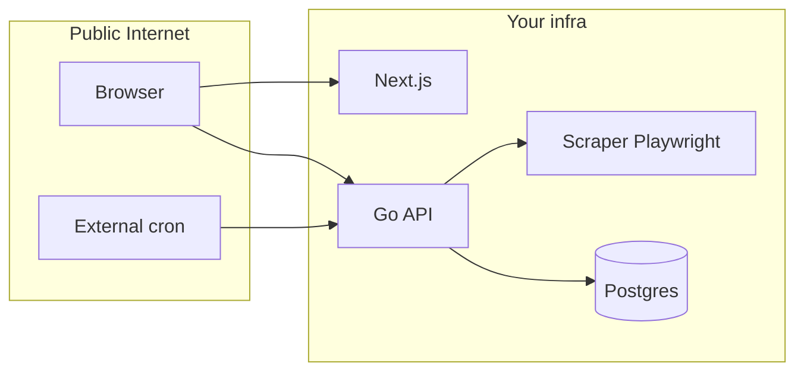

# Production security audit

This audit is based on static analysis of the repository ([apps/api](apps/api), [apps/scraper](apps/scraper), [apps/web](apps/web)). It is **not** a penetration test or dependency CVE scan—those should be run separately (see [Verification checklist](#verification-checklist)).

---

## Architecture (trust boundaries)



**Trust assumption:** Only the API should be able to drive the scraper. If the scraper URL is reachable from the internet without auth, that boundary is broken.

---

## Critical

### 1. Job triggers are **unauthenticated** when `CRON_SECRET` is unset

`[validateCronSecret](apps/api/main.go)` returns `true` when `CRON_SECRET` is empty:

```103:112:apps/api/main.go
func validateCronSecret(r *http.Request) bool {
	secret := os.Getenv("CRON_SECRET")
	if secret == "" {
		return true
	}
	got := r.Header.Get("X-Cron-Secret")
	if got == "" {
		got = r.URL.Query().Get("secret")
	}
	return got == secret
}
```

`[validateCronOrAdmin](apps/api/main.go)` ORs that with admin Bearer auth. If the secret is empty, the first branch is always true, so **any client can `POST /scrape-now` and `POST /enrich-now`** (expensive jobs, DoS, data churn).

**Before go-live:** Set a strong `CRON_SECRET` in production and configure cron (and any manual tools) to send `X-Cron-Secret`. Prefer **not** using `?secret=` in URLs (secrets appear in access logs, referrers, browser history).

**Optional hardening (code):** Require auth when `CRON_SECRET` is unset in production (e.g. env `ENV=production` fails fast), or invert logic so missing secret means “forbid” unless an explicit `ALLOW_OPEN_CRON=1` is set for local dev only.

---

### 2. Scraper HTTP API has **no authentication**

`[apps/scraper/src/server.ts](apps/scraper/src/server.ts)` exposes `POST /scrape` and `POST /enrich` with only Zod validation—no shared secret, no mTLS. Anyone who can reach the scraper URL can supply a `url` and `store`; Playwright will navigate there (**SSRF-style abuse**, resource exhaustion, abuse of retailer sites from your IP).

**Before go-live:**

- Prefer **private networking** (same VPC / Render private service / allowlist so only the API’s egress IP can call the scraper).
- If the scraper must stay on a public URL, add a **shared secret** header checked on every route (API and scraper both get the same env var), or terminate TLS with a gateway that enforces auth.

**Operational:** Ensure `DEBUG=1` is **never** set in production (`[/scrape-debug](apps/scraper/src/server.ts)` fetches arbitrary URLs and returns HTML snippets).

---

## High

### 3. Admin model: single shared password, Bearer token, `localStorage`

`[ValidateAdminAuth](apps/api/internal/api/admin.go)` compares `Authorization: Bearer <ADMIN_PASSWORD>` to the env value with `==` (not constant-time; minor concern). The web app stores the token under `[adminPassword` in `localStorage](apps/web/src/admin/api.ts)`—any XSS in the admin SPA can exfiltrate it.

**Before go-live:**

- Use a **long, random** `ADMIN_PASSWORD`; rotate if leaked.
- Treat admin as **high-value**: keep dependencies patched, avoid introducing `dangerouslySetInnerHTML` with untrusted data in admin routes, consider **HttpOnly session cookies** + server-side session if you outgrow this model.

### 4. No rate limiting on `POST /admin/auth`

Brute-force of the admin password is only limited by network and your hosting. **Mitigation:** IP-based rate limiting at the edge (Cloudflare, Vercel firewall rules, API gateway) or application-level throttle on `/admin/auth`.

---

## Medium

### 5. Information disclosure on 5xx responses (public API)

Many handlers return internal errors to the client, e.g. `[GetDeals](apps/api/internal/api/handlers.go)` and `[GetStatus](apps/api/internal/api/handlers.go)` use `http.Error(w, err.Error(), ...)`. That can leak SQL or schema details to anonymous users.

**Remediation:** Log the full error server-side; return a generic body for public routes (e.g. `"internal error"`) unless `ENV=development`.

### 6. `GET /status` is fully public

It exposes per-store scrape health and whether the scraper is reachable—useful for monitoring but also reconnaissance. Acceptable if intentional; otherwise restrict or move behind admin.

### 7. CORS defaults to `*`

`[corsMiddleware](apps/api/main.go)` defaults `CORS_ORIGINS` to `*`. Fine for a read-only public JSON API without credentials; if you ever send cookies or credential headers to the API, **narrow origins** explicitly.

### 8. Database TLS

Default local `DATABASE_URL` uses `sslmode=disable` (`[.env.example](.env.example)`). Production (e.g. Neon) should use `**sslmode=require` (or stricter) in the connection string—verify in platform settings.

---

## Low / hygiene

- **Sentry / logs:** Confirm PII and secrets are not logged (URLs and store names are probably OK; avoid logging full `Authorization` headers).
- **LLM keys:** `[OPENAI_API_KEY](apps/api/internal/llm/client.go)` is server-only; ensure it never appears in `NEXT_PUBLIC_` or client bundles (current layout looks server-side only).
- **Next.js `[layout.tsx](apps/web/src/app/layout.tsx)`:** `dangerouslySetInnerHTML` is a fixed theme script—no user input; acceptable.

---

## Verification checklist (run before launch)

| Activity              | Tool / action                                                                                            |
| --------------------- | -------------------------------------------------------------------------------------------------------- |
| Go vulnerability scan | `govulncheck ./...` in `apps/api`                                                                        |
| Node audit            | `pnpm audit` (scraper + web)                                                                             |
| Secrets               | Confirm `CRON_SECRET`, `ADMIN_PASSWORD`, `OPENAI_API_KEY`, DB URL only in host env—not in repo or client |
| Scraper exposure      | From an unrelated network, `curl` scraper `/scrape`—should fail if locked down                           |
| Cron                  | `POST /scrape-now` without header should return **403** when `CRON_SECRET` is set                        |

---

## Documentation drift

[apps/api/README.md](apps/api/README.md) mentions `POST /admin/login`; the route implemented is `**POST /admin/auth`** (`[PostAuthHandler](apps/api/internal/api/admin.go)`). The comment on the `/scrape-now` handler (“requires CRON_SECRET … **if set**”) is accurate but easy to misread—worth clarifying that **no secret means open access.

---

## Suggested follow-up (if you want code changes)

1. Fail closed on cron triggers when `CRON_SECRET` is empty in production.
2. Add optional `SCRAPER_SHARED_SECRET` (or similar) to scraper + API client.
3. Sanitize 5xx bodies on public handlers; keep detailed errors in logs only.
4. Rate-limit `/admin/auth` at edge or in Go middleware.

No code changes are included in this plan; confirm which items you want implemented vs. operational-only (env, hosting, WAF).
