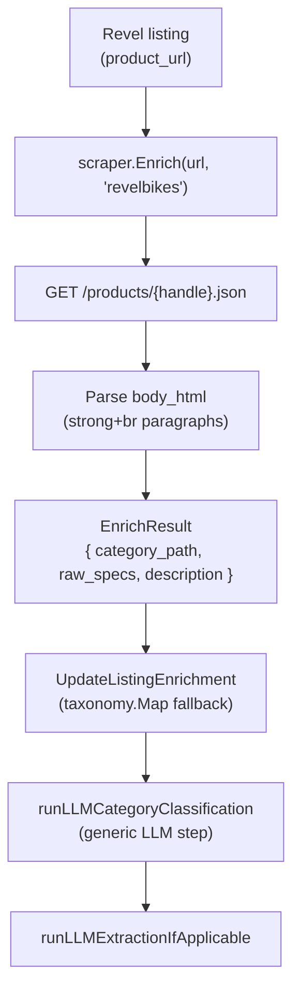

## Background

The repo already separates classification from enrichment:

- **Per-store enricher** (`apps/scraper/src/parsers/*.ts`) does HTTP/HTML extraction only: returns `EnrichResult { category_path, raw_specs, unavailable?, description?, variants? }`.
- **LLM canonical-category classification** is generic (one config in DB + `apps/api/internal/llm/client.go`) and runs as a separate orchestration step in `internal/scheduler/scheduler.go` and `internal/api/handlers.go`, plus its own admin "classify-only" bulk path in `handlers_llm.go` / `bulk_listings_admin.go`.

Revel Bikes already has a scrape parser at [apps/scraper/src/parsers/revelbikes.ts](apps/scraper/src/parsers/revelbikes.ts) and is in `STORE_TYPES`. It is **not** registered in `ENRICHERS` (scraper) or `StoreTypesWithEnrichers` (API), so PDP enrichment is currently a no-op for Revel.

Revel runs Shopify; per-product `body_html` from `/products/{handle}.json` already contains structured spec paragraphs of the form `<p><strong>KEY:</strong><br>VALUE</p>` (DRIVETRAIN, BRAKES, COCKPIT, SEAT POST, WHEELS, FORK, etc.). Worldwide Cyclery's table/`<dl>` extractor at [apps/scraper/src/parsers/worldwidecyclery.ts](apps/scraper/src/parsers/worldwidecyclery.ts) won't match this layout, so we need a small Revel-specific extractor.

Per the answers above:

- Fetch only `/products/{handle}.json` (no PDP HTML).
- Skip product `tags` (rely on name + specs + description for the LLM classifier).

## Data flow



## Changes

### 1. Add `enrichRevelBikes` to [apps/scraper/src/parsers/revelbikes.ts](apps/scraper/src/parsers/revelbikes.ts)

Append a new exported function that mirrors the shape of `enrichWorldwideCyclery`:

- Resolve `{origin}` and `{handle}` from `productUrl`; fetch `${origin}/products/${handle}.json` with `Accept: application/json` and our existing `MTBDealBot/1.0` UA.
- On non-`ok`, return `{ category_path: null, raw_specs: null }` with a `console.error` (consistent with WWC).
- Response gives `product.body_html`, `product.product_type`, `product.tags`, etc.
- `category_path`:
  - If `product.product_type` is non-empty → `[product.product_type]`.
  - Else `null`. (Skipping tags per decision above.)
- `raw_specs`: parse `body_html` with `cheerio` using a Revel-specific extractor (see snippet below).
- `description`: clone the parsed body, remove the matched spec paragraphs, return remaining text trimmed/collapsed to ≤8000 chars (mirrors WWC's `extractDescriptionFromHtml`); return `undefined` when too short.
- Return `EnrichResult` (re-imported from `./jensonusa.js` like WWC does).

Spec extractor sketch — match `<p>` blocks where the first `<strong>` ends in `:` and the value is everything after the first `<br>`:

```typescript
function extractRevelSpecsFromBodyHtml(html: string): {
  specs: Record<string, string>;
  matchedNodes: cheerio.Cheerio<any>;
} {
  const $ = cheerio.load(html);
  const specs: Record<string, string> = {};
  const matched = $();
  $("p").each((_, el) => {
    const p = $(el);
    const strong = p.find("strong").first();
    if (!strong.length) return;
    const key = strong.text().replace(/\s+/g, " ").trim().replace(/:$/, "");
    if (!key || key.length > 80) return;
    // value = everything after the first <br>, falling back to text minus the strong text
    const html = p.html() ?? "";
    const idx = html.search(/<br\s*\/?\s*>/i);
    const valueHtml = idx >= 0 ? html.slice(idx) : "";
    const value = cheerio
      .load(`<div>${valueHtml}</div>`)("div")
      .text()
      .replace(/\s+/g, " ")
      .trim();
    if (!value || value.length > 400) return;
    specs[key] = value;
    matched.add(p);
  });
  return { specs, matchedNodes: matched };
}
```

Failure modes: any `body_html` parse error → `raw_specs: null`. Network/HTTP error → fail-soft `{ category_path: null, raw_specs: null }` with `console.error` (matches WWC). With `SENTRY_DSN` set, the existing scraper-side `captureRouteError` (in `server.ts`) will already report `/enrich` failures that escape this function; if we swallow inside the function we should still call `Sentry.captureException` per the error-reporting policy in [docs/ARCHITECTURE.md](docs/ARCHITECTURE.md) — match WWC's current behavior (it does **not** call Sentry from inside its enricher; it just returns nulls). I'll follow that precedent for parity.

### 2. Register the enricher

- [apps/scraper/src/parsers/index.ts](apps/scraper/src/parsers/index.ts): import `enrichRevelBikes` and add `revelbikes: enrichRevelBikes` to `ENRICHERS`.
- [apps/api/internal/db/db.go](apps/api/internal/db/db.go): line 1379 — add `"revelbikes"` to `StoreTypesWithEnrichers`. This is the single source of truth that gates:
  - the nightly enrich job (`GetListingsNeedingEnrichment*`),
  - admin filtered enrich (`RunEnrichmentJobFiltered`),
  - admin per-listing/bulk enrich (`bulk_listings_admin.go`),
  - the "Enrich" button in [apps/web/src/admin/StoreManager.tsx](apps/web/src/admin/StoreManager.tsx) (it already lists `revelbikes` in its fallback).

No code change needed in scheduler's `scrapeStore` (line 154) — `revelbikes` is already in the recognized list.

### 3. Refresh the unsupported-store error string

[apps/scraper/src/server.ts](apps/scraper/src/server.ts) line ~51 currently says `Supported: jensonusa, worldwidecyclery, revelbikes` for both `/scrape` and `/enrich` errors and is stale (missing `backcountry`, `ridebicycles`). While we're here, regenerate that string from `Object.keys(PARSERS)` / `Object.keys(ENRICHERS)` so it stays accurate.

### 4. Tests

Add [apps/scraper/src/parsers/revelbikes.test.ts](apps/scraper/src/parsers/revelbikes.test.ts) with a fixture under `apps/scraper/src/parsers/__fixtures__/revelbikes-pdp.json` (a trimmed `/products/{handle}.json` payload captured from a real Revel PDP — Rover or Rascal). Cover:

- Strong+br spec paragraphs become `raw_specs` keys (DRIVETRAIN, BRAKES, COCKPIT, SEAT POST, WHEELS).
- Mixed-case keys are preserved as-is (LLM extractor handles normalization downstream).
- `product_type` populates `category_path` when present; `null` otherwise.
- Description is returned and excludes the spec paragraphs.
- Mock `fetch` (vitest) so the test doesn't hit the network.

### 5. Optional Makefile target

Add a `make enrich-now-revel` target for parity with `scrape-now-revel`:

```makefile
enrich-now-revel:
	@curl -s -X POST "http://localhost:8080/enrich-now?store=revelbikes$(if $(FORCE),&force=1,)"
```

(Confirm `enrich-now` accepts `?store=` — `RunEnrichmentJobFiltered` does. If the HTTP wrapper doesn't yet, defer this and use the admin Operations UI.)

### 6. Docs

Per `documentation-sync.mdc`:

- [apps/scraper/README.md](apps/scraper/README.md): change Revel's row from "scrape only" to scrape + enrich; describe the strong+br spec format.
- [docs/SCRAPING.md](docs/SCRAPING.md): same update; mention `enrichRevelBikes` alongside the others.
- [apps/api/README.md](apps/api/README.md): if it lists `StoreTypesWithEnrichers`, append `revelbikes`.

## Verification

1. `pnpm --filter @mtb-aggregator/scraper run test` passes (new test).
2. With API + scraper running locally:
   - Trigger enrichment for one Revel listing via the admin UI (DataBrowser → Enrich button) and confirm `raw_specs` and `description` populate, then watch `runLLMCategoryClassification` set `canonical_category` and `category_id` on the next pass.
   - Run `make enrich-now` (or scoped to revelbikes) and confirm a batch of Revel listings get enriched without errors.
3. `make build-all` succeeds.

## Out of scope

- Per-store classification config (classifier remains generic).
- Variant fanout (Revel collection JSON already enumerates every variant during scrape; no PDP-only variants to recover).
- Geometry/sizing extraction (likely lives in a different Revel page section; can be added later if `raw_specs` proves insufficient).
