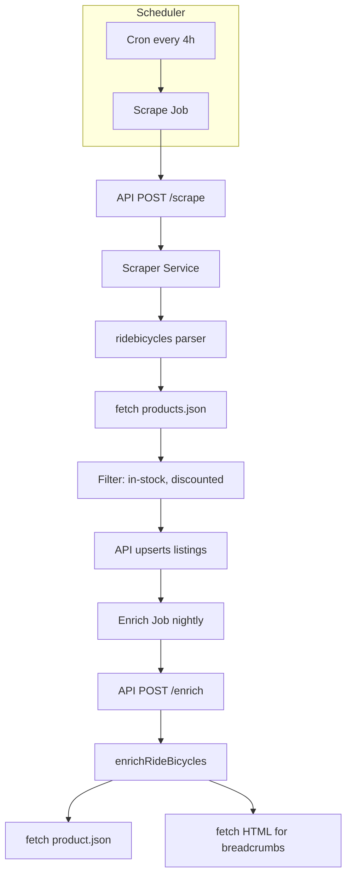

# Ride Bicycles Store Scraper Implementation

## Summary

Ride Bicycles (ridebicycles.com) is a Shopify store. The product list and PDP follow the standard Shopify structure, so we can use the same JSON API approach as [Worldwide Cyclery](apps/scraper/src/parsers/worldwidecyclery.ts) and [Revel Bikes](apps/scraper/src/parsers/revelbikes.ts) — no Playwright required.

## URL Analysis

- **Product list**: `https://ridebicycles.com/collections/all-products?page=1&rb_stock_status=In%20Stock&rb_discount_relative=40%25%7C50%25&tab=products&sort_by=sales_amount`
- **Shopify products.json**: `https://ridebicycles.com/collections/all-products/products.json?limit=250&page=1`
- **PDP example**: `https://ridebicycles.com/collections/all-products/products/norco-fluid-fs-c2-29-2024?variant=47765070512437`
- **Product JSON**: `https://ridebicycles.com/products/norco-fluid-fs-c2-29-2024.json` (handle extracted from path)

**Important**: The `rb_stock_status` and `rb_discount_relative` query params are from a Shopify filter app and are not honored by the products.json API. The API returns all products in the collection. We will filter client-side for:

- `variant.available === true` (in stock)
- `compare_at_price > price` (discounted)
- Exclude gift cards (`product_type === ""` or title contains "Gift Card")

This approximates the intended "40-50% off, in stock" view.

---

## Implementation Steps

### 1. Create Parser: `apps/scraper/src/parsers/ridebicycles.ts`

Create a new parser modeled on [worldwidecyclery.ts](apps/scraper/src/parsers/worldwidecyclery.ts):

**Scraper (`scrapeRideBicycles`):**

- Use `fetch` to call `{origin}{pathname}/products.json?limit=250&page={n}` (strip query params from input URL to get base collection path)
- Parse Shopify `products[]` with `variants[]`, `handle`, `vendor`, `product_type`
- Filter: only include variants where `variant.available === true`
- Filter: only include variants where `compare_at_price` exists and `parseFloat(compare_at_price) > parseFloat(price)` (discounted)
- Filter: exclude products where `product_type === ""` and `title` includes "Gift Card"
- Map to `ScrapeResult`: `store_sku` from `variant.sku` or `v${variant.id}`, `product_url` as `${origin}/products/${handle}`
- Dedupe by `store_sku`, paginate until empty

**Enricher (`enrichRideBicycles`):**

- Extract handle from PDP URL path (last segment before `?`; path may be `/collections/.../products/{handle}` or `/products/{handle}`)
- Fetch `{origin}/products/{handle}.json` for `body_html` (specs)
- Fetch HTML for breadcrumbs (reuse `extractBreadcrumbsFromHtml` logic from worldwidecyclery)
- Return `EnrichResult` with `category_path`, `raw_specs`, `description`

Reuse interfaces and extraction helpers from worldwidecyclery where possible (`extractBreadcrumbsFromHtml`, `extractSpecsFromHtml`, `extractDescriptionFromHtml`). Consider extracting shared Shopify helpers to avoid duplication, or copy the logic into ridebicycles.ts for simplicity.

### 2. Register Store in Scraper

- `**apps/scraper/src/types.ts`: Add `"ridebicycles"` to `STORE_TYPES`
- `**apps/scraper/src/parsers/index.ts`: Add `ridebicycles: scrapeRideBicycles` to `PARSERS`, `ridebicycles: enrichRideBicycles` to `ENRICHERS`

### 3. Register Store in API

- `**apps/api/internal/api/admin.go`: Add `"ridebicycles"` to `AllowedStoreTypes`
- `**apps/api/internal/db/db.go`: Add `"ridebicycles"` to `StoreTypesWithEnrichers`
- `**apps/api/internal/scheduler/scheduler.go`: Add `"ridebicycles"` to the store type check (around line 106)

### 4. Add Store Seed

- `**packages/shared/seed.sql` (or equivalent seed file): Add:

```sql
INSERT INTO stores (name, base_url, scrape_url, store_type, affiliate_network)
SELECT 'Ride Bicycles', 'https://ridebicycles.com', 'https://ridebicycles.com/collections/all-products?page=1&rb_stock_status=In%20Stock&rb_discount_relative=40%25%7C50%25&tab=products&sort_by=sales_amount', 'ridebicycles', NULL
WHERE NOT EXISTS (SELECT 1 FROM stores WHERE name = 'Ride Bicycles');
```

### 5. Update Web Admin

- `**apps/web/src/admin/StoreManager.tsx**`: Add `"ridebicycles"` to the `storeTypes` fallback array (if present)

### 6. Update Documentation

- [apps/scraper/README.md](apps/scraper/README.md): Add Ride Bicycles to parser list
- [docs/SCRAPING.md](docs/SCRAPING.md): Add ridebicycles to store list and note filtering behavior
- [apps/api/README.md](apps/api/README.md): Add ridebicycles to store list if applicable

---

## PDP URL Handle Extraction

Ride Bicycles PDP URLs can be:

- `https://ridebicycles.com/collections/all-products/products/norco-fluid-fs-c2-29-2024?variant=...`
- `https://ridebicycles.com/products/norco-fluid-fs-c2-29-2024` (canonical)

Handle = segment after `/products/`. Implementation:

```ts
const parts = url.pathname.split("/").filter(Boolean);
const productsIdx = parts.indexOf("products");
const handle =
  productsIdx >= 0 && productsIdx < parts.length - 1
    ? parts[productsIdx + 1]
    : parts[parts.length - 1];
```

---

## Data Flow



---

## Testing

1. **Manual scrape** (scraper + API running):

```bash
   curl -X POST http://localhost:3000/scrape \
     -H "Content-Type: application/json" \
     -d '{"url": "https://ridebicycles.com/collections/all-products?page=1&rb_stock_status=In%20Stock&rb_discount_relative=40%25%7C50%25", "store": "ridebicycles"}'


```

1. **Unit test**: Add `ridebicycles.test.ts` (optional) to assert filtering and URL parsing.
2. **Full flow**:

```bash
   make db-seed   # after adding seed
   make scrape-now-ridebicycles  # add Makefile target like scrape-now-wwc
   make enrich-now


```

---

## Makefile Addition

Add a convenience target in [Makefile](Makefile):

```makefile
scrape-now-ridebicycles:
	@curl -s -X POST "$${API_URL:-http://localhost:8080}/admin/scrape/trigger" \
		-H "Authorization: Bearer $${ADMIN_PASSWORD}" \
		-H "Content-Type: application/json" \
		-d '{"store_type":"ridebicycles"}'
```

(Check existing `scrape-now-wwc` pattern for exact structure.)

---

## Files Changed Summary

| File                                         | Change                             |
| -------------------------------------------- | ---------------------------------- |
| `apps/scraper/src/parsers/ridebicycles.ts`   | New parser + enricher              |
| `apps/scraper/src/parsers/index.ts`          | Register ridebicycles              |
| `apps/scraper/src/types.ts`                  | Add ridebicycles to STORE_TYPES    |
| `apps/api/internal/api/admin.go`             | Add to AllowedStoreTypes           |
| `apps/api/internal/db/db.go`                 | Add to StoreTypesWithEnrichers     |
| `apps/api/internal/scheduler/scheduler.go`   | Add to store type check            |
| `packages/shared/seed.sql`                   | Add Ride Bicycles store            |
| `apps/web/src/admin/StoreManager.tsx`        | Add to storeTypes fallback         |
| `Makefile`                                   | Add scrape-now-ridebicycles target |
| `apps/scraper/README.md`, `docs/SCRAPING.md` | Doc updates                        |
