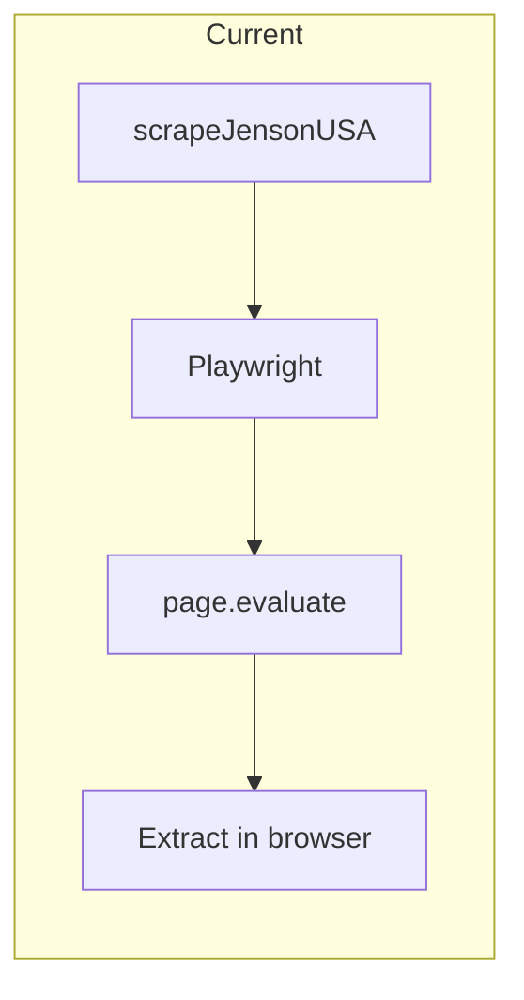
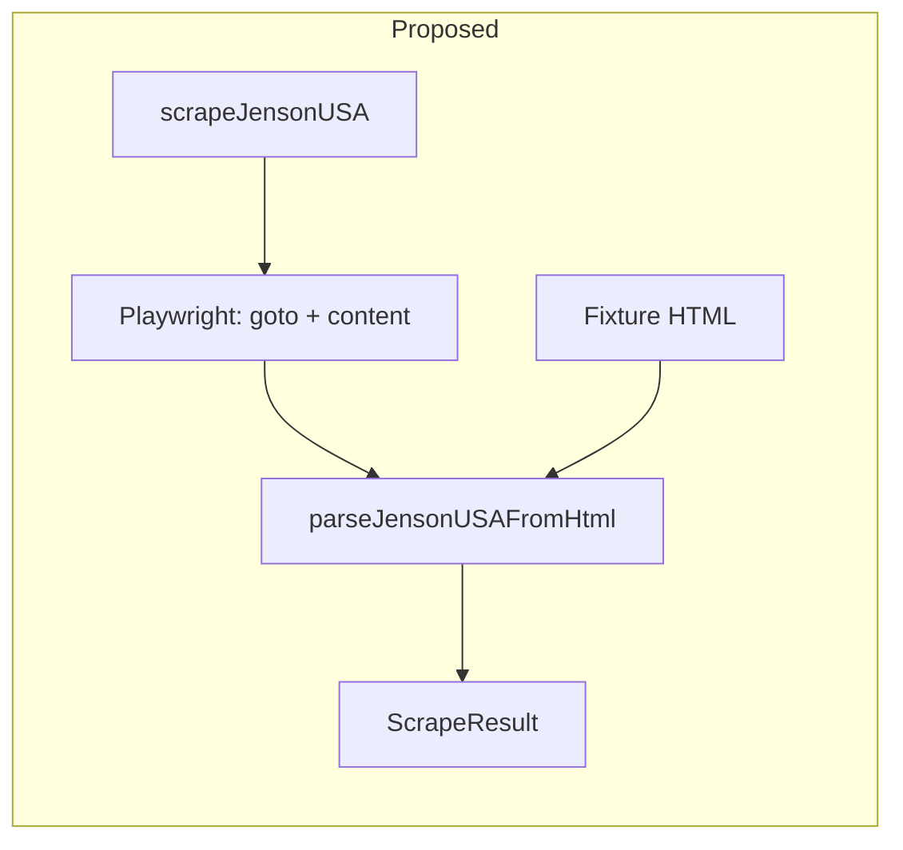

# Scraper Fixture-Based Testing Plan

## Why This Helps

- **No live scraping during dev** – iterate on selectors and logic without rate limits or blocks
- **Fast, deterministic tests** – no network, no flakiness
- **Edge cases** – test empty results, malformed HTML, schema changes
- **Versioned fixtures** – document expected page structure for future maintainers

## Current Architecture (Problem)

The JensonUSA parser in [apps/scraper/src/parsers/jensonusa.ts](apps/scraper/src/parsers/jensonusa.ts) embeds ~70 lines of extraction logic inside a string passed to `page.evaluate()`. That logic runs only in the browser context and cannot be tested with static HTML.

## Proposed Architecture

Split into two layers: **fetch** (Playwright) and **parse** (pure function over HTML).

---

## Implementation Steps

### 1. Add JSDOM dependency

Add `jsdom` to [apps/scraper/package.json](apps/scraper/package.json) so we can parse HTML in Node without a browser.

### 2. Extract parsing logic into a pure function

Refactor [apps/scraper/src/parsers/jensonusa.ts](apps/scraper/src/parsers/jensonusa.ts):

- **New**: `parseJensonUSAFromHtml(html: string): ScrapeResult[]` – takes HTML, uses JSDOM to create a `document`, runs the same extraction logic (refactored from the inline string into a TypeScript function that operates on `document`), returns results.
- **Keep**: `scrapeJensonUSA(url: string)` – launches Playwright, navigates to URL, calls `page.content()`, then invokes `parseJensonUSAFromHtml(html)`.

The extraction logic (product cards via `[data-product-result-dto]`, fallback link-based extraction) stays the same; it just runs in Node against a JSDOM document instead of inside `page.evaluate()`.

### 3. Create fixtures directory and capture script

- Create `apps/scraper/__fixtures__/jensonusa/` for HTML fixtures.
- Add a capture script (e.g. `scripts/capture-fixture.ts`) that:
  - Calls the existing `POST /scrape-debug` (with `DEBUG=1`) or uses Playwright directly once to fetch the clearance page,
  - Saves the HTML to `__fixtures__/jensonusa/clearance.html`.

Run this once (or occasionally) to refresh fixtures when the site structure changes.

### 4. Add Vitest and parser tests

- Add `vitest` to scraper devDependencies.
- Add `apps/scraper/jensonusa.test.ts` (or `parsers/jensonusa.test.ts`):
  - Load `__fixtures__/jensonusa/clearance.html`
  - Call `parseJensonUSAFromHtml(html)`
  - Assert: result is non-empty, each item passes `ScrapeResultSchema`, sample fields (e.g. first item has `product_name`, `current_price`, `product_url`).
- Optionally add `empty.html` and `malformed.html` fixtures for edge cases.
- Add `"test": "vitest run"` to [apps/scraper/package.json](apps/scraper/package.json).

### 5. Wire into Phase 7 of the implementation plan

The existing [.cursor/plans/mtb_aggregator_implementation_ee6ce2cd.plan.md](.cursor/plans/mtb_aggregator_implementation_ee6ce2cd.plan.md) Phase 7 already mentions "Unit tests for parsers with fixture HTML". This work fulfills that.

---

## Key Files

| File                                                                           | Change                                                                       |
| ------------------------------------------------------------------------------ | ---------------------------------------------------------------------------- |
| [apps/scraper/src/parsers/jensonusa.ts](apps/scraper/src/parsers/jensonusa.ts) | Extract `parseJensonUSAFromHtml(html)`, refactor `scrapeJensonUSA` to use it |
| `apps/scraper/__fixtures__/jensonusa/clearance.html`                           | Sample HTML (captured once)                                                  |
| `apps/scraper/scripts/capture-fixture.ts`                                      | One-off script to refresh fixtures                                           |
| `apps/scraper/src/parsers/jensonusa.test.ts`                                   | Vitest tests against fixtures                                                |
| [apps/scraper/package.json](apps/scraper/package.json)                         | Add `jsdom`, `vitest`, test script                                           |

---

## Optional: CLI for quick fixture refresh

A `pnpm capture:jensonusa` script could run the capture script so you can refresh fixtures when JensonUSA changes their markup, without manually calling the debug endpoint.
