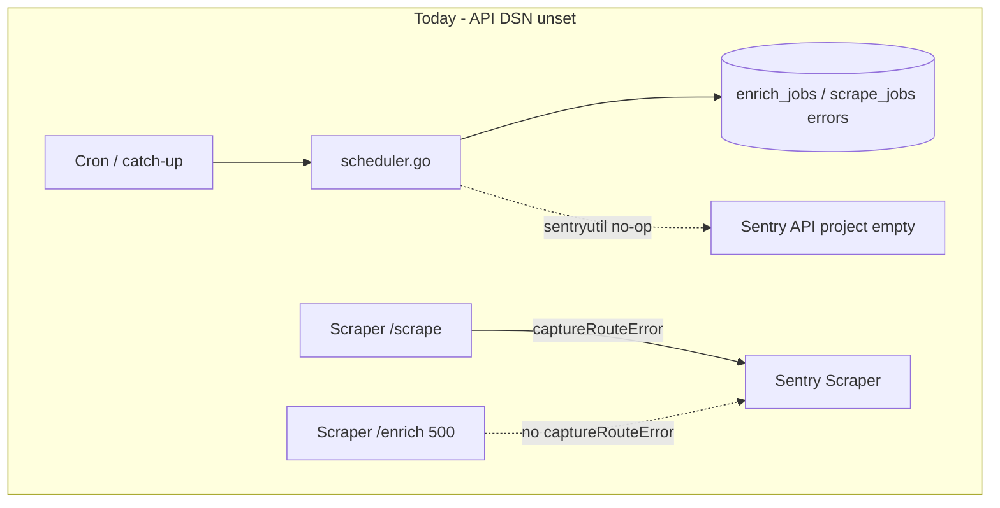

# Sentry visibility for scheduler / ops errors

## Problem statement (How Might We)

**How might we make scrape and enrich failures that appear in the admin Operations table reliably visible in Sentry**, so production issues are alerted without manually polling job history?

## What we already know

| Finding                                                  | Implication                                                                                                                                                                                                                                                                                       |
| -------------------------------------------------------- | ------------------------------------------------------------------------------------------------------------------------------------------------------------------------------------------------------------------------------------------------------------------------------------------------- |
| **`SENTRY_DSN` not set on Render API**                   | [`initSentry()`](apps/api/main.go) returns false; all [`sentryutil.CaptureError`](apps/api/internal/sentryutil/sentryutil.go) calls in [`scheduler.go`](apps/api/internal/scheduler/scheduler.go) are **no-ops**. This matches your observation: **Web + Scraper have events; API has none.**     |
| Ride Bicycles scrape: `scraper returned status 500`      | API **would** report this **after** DSN is set (line 175 in `scrapeStore`). Today only the **Scraper** project can see the real exception (if `/scrape` calls `captureRouteError`).                                                                                                               |
| Enrich: `context deadline exceeded` on `POST .../enrich` | Per-listing failures are **logged + stored in `enrich_jobs.errors`** but **not sent to Sentry** (intentional high-volume omission per [docs/ARCHITECTURE.md](docs/ARCHITECTURE.md#error-monitoring-sentry)). Job-level **`timed_out`** **does** call `sentryutil` — but only once API DSN exists. |
| Scraper `/enrich` catch block                            | **Bug:** [`/scrape`](apps/scraper/src/server.ts) calls `captureRouteError`; [`/enrich`](apps/scraper/src/server.ts) returns 500 **without** `captureRouteError`, so enrich 500s may be missing from Scraper Sentry even when DSN is set.                                                          |



## Recommended direction (visibility first)

1. **Turn on API Sentry** (highest leverage, no code required for scrape-store failures).
2. **Fix scraper `/enrich` reporting** (one-line parity with `/scrape`).
3. **Add job-level aggregation** for enrich jobs that finish `completed` but carry many listing errors (your timeout pattern often fills `errors[]` without always being the only signal you care about).
4. **Verify in Sentry** with tag filters; only then dig into Ride Bicycles 500 and enrich duration (separate workstream).

---

## Phase A — Enable API Sentry (ops, no code)

1. In **Render → API service → Environment**, set:
   - `SENTRY_DSN` — DSN for a dedicated **Go/API** Sentry project (do not reuse the Next.js DSN unless you want one combined project).
   - `SENTRY_ENVIRONMENT=production` (optional but recommended).
   - Release is already derived from `RENDER_GIT_COMMIT` in [`main.go`](apps/api/main.go).
2. Redeploy API; confirm startup log: `[sentry] initialized`.
3. In Sentry → Issues, filter: `component:scheduler` (tags set by `sentryutil`).
4. Trigger or wait for the next Ride Bicycles scrape failure — you should see **`scraper returned status 500`** with tag `job:scrape`, `store:Ride Bicycles`.

Update [README.md](README.md) / [apps/api/README.md](apps/api/README.md): change “optional” to **required in production** for `SENTRY_DSN` (align with [docs/ARCHITECTURE.md](docs/ARCHITECTURE.md) policy).

---

## Phase B — Code fixes for reporting gaps

### B1. Scraper: report `/enrich` failures to Sentry

In [`apps/scraper/src/server.ts`](apps/scraper/src/server.ts), in the `/enrich` `catch` block (mirroring `/scrape` ~line 79):

```ts
captureRouteError(err, { route: "enrich", store, url });
```

### B2. API: aggregate enrich job errors when job completes with failures

Today in [`runEnrichmentLoop`](apps/api/internal/scheduler/scheduler.go) / [`RunEnrichmentJob`](apps/api/internal/scheduler/scheduler.go):

- Per-listing `scraper.Enrich` errors → `errStrs` only (no Sentry).
- `timed_out` → one `sentryutil.CaptureError` (works once DSN is set).
- `completed` with a long `errStrs` → **no Sentry**.

Add a small helper (e.g. in `scheduler.go` or `sentryutil`):

- After `finalizeEnrichJob(..., "completed", ...)`, if `len(errStrs) >= N` (suggest **N=5**) or if **>50%** of processed listings failed, call `sentryutil.CaptureError` with a **single** synthetic error, e.g. `enrich job completed with 42 listing errors (scope=..., sample: listing 243467: ...)`, tags: `job=enrich`, `store_type`, `phase=listing_errors_aggregate`.
- Include **at most 3** sample lines from `errStrs` to avoid huge payloads (same spirit as LLM cap in architecture doc).

Optional: classify `context deadline exceeded` vs `scraper returned status 500` in the aggregate message for faster triage.

### B3. API: optional flush after background jobs (lower priority)

[`sentry.Flush`](apps/api/main.go) runs only on process shutdown. For long-running API this is usually fine; if events still lag after DSN is set, add `sentry.Flush(2 * time.Second)` at the end of `RunScrapeJob` / `runEnrichmentLoop` (defer) — only if verification shows dropped events.

### B4. Scraper client: surface 500 response body (nice-to-have)

[`apps/api/internal/scraper/client.go`](apps/api/internal/scraper/client.go) discards body on non-200. Reading JSON `message` from scraper 500 responses would make API Sentry events actionable without opening Scraper project.

---

## Phase C — Verify (acceptance criteria)

| Scenario                                      | Expected Sentry home   | Tag hints                                                                               |
| --------------------------------------------- | ---------------------- | --------------------------------------------------------------------------------------- |
| Ride Bicycles scrape fails                    | **API** + **Scraper**  | API: `job=scrape`, `store=Ride Bicycles`; Scraper: `route=scrape`, `store=ridebicycles` |
| Enrich job hits 30m deadline                  | **API**                | `job=enrich`, status timed_out message                                                  |
| Many listing enrich failures, job `completed` | **API** (after B2)     | `phase=listing_errors_aggregate`                                                        |
| Scraper enrich handler throws                 | **Scraper** (after B1) | `route=enrich`                                                                          |

Create Sentry alert rules on **API project**: new issues with `component:scheduler`, spike on `job=enrich`.

---

## Root-cause investigation (deferred — after visibility)

Not required to fix Sentry visibility, but explains the ops table symptoms:

**Ride Bicycles `scraper returned status 500`**

- Parser: [`apps/scraper/src/parsers/ridebicycles.ts`](apps/scraper/src/parsers/ridebicycles.ts) — fetch-based `products.json`; 500 means an **uncaught throw** in `scrapeRideBicycles` (e.g. `products.json 403/429`, bad URL, JSON parse).
- After B1 + API DSN: read **Scraper** issue stack trace; optionally `curl` scraper `/scrape` locally with the seed URL from [`packages/shared/seed.sql`](packages/shared/seed.sql).

**Enrich `context deadline exceeded`**

- API passes the **job** `context` ([`getEnrichJobTimeout()`](apps/api/internal/scheduler/scheduler.go) default **30m**) into each `Enrich` call — not the scraper’s fault per se when the **whole job** exceeds 30m.
- Ride Bicycles enrich **swallows** errors and returns 200 with null specs — so mass deadline errors are likely **backlog + job timeout**, or **slow Playwright stores** saturating the scraper service.
- Tuning knobs (later): `ENRICH_JOB_TIMEOUT`, `ENRICH_BATCH_SIZE`, store-scoped jobs, scraper scaling — see [enrichment_job_resilience plan](.cursor/plans/enrichment_job_resilience_4c6b068d.plan.md).

---

## Idea variations considered (idea-refine)

| Direction                                     | Trade-off                                                                                 |
| --------------------------------------------- | ----------------------------------------------------------------------------------------- |
| **A. Fix API DSN only**                       | Fastest; fixes scrape failures + job timeouts; leaves per-listing enrich noise in DB only |
| **B. + aggregate completed jobs with errors** | Best match for “ops table full, Sentry quiet”                                             |
| **C. Per-listing Sentry (capped)**            | Maximum detail; risk of quota flood — architecture doc argues against                     |
| **D. Single Sentry project for all services** | Simpler UI; loses service-level alert routing                                             |
| **E. Render log drains → Sentry**             | No code; weaker grouping than SDK                                                         |
| **F. PostHog for job failures**               | Wrong tool; keep product analytics separate                                               |

**Recommended:** A + B + B1 now; F deferred.

---

## Key assumptions to validate

- [ ] After setting API `SENTRY_DSN`, Ride Bicycles scrape failure produces an API issue within one deploy cycle.
- [ ] Scraper project already has (or will have) the **underlying** Ride Bicycles exception for `/scrape` 500s.
- [ ] Most enrich ops noise is **`completed` jobs with long `errors[]`**, not only `timed_out` — drives need for B2.

---

## Not doing (for this pass)

- Changing `ENRICH_JOB_TIMEOUT` or batch sizes — ops tuning, not observability.
- Per-listing uncapped Sentry events — quota / noise.
- Fixing Ride Bicycles parser until Scraper stack trace is read.
- Web app Sentry changes — unrelated to scheduler ops table.

---

## Docs to update after implementation

- [docs/ARCHITECTURE.md](docs/ARCHITECTURE.md) — note `/enrich` Sentry gap fix + enrich aggregate capture
- [apps/scraper/README.md](apps/scraper/README.md) — `/enrich` uses `captureRouteError`
- [apps/api/README.md](apps/api/README.md) — `SENTRY_DSN` required in production
