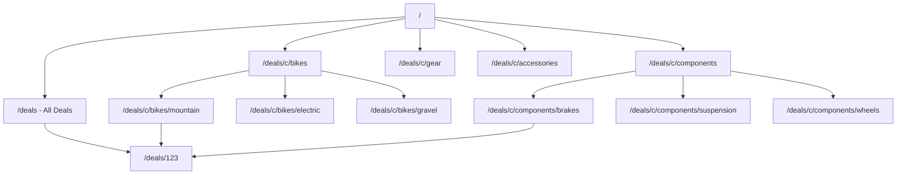

# SEO and GEO Implementation Plan

## Current State

The app has **zero SEO infrastructure** beyond a root title/description in `[apps/web/src/app/layout.tsx](apps/web/src/app/layout.tsx)`. Specifically:

- Only 2 public page routes: `/` and `/deals` (plus `/deals/[id]` for detail)
- No per-page metadata for `/` or `/deals`
- No `sitemap.xml`, no `robots.txt`
- No Open Graph or Twitter card tags
- No JSON-LD structured data
- No canonical URLs or `metadataBase`
- Categories are query params (`/deals?category=bikes-electric`), invisible to search engines as distinct pages

---

## Search Queries to Target

**Primary (high intent, category-level):**

- "mountain bike deals", "MTB deals", "best deals on enduro bikes"
- "electric mountain bike deals", "cheapest full power emtb"
- "MTB component deals", "mountain bike brake deals"
- "mountain bike gear sale", "MTB helmet deals"

**Secondary (brand + category, long-tail):**

- "shimano groupset deals", "fox fork sale", "sram eagle deals"
- "carbon MTB wheel deals", "full suspension bike deals"
- "cheap mountain bike pedals", "budget MTB clothing"

**Tertiary (comparison/temporal):**

- "best mountain bike deals 2026", "MTB price comparison"
- "mountain bike sale today", "end of season MTB deals"

**GEO (generative engine optimization):**

- AI overviews pull from pages with clear factual structure, prices, and schema markup
- JSON-LD `Product` and `ItemList` schemas are critical for AI citation
- Category pages with descriptive intros help AI summarize what you offer

---

## Information Architecture Change

**Yes, dedicated category pages are essential.** Query params (`?category=bikes`) are treated by search engines as variants of `/deals`, not indexable pages. Each category needs its own URL with unique metadata.

### New URL structure (under `/deals/c/` to avoid conflict with `/deals/[id]`)

```
/                               Home
/deals                          All deals
/deals/c/bikes                  Bikes (parent category)
/deals/c/bikes/electric         Electric bikes (child)
/deals/c/bikes/mountain         Mountain bikes (child)
/deals/c/components             Components (parent)
/deals/c/components/brakes      Brakes (child)
/deals/c/components/suspension  Suspension (child)
...etc for all 21 categories
/deals/[id]                     Deal detail (unchanged)
```

The path segments map to the existing category tree from migration 017. For example, `/deals/c/bikes/electric` resolves to the category with slug `bikes-electric` by joining the path segments.



---

## Implementation

### 1. Category route (`/deals/c/[...slug]`)

Create `[apps/web/src/app/(public)/deals/c/[...slug]/page.tsx](<apps/web/src/app/(public)`/deals/c/[...slug]/page.tsx>) -- a server component that:

- Resolves URL segments to a category (e.g. `["bikes", "electric"]` -> slug `bikes-electric`)
- Calls `fetchDeals({ category_slug })`, `fetchFacets(...)`, `fetchStores()`, `fetchCategoryTree()` -- same data as the existing deals page
- Renders the same `DealsPageContent` component, pre-filtered to that category
- Returns `notFound()` for invalid category paths

Add `generateMetadata` with SEO-optimized titles and descriptions per category:

```typescript
// /deals/c/bikes/electric ->
// title: "Electric Mountain Bike Deals | The Dropper"
// description: "Compare prices on electric mountain bikes across top retailers. Find the best eMTB deals, discounts, and sales."
```

Add a helper map or function for category-specific copy (title, description, intro text) in a new file like `[apps/web/src/lib/categorySeo.ts](apps/web/src/lib/categorySeo.ts)`.

### 2. Per-page metadata for existing routes

**Home page** (`[apps/web/src/app/(public)/page.tsx](<apps/web/src/app/(public)`/page.tsx>)):

```typescript
export const metadata: Metadata = {
  title: "The Dropper | Mountain Bike Deals Aggregator",
  description:
    "Compare mountain bike deals across top retailers. Find the best prices on bikes, components, gear, and accessories — updated every 4 hours.",
  alternates: { canonical: "/" },
};
```

**Deals page** (`[apps/web/src/app/(public)/deals/page.tsx](<apps/web/src/app/(public)`/deals/page.tsx>)):

```typescript
export const metadata: Metadata = {
  title: "All Mountain Bike Deals",
  description:
    "Browse all mountain bike deals. Filter by category, brand, price, and specs to find your next ride at the best price.",
  alternates: { canonical: "/deals" },
};
```

**Deal detail** (`[apps/web/src/app/(public)/deals/[id]/page.tsx](<apps/web/src/app/(public)`/deals/[id]/page.tsx>)) -- enhance existing `generateMetadata`:

- Add Open Graph tags (title, description, image if available)
- Add canonical URL
- Improve description to include discount %, original price, category

### 3. Root metadata and `metadataBase`

In `[apps/web/src/app/layout.tsx](apps/web/src/app/layout.tsx)`, add:

- `metadataBase: new URL(process.env.NEXT_PUBLIC_SITE_URL || "https://thedropper.bike")` (or whatever the production domain is)
- `openGraph` defaults (site name, locale, type)
- `twitter` card defaults
- `robots` defaults (index, follow)

### 4. JSON-LD structured data

**Deal detail page** -- `Product` schema:

```typescript
<script type="application/ld+json">
{
  "@context": "https://schema.org",
  "@type": "Product",
  "name": "...",
  "brand": { "@type": "Brand", "name": "..." },
  "offers": {
    "@type": "Offer",
    "price": "...",
    "priceCurrency": "USD",
    "availability": "https://schema.org/InStock",
    "seller": { "@type": "Organization", "name": "..." },
    "url": "..."
  }
}
</script>
```

**Category pages** -- `ItemList` schema with top deals listed as `ListItem` entries.

**Home page** -- `WebSite` schema with `SearchAction` (tells Google about the search box):

```typescript
{
  "@context": "https://schema.org",
  "@type": "WebSite",
  "name": "The Dropper",
  "url": "https://thedropper.bike",
  "potentialAction": {
    "@type": "SearchAction",
    "target": "https://thedropper.bike/deals?q={search_term_string}",
    "query-input": "required name=search_term_string"
  }
}
```

### 5. Sitemap (`sitemap.ts`)

Create `[apps/web/src/app/sitemap.ts](apps/web/src/app/sitemap.ts)` that dynamically generates entries for:

- `/` (priority 1.0, daily)
- `/deals` (priority 0.9, every 4 hours)
- All category pages `/deals/c/...` (priority 0.8, daily) -- fetched from `/categories/tree`
- Top deal detail pages `/deals/[id]` (priority 0.5, daily) -- fetched from `/deals` API

### 6. Robots.txt (`robots.ts`)

Create `[apps/web/src/app/robots.ts](apps/web/src/app/robots.ts)`:

- Allow all crawlers on public routes
- Disallow `/admin`
- Point to sitemap URL

### 7. Internal linking improvements

- **Category pages**: include links to sibling and child categories (the existing `DealsCategoryNav` breadcrumbs/chips already do this -- just ensure they render as `<a>` tags via `next/link`, not client-side-only navigation)
- **Home page**: update `CategoryCard` links from `/deals?category=slug` to `/deals/c/bikes` etc.
- **Deal detail**: add breadcrumb links back to the category page (not just `/deals`)
- **Cross-linking**: each category page should link to related categories in the footer/sidebar area

### 8. Redirect old query-param URLs

In `[apps/web/next.config.ts](apps/web/next.config.ts)`, add `redirects()` to send `/deals?category=bikes` to `/deals/c/bikes` (301 redirect). This preserves any existing links/bookmarks and consolidates SEO signals. This would be implemented as Next.js middleware since `next.config` redirects can't easily read query params -- or handled in the deals page itself with a server-side redirect when `category` param is present.

### 9. Category page content

For GEO, category pages should include a brief intro paragraph (2-3 sentences) above the deal grid. This gives AI models and search engines text to extract. Store these in the `categorySeo.ts` helper:

```typescript
export const CATEGORY_SEO: Record<
  string,
  { title: string; description: string; intro: string }
> = {
  "bikes-electric": {
    title: "Electric Mountain Bike Deals",
    description: "Compare prices on electric mountain bikes...",
    intro:
      "Find the best deals on full-power and lightweight eMTBs from top retailers. Updated every 4 hours with current sale prices across brands like Specialized, Trek, and YT.",
  },
  // ...
};
```

---

## Files to Create/Modify

| Action     | File                                                                               |
| ---------- | ---------------------------------------------------------------------------------- |
| **Create** | `apps/web/src/app/(public)/deals/c/[...slug]/page.tsx`                             |
| **Create** | `apps/web/src/app/(public)/deals/c/[...slug]/loading.tsx`                          |
| **Create** | `apps/web/src/app/sitemap.ts`                                                      |
| **Create** | `apps/web/src/app/robots.ts`                                                       |
| **Create** | `apps/web/src/lib/categorySeo.ts`                                                  |
| **Create** | `apps/web/src/components/JsonLd.tsx`                                               |
| **Modify** | `apps/web/src/app/layout.tsx` (metadataBase, OG defaults)                          |
| **Modify** | `apps/web/src/app/(public)/page.tsx` (metadata, JSON-LD)                           |
| **Modify** | `apps/web/src/app/(public)/deals/page.tsx` (metadata)                              |
| **Modify** | `apps/web/src/app/(public)/deals/[id]/page.tsx` (enhanced metadata, JSON-LD)       |
| **Modify** | `apps/web/src/views/HomePageContent.tsx` (update category links to `/deals/c/...`) |
| **Modify** | `apps/web/next.config.ts` (if adding redirect logic)                               |

---

## Status

**Core implementation:** Done (see todos above — all `completed`). Redirect from `?category=` is handled in **middleware** (not `next.config`), preserving query params.

**Optional follow-ups:** Tracked below; prioritize by traffic, scale, and Search Console feedback.

---

## Optional follow-ups

### Content and GEO (`categorySeo`, taxonomy)

- Add or refine **hand-tuned intros** (and optionally titles/descriptions) in `HAND_TUNED` for **every slug** in `[packages/shared/categories.export.json](packages/shared/categories.export.json)`, especially **deep leaf** categories (e.g. drivetrain/brakes/wheels children) that still fall back to generated copy only.
- **Regenerate `categories.export.json`** from Neon when the category tree changes (operational step; documented in `[packages/shared/README.md](packages/shared/README.md)`).

### Deal detail metadata (`apps/web/src/app/(public)/deals/[id]/page.tsx`)

- Enrich `**generateMetadata` description** with **canonical category when resolvable (plan §2 suggested including category; current copy focuses on price/store/discount).
- Revisit **title** format if product SEO needs brand/category ordering tweaks.

### Structured data (`apps/web/src/lib/jsonLd.ts` and consumers)

- Extend `**Product` JSON-LD (e.g. `category`, identifiers like `sku`/`mpn` if the API ever exposes them).
- Consider `**BreadcrumbList` JSON-LD on category and/or deal pages (common for rich results; not in original plan).
- `**ItemList` on category pages** caps at **12 deals (`ITEM_LIST_MAX`) — confirm policy (raise cap, or document “sample of listing” intentionally).

### Sitemap (`apps/web/src/app/sitemap.ts`)

- `**lastModified`:** Currently effectively “build/runtime generation time,” not per-URL content change — improve if the API or DB can expose **real change signals (e.g. last listing update).
- **Scale:** At ~50k URLs or for clearer crawl hints, add a **sitemap index** and/or **split** static + deal sitemaps.
- **Deal inclusion:** Policy is **paginated fetch with cap** (~48k deal URLs) — revisit **newest vs full inventory** as product needs change.

### Crawling, canonicals, redirects

- Periodically verify **canonicals**: `/deals` static canonical for filtered `?` URLs; `**/deals/c/...` routes use route-level metadata (ensure no accidental duplicates).
- **308 vs 301** for `?category=` → path: middleware uses **308** (permanent). Change only if you explicitly want **301** semantics everywhere.
- If **faceted URL explosion** becomes an issue, revisit **robots / noindex** or canonical strategy for low-value filter combinations (not required at current scale).

### PostHog and analytics

- **Validate funnels/dashboards** after category nav moved to `<Link>` (event order or timing may shift vs `router.replace`).
- Update `**[posthog-setup-report.md](posthog-setup-report.md)` (if maintained) and `[apps/web/README.md](apps/web/README.md)` if event contracts or recommended dashboards change.

### Storybook and docs

- **Storybook:** `DealsBrowseFooter` and `DealsCategoryNav` have stories; add stories for any new SEO-related UI as it ships.
- Keep **architecture / web README** in sync when changing routes, middleware, or analytics (see repo documentation-sync rule).

### Operations and QA (non-code)

- **Google Search Console:** Submit sitemap, monitor coverage, enhancements, and **SearchAction** / rich results where applicable.
- **Bing Webmaster Tools** if Bing/Copilot surfaces matter.
- **Lighthouse / Core Web Vitals** on key templates (`/`, `/deals`, `/deals/c/...`, `/deals/[id]`).

### Internationalization (future)

- `**hreflang` and locale-specific metadata only if the site becomes multi-region/multi-language.
