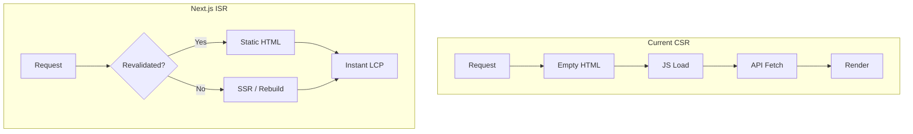

# SEO/GEO Migration Assessment: Next.js vs Alternatives

## Current State

Your web app ([apps/web](apps/web)) is a **pure client-side rendered (CSR)** React + Vite SPA:

- Single `index.html` with `
` — crawlers receive an empty shell
- No dynamic meta tags, schema markup, or per-page titles
- Routes: `/` (Home), `/deals` (with query params for category, filters, pagination), `/admin/`
- Data fetched via TanStack Query after hydration
- Deployed on Vercel with SPA rewrites

## Is Gemini Right?

**Yes, on the core problem.** CSR is a real SEO/GEO disadvantage:

| Concern                   | Reality                                                                                                                |
| ------------------------- | ---------------------------------------------------------------------------------------------------------------------- |
| **"Two-pass" indexing**   | Google does render JS, but it's deferred. For a deal aggregator where freshness matters, delays hurt.                  |
| **GEO / AI crawlers**     | Perplexity, ChatGPT, etc. may not execute JS reliably. Text in the initial HTML is more extractable.                   |
| **LCP / Core Web Vitals** | CSR delays LCP until JS loads + API returns + render. SSR/SSG delivers content in the first byte.                      |
| **Schema markup**         | You have none. Product/Offer schema would help rich snippets — but it must be in the HTML payload, not injected by JS. |

**Caveat:** Gemini overstates the "locked door" metaphor. Google _does_ index CSR sites. The issue is _speed of indexing_, _consistency for AI crawlers_, and _Core Web Vitals_, not total invisibility.

---

## Options (Ranked by Effort vs Impact)

### Option A: Full Next.js Migration (Gemini's Recommendation)

**Pros:**

- SSR/ISR gives you exactly what you need: HTML with deals on first load, revalidation every 60s for fresh prices
- Native support for meta tags, Open Graph, schema
- Vercel is built for Next.js — deployment is trivial
- Long-term: best foundation for SEO/GEO

**Cons:**

- **High migration effort**: React Router → Next.js App Router, TanStack Query patterns, env vars (`VITE_`_ → `NEXT*PUBLIC`_), Storybook config
- Your `/deals` page has many dynamic combinations (category, filters, pagination). You'd need to decide: SSR every request, or ISR for a subset of "canonical" URLs (e.g. `/deals`, `/deals?category=brakes`)
- Admin section could stay client-only, but routing and layout would change

**Rough scope:** 2–4 weeks for a careful migration, depending on how much you want to refactor.

---

### Option B: Vite + Prerender (Lighter Lift)

Use a prerender plugin (e.g. [vite-plugin-ssr](https://vite-plugin-ssr.com/pre-rendering), [vite-plugin-seo-prerender](https://www.npmjs.com/package/vite-plugin-seo-prerender), or React's `react-dom/server` prerender) to output static HTML for key routes at build time.

**Pros:**

- Stay on Vite + React Router
- Add prerendering for `/` and maybe `/deals` (or a few category URLs)
- Lower effort than full Next.js

**Cons:**

- **Stale data**: Build-time HTML is static. Your deals change every 4h. You'd need frequent rebuilds or a different strategy for "live" pages.
- No built-in ISR — you'd need external cron to trigger rebuilds
- Less elegant than Next.js for this use case

**Verdict:** Viable for home page + a few static category landing pages, but not ideal for a live deal feed.

---

### Option C: Crawler-Specific Prerendering (Prerender.io / Rendertron)

Serve pre-rendered HTML only to crawlers (User-Agent detection), while humans get the normal SPA.

**Pros:**

- No code migration
- Crawlers see full HTML; users keep current experience

**Cons:**

- Third-party dependency and cost
- Cloaking (different content for bots vs users) can be a gray area with Google
- Doesn't fix LCP for real users

---

### Option D: Quick Wins (No Migration)

Add SEO hygiene that helps even with CSR:

- **react-helmet-async** — dynamic `<title>`, `<meta>`, Open Graph per route (crawlers must run JS to see them, but it helps)
- **Schema.org** — Product + Offer JSON-LD in a component (same caveat)
- **llms.txt** — text summary for AI crawlers (emerging standard)
- **sitemap.xml** — list key URLs for indexing
- **robots.txt** — ensure crawlers can access public routes

**Impact:** Improves discoverability and AI extractability _if_ crawlers execute JS. Does not solve the empty-HTML or LCP issues.

---

## Recommendation

**If SEO/GEO is a business priority:** Migrate to Next.js. For a deal aggregator, ISR is the right model — pre-rendered HTML with periodic revalidation. The migration is non-trivial but one-time; the benefits compound.

**If you want to validate demand first:** Do Option D (quick wins) + consider Option B for the home page only. Measure search traffic and AI citations. If you see traction, invest in Next.js.

**If you choose Next.js:** Focus the migration on public routes (`/`, `/deals`). Keep the admin as a client-only section or migrate it later. Use App Router with Server Components for the shell and TanStack Query (or server actions) for deal data. Pre-render `/` and `/deals` with ISR (e.g. `revalidate: 60`). Category URLs like `/deals?category=brakes` can be SSR on first request, then cached.

---

## Architecture Sketch (Next.js Migration)

---

## Next Steps

1. **Decide** whether SEO/GEO is a near-term priority or a "nice to have."
2. **If yes:** Create a detailed Next.js migration plan (routes, data fetching, env, Storybook).
3. **If not yet:** Implement Option D (meta tags, schema, llms.txt, sitemap) as a low-effort baseline.
